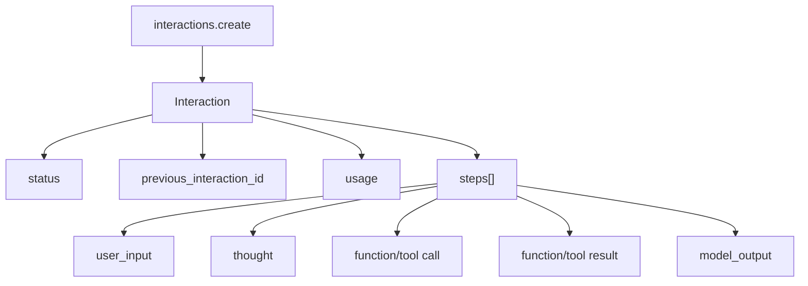

# Gemini Interactions API：一次工具请求为什么停在 `requires_action`

<!-- learning-contract -->
<div class="learning-contract" markdown="1">

**学习导航**

- **适合读者**：需要接入有状态会话、流式步骤或后台任务的 API 工程师。
- **先修**：先读 [Gemini 总览](gemini.md)，知道模型、API 与应用权限属于不同层。
- **首次阅读**：先运行固定回放，再读 Interaction、服务端历史和后台任务。
- **完成信号**：看到 `interaction.completed` 时，能继续检查资源状态，而不是直接宣布任务成功。
- **卡住时**：只盯住 `event name → resource status → application action` 这三个值。

</div>

**章节导航**：[总览](gemini.md) · [generateContent 与多模态](gemini-generate-content.md) · [生产接入](gemini-production.md) · [证据台账](../evidence/gemini-controls.md)
{ .doc-nav }

先看一个容易误判的场景。用户问“上海天气怎样”，模型没有直接回答，而是建议调用
`lookup_weather(city="上海")`。流最后确实出现了 `interaction.completed`，但 Interaction 的状态是
`requires_action`。这表示服务端正在等客户端处理函数调用，天气查询尚未执行，更没有最终答案。

## 先运行这次请求

仓库保存了一段固定的 SSE（Server-Sent Events，服务器发送事件）记录。它不需要 API key，也不会访问
Google：

```powershell
python projects/cloud-api-contracts/gemini_interactions_replay.py
```

先在输出里找到下面几项：

```json
{
  "stream_terminal_event": "interaction.completed",
  "resource_status": "requires_action",
  "provider_result_available": false,
  "business_result_verified": false,
  "steps": [
    {
      "type": "function_call",
      "function_call": {
        "id": "call_weather_001",
        "name": "lookup_weather",
        "arguments": {"city": "上海"}
      }
    }
  ]
}
```

这些字段讲的是不同事情：

| 观察结果 | 它真正表示什么 |
|---|---|
| `function_call` step | 模型提出了一个函数调用 |
| `interaction.completed` event | 当前这条流已经给出了 Interaction 的最终快照 |
| `requires_action` status | 快照仍在等待客户端动作 |
| `provider_result_available=false` | Provider 还没有给出最终天气回答 |
| `business_result_verified=false` | 应用尚未验证可发布的业务结果 |

下一步应先校验函数名和参数 schema，再检查调用权限。工具执行成功后，客户端用
`previous_interaction_id` 和 `function_result` 创建下一次 Interaction，让模型生成最终回答。本实验故意停在
执行之前，因此不能把固定参数理解为真实天气结果。

## 两段参数是怎样变成一个调用的

原始记录中的主要事件如下：

```text
interaction.created(status=in_progress)
→ interaction.status_update(status=in_progress)
→ step.start(index=0, type=function_call, name=lookup_weather)
→ step.delta(arguments_delta='{"city":')
→ step.delta(arguments_delta='"上海"}')
→ step.stop(index=0)
→ interaction.completed(status=requires_action, usage=...)
→ event: done / data: [DONE]
→ transport EOF
```

`arguments_delta` 只是 JSON 字符串的一部分。第一个增量 `{"city":` 仍在等待后续内容。回放程序等到
`step.stop`，再合并全部片段并解析一次 JSON object。重复字段以及 `NaN`、`Infinity` 等非法数值会在这里被拒绝；
工具只接收通过检查的完整对象。

固定记录还会按字节分片送进 SSE 解析器。一次网络读取所得的字节片段、一个服务器事件、一个步骤增量和一个
模型词元属于四层数据，它们的边界彼此独立。

## Interactions object graph

Interactions API 用一个 Interaction resource 表示一次对话 turn 或长任务，用有序 steps 记录模型输出、
思考摘要和工具活动：



`interactions.create` 的响应只返回模型生成的 steps。之后通过 `interactions.get` 读取已保存的 resource 时，
结果还可能包含完整上下文中的 `user_input` steps。因此 create response 和 stored resource 是同一任务的不同
视图，不能靠数组下标假设它们完全相同。

### 一份请求包含哪些决定

下面的 JSON 用来说明字段关系；固定回放从响应事件开始，没有发送这份请求：

```json
{
  "model": "deployment-owned-exact-id",
  "input": "上海天气怎样？",
  "system_instruction": "工具执行前必须检查权限",
  "tools": [
    {
      "type": "function",
      "name": "lookup_weather",
      "description": "查询指定城市的天气",
      "parameters": {
        "type": "object",
        "properties": {
          "city": {"type": "string", "description": "城市名"}
        },
        "required": ["city"]
      }
    }
  ],
  "generation_config": {"temperature": 0},
  "store": true,
  "stream": true
}
```

模型版本、工具表、系统指令、预算和存储选择应属于这次逻辑调用的配置。若一次重试临时读取了已经变化的
全局设置，两次 attempt 就不再是同一请求。

## 先读 event，再读 resource status

官方后台执行指南目前演示五种状态；API 以后还可能增加状态：

| status | 应用应该怎样处理 |
|---|---|
| `in_progress` | 任务仍在服务端运行，继续等待或接收进度 |
| `requires_action` | 暂停发布结果，处理需要客户端参与的步骤 |
| `completed` | Provider 生命周期完成，再运行应用自己的验证器 |
| `failed` | 保存 Interaction id、错误和已发生的 usage，进入失败处理 |
| `cancelled` | 停止等待正常结果，并对已经发生的工作或副作用做对账 |

流事件名与这张状态表不在同一层。官方函数调用示例会发送
`event: interaction.completed`，同时在 payload 中返回 `status: requires_action`。事件名说明流协议走到哪里，
status 才说明资源接下来需要什么动作。

即使 status 是 `completed`，应用仍要检查输出 schema、引用、工具效果、质量和安全规则。Provider 完成只是一层
生命周期事实，不等于用户任务已经正确完成。

### `output_text` 为什么不够

SDK 的 `interaction.output_text` 是便捷文本视图。较早的文字若被 thought、图片、音频或 tool call 分隔，可能
不会出现在这个最终字符串里。只保存它会丢掉工具关联、多模态内容和无状态续聊需要的信息。

应用通常同时保留：

- 原始 Interaction，或经过明确允许的 typed projection；
- step 的类型、顺序、id 与 call/result 关联；
- 方便 UI 使用的最终文本；
- 投影是否遗漏了尚未支持的 step 或 delta。

本仓库的回放程序只完整投影 text `model_output` 与客户端 `function_call`。遇到新 event 时，它会把类型写进
`compatibility.unknown_event_types` 后跳过；遇到未支持的 step 或 delta，则把对应 step 标为
`projection_complete=false`。这样既遵守官方对新增类型保持兼容的建议，也不会把“跳过”伪装成“完整支持”。

已知事件如果缺字段、顺序错误或前后 id 不一致，程序仍会失败。这类错误不是协议扩展，而是当前记录内部矛盾。

## 服务端历史与无状态历史

### 使用 `previous_interaction_id`

```text
turn 1: create(store=true)
  → interaction_id=A
turn 2: create(previous_interaction_id=A, tools/config resent)
  → interaction_id=B
```

`previous_interaction_id` 延续的是已保存的历史输入和输出。`tools`、`system_instruction` 和
`generation_config` 仍属于当前 Interaction；后续 turn 需要再次发送。否则工具允许列表、行为约束或温度会在
续聊时悄悄变化。

本地还要记录 Interaction id 属于哪个 tenant/project，谁可以读取、续接或删除，以及本次使用的策略和工具
版本。客户端提供的 id 不能绕过这些绑定关系。

### 使用 `store=false`

无状态模式由客户端重发完整历史。若模型产生 thought（思考）或工具步骤，客户端还要保存步骤顺序、函数调用与
结果的关联，以及继续生成所需的 opaque signature。只保存屏幕上可见的问答，会缺少这些续接信息。

Opaque signature 应绑定原会话并避免出现在普通日志或前端。来源与上下文无法确认时，停止重放比猜测字段更安全。

### 当前存储规则

截至 2026-08-26，官方概览写明 Interactions 默认使用 `store=true`。付费层保留 55 天，免费层保留 1 天。
付费项目还可在 AI Studio 选择 7、14、28 或 55 天。

选择 `store=false` 会关闭两项依赖服务端记录的能力：后台执行，以及后续请求通过
`previous_interaction_id` 续接这次 Interaction。

这些是 Provider 当前提供的存储控制。应用自己的 transcript、trace、缓存和备份仍有各自的保留与删除流程。
调用 Interaction delete 后，应记录目标 id 和 API 结果；它不能替代其他系统的删除工作。

## Streaming parser 检查什么

固定回放把协议检查集中在几个容易出错的边界：

1. `interaction.created` 先建立 id、model 与初始状态；
2. 同一时间只允许一个 active step，index 从 0 连续增加；
3. `step.delta` 与 `step.stop` 必须指向当前 active step；
4. 函数参数等到 step 关闭后才作为完整 JSON 解析；
5. `interaction.completed` 到来时不能还有 active step；
6. payload 中的 `event_type` 必须与 SSE 的命名 event 相同；
7. `[DONE]` 不能代替 typed terminal，也不能出现在 terminal 之前；
8. `[DONE]` 之后不能再接收 Provider event，最终还要看到完整 EOF。

这正好对应三层结束信号：

```text
step.stop
  ≠ Interaction 的最终快照
interaction.completed event
  ≠ [DONE] 与网络 EOF
resource status=completed
  ≠ 应用验证成功
```

## 后台任务、恢复与取消

设置 `background=true` 后，`create` 先返回 Interaction id，任务继续在服务端运行。客户端随后轮询 `get`，
或接收流式进度。Deep Research、长推理和多步 Agent 等耗时任务适合走这条路径。

轮询循环不应只写成“不是 completed 就继续”：

```text
in_progress     → 继续等待，并遵守 deadline 与退避策略
requires_action → 交给工具/人工动作流程
completed       → 读取结果，再做业务验证
failed          → 保存错误与 usage，进入失败处理
cancelled       → 停止正常等待，检查是否仍需对账
unknown         → 保留原状态，交给兼容性处理
```

从一个仍为 `in_progress` 的 Interaction 继续创建下一 turn，官方当前会返回 400；要等它完成后再续接。Managed
Agent 续接时还可能需要重新提供 environment。

流断开后，官方文档允许使用事件中的 `event_id` 和 `last_event_id` 恢复。应用仍要决定重复事件怎样去重、已经显示
的 partial text 是否可以重复，以及断线期间工具是否可能执行。没有这些规则，“能 reconnect”还不是可靠恢复。

取消通过 `POST /interactions/{id}/cancel` 发出。服务端清理可能使 GET 中的状态稍后才变成 `cancelled`。
状态变化前已经发生的计算、token 和外部工具动作仍可能留下结果，因此费用与副作用需要继续对账。删除是另一项
操作，用于移除保存的 Interaction record。

## 这个回放能说明什么

这个回放实际执行了 SSE 字节分帧、事件顺序检查、步骤重建和函数参数 JSON 检查。你可以用它验证“流已收尾”与
“资源仍待处理”是两件事。

远端 Gemini、Google SDK、天气工具、断线恢复和账单都不在这次运行中。接入真实服务时，应保留相同状态边界，
再补认证、网络、限流、恢复和计费证据。

## 一手资料

- Google，[Interactions API overview](https://ai.google.dev/gemini-api/docs/interactions-overview)，资源、服务端历史、存储与当前支持范围；核对日期 2026-08-26。[SOURCE:gemini-interactions-overview]
- Google，[Streaming interactions](https://ai.google.dev/gemini-api/docs/streaming)，SSE event、step、函数参数增量和未知事件策略；核对日期 2026-08-26。[SOURCE:gemini-interactions-streaming]
- Google，[Background execution](https://ai.google.dev/gemini-api/docs/background-execution)，后台状态、轮询、恢复、取消与删除；核对日期 2026-08-26。
- Google，[Function calling](https://ai.google.dev/gemini-api/docs/function-calling)，函数声明、`function_call` 与 `function_result` 多轮流程；核对日期 2026-08-26。
