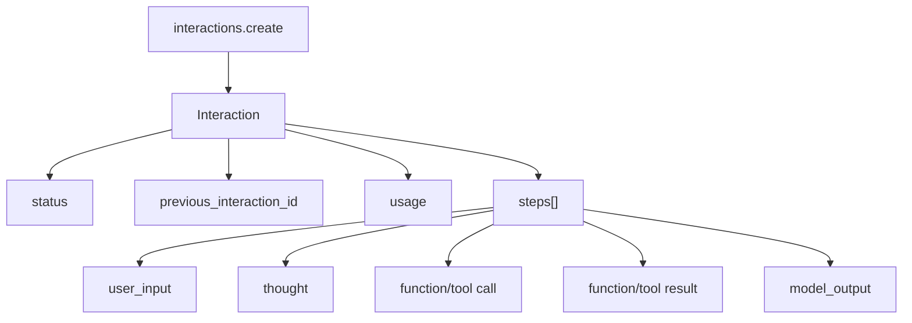

# Gemini Interactions API：状态、流式与后台任务

<!-- learning-contract -->
<div class="learning-contract" markdown="1">

**学习导航**

- **适合读者**：需要接入有状态会话、流式 step 或后台任务的 API 工程师。
- **先修**：先读 [Gemini 总览](gemini.md)，理解 provider lifecycle 与业务成功不是一回事。
- **首次阅读**：object graph → stateful/stateless → streaming → background。
- **完成信号**：能画出 Interaction、step、terminal 与 transport EOF 的状态关系。
- **卡住时**：先用同步、无工具、非 background 请求理解 resource，再增加一种复杂度。

</div>

**章节导航**：[总览](gemini.md) · [generateContent 与多模态](gemini-generate-content.md) · [生产接入](gemini-production.md) · [证据台账](../evidence/gemini-controls.md)
{ .doc-nav }

Interactions API 把一次 turn 或长任务建模为可查询的 Interaction resource。它适合需要服务端状态、typed steps 或 background execution 的场景，但也要求应用明确处理状态归属、保留、恢复和取消。


## Interactions object graph

Interactions 以一个 Interaction resource 表示一次 turn 或 task，并用有序 steps 表达执行过程：



官方 overview 说明：`interactions.create` 的响应只返回模型生成 steps，而持久 resource 经 `interactions.get` 可包含完整上下文中的 user input steps。客户端不能假设 create/get 的投影视图完全相同。

### authored request 形状

下面只用于解释字段关系，不是本仓库执行过的请求：

```json
{
  "model": "deployment-owned-exact-id",
  "input": "只返回结论和证据坐标",
  "system_instruction": "不得执行未授权工具",
  "tools": [],
  "generation_config": {"temperature": 0},
  "store": false,
  "stream": true
}
```

身份与治理字段必须在 canonical request 中先冻结，再映射到 wire body；不要在 retry attempt 中重新读取可变全局配置。

### Interaction status 不是一个布尔 finished

官方 reference 当前列出多种 status。生产状态机至少保留：

| status | 客户端含义 | 不能做的事 |
|---|---|---|
| `queued` | 等待处理 | 当作已开始计时或已执行工具 |
| `in_progress` | 仍在运行 | 提前发布最终答案 |
| `requires_action` | 等待客户端输入/动作 | 自动执行未授权 proposal |
| `completed` | provider interaction 完成 | 等同业务任务通过 verifier |
| `incomplete` | 有结果但不完整 | 静默当完整成功 |
| `budget_exceeded` | token budget 终止 | 假设 usage 为零 |
| `failed` | provider 报失败 | 丢掉 request id/error evidence |
| `cancelled` | provider 报取消状态 | 推断未生成、未计费、无副作用 |

`completed` 只是 provider lifecycle terminal。业务层还需要解析、schema、引用、工具 effect、质量和安全 verifier。

### `output_text` 是有损 projection

官方文本生成指南说明 SDK 的 `interaction.output_text` 便捷属性拼接最后一段连续 text blocks；若更早的文本被 thought、图片、音频或 tool call 分隔，它不会保留那些内容。

因此 adapter 应同时提供：

- `raw_interaction` 或 allowlisted typed projection；
- `steps[]` 的类型、顺序和 identity；
- `final_text_projection`；
- `projection_loss` 标记；
- 未理解 step 的 fail-closed/forward-compatible policy。

只保存 `output_text` 会破坏工具重放、审计、无状态续聊和多模态输出的完整性。

## 服务端状态与无状态历史

`previous_interaction_id` 只延续已保存的历史输入/输出，不自动继承所有本次配置。官方 overview 明确要求每次重新指定 interaction-scoped 参数，例如：

- `tools`；
- `system_instruction`；
- `generation_config`；
- 其他与当前 interaction 绑定的约束。

把这些字段误认为 session property 会导致策略、工具 allowlist 或预算在后续 turn 悄悄消失。

### stateful 路径

```text
turn 1 create(store=true)
  → interaction_id=A
turn 2 create(previous_interaction_id=A, config resent)
  → interaction_id=B
```

需要保存：

- tenant/project 与 interaction id 的绑定；
- 谁有权读取、续接或删除；
- 当前 policy/tool/config version；
- 保留/删除状态；
- 祖先链与循环/跨租户防护；
- provider 与本地 trace 的 join key。

### stateless 路径

`store=false` 时由客户端维护完整历史。官方指南特别要求：如果模型使用 thinking 或 tools，必须原样保存并重发模型生成 steps，包括 continuation 所需的 signatures。

这意味着“只保存可见问答文本”不是等价 stateless replay。至少要保留：

- step type 与顺序；
- provider-returned opaque fields；
- function call/result 关联；
- model output 的 typed content；
- canonical serialization bytes 或明确的重放 projection；
- 来源、租户与会话 context binding。

opaque signature 不应被日志、前端或跨会话复用。无法验证来源/上下文时应拒绝重放，而不是猜测或修补。

### 存储与保留是治理选择

官方 overview 当前说明默认存储 Interaction，`store=false` 会影响 `previous_interaction_id` 与 background 等能力；具体保留期限和控制选项会变化，因此本教材不把天数写成永久合同。

生产前要确认：

- free/paid tier 与项目级设置；
- 请求级 `store` 是否覆盖项目配置；
- delete 的授权、传播与审计；
- 日志、备份、衍生缓存是否同步删除；
- 跨境/区域与 legal hold；
- application transcript 与 provider store 的双份数据；
- 用户导出、撤回与 incident response。

“调用 delete 成功”也不自动证明所有副本已物理擦除；结论必须限定为目标 API 的响应与合同语义。

## Interactions streaming lifecycle

截至 2026-08-15 核对的官方 streaming guide 使用 SSE，并给出以下主生命周期：

```text
interaction.created
  → interaction.status_update*         # 可选、可在 steps 间出现
  → step.start(index, type)
  → step.delta(index, typed delta)*
  → step.stop(index)
  → ... more steps ...
  → interaction.completed(final usage)
  → event: done / data: [DONE]
  → transport EOF
```

它不是本仓库 `GeminiGenerateContentTextStream` 的状态机。后者只审核 `streamGenerateContent` 的 text/candidate/finishReason+EOF 子集。

### step 级不变量

一个 strict Interactions parser 至少应验证：

1. `interaction.created` 只能出现一次；
2. created 前不得出现 step；
3. step index 的唯一性与预期顺序；
4. `step.delta` 只能作用于 active step；
5. delta type 必须与 step type 相容；
6. `step.stop` 只能关闭对应 active step；
7. 同一 step 不得重复 stop；
8. terminal interaction 前不得有 active step；
9. completed/error/cancelled 等 terminal 只能选择一个；
10. `[DONE]` 不能替代 typed terminal object；
11. `[DONE]` 后拒绝 provider event；
12. transport EOF 前必须取得协议 terminal；
13. unknown event/step/delta 按版本策略 fail closed 或隔离保存；
14. usage 是 provider 报告的 token accounting，不是 SSE event 数；
15. raw bytes、SSE event 与 typed delta 是三层不同对象。

### step type 与 delta type

官方指南示例包括：

| step type | 常见 delta | 工程处理 |
|---|---|---|
| `model_output` | text/image/audio | 按模态组装并执行大小限制 |
| `thought` | thought signature/summary | opaque、context-bound、限制公开 |
| `function_call` | `arguments_delta` | 累积完整 JSON 后才解析/授权 |
| server-side tool call/result | provider-specific | 保留 call/result identity 与来源 |

`arguments_delta` 是局部 JSON 字符串。不得逐 delta 执行工具，也不得用字符串拼接后跳过 duplicate-key、non-finite、深度和字节上限检查。

### terminal 的三层含义

```text
step.stop
  != interaction terminal
interaction.completed
  != transport EOF
provider completed
  != business success
```

工具 proposal 可能以 `requires_action` 结束；它不是错误，也不是已执行 effect。客户端必须把 proposal、authorization、execution 与 effect verification 分开。

### reconnect 与 resume

官方 API reference 暴露 retrieval/stream resume 相关字段（例如 interaction id 与 event id）。接入时仍需验证：

- event id 的范围与持久期；
- resume 是 at-least-once 还是 exactly-once delivery；
- 重复 delta/step 的去重键；
- server 是否重发 terminal；
- client checkpoint 与已发布 partial output 的关系；
- 断线期间工具是否已执行；
- cancellation 与 background 状态的竞态。

本仓库没有 Interactions event fixture、resume parser 或真实 SSE 证据，因此这里只给设计要求，不声称已实现。

## Background interaction 状态机

长任务不能套用同步 HTTP 成败模型。建议使用显式状态：

```text
submit
  → queued
  → in_progress
  → completed | requires_action | incomplete | failed | cancelled | budget_exceeded
```

每次 poll/webhook 处理要验证：

- interaction id 与 tenant；
- status transition 是否允许；
- response freshness/monotonic updated time；
- webhook authentication 与 replay window；
- duplicate notification 幂等；
- cancel request 与最终 terminal 的竞态；
- deadline 后由谁继续 reconciliation；
- usage、费用和 partial artifact 的归属。

`cancel` 返回或状态变成 `cancelled` 不等于服务器从未执行、没有生成 token、没有外部工具副作用或不会计费。
