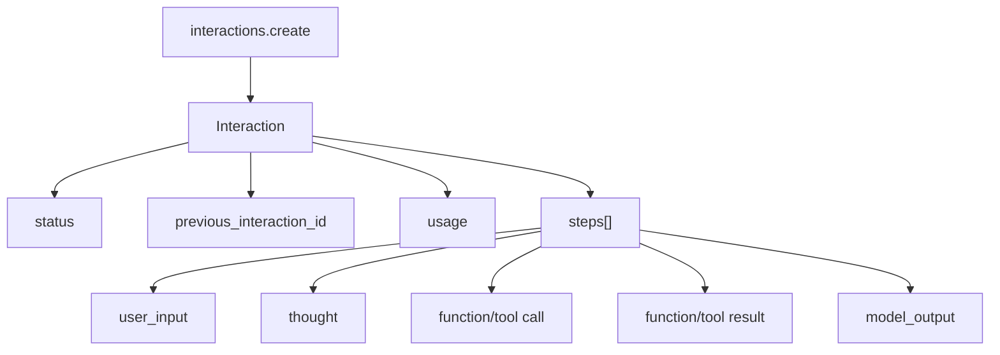

# Gemini：多模态 API、Interactions 状态与生产证据

<!-- learning-contract -->
<div class="learning-contract" markdown="1">

**学习导航**

- **适合读者**：Gemini 多模态、云平台和工具应用工程师。
- **先修**：多模态输入、HTTP/JSON、流式、工具调用与 IAM 基础。
- **首次阅读**：平台选择 → API surface → generateContent → 模态验证。
- **完成信号**：能区分平台契约，并设计目标模态是否被使用的评测。
- **卡住时**：回到[云 API 契约](cloud-api-contracts.md)和[多模态](../frontier/multimodal.md)。

</div>

## 学习目标与证据边界

读完本章应能区分 Gemini 模型家族、Gemini API、Vertex AI 与终端产品；能够分别建模 Interactions API 和 `generateContent`，并设计多模态、长上下文、工具与文件输入的可证伪评测。

**先修知识**：多模态 token/embedding、HTTP/JSON、流式事件、工具调用、RAG 与云 IAM。

Gemini 同时出现在模型研究、开发者 API、Google Cloud 托管和消费产品中。产品界面中可见的能力不自动等于 Gemini API 或 Vertex AI 的公开契约；API 模型的内部参数量、训练数据、完整路由与后训练配方若未披露，应保持未知。

以下 API 状态于 **2026-08-15** 核对。型号、价格、窗口、媒体限制、区域、配额与保留策略都是时间敏感事实，部署时必须重新查看所选平台与 API 版本。官方网页是可变的 L2 产品证据：本仓库没有固定其 raw bytes/hash，也没有把网页最后更新时间当作 endpoint 已执行证明。

## 先选平台，再选模型

| 层 | 主要问题 | 不能自动外推 |
|---|---|---|
| Gemini 模型 | 文本、多模态、推理和工具能力 | 某平台一定开放全部能力 |
| Gemini API | 开发者接口、AI Studio 相关密钥与配额 | Vertex AI 的 IAM、区域和治理 |
| Vertex AI | Google Cloud 项目、IAM、区域、审计与企业治理 | Gemini API 的 endpoint 与默认值 |
| 终端产品 | 产品内交互、集成与 UI | 可编程 API、数据政策和配额 |

工程配置至少固定 `provider/platform`、API surface、model id、region、checked_at、SDK/API version 和数据保留选择。只写 `provider=gemini` 无法复现身份、端点或治理语义。

## 两套 API surface 必须分开

截至 2026-08-15，官方文档说明 Interactions API 已 GA，并推荐所有新项目使用；原有 `generateContent` 被标为 legacy，但仍受支持。本仓库当前 adapter 教学实现的是 `generateContent`，不是 Interactions API。

| 维度 | Interactions API | `generateContent` |
|---|---|---|
| 核心抽象 | Interaction resource 与可观察 steps | 针对 model 的内容生成请求/响应 |
| 多轮状态 | 可用 `previous_interaction_id` 选择服务端状态，也可无状态 | 客户端通常重发 `contents` 历史 |
| 长任务 | 支持独立的 background execution 语义 | 不应套用 Interactions 的后台状态机 |
| 输出 | model/tool/thought 等步骤按该接口建模 | `candidates`、content/parts、finish reason |
| 数据保留 | 默认存储与 `store=false` 是重要治理选择 | 按该接口及平台的数据政策单独核对 |
| 本仓库状态 | 尚无 adapter/真实端点验证 | 有离线 text-only 契约 adapter |

`previous_interaction_id` 只延续已保存的会话历史；工具、system instruction、generation config 等 interaction-scoped 参数应按本次请求重新设置。`store=false` 会改变可用的状态/后台能力，不能当作无影响的隐私开关。具体保留天数可能变化，本教材不固化数字，生产前应查看官方 data retention 页面。

迁移不能只替换 endpoint。要重新处理：状态所有权、step/event 类型、tool call/result、后台轮询或 webhook、取消、重试、幂等、存储/删除、usage 和错误 taxonomy。

## `generateContent` 契约

官方 GenerateContent reference 的请求核心是 `contents`：单轮是一项，多轮包含历史和最新输入；每项 Content 由 role 与 `parts` 组成。顶层 `systemInstruction`、`generationConfig`、tools 和 safety settings 属于各自字段。

教学用请求形状：

```json
{
  "systemInstruction": {
    "parts": [{"text": "仅依据给定证据回答"}]
  },
  "contents": [
    {
      "role": "user",
      "parts": [
        {"text": "解释图中趋势"},
        {"inlineData": {"mimeType": "image/png", "data": "<base64>"}}
      ]
    }
  ],
  "generationConfig": {
    "temperature": 0
  }
}
```

字段名和媒体传输方式应以实际 SDK/API 版本为准；示例只展示数据模型。响应解析至少保留：

- `candidates`，不能默认永远只有一个成功候选；
- 每个 candidate 的 content/parts；
- `finishReason` 与安全相关反馈；
- `usageMetadata`；
- model version、request id 或 provider 可用的追踪字段；
- 未识别 part 的原始内容。

若 prompt 被阻止，响应可能没有可用 candidate；若 candidate 只有 function call 或其他非 text part，text-only parser 也不应返回空字符串冒充成功。

## Parts 是统一多模态容器

`parts` 让文本、媒体、文件、函数调用与结果进入同一有类型序列。它的工程后果不是“可以传图片”这么简单，而是 parser、存储和安全边界都必须按类型设计：

```text
Content(role)
└── parts[]
    ├── text
    ├── inline/file media reference
    ├── function call / result
    └── provider-specific part
```

每个媒体 part 要校验 MIME、解码后大小、分辨率/时长、来源、租户 ACL、恶意文件和生命周期。不要只相信扩展名或客户端上报的 MIME。内联 base64 会放大请求体；大文件通常应使用受控上传/文件引用，并明确删除和版本策略。

多模态输入也是提示注入载体：图片中的小字、PDF 隐藏层、音频转写和视频字幕都可能包含指令。低信任媒体提取出的文字不能升级为 system instruction；工具执行仍由外部授权层控制。

## 怎样证明模型真的使用了目标模态

“这张图讲什么”容易被标题或常识猜中。高质量评测要构造反事实和遮蔽：

| 模态 | 核心任务 | 反作弊设计 |
|---|---|---|
| 图片 | OCR、小字、空间、计数、属性 | 去掉文件名/alt text，交换局部区域 |
| 图表 | 数值、单位、图例、趋势 | 改一个数据点或单位，保持文字描述相同 |
| 文档 | 布局、表格、页码、跨页引用 | 打乱页序，加入相似干扰段 |
| 视频 | 时间定位、动作顺序、状态变化 | 剪掉关键帧或交换两个片段 |
| 音频 | 转写、说话人、事件与时间 | 替换同文本不同说话人/情绪样本 |

报告 exact match/F1 之外，还要保存证据坐标、页码/时间戳、拒答、媒体解析失败和文本先验对照。视觉模型答对但引用错区域，不能算可审计成功。

## 长上下文、文件与缓存

长上下文要测位置、多跳、冲突、顺序、全局聚合和长输出一致性，不能只放一根 needle。文件/缓存可以减少重复传输或计算，但会引入：

- 文件 owner、租户与项目 ACL；
- 上传、处理、可用、失败、删除等生命周期；
- 内容 hash、版本与解析器版本；
- cache/file id 被错误跨用户复用；
- 原文件删除后派生缓存是否仍存在；
- 媒体 token、延迟与费用的独立计量。

RAG 仍有价值：它在送入模型前做权限过滤、版本选择、证据定位和输入压缩。文件 API 或超长窗口不等于检索系统，也不自动提供引用正确性。

## Structured output 与工具

结构化输出约束语法，不保证字段真实、单位正确或引用存在。function call 只是候选动作；runtime 仍要做 schema、业务规则、身份、ACL、预算、审批、幂等和审计。

Interactions 与 `generateContent` 的工具/step 表达应分别实现 provider adapter，再归一到内部 `ToolCall(id, name, arguments, raw)`。不要把一个 API 的流式事件或 call id 规则复制到另一个 API。工具结果属于低信任输入，尤其要防网页、地图、搜索和代码执行结果中的间接提示注入。

## 工程选型与迁移评测

模型和 API surface 一起评测：

1. 固定平台、区域、API/SDK 版本、model id 与 checked_at；
2. 固定 text/media case、system instruction、工具 schema 与输出预算；
3. 保存原始 part/step/event、usage、finish reason、安全反馈和延迟；
4. 分开统计 provider error、媒体处理失败、解析错误、内容错误和安全阻止；
5. 比较每成功任务成本，而不是只比较每 token 标价；
6. 检查存储、删除、日志、IAM 和跨区域数据流；
7. paired eval 后再 shadow/canary，并保留旧 adapter 以回滚。

Interactions 的服务端状态让客户端更轻，但也增加状态归属、删除、保留和重放问题。无状态 `store=false` 更易由应用掌控历史，却可能失去某些状态/后台能力；应按治理和产品需求选择，而不是只按代码行数。

## 闭源多模态 API 的 L0–L5 证据阶梯

“Gemini 支持某能力”不是一个足够精确的结论。至少要回答：哪个产品、哪个 API、哪个版本、哪个 model id、哪个区域、哪种输入、何时核对、证据来自哪里。

| 层级 | Gemini 场景中的证据 | 能支持的结论 | 仍不能支持 |
|---|---|---|---|
| L0 | `Gemini` 品牌或家族名 | 候选生态 | model id、接口、窗口、质量 |
| L1 | 论文、发布说明、产品页 | 研究/产品声明 | 当前 wire contract、你的账号可用性 |
| L2 | 带日期的官方 API/reference 页面 | 当日文档声明的字段与 lifecycle | raw bytes 不变、endpoint 已接受请求 |
| L3 | authored JSON/SSE/MockTransport/SQLite controls | 本地 adapter、parser、状态机与 policy 行为 | Google SDK、真实网络、provider usage |
| L4 | 固定身份的受限真实调用与原始 receipt | 该时刻单个账号/区域/API/model/workload 的协议行为 | 代表性质量、容量或生产可靠性 |
| L5 | 代表性评测、压测、故障注入、账单对账与 rollout | 明确 workload 下的发布/运维结论 | 其他平台、区域、模型或未来版本 |

这里的 L2 也不是 immutable byte evidence。官方页面会重定向、更新字段、改变导航；`Last updated` 只描述网页，不证明你的请求经过相同服务版本。

本仓库当前最高只取得 Gemini `generateContent` text-only 子集的 L3 离线证据：

- authored request/response fixture；
- authored SSE event fixture；
- provider-neutral strict JSON/SSE/HTTP/retry controls；
- provider-neutral memory/SQLite budget controls；
- `network_performed=false` 的三供应商契约报告。

这些证据不能相加成 L4：

- `generateContent` adapter 通过，不表示 Interactions 已实现；
- SSE state machine 通过，不表示执行过 streaming HTTP；
- HTTP MockTransport 通过，不表示 Google endpoint 收到 cancel；
- SQLite 账本通过，不表示 provider usage 或 invoice 正确；
- 多模态教材与 text fixture 并存，不表示运行过图片/音频/视频；
- API 产品文档不公开内部参数、层数、训练数据或完整后训练配方。

### 一条 claim 的最小身份

建议把每条外部结论写成：

```text
claim = (
  platform,
  api_surface,
  api_version,
  endpoint_origin,
  region_or_location,
  model_id,
  account_tier,
  request_identity,
  checked_at,
  evidence_level
)
```

任何一项缺失都可能改变语义。尤其不能只记录 SDK 类名，因为同一 SDK 可切换 Gemini API/Google Cloud、API 版本和模型。

## 模型家族知识：公开能力不等于公开架构

Gemini 是模型与产品家族，而不是一个冻结 checkpoint。闭源场景应刻意保持以下字段未知，除非目标版本的官方材料明确披露：

- 参数量与层数；
- 稠密或稀疏结构的具体实现；
- attention、位置编码与 cache 的内部布局；
- 训练数据构成与去重细节；
- 多模态 encoder/projector 的精确结构；
- router、system prompt 与后训练配方；
- 服务端模型路由、量化、batch 与 speculative 策略；
- thought/signature 的内部生成与验证协议。

因此下列推理无效：

- “能看图”不证明使用某个视觉 encoder；
- “有 thinking token”不证明返回真实 chain of thought；
- “model id 名称相近”不证明权重或 tokenizer 相同；
- “同一问题输出相近”不证明底层 revision 相同；
- “文档写长上下文”不证明你的 task 在全窗口都有效；
- “Google Cloud 托管”不证明数据驻留、日志或 IAM 已满足你的合同。

工程学习的重点不是猜内部结构，而是建立可验证的输入、状态、输出、工具、费用和治理契约。

## 平台与 endpoint 身份

至少把部署配置拆成四组：

| 组 | 典型字段 | 漂移风险 |
|---|---|---|
| 产品 | Gemini API / Google Cloud 托管 surface | auth、区域、治理和 endpoint 不同 |
| 接口 | Interactions / `generateContent` | object graph、状态和事件不同 |
| 模型 | exact model id / alias / preview | 能力、默认值和下线策略不同 |
| 运行 | API version、SDK version、region、tier | 字段、配额、保留和错误语义不同 |

不要让 `provider="gemini"` 同时承担这些身份。一个更可审计的配置应至少包括：

```yaml
platform: gemini-api
api_surface: interactions
api_version: v1
endpoint_origin: https://generativelanguage.googleapis.com
model_id: deployment-owned-exact-id
region_or_location: platform-defined
checked_at: 2026-08-15
storage_mode: explicit
```

这只是配置形状，不是已运行配置；教材不写入真实密钥、项目号或当前型号榜单。

### alias、preview 与固定 revision

闭源 API 常无法像开放权重仓库那样固定 commit。生产身份至少要保存：

- 请求中的 exact model id；
- 响应中的 model/version 字段（若该 surface 提供）；
- API/SDK 版本；
- 首次与最近验证时间；
- provider request/interaction id；
- capability probe 结果；
- 评测 artifact 与 rollout decision id。

如果 model id 是会漂移的 alias，必须承认它不是 immutable revision。响应字段也只能证明 provider 回报了什么，不能自行认证权重来源。

## Canonical Core 与两套 wire model

业务层可以共享一个窄 canonical core：

```text
CanonicalRequest
├── conversation turns / content blocks
├── system policy
├── output contract
├── tool proposals
├── generation budget
└── trace / tenant / data-policy identity
```

但 wire adapter 必须分开：

```text
canonical request
├── Interactions adapter
│   └── interaction + input/steps + previous_interaction_id
└── generateContent adapter
    └── contents/parts + systemInstruction + generationConfig
```

归一化只应覆盖业务确实共享的语义。以下信息不能在 adapter 中静默丢弃：

- step/part 的原始类型与顺序；
- tool call/result identity；
- thought/signature 等 continuation artifact；
- prompt/candidate safety feedback；
- model version、response/interaction id；
- usage 的分项与计量口径；
- provider terminal 与 transport EOF；
- unknown extension fields 的受控原始投影。

“返回一段 text”是有损 convenience view，不是完整响应模型。

## Interactions object graph

Interactions 以一个 Interaction resource 表示一次 turn 或 task，并用有序 steps 表达执行过程：



官方 overview 说明：`interactions.create` 的响应只返回模型生成 steps，而持久 resource 经 `interactions.get` 可包含完整上下文中的 user input steps。客户端不能假设 create/get 的投影视图完全相同。

### authored request 形状

下面只用于解释字段关系，不是本仓库执行过的请求：

```json
{
  "model": "deployment-owned-exact-id",
  "input": "只返回结论和证据坐标",
  "system_instruction": "不得执行未授权工具",
  "tools": [],
  "generation_config": {"temperature": 0},
  "store": false,
  "stream": true
}
```

身份与治理字段必须在 canonical request 中先冻结，再映射到 wire body；不要在 retry attempt 中重新读取可变全局配置。

### Interaction status 不是一个布尔 finished

官方 reference 当前列出多种 status。生产状态机至少保留：

| status | 客户端含义 | 不能做的事 |
|---|---|---|
| `queued` | 等待处理 | 当作已开始计时或已执行工具 |
| `in_progress` | 仍在运行 | 提前发布最终答案 |
| `requires_action` | 等待客户端输入/动作 | 自动执行未授权 proposal |
| `completed` | provider interaction 完成 | 等同业务任务通过 verifier |
| `incomplete` | 有结果但不完整 | 静默当完整成功 |
| `budget_exceeded` | token budget 终止 | 假设 usage 为零 |
| `failed` | provider 报失败 | 丢掉 request id/error evidence |
| `cancelled` | provider 报取消状态 | 推断未生成、未计费、无副作用 |

`completed` 只是 provider lifecycle terminal。业务层还需要解析、schema、引用、工具 effect、质量和安全 verifier。

### `output_text` 是有损 projection

官方文本生成指南说明 SDK 的 `interaction.output_text` 便捷属性拼接最后一段连续 text blocks；若更早的文本被 thought、图片、音频或 tool call 分隔，它不会保留那些内容。

因此 adapter 应同时提供：

- `raw_interaction` 或 allowlisted typed projection；
- `steps[]` 的类型、顺序和 identity；
- `final_text_projection`；
- `projection_loss` 标记；
- 未理解 step 的 fail-closed/forward-compatible policy。

只保存 `output_text` 会破坏工具重放、审计、无状态续聊和多模态输出的完整性。

## 服务端状态与无状态历史

`previous_interaction_id` 只延续已保存的历史输入/输出，不自动继承所有本次配置。官方 overview 明确要求每次重新指定 interaction-scoped 参数，例如：

- `tools`；
- `system_instruction`；
- `generation_config`；
- 其他与当前 interaction 绑定的约束。

把这些字段误认为 session property 会导致策略、工具 allowlist 或预算在后续 turn 悄悄消失。

### stateful 路径

```text
turn 1 create(store=true)
  → interaction_id=A
turn 2 create(previous_interaction_id=A, config resent)
  → interaction_id=B
```

需要保存：

- tenant/project 与 interaction id 的绑定；
- 谁有权读取、续接或删除；
- 当前 policy/tool/config version；
- 保留/删除状态；
- 祖先链与循环/跨租户防护；
- provider 与本地 trace 的 join key。

### stateless 路径

`store=false` 时由客户端维护完整历史。官方指南特别要求：如果模型使用 thinking 或 tools，必须原样保存并重发模型生成 steps，包括 continuation 所需的 signatures。

这意味着“只保存可见问答文本”不是等价 stateless replay。至少要保留：

- step type 与顺序；
- provider-returned opaque fields；
- function call/result 关联；
- model output 的 typed content；
- canonical serialization bytes 或明确的重放 projection；
- 来源、租户与会话 context binding。

opaque signature 不应被日志、前端或跨会话复用。无法验证来源/上下文时应拒绝重放，而不是猜测或修补。

### 存储与保留是治理选择

官方 overview 当前说明默认存储 Interaction，`store=false` 会影响 `previous_interaction_id` 与 background 等能力；具体保留期限和控制选项会变化，因此本教材不把天数写成永久合同。

生产前要确认：

- free/paid tier 与项目级设置；
- 请求级 `store` 是否覆盖项目配置；
- delete 的授权、传播与审计；
- 日志、备份、衍生缓存是否同步删除；
- 跨境/区域与 legal hold；
- application transcript 与 provider store 的双份数据；
- 用户导出、撤回与 incident response。

“调用 delete 成功”也不自动证明所有副本已物理擦除；结论必须限定为目标 API 的响应与合同语义。

## Interactions streaming lifecycle

截至 2026-08-15 核对的官方 streaming guide 使用 SSE，并给出以下主生命周期：

```text
interaction.created
  → interaction.status_update*         # 可选、可在 steps 间出现
  → step.start(index, type)
  → step.delta(index, typed delta)*
  → step.stop(index)
  → ... more steps ...
  → interaction.completed(final usage)
  → event: done / data: [DONE]
  → transport EOF
```

它不是本仓库 `GeminiGenerateContentTextStream` 的状态机。后者只审核 `streamGenerateContent` 的 text/candidate/finishReason+EOF 子集。

### step 级不变量

一个 strict Interactions parser 至少应验证：

1. `interaction.created` 只能出现一次；
2. created 前不得出现 step；
3. step index 的唯一性与预期顺序；
4. `step.delta` 只能作用于 active step；
5. delta type 必须与 step type 相容；
6. `step.stop` 只能关闭对应 active step；
7. 同一 step 不得重复 stop；
8. terminal interaction 前不得有 active step；
9. completed/error/cancelled 等 terminal 只能选择一个；
10. `[DONE]` 不能替代 typed terminal object；
11. `[DONE]` 后拒绝 provider event；
12. transport EOF 前必须取得协议 terminal；
13. unknown event/step/delta 按版本策略 fail closed 或隔离保存；
14. usage 是 provider 报告的 token accounting，不是 SSE event 数；
15. raw bytes、SSE event 与 typed delta 是三层不同对象。

### step type 与 delta type

官方指南示例包括：

| step type | 常见 delta | 工程处理 |
|---|---|---|
| `model_output` | text/image/audio | 按模态组装并执行大小限制 |
| `thought` | thought signature/summary | opaque、context-bound、限制公开 |
| `function_call` | `arguments_delta` | 累积完整 JSON 后才解析/授权 |
| server-side tool call/result | provider-specific | 保留 call/result identity 与来源 |

`arguments_delta` 是局部 JSON 字符串。不得逐 delta 执行工具，也不得用字符串拼接后跳过 duplicate-key、non-finite、深度和字节上限检查。

### terminal 的三层含义

```text
step.stop
  != interaction terminal
interaction.completed
  != transport EOF
provider completed
  != business success
```

工具 proposal 可能以 `requires_action` 结束；它不是错误，也不是已执行 effect。客户端必须把 proposal、authorization、execution 与 effect verification 分开。

### reconnect 与 resume

官方 API reference 暴露 retrieval/stream resume 相关字段（例如 interaction id 与 event id）。接入时仍需验证：

- event id 的范围与持久期；
- resume 是 at-least-once 还是 exactly-once delivery；
- 重复 delta/step 的去重键；
- server 是否重发 terminal；
- client checkpoint 与已发布 partial output 的关系；
- 断线期间工具是否已执行；
- cancellation 与 background 状态的竞态。

本仓库没有 Interactions event fixture、resume parser 或真实 SSE 证据，因此这里只给设计要求，不声称已实现。

## Background interaction 状态机

长任务不能套用同步 HTTP 成败模型。建议使用显式状态：

```text
submit
  → queued
  → in_progress
  → completed | requires_action | incomplete | failed | cancelled | budget_exceeded
```

每次 poll/webhook 处理要验证：

- interaction id 与 tenant；
- status transition 是否允许；
- response freshness/monotonic updated time；
- webhook authentication 与 replay window；
- duplicate notification 幂等；
- cancel request 与最终 terminal 的竞态；
- deadline 后由谁继续 reconciliation；
- usage、费用和 partial artifact 的归属。

`cancel` 返回或状态变成 `cancelled` 不等于服务器从未执行、没有生成 token、没有外部工具副作用或不会计费。

## `generateContent` 的完整对象图

`generateContent` 以 request/response 而非 Interaction resource 为中心：

```text
GenerateContentRequest
├── contents[]
│   └── Content(role, parts[])
├── systemInstruction
├── tools[] / toolConfig
├── safetySettings[]
├── generationConfig
├── cachedContent
└── service/store 等版本化字段

GenerateContentResponse
├── candidates[]
│   ├── content.parts[]
│   ├── finishReason
│   └── safetyRatings
├── promptFeedback
├── usageMetadata
├── modelVersion
└── responseId
```

官方 reference 说明 prompt 被阻止时可能没有 candidates，并应检查 `promptFeedback`。因此空候选不是空文本成功。

### 当前 request builder 实际覆盖什么

`build_gemini_request()` 当前只支持：

- HTTPS base URL；
- `x-goog-api-key` header；
- `/v1beta/models/{model}:generateContent`；
- system text → `systemInstruction.parts[0].text`；
- user/assistant text → `user/model` role；
- 每条 message 一个 text part；
- `maxOutputTokens` 与 temperature。

它没有实现：

- Interactions；
- Google Cloud IAM/region endpoint；
- image/audio/video/document input；
- file/cached content lifecycle；
- function calling/code execution；
- safety settings；
- structured output；
- thinking config；
- streaming HTTP；
- SDK transport 与真实 credentials。

### 当前 response parser 的有损边界

`parse_gemini_response()`：

- 只读取 `candidates[0]`；
- 只拼接其中含 `text` 的 parts；
- 无 text part 时 fail closed；
- 读取 `modelVersion`；
- 读取 `promptTokenCount` / `candidatesTokenCount`；
- 读取第一个 candidate 的 `finishReason`。

它不会保真返回：

- 第二及后续 candidates；
- `promptFeedback`；
- safety ratings；
- function call/result；
- image/audio/video/document parts；
- thought/signature；
- citations/grounding/provider extension；
- `responseId`；
- cache/tool/thought/total token 明细；
- unknown parts。

因此它是 narrow text projection，不是完整 `GenerateContentResponse` adapter。真实生产 adapter 应把有损行为变成显式类型或拒绝，而不是静默吞字段。

## `streamGenerateContent` 与 Interactions stream 不可混写

仓库 `GeminiGenerateContentTextStream` 的 authored 子集：

```text
SSE message
  → candidates[0].content.parts[text]*
  → candidates[0].finishReason
  → usageMetadata
  → transport EOF
```

它强制：

- SSE `event` 必须是默认 `message`；
- 每个 payload 最多一个 candidate；
- candidate index 必须为 0；
- 只允许单字段 text part；
- `finishReason` 为非空字符串且只能出现一次；
- finish 后不能再有 candidate；
- usage token 为非负整数且 bool 不算整数；
- EOF 前必须见到 `finishReason`。

它没有：

- Interactions 的 named event/event_type 双重校验；
- step start/delta/stop；
- function/multimodal/thought delta；
- prompt feedback；
- 多 candidate；
- HTTP `alt=sse`/URL 选择验证；
- provider error taxonomy；
- resume/reconnect；
- backpressure 与 server cancel 证据。

所以正确表述是“实现并测试 `streamGenerateContent` text-only local state machine”，不是“完成 Gemini 流式 API”。

## SSE framing、typed state 与 HTTP 是三层

```text
arbitrary network bytes
  → SSE lines/events
  → provider JSON payload
  → Interactions event or GenerateContent chunk
  → canonical update
```

每层有不同失败模式：

- UTF-8 跨 chunk；
- CR/LF/CRLF 与多行 `data:`；
- line/event/total byte 超限；
- invalid/duplicate/non-finite JSON；
- event name 与 payload discriminator 不一致；
- step/candidate 状态错序；
- provider terminal 缺失；
- EOF、idle timeout、overall deadline；
- callback backpressure 和 partial output 已发布。

本仓库 generic `SSEDecoder` 与 MockTransport executor 可证明本地这些控制流的子集；不证明真实 TCP/HTTP2、Google backpressure、服务端收到取消、停止生成或停止计费。

## Parts/Content 的安全类型系统

多模态不是把 base64 塞进 prompt。内部模型至少区分：

```text
TextPart
InlineMediaPart(mime, bytes, digest)
FileReferencePart(uri/id, owner, version)
FunctionCallPart(call_id, name, arguments)
FunctionResultPart(call_id, result, trust)
OpaqueProviderPart(type, allowlisted_projection)
```

每类 part 都要有：

- 字节与结构上限；
- MIME allowlist 与 magic-byte 检查；
- tenant/owner/ACL；
- content digest 与版本；
- 来源与解析器版本；
- retention/delete policy；
- 日志/前端 projection；
- prompt-injection trust label；
- 失败与隔离状态。

### inline、file 与 URI 的不同威胁

| 形式 | 优点 | 主要风险 |
|---|---|---|
| inline bytes | request identity 易绑定 | base64 放大、body/日志泄漏、内存峰值 |
| uploaded file id | 复用与大文件友好 | owner/TTL/delete/version 漂移 |
| remote URI | 少搬运 | SSRF、重定向、DNS、内容漂移、凭证泄漏 |

生产层必须先下载/验证还是让 provider 拉取，要按威胁模型选择；不能把用户给出的 URL 直接升级为可信媒体。

## 多模态评测：证明目标模态产生因果影响

单个“看图答对”case 不能证明模型使用图像。建议每个样本建立 paired counterfactual：

| 条件 | 改动 | 预期用途 |
|---|---|---|
| original | 完整媒体与中性文本 | 主任务 |
| no-media | 移除媒体 | 测文本先验 |
| masked | 遮蔽关键区域/时间段 | 测关键证据依赖 |
| swapped | 换关键对象/数值/片段 | 测答案是否随证据变 |
| misleading-text | 加入冲突标题/alt text | 测模态与注入鲁棒性 |
| corrupted | 破损/超限/错误 MIME | 测解析和拒答 |

每个 task 至少记录：

- media hash/version；
- 关键区域坐标、页码或时间戳；
- prompt/template hash；
- model/API/platform identity；
- raw typed output 与解析结果；
- answer/citation/abstention；
- safety/provider/parse errors；
- latency 与 usage 分项；
- paired case id 与统计分母。

### 指标要按能力拆分

- OCR：字符/字段 exact match，按脚本/语言分层；
- 图表：数值、单位、图例与坐标证据；
- 文档：字段、表格、跨页引用与页码；
- 图片：属性、关系、计数、空间与证据框；
- 音频：转写、说话人、事件、时间戳；
- 视频：动作顺序、事件定位、状态变化；
- 工具：proposal schema、授权、effect 与最终任务成功；
- 安全：attack success、over-refusal、正常任务质量。

micro average 会掩盖小模态和难例；报告 macro、slice、failure taxonomy 和置信区间。

## 长上下文不是单一上限

至少区分：

1. **文档声明上限**：当日 model/API page 的 vendor claim；
2. **请求接受上限**：目标账号/区域/配置实际接受；
3. **任务有效上限**：你的 workload 在位置、干扰和输出预算下仍通过 gate。

评测维度包括：

- evidence 在头/中/尾的位置；
- 多证据 join；
- 相互冲突版本；
- 全局聚合；
- recency/order；
- 长输出一致性；
- 多模态 token 分配；
- cache hit/miss；
- timeout/费用/阻止率。

只做 needle retrieval 不能证明多跳、冲突解决、引用或工具任务。

### 文件、cache 与 RAG

`cachedContent`、implicit cache、file API 和 `previous_interaction_id` 解决的是不同问题：

- cache：减少重复处理/计费的 provider 机制；
- file：媒体上传与引用生命周期；
- server state：历史续接；
- RAG：授权过滤、检索、版本、证据定位与发布引用。

它们不能互相替代。尤其 file id 或长窗口不自动提供 tenant ACL、最新版本选择、删除传播、引用正确性或 no-answer gate。

## Structured output：语法约束之后还有语义验证

无论 Interactions 的 response format 还是 `generateContent` 的 generation config/schema surface，结构化输出都只解决受支持 schema 子集中的格式问题。

还必须验证：

- schema/version identity；
- unknown/missing fields；
- duplicate key 与 non-finite number；
- 字符串/数组/嵌套深度上限；
- 单位、范围、交叉字段 invariant；
- 引用是否存在且获授权；
- refusal/block/incomplete 与普通 JSON 分开；
- raw response 与 parsed artifact fingerprint；
- retry 是否会产生不同业务 effect。

“有效 JSON”不等于事实正确、引用正确或工具可执行。

## Function calling：proposal、authorization 与 effect

Interactions 的 `function_call` step 或 `generateContent` function part 都只是候选动作：

```text
provider proposal
  → accumulate/parse strict arguments
  → schema validation
  → trusted resource resolution
  → tenant/subject/ACL/policy
  → approval if required
  → idempotent handler attempt
  → effect verification
  → function result
  → model continuation
```

必须绑定：

- provider call/step id；
- canonical call id；
- tool name 与 schema version；
- exact arguments fingerprint；
- subject/tenant/resource；
- policy/approval version 与 expiry；
- handler attempt/effect id；
- result trust/provenance；
- continuation interaction id。

`requires_action` 不授权工具；`function_result` 不证明 effect；provider 生成最终文本也不证明业务成功。

### server-side tools 与 client-side tools

server-side search/code 等工具由 provider 执行，客户端工具由你的 runtime 执行。两者都要保留 call/result step，但责任边界不同：

- provider tool：核对来源、引用、数据政策、区域与 usage；
- client tool：你负责授权、secret、network egress、sandbox、幂等和审计；
- 混合工具：防止 provider result 与本地 result 的 id/信任级别混淆。

本仓库没有执行任何 Gemini tool step 或 Google server-side tool。

## Thought/signature 是高风险 opaque artifact

官方指南要求某些 stateless continuation 原样保留 thought/tool steps 与 signatures。安全设计应把它们视为：

- provider-originated；
- 会话/模型/API/version context-bound；
- 可能含敏感或不可公开内容；
- 不供业务逻辑解释；
- 不跨用户/租户/模型重放；
- 不进入普通 analytics、前端或简历 artifact。

存储最小化建议：

- 原始密文或受控 blob store；
- 会话与请求 identity；
- allowlisted metadata projection；
- access log 与短 TTL；
- export/redaction policy；
- 重放前 context-binding 校验；
- 删除传播与 incident playbook。

仓库的通用 reasoning artifact fixture 只验证 authored context binding/发布 allowlist，不模拟 Gemini signature 协议，也不证明当前 provider 漏洞或加密安全。

## Safety surface 的版本漂移

2026-08-15 核对时，Interactions overview 的 limitation 文本与 API reference 可见字段对 custom safety surface 存在需要按版本解释的差异。正确工程动作不是选一页当永久真相，而是：

1. 固定 `v1` 或 `v1beta`；
2. 固定 SDK 版本与生成的 wire request；
3. 在目标 endpoint 做 capability probe；
4. 保存 accepted/rejected response 与 checked_at；
5. 将 unsupported field 视为显式能力差异；
6. 发布前用目标模型重跑安全与 over-refusal gate。

provider safety filter 只是 defense-in-depth。应用仍需：

- 输入/文件/URL 安全；
- 数据和工具授权；
- 输出政策；
- 业务 verifier；
- 人工升级；
- abuse monitoring；
- incident/rollback。

## Retry、幂等与 outcome uncertainty

每个失败先回答三个问题：

1. `retryable?`：协议/错误策略允许重试吗？
2. `replay safe?`：相同业务动作可安全重复吗？
3. `outcome known?`：能证明 provider 未接受/执行吗？

| 场景 | outcome | 默认动作 |
|---|---|---|
| target/preflight 失败 | known not sent | 修配置，不记 provider usage |
| connect 前明确失败 | likely not sent，按实现证据 | 可有限重试 |
| 已发送后 timeout/reset | uncertain | 不自动重放副作用任务 |
| HTTP/provider 明确 terminal error | 按固定 allowlist | 保存 request id 后决定 |
| partial stream 已发布 | externally visible | 默认不 replay |
| background id 已取得 | 可查询 | 先 get/reconcile，不新建 |

SSE 断开不等于 cancel；client cancel 不等于 server stop；server stop 不等于零 usage/费用。

## Usage、费用与预算账本

`GenerateContentResponse.usageMetadata` 当前可包含 prompt/candidate/cache/tool/thought/total 等口径；Interactions 有自己的 usage object。不能只读取两个总数字就宣称完成成本治理。

预算流程：

```text
exact request identity
  → conservative input estimate + output cap
  → reserve before send
  → one reservation per attempt
  → settle | cancel-before-send | uncertain
  → provider billing reconciliation
```

仓库固定 authored fixture：

- 60 input + 10 max output；
- authored `$1/M input + $2/M output`；
- reserve 80 micro-USD；
- provider-shaped 58 input + 4 output；
- settle 66 micro-USD；
- 500→200 retry 的两 attempts 合计 146 micro-USD；
- hard limit=140 时第二次发送前被 gate 拒绝。

这些数字只证明整数算术、reservation/reconciliation 与本地 hard gate，**不是 Gemini/Google 价格、usage 或发票**。

Gemini 生产计价可能区分平台、模型、模态、cache、thinking、tool、batch/tier、区域和时间。定价 snapshot 必须独立版本化，并与 provider billing export 对账。

## 生产 adapter 的目录与能力协商

建议拆分：

```text
integrations/gemini/
├── canonical.py
├── identity.py
├── interactions_request.py
├── interactions_response.py
├── interactions_stream.py
├── generate_content_request.py
├── generate_content_response.py
├── generate_content_stream.py
├── multimodal.py
├── tools.py
├── errors.py
├── retry.py
├── usage.py
├── governance.py
└── fixtures/
```

不要用一个 `if provider == "gemini"` 的巨大 parser 同时处理两个 object graph。

### capability matrix

启动或发布前生成机器可读能力快照：

| 能力 | Interactions | `generateContent` | 本仓库证据 |
|---|---|---|---|
| text request/response | official L2 | official L2 + local L3 subset | 仅后者 L3 |
| typed steps | official L2 | 不适用 | 未实现 |
| text streaming | official L2 | official L2 + local L3 subset | 后者 state-only |
| multimodal input | model/API dependent | model/API dependent | 未执行 |
| function calling | API/model dependent | API/model dependent | 未执行 |
| server state | `previous_interaction_id` | 不同历史模型 | 未执行 |
| background | Interactions capability | 不借用 | 未执行 |
| custom safety/config | version/capability probe | surface-specific | 未执行 |
| usage/billing | provider-reported/账单 | provider-reported/账单 | authored budget only |

capability negotiation 失败应阻止发布或走显式降级，不能静默删字段后继续。

## 观测与隐私

最小生产 trace 可记录：

- internal request/attempt id；
- provider response/interaction id；
- platform/API/version/model/region/tier；
- request/template/tool/schema fingerprints；
- part/step type 与大小，不默认记录内容；
- lifecycle timestamps；
- finish/status/error taxonomy；
- usage 分项与 budget terminal；
- store/cache/file policy；
- verifier/rollout decision；
- redaction/projection version。

默认不记录：

- API key/authorization；
- raw media；
- thought/signature；
- tool secret；
- 敏感 prompt/result；
- 可跨租户复用的 file/interaction id。

hash 不是匿名化。低熵 prompt、文件名和短 ID 仍可被猜测；需要 keyed fingerprint、权限与 retention policy。

## Evaluation unit 与分母

模型/API 迁移评测的最小单位是 task attempt，不是 text response。建议保存：

```text
TaskResult
├── task/case/slice identity
├── all attempts
├── provider/transport/parse/tool/verifier outcomes
├── final publish outcome
├── latency timestamps
├── usage/cost
└── evidence artifacts
```

至少报告：

- all-attempt provider success；
- parse success；
- tool proposal/authorization/effect success；
- task success；
- citation/grounding；
- safety violation 与 over-refusal；
- multimodal counterfactual consistency；
- latency（offered 与 success-conditional 分开）；
- usage/cost per attempted 与 successful task；
- background completion/cancel/reconciliation；
- unknown/unjudged/pending 分母。

只在成功响应上算质量会隐藏 blocked、timeout、parse failure 和 tool failure。

### paired migration protocol

迁移 Interactions 前后应固定：

- case set/split；
- platform/region/account；
- exact model identity；
- system/tool/schema；
- media bytes/file versions；
- generation budget；
- evaluator/rubric；
- timeout/retry；
- usage/cost口径；
- store/cache/history policy。

如果 API surface 不能保持某字段，应把它记录为 treatment difference，而不是假装同条件比较。

## 生产 rollout / rollback bundle

发布工件至少包含：

- adapter/version manifest；
- official docs checked_at 与 capability probe；
- model/API/platform identity；
- eval dataset/report；
- raw/typed parser fixtures；
- error/retry/cancel matrix；
- tool/ACL/approval policy；
- budget/pricing snapshot；
- logging/redaction/retention review；
- canary/shadow observation；
- rollback trigger 与旧 adapter；
- incident owner 与 reconciliation runbook。

推荐顺序：

```text
offline contract
  → restricted real smoke
  → paired shadow
  → low-volume canary
  → staged rollout
  → steady-state gate
```

回滚不只切 model id。还要恢复 API surface、state ownership、stored interaction/file/cache policy、tool result compatibility 与 parser version。

## 故障定位树

```text
失败
├── identity/preflight
│   ├── platform/API/version/model
│   └── auth/region/capability
├── transport
│   ├── connect/TLS/timeout
│   └── HTTP/SSE framing
├── provider protocol
│   ├── Interaction step/status
│   └── candidate/part/finish
├── application
│   ├── parse/schema
│   ├── state/history/signature
│   ├── tool/ACL/effect
│   └── quality/safety/citation
└── economics/governance
    ├── usage/budget/billing
    └── storage/delete/logging
```

先确认 identity 和层级，再看模型输出。否则会把 endpoint 配错、状态丢失或 parser 有损误判成“模型能力下降”。

## 单张消费 GPU 与 Gemini API

Gemini 闭源 API 本身不在本地 GPU 部署。单张消费 GPU 可以用于：

- 本地 OCR/ASR/媒体抽取 baseline；
- embedding/reranker/RAG；
- 输入去敏与输出 verifier；
- 小模型 fallback；
- synthetic/counterfactual 媒体生成；
- 离线评测与可视化。

这些本地组件的 GPU 指标不能归因给 Gemini；远端 latency/usage 也不能解释本地 GPU 性能。

## 真实接入最小 smoke runbook

只有用户提供账号、合法权限与预算后才执行：

1. 固定 platform/API version/model/region；
2. 使用最小权限 secret，不写入仓库；
3. 设置请求数、token、费用、媒体大小与总时限上限；
4. 先 text-only non-tool case；
5. 保存 redacted request/response/headers/ids/usage；
6. 验证错误、timeout 与 credential redaction；
7. 再分别验证 streaming、state、tool、多模态；
8. 每项独立 artifact，不互借成功；
9. 删除测试 interaction/file/cache；
10. 与 dashboard/billing export 对账。

即使该 smoke 成功，也只得到 L4 单账号/区域/API/model/workload 证据，不得到代表性质量、容量、生产 SLO 或长期兼容性。

## 作品集与简历证据边界

当前仓库可如实写：

> 为 Gemini `generateContent` 构建 text-only canonical→wire adapter 与单 candidate stream state machine，显式映射 `user/model`、顶层 `systemInstruction`、`usageMetadata` 与 `finishReason + EOF`，并对 non-text part、多 candidate、重复 terminal、缺 terminal 和非法 token usage fail closed；同时给出 Interactions resource/step/state/tool/retention 的生产设计与迁移 gate。

必须紧邻披露：

- adapter/stream 都是 authored offline fixtures；
- 未实现 Interactions parser；
- 未执行 Google GenAI SDK；
- 未使用账号、真实 DNS/TLS/HTTP/SSE；
- 未运行 Gemini model、多模态、tool、thought/signature、file/cache；
- 未验证 usage/billing、质量、性能、安全或生产 SLO；
- 80/66/146 micro-USD 是 authored fixture，不是 Google 价格。

不能写：

- “接入最新 Gemini”；
- “完成 Interactions API”；
- “支持全量多模态”；
- “实现安全工具调用”；
- “验证长上下文与缓存收益”；
- “降低 Gemini 成本 45%”；
- “生产级 Google Cloud 网关”。

若未来取得真实证据，简历数字必须能回溯到 platform、API/version、model、region、case denominator、artifact、usage/billing 与环境。

## 可运行实验

本仓库 `about_llm.integrations.cloud_api` 对 `generateContent` 做离线 text-only 契约测试：assistant role 映射为 `model`、system 映射到 `systemInstruction`、响应提取 `usageMetadata`；`GeminiGenerateContentTextStream` 另检查 `streamGenerateContent` 单 candidate 的 text parts、usageMetadata、finishReason 与 EOF。它没有实现 Interactions API streaming、完整多模态/function parts、真实 streaming HTTP 或 Google 端点验证。

建议新增四组 fixture/实验：

1. **契约矩阵**：text、多 text part、无 candidate、多 candidate、function call、安全阻止、未知 part 与错误响应；
2. **API 迁移**：同一 task 分别经 Interactions 和 `generateContent` adapter，检查内部规范化结果与状态差异；
3. **多模态反事实**：原样、遮蔽、局部替换、文本先验四个版本成组评测；
4. **文件治理**：跨租户 id、过期/删除、版本更新和超大文件必须失败或走审批路径。

若运行真实 API，要把结果标为具体平台、区域、model id、API surface、checked_at 和账号配置下的验证；离线 fixture 通过不能证明真实配额、媒体限制或服务端状态行为。

## 常见错误

- 把 Gemini 产品、Gemini API 和 Vertex AI 当作同一个 endpoint；
- 因同属 Gemini 就混用 Interactions API 与 `generateContent` 的字段和事件；
- 迁移到 `previous_interaction_id` 后忘记重新发送 interaction-scoped 配置；
- 忽略默认存储与删除策略，直接处理敏感会话；
- 只解析第一个 candidate 的第一个 text part；
- 把无 candidate 的安全阻止解析成空答案成功；
- 信任媒体 MIME、文件 id 或图片中的文字指令；
- 只做主题识别，没有反事实证明模型使用了目标模态；
- 把长窗口/文件上传当作 RAG、ACL 和引用系统的替代品。

## 面试追问

1. Interactions API 与 `generateContent` 的状态和 adapter 边界为什么不能混写？
2. `previous_interaction_id` 带来哪些状态归属、删除和配置继承问题？
3. contents/parts 相比纯文本 messages 怎样改变存储、解析与安全设计？
4. 如何证明视觉问答不是从文件名、OCR 线索或文字先验猜出？
5. 多模态提示注入如何跨提取器、模型和工具执行层隔离？
6. Gemini API 与 Vertex AI 选型要看哪些非模型因素？
7. 文件缓存和长上下文为什么不能替代权限感知 RAG？

## 一手资料

- Google，[Interactions overview](https://ai.google.dev/gemini-api/docs/interactions-overview)，GA、状态、steps、后台执行与存储边界；核对日期 2026-08-15。
- Google，[Interactions API reference](https://ai.google.dev/api/interactions-api)，resource、status、methods、steps 与 API version；核对日期 2026-08-15。
- Google，[Streaming interactions](https://ai.google.dev/gemini-api/docs/streaming)，SSE interaction/step/terminal lifecycle；核对日期 2026-08-15。
- Google，[GenerateContent API reference](https://ai.google.dev/api/generate-content)，`contents`、`systemInstruction`、candidates、prompt feedback 与 usage；核对日期 2026-08-15。
- Google，[Text generation](https://ai.google.dev/gemini-api/docs/text-generation)，当前入口、`output_text` 有损边界与 stateless step preservation；核对日期 2026-08-15。
- Google Cloud，[Agent Platform model overview](https://docs.cloud.google.com/gemini-enterprise-agent-platform/models)，云平台模型、访问与治理导航；核对日期 2026-08-15。
- 目标 model page、SDK reference、data retention 与区域文档；生产部署时的最高优先级证据。
