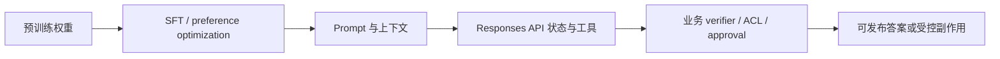
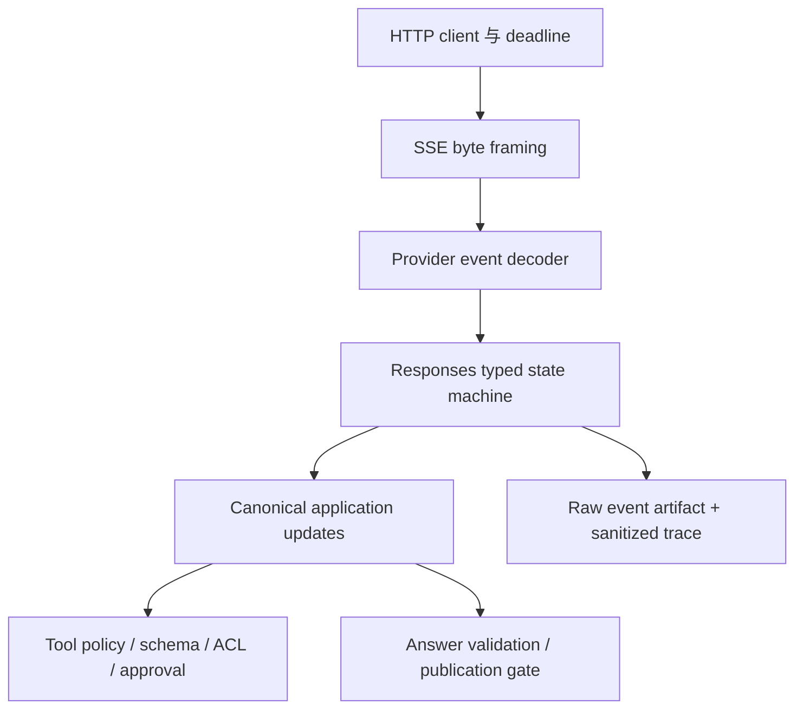

# GPT 家族：从论文读到一次完整 Response

<!-- learning-contract -->
<div class="learning-contract" markdown="1">

**学习导航**

- **适合读者**：GPT API 集成、模型迁移、Agent runtime 与评测工程师。
- **先修**：decoder-only Transformer、SFT/偏好训练、HTTP/JSON、SSE 与工具调用。
- **首次阅读**：证据分层 → 公开研究 → 当前产品接口 → Responses object graph → typed-event replay → 生产迁移。
- **完成信号**：能说明 Chat Completions 与 Responses 的数据模型差异，保存原始 typed events，并用固定工件验证一次 adapter 或模型升级。
- **卡住时**：回到[Transformer](../core/transformer.md)、[生成协议](../core/generation.md)或[云 API 契约](cloud-api-contracts.md)。

</div>

先把型号表放到一边，跟一次响应走完主线。用户问“上海天气怎样”，模型先输出一小段文本，随后提出
`lookup_weather({"city":"上海"})`。在 Responses 里，这不是一条可以直接取出的字符串，而是多个 typed item
和一串有生命周期的事件：message、function call、arguments delta、done 和 terminal response。

如果 adapter 只取 `output[0].content[0].text`，工具调用会悄悄消失；如果看到 function call 就直接执行，
模型生成的参数又会绕过 Schema、ACL 和审批。本章用这个例子连接 GPT 的自回归核心、产品 API 和工程 runtime。

## 先把三种证据放进不同抽屉

读完本章，你应能把下列三类陈述严格分开：

1. **公开研究事实**：GPT-1/2/3、InstructGPT 等论文明确报告的训练目标、实验设置与观察；
2. **当前产品契约**：官方 model catalog 与 Responses API reference 在某个检查日期公开的型号、请求对象、输出对象和事件类型；
3. **本地可执行结果**：本仓库用一份自编 JSONL 检查解析、状态迁移和对账规则。

三类材料分别回答不同问题：旧论文解释公开过的研究方法，接口文档说明当前协议，本地 replay 检查我们自己的
解析和状态机。当前闭源产品的内部结构、真实服务执行、模型质量、账单和生产可靠性，都需要与问题匹配的
新证据。
当前产品信息属于**时间敏感**事实，本页最近核对日期为 **2026-08-19**。

## 自回归公式只描述了系统的一层

GPT 的稳定数学核心是自回归条件分布：

\[
p(x_{1:T})=\prod_{t=1}^{T}p(x_t\mid x_{<t}).
\]

这个式子解释 next-token prediction，却没有完整描述用户实际调用的产品。一个可执行系统通常至少包含：



| 层 | 主要改变什么 | 不自动保证什么 |
|---|---|---|
| 预训练 | 语言、代码与世界模式的条件分布 | 指令遵循、事实实时性 |
| SFT/偏好训练 | 输出行为、格式、帮助性与拒答倾向 | 外部权限、业务真值 |
| Prompt/context | 当前请求的条件、示例与证据 | 参数更新、永久记忆 |
| tools/RAG | 可调用能力与外部信息 | 模型一定正确选工具或使用证据 |
| schema/grammar | 输出语法空间 | 字段真实、动作已授权 |
| runtime/gate | 重试、预算、审批、验证和审计 | 模型本身变得正确 |

工程事故常来自层级混淆。例如，“JSON Schema 通过”只是语法/结构层证据；它不说明金额合理、citation 存在、tool arguments 获得授权或远端副作用只发生一次。

## 读论文时追踪任务接口怎样变化

### GPT-1 到 GPT-3：任务接口发生了什么变化

学习重点不是背参数量，而是观察任务接口的演化：

- GPT-1 强调生成式预训练后再针对任务适配；
- GPT-2 展示扩大无监督语言建模后出现的任务迁移能力；
- GPT-3 系统性展示把说明和示例放入上下文的 zero/one/few-shot 使用方式。

In-context learning 改变的是当前条件上下文，不是对模型参数做一次隐式梯度更新。论文结果还绑定当时的数据、模型、提示与评测协议；不能把 GPT-3 的架构表复制成当前 API 模型说明，也不能把 benchmark few-shot 提升等价为生产任务可靠性。

### InstructGPT：续写与遵循意图不是同一个问题

InstructGPT 路线把监督示范、偏好排序、奖励模型与强化学习连接起来。它解释了“能继续文本”与“愿意按人类意图回答”是两个训练问题，同时也带来 reward hacking、标注者代表性、分布外行为和 alignment tax 等风险。

RLHF 不是一个跨时代固定的配方。当前产品是否使用某个 reward model、PPO 变体、数据比例或 rejection sampling 流程，只有官方明确披露时才能写成事实；其余应保持**未披露**，不能从模型名称或回答风格反推。

## 型号目录是带日期的产品快照

截至 **2026-08-19**，OpenAI 官方 model catalog 把 GPT-5.6 Sol、Terra、Luna 作为通用起点：Sol 面向复杂专业任务，
Terra 平衡智能与成本，Luna 面向成本敏感的高吞吐 workload。目录还包含面向特定任务的专用条目，
并把最新模型的使用入口指向 Responses API 与官方 SDK。本教材不维护完整型号榜。

这是产品目录快照，不是架构披露，也不是永久选型结论。型号、alias、价格、上下文窗口、最大输出、模态与工具支持都可能变化。本教材因此不复制价格表；实际选型要保存具体 model page、检查日期、账号/区域可用性和一份目标 workload 评测。

一个可审计配置至少记录：

```json
{
  "provider": "openai",
  "api_surface": "responses",
  "model": "<pinned-model-id-or-snapshot>",
  "checked_at": "2026-08-19",
  "sampling": {"temperature": 0},
  "max_output_tokens": 1024,
  "tool_schema_version": "sha256:...",
  "prompt_version": "git:...",
  "adapter_version": "git:..."
}
```

示意字段不是所有模型与端点的公共 schema。某个具体模型是否支持 `temperature`、某种 tool、某种模态或某个 reasoning 参数，必须回到该 model page 和对应 API reference 核对。

## 从 messages/choices 迁移时，数据模型也要改

Chat Completions 常以 `messages → choices` 为主要心智模型。Responses 把一次调用建模为带状态的 `response`，
其 `output` 可以包含多个 typed item；message item 还可以包含多个 typed content part，tool call 则是独立 item。

```text
response
├── id / model / status / usage
└── output[]
    ├── message
    │   └── content[]
    │       ├── output_text
    │       └── refusal
    ├── function_call
    │   ├── call_id / name
    │   └── arguments
    └── other typed item, such as reasoning
```

因此下面这种抽象会丢失信息：

```python
def parse_response(payload: dict) -> str:
    return payload["output"][0]["content"][0]["text"]
```

这段代码暗中假设：只有一个 output item，它一定是 message，第一段一定是 text，没有 refusal、tool 或 reasoning，
而且响应已经完整。生产 adapter 至少应保留 response id、model、status、每个 item 的 type/id/index、
content type、call id、原始 arguments、usage 和 terminal reason。

### Structured Outputs 解决的是哪一层

JSON mode 的目标是有效 JSON；Structured Outputs 在受支持的 JSON Schema 子集内约束结构。二者都不保证值为真、
引用存在、金额合理或工具调用有权限。调用方还要分别处理 refusal 与 `incomplete`：遇到安全拒绝或输出上限终止，
不能假定已经得到完整业务对象。

推荐顺序是：

```text
terminal status
→ refusal / incomplete / error 分流
→ JSON/schema 校验
→ 业务规则
→ identity / ACL
→ budget / idempotency / approval
→ 执行
→ effect verifier 与审计
```

### Tool call 是候选动作，不是执行证明

Responses 中的 function call arguments 仍是模型生成文本。即使它恰好解析成 JSON object，也只证明语法可解析。生产 runtime 要重新检查类型、资源归属、身份、权限、预算、审批、幂等键与前置状态，再把受控结果提交给 handler。

若 arguments 不是有效 JSON object，adapter 会保留原字符串，并把 `arguments_is_strict_object` 设为 `false`。
后续策略可以明确报错，或者把它送入独立的修复流程；修复后的对象不能冒充原参数已经通过校验。

截至 2026-08-19，官方 Function Calling guide 把这条链路写成多步交互：应用提供 tool definition，
模型返回 tool call，**应用侧**执行代码，再用对应 `call_id` 回传 `function_call_output`，模型才继续生成最终响应
或下一次调用。

“应用侧执行”只描述 API 编排位置，不会替应用完成 Schema、ACL、审批、幂等或副作用验证。

## Streaming 要重建状态，不是只拼字符串

流式处理不是“从每个 chunk 取一点 text”。网络 byte chunk、SSE event 与 Responses typed event 是三层不同对象：

```text
arbitrary network bytes
→ SSE framing
→ typed Responses event
→ item/content state transition
→ application update
```

官方 streaming guide 与 streaming-events reference 展示了 response、output item、content part、
text/refusal/function arguments 和 terminal 事件。一个典型的 text + function-call 路径可以写成：

```text
response.created
response.in_progress
response.output_item.added           # message
response.content_part.added          # output_text
response.output_text.delta           # 0..N
response.output_text.done
response.content_part.done
response.output_item.done
response.output_item.added           # function_call
response.function_call_arguments.delta  # 0..N
response.function_call_arguments.done
response.output_item.done
response.completed
```

真实流可能选择其他受支持事件与 item。adapter 应按 type dispatch。遇到未知类型时，默认停止处理，
或者把原始内容放进明确的 opaque/quarantine 路径；“当前 parser 不认识”本身不是忽略数据的理由。

### Delta、done 与 terminal 是三次不同的对账

对每个 text/refusal/function arguments，至少存在三个可比较层次：

1. 多个 `delta` 拼接后的局部值；
2. 对应 `*.done` 或 `output_item.done` 给出的完成值；
3. terminal response 的最终 `output`。

三者不一致说明事件丢失、重复、错序、parser bug 或协议版本漂移。不能因为最后拿到 `response.completed` 就丢弃前面的矛盾。

### completed、incomplete 与 failed 都是 terminal，但语义不同

- `completed`：流到达成功终态；仍不保证业务正确或动作已授权；
- `incomplete`：响应终止但不完整，需保留 `incomplete_details` 的 reason；
- `failed`：响应失败，需保留稳定 error code 与受控错误信息。

EOF 本身不是成功终态。缺 terminal event、item 尚未 done、content 只有 delta 没有 done，或 terminal 后又出现事件，都应视为协议失败。

### `sequence_number` 的本地严格规则

官方事件对象包含 `sequence_number`。为了让固定 evidence artifact 容易审计，本仓库额外要求它从 0 开始且严格连续。
这是本地 replay 的检查规则，用于发现固定样例中的事件缺失、重复和重排。网络恢复、SDK 重连和未来 API
传输各有自己的协议，需要分别验证。

## 亲手重放开头那次天气响应

本仓库新增独立 reference，而不是把 Responses 强塞进旧的 Chat-Completions text-only 状态机：

```powershell
python projects/cloud-api-contracts/openai_responses_replay.py `
  --events projects/cloud-api-contracts/openai-responses-events.example.jsonl
```

固定输入与收据为：

| 项 | 固定值 |
|---|---|
| JSONL bytes | 3,208 |
| input SHA-256 | `f2947212c1f67adf6f35bc976264db28c30abe1a32310daa284df42ca5a54686` |
| events / output items | 15 / 2 |
| output text | `天气：晴。` |
| function call | `lookup_weather({"city":"上海"})` |
| usage | 12 input / 9 output / 21 total |
| event projection | `sha256:9cc5964da2517f2076a1c624c2636bd8ca75077b89f024c7710b1b720cbd713e` |
| receipt | `sha256:c4829c19895dcb4013141da3d11b5dc9befee8189210a0901f0cb14c19942579` |

样例使用 `model: gpt-reviewed-snapshot` 这个自定义标签，避免让人误以为运行了真实 model id。收据会明确记录
本次执行范围：
重放 SDK-shaped events，检查 sequence/item lifecycle，并对账 terminal output 与 usage。

它没有执行 HTTP/SSE/WebSocket transport、OpenAI SDK 或远程 API。

### 当前 reviewed subset 覆盖什么

- `response.created`、`response.in_progress`；
- message item 的 `output_text` 与 `refusal` lifecycle；
- function-call arguments delta/done；
- `response.completed`、`response.incomplete`、`response.failed`；
- response id/model 在流内保持一致；
- output index、item id、content index 和 done 顺序；
- accumulated delta、done item 与 terminal output 对账；
- `input_tokens + output_tokens = total_tokens`；
- 遇到 duplicate JSON key、`NaN`/`Infinity`、invalid UTF-8、未知事件字段、截断或资源超限时停止解析并报错；
- reasoning/其他 output item 只作为 opaque item 保存生命周期，不解释语义。

资源边界是 4 MiB 文件、1 MiB 单行和最多 10,000 events。这些数值是本地防御默认值，不是 OpenAI 配额。

### 故意破坏比 happy path 更重要

专项测试覆盖：

```powershell
python -m pytest tests/test_openai_responses_replay.py -q
```

建议至少亲手破坏五类输入：

1. 跳过一个 `sequence_number`；
2. 改写某个 `output_text.done`，使其不同于 delta 拼接值；
3. 在 event 中加入 parser 未审核字段；
4. 把 usage total 改成不等于 input + output；
5. 删除最后换行或 terminal event，模拟截断。

正确结果不是“尽量输出已有文本”，而是拒绝生成成功收据。部分文本可以作为受控诊断证据保存，但不能被包装成完整 response。

### 这个实验说明了什么

这份离线报告说明当前 parser 和 state machine 能处理前面列出的事件，并在输入损坏时停止。它使用本仓库准备的
固定输入，没有连接 OpenAI API，也没有运行真实模型。

真实接入还要验证 provider 身份、账号认证、网络、SSE framing、SDK、backpressure、取消、usage、计费、
模型质量和生产可靠性。当前样例也只覆盖 Responses API 的一小部分，没有包含全部 input/output item、tool、
音频/图像、web/file/computer use、error event 和状态续接。

## 从 reference 走向生产 adapter

### 把 transport、协议状态和业务授权分层



每层只承担一种责任：

- transport 管连接、超时、取消、body byte limit；
- SSE decoder 管 UTF-8、line/event framing 与截断；
- provider decoder 管 event type 和字段版本；
- state machine 管 item/content lifecycle 与 terminal 对账；
- policy/runtime 管工具权限、幂等和副作用；
- publication gate 管最终可见内容。

### 日志与工件

建议保存 raw event artifact 的加密访问控制版本，以及不含敏感值的审计投影。投影可以包含 provider、
API surface/version、model id、response/request id、event type/index、terminal status/reason、usage、latency、
parser revision、Prompt/tool Schema fingerprint 和输入 artifact hash。

不要把 API key、完整 prompt、敏感 output、reasoning plaintext、tool secret 或任意被拒绝字段直接写进普通日志。无密钥 SHA-256 只绑定 bytes，不认证 provider 或调用者，也不提供保密性。

### 重试、取消和费用

2xx stream 开始后出现截断，远端 outcome 和 usage 可能仍然未知。自动重放可能重复生成、重复工具候选或重复计费。
生产策略要按具体 endpoint 核对 replay/idempotency 语义，并为每次 attempt 独立 reserve 和 reconcile；
关闭本地 response 也不能证明服务端已经停止计算或计费。

旧 text-only SSE reference 与新 typed replay 的关系是：

- `OpenAICompatibleTextStream` 覆盖 OpenAI-compatible Chat Completions 的单 choice text delta/usage/finish reason/`[DONE]`；
- `OpenAIResponsesEventReplay` 覆盖一组独立审核的 Responses SDK-shaped typed events；
- 二者都不执行真实网络，也不能互借“完整协议兼容”结论。

## 模型选型与升级评测

不要先问“哪个 GPT 最强”，先写 workload contract：

1. 任务：抽取、代码、规划、长文综合、工具执行还是实时对话；
2. 输入：模态、长度、语言、RAG 证据与工具数量；
3. 质量：任务指标、schema 合法率、citation/tool 参数正确率与拒答口径；
4. SLO：TTFT、E2E、吞吐、并发和可接受错误率；
5. 治理：区域、保留策略、敏感信息、日志和人工审批；
6. 成本：输入、缓存、输出、工具和重试后的 **cost per successful task**。

模型升级采用 paired evaluation：在同一 case、工具环境和预算下运行旧/新快照，保存原始 response items/events，
并报告总体与切片差异、置信区间、格式/安全 gate、延迟和每成功任务成本。

上线顺序是先 shadow，再做小流量 canary；旧 model id、Prompt、adapter、parser 和路由都要保留，以便回滚。

temperature=0 也不能宣称跨服务版本、硬件、批处理和并发严格确定。回归工件要记录实际输出 identity，而不是假设相同配置必得相同文本。

## 常见错误

- 把 GPT-3 论文参数写成当前 GPT 产品内部结构；
- 把 model catalog 快照写成永久推荐或账号可用性保证；
- 把 `OpenAI-compatible` 当作 Responses tools、events、errors 全部兼容；
- 只解析第一个 text，静默丢掉 refusal、tool、reasoning 或其他 item；
- 把 chunk 数、event 数或字符数称为 token 数；
- 把 `response.completed` 当作业务正确或副作用成功；
- 把 function arguments 可解析等价为已授权；
- 把 schema 通过率代替事实正确率；
- EOF 或断流后仍发布 accumulated partial text；
- 自动重试 outcome-unknown stream，却不建立 attempt-level usage/费用账本；
- 升级 model id，却沿用未经回归的 prompt、token budget 和 parser。

## 求职与面试验收

### 面试追问

1. next-token prediction 为什么能支持 in-context learning？它和参数更新有什么区别？
2. 预训练、SFT、偏好优化和工具系统分别解决什么问题？
3. Responses 的 response/output item/content part 三层对象图为什么不能压成一个字符串？
4. delta、done item 和 terminal response 应怎样对账？
5. `completed`、`incomplete`、`failed` 与 EOF 有何区别？
6. Structured Outputs 保证什么，为什么仍不能直接执行工具？
7. 2xx stream 中途断开后，为什么不能无条件重试？
8. 如何设计一次有统计把握、能回滚的模型快照升级？

### 可写进简历的诚实版本

> 为 OpenAI Responses 设计 typed-event 离线 replay：在一组包含 15 个 event、2 个 item 的固定样例上校验
> response/item/content 生命周期，重建 text 与 function arguments，并对 delta/done/terminal output、
> 12+9=21 usage，并用输入/收据 fingerprint 发现内容变化；16 个测试覆盖错序、未知字段、refusal、
> incomplete/failed、截断与非有限 JSON。

紧接着应说明：样例只模仿 SDK 的事件形状，没有调用 OpenAI SDK 或真实 API，也没有覆盖完整 Responses surface。
如果候选人能解释本地 replay 与真实网络、计费、质量和安全验证的区别，这个项目就比只展示一次成功 API 调用
更有说服力。

## 一手资料

- OpenAI，[Model catalog](https://developers.openai.com/api/docs/models)，当前产品目录与 Responses 入口；核对日期 2026-08-19。
- OpenAI，[Create a response](https://developers.openai.com/api/reference/resources/responses/methods/create)，response 请求/对象 reference；核对日期 2026-08-19。
- OpenAI，[Streaming API responses](https://developers.openai.com/api/docs/guides/streaming-responses)，Responses 流式处理指南；核对日期 2026-08-19。
- OpenAI，[Streaming events](https://developers.openai.com/api/reference/resources/responses/streaming-events)，typed streaming event reference；核对日期 2026-08-19。
- OpenAI，[Structured Outputs](https://developers.openai.com/api/docs/guides/structured-outputs)，JSON Schema 子集、JSON mode、refusal 与 incomplete 边界；核对日期 2026-08-19。
- OpenAI，[Function calling](https://developers.openai.com/api/docs/guides/function-calling)，tool call、应用执行与 `function_call_output` 多步流程；核对日期 2026-08-19。
- Brown 等，[Language Models are Few-Shot Learners](https://arxiv.org/abs/2005.14165)，GPT-3 与 in-context learning。
- Ouyang 等，[Training language models to follow instructions with human feedback](https://arxiv.org/abs/2203.02155)，InstructGPT。
