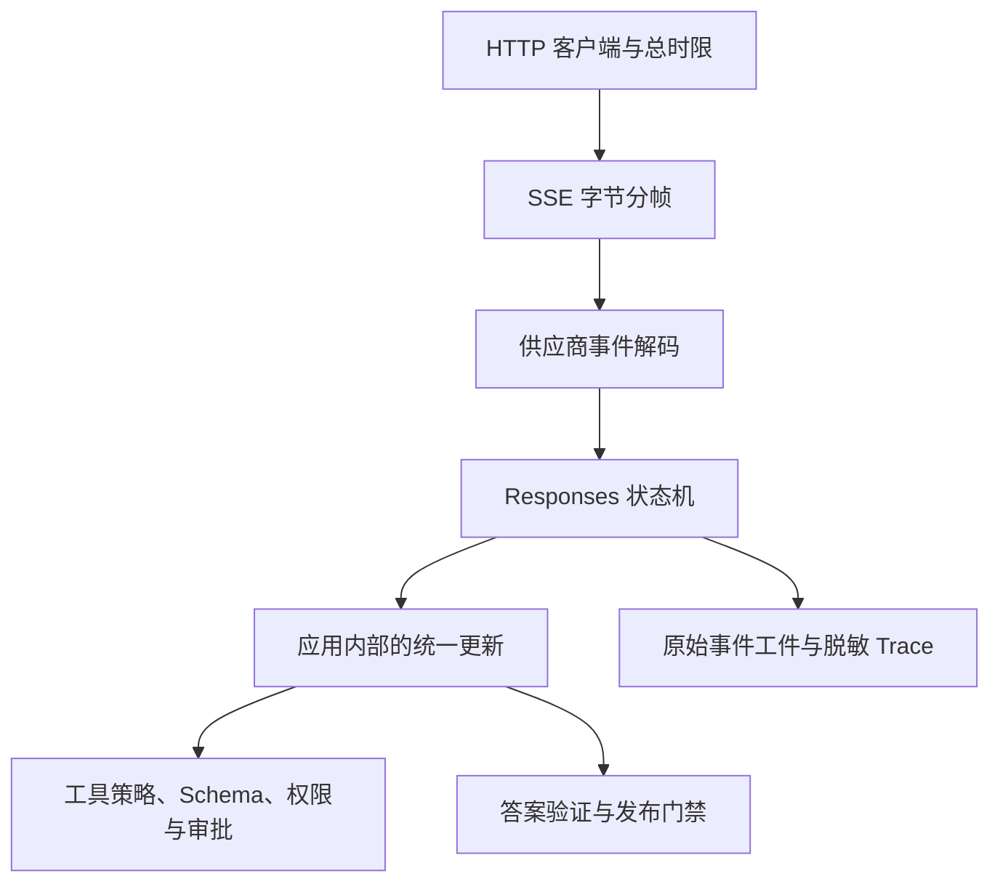

# GPT 家族：一次 Response 为什么不是一段文本

<!-- learning-contract -->
<div class="learning-contract" markdown="1">

**学习导航**

- **适合读者**：GPT API 集成、模型迁移、Agent Runtime 与评测工程师。
- **先修**：decoder-only Transformer、SFT/偏好训练、HTTP/JSON、SSE 与工具调用。
- **首次阅读**：天气样例的边界 → Response 对象图 → 15 个事件 → 工具执行边界 → 研究与产品版本。
- **完成信号**：能画出 Response、输出项和内容片段的关系，解释工具调用为何还不能执行，并用固定事件验证适配器升级。
- **卡住时**：回到[Transformer](../core/transformer.md)、[生成协议](../core/generation.md)或[云 API 契约](cloud-api-contracts.md)。

</div>

先把型号表放到一边，跟一份固定事件流走完主线。用户问“上海天气怎样”，事件中出现了两个输出项：

| 输出项 | 固定样例中的内容 | 应用现在能得出什么结论 |
| --- | --- | --- |
| 消息（message） | `天气：晴。` | 只得到一段模型生成的文字，天气真值仍未验证 |
| 函数调用（function call） | `lookup_weather({"city":"上海"})` | 只得到一项候选动作，工具尚未执行 |

这组内容是本仓库编写的协议练习，故意把文字和函数调用放进同一个 Response，用来检查适配器会不会丢掉第二个输出项。
它没有调用天气服务，也没有证明“上海天气是晴”。

真正的工具闭环通常还要继续：

1. Response A 提出函数调用；
2. 应用校验参数、身份、权限与审批；
3. 受控执行天气工具；
4. 用同一个 `call_id` 回传 `function_call_output`；
5. Response B 根据工具结果生成最终答案。

本页的固定样例停在 Response A 的事件重放，而且没有真实执行其中的调用。先记住这个边界，再学习对象图和流式事件，
就不会把“解析出函数参数”误认为“工具已经运行”，也不会把模型先生成的天气文字当成外部事实。

## 先把三种证据放进不同抽屉

读完本章，你应能把下列三类陈述严格分开：

1. **公开研究事实**：GPT-1/2/3、InstructGPT 等论文明确报告的训练目标、实验设置与观察；
2. **当前产品契约**：官方 model catalog 与 Responses API reference 在某个检查日期公开的型号、请求对象、输出对象和事件类型；
3. **本地可执行结果**：本仓库用一份自编 JSONL 检查解析、状态迁移和对账规则。

旧论文解释公开过的研究方法，接口文档说明当前协议，本地 replay 检查仓库自己的解析和状态机。三类证据各自回答
一个问题，不能互相替代。

当前闭源产品的内部结构、真实服务执行、模型质量、账单和生产可靠性，需要另外收集与问题匹配的证据。
当前产品信息属于**时间敏感**事实，本页最近核对日期为 **2026-08-19**。

## 自回归公式只描述了系统的一层

GPT 的稳定数学核心是自回归条件分布：

\[
p(x_{1:T})=\prod_{t=1}^{T}p(x_t\mid x_{<t}).
\]

这个式子解释 next-token prediction，却没有完整描述用户实际调用的产品。从预训练权重到一条可发布答案，中间还要经过
行为训练、当前上下文、API 状态、工具以及业务验证。下表把这些层分开：

| 层 | 主要改变什么 | 不自动保证什么 |
|---|---|---|
| 预训练 | 语言、代码与世界模式的条件分布 | 指令遵循、事实实时性 |
| SFT/偏好训练 | 输出行为、格式、帮助性与拒答倾向 | 外部权限、业务真值 |
| Prompt/context | 当前请求的条件、示例与证据 | 参数更新、永久记忆 |
| tools/RAG | 可调用能力与外部信息 | 模型一定正确选工具或使用证据 |
| schema/grammar | 输出语法空间 | 字段真实、动作已授权 |
| runtime/gate | 重试、预算、审批、验证和审计 | 模型本身变得正确 |

工程事故常来自层级混淆。例如，“JSON Schema 通过”只是语法/结构层证据；它不说明金额合理、citation 存在、tool arguments 获得授权或远端副作用只发生一次。

## 读论文时追踪任务接口怎样变化

### GPT-1 到 GPT-3：任务接口发生了什么变化

学习重点不是背参数量，而是观察任务接口的演化：

- GPT-1 强调生成式预训练后再针对任务适配；
- GPT-2 展示扩大无监督语言建模后出现的任务迁移能力；
- GPT-3 系统性展示把说明和示例放入上下文的 zero/one/few-shot 使用方式。

In-context learning 改变的是当前请求的条件上下文，模型参数并没有因此执行一次隐式梯度更新。

论文结果还绑定当时的数据、模型、提示与评测协议。GPT-3 的架构表不能直接作为当前 API 模型说明；论文中的
few-shot benchmark 提升，也不能直接回答生产任务是否可靠。

### InstructGPT：续写与遵循意图不是同一个问题

InstructGPT 路线把监督示范、偏好排序、奖励模型与强化学习连接起来。它解释了“能继续文本”与“愿意按人类意图回答”是两个训练问题，同时也带来 reward hacking、标注者代表性、分布外行为和 alignment tax 等风险。

RLHF 不是一个跨时代固定的配方。当前产品是否使用某个 reward model、PPO 变体、数据比例或 rejection sampling 流程，只有官方明确披露时才能写成事实；其余应保持**未披露**，不能从模型名称或回答风格反推。

## 型号目录是带日期的产品快照

截至 **2026-08-19**，OpenAI 官方 model catalog 给出的通用起点是：

| 型号 | 目录中的定位 |
|---|---|
| GPT-5.6 Sol | 复杂专业工作与推理、代码任务 |
| GPT-5.6 Terra | 在智能与成本之间取平衡 |
| GPT-5.6 Luna | 成本敏感的高吞吐工作负载 |

目录还包含特定任务模型，并把当前使用入口指向 Responses API 与官方 SDK。本教材不维护完整型号榜。

这只是带日期的产品目录，不是内部架构披露，也不能永久替代选型实验。型号、alias、价格、上下文窗口、最大输出、
模态和工具支持都可能变化。

实际选型时，保存具体 model page、检查日期和账号/区域可用性，再用目标 workload 评测。价格表则直接以运行时的
官方页面和账单为准。

一个可审计配置至少记录：

```json
{
  "provider": "openai",
  "api_surface": "responses",
  "model": "<pinned-model-id-or-snapshot>",
  "checked_at": "2026-08-19",
  "sampling": {"temperature": 0},
  "max_output_tokens": 1024,
  "tool_schema_version": "sha256:...",
  "prompt_version": "git:...",
  "adapter_version": "git:..."
}
```

示意字段不是所有模型与端点的公共 schema。某个具体模型是否支持 `temperature`、某种 tool、某种模态或某个 reasoning 参数，必须回到该 model page 和对应 API reference 核对。

## 从 messages/choices 迁移时，数据模型也要改

Chat Completions 常以 `messages → choices` 为主要心智模型。Responses 则把一次调用建模为一个带状态的 Response：

- `output` 可以包含多个带类型的输出项（item）；
- 消息输出项可以再包含多个内容片段（content part）；
- 函数调用与消息并列，不是消息文字中的一个特殊字符串。

```text
response
├── id / model / status / usage
└── output[]
    ├── message
    │   └── content[]
    │       ├── output_text
    │       └── refusal
    ├── function_call
    │   ├── call_id / name
    │   └── arguments
    └── other typed item, such as reasoning
```

因此下面这种抽象会丢失信息：

```python
def parse_response(payload: dict) -> str:
    return payload["output"][0]["content"][0]["text"]
```

这段代码暗中做了四个假设：

1. 只有一个 output item；
2. 这个 item 一定是 message；
3. 第一段内容一定是 text；
4. 响应已经完整，没有 refusal、tool 或 reasoning item。

生产适配器至少应保留 Response 的编号、模型和状态。每个输出项的类型、编号、位置也要保存。内容类型、调用编号、
原始参数、用量和终止原因分别承担不同语义，压成一段字符串后就无法可靠恢复。

### Structured Outputs 解决的是哪一层

JSON mode 的目标是生成有效 JSON。Structured Outputs 进一步在受支持的 JSON Schema 子集内约束结构。

这两项能力只处理语法和结构。字段值是否真实、引用是否存在、金额是否合理，以及工具调用是否有权限，都要由应用检查。
调用方还要单独处理 refusal 与 `incomplete`；安全拒绝或输出上限终止时，业务对象并不完整。

推荐顺序是：

```text
terminal status
→ refusal / incomplete / error 分流
→ JSON/schema 校验
→ 业务规则
→ identity / ACL
→ budget / idempotency / approval
→ 执行
→ effect verifier 与审计
```

### Tool call 是候选动作，不是执行证明

Responses 中的 function call arguments 仍是模型生成的文本。解析成 JSON object，只说明语法可解析。

生产 runtime 还要依次检查类型、资源归属、身份、权限、预算、审批、幂等键和前置状态。全部通过后，才能把受控参数
提交给 handler。

若 arguments 不是有效 JSON object，adapter 会保留原字符串，并把 `arguments_is_strict_object` 设为 `false`。
后续策略可以明确报错，或者把它送入独立的修复流程；修复后的对象不能冒充原参数已经通过校验。

截至 2026-08-19，官方 Function Calling guide 把这条链路写成多步交互：应用提供 tool definition，
模型返回 tool call，**应用侧**执行代码，再用对应 `call_id` 回传 `function_call_output`，模型才继续生成最终响应
或下一次调用。

“应用侧执行”只描述 API 编排位置，不会替应用完成 Schema、ACL、审批、幂等或副作用验证。

## 流式返回要重建状态，而不只是拼字符串

网络每次读到的字节块，不一定刚好对应一个 SSE 事件；一个 SSE 事件也不一定就是一段用户可见文字。适配器要依次处理
网络分帧、SSE 分帧和带类型的 Responses 事件：

```text
arbitrary network bytes
→ SSE framing
→ typed Responses event
→ item/content state transition
→ application update
```

固定天气样例的 15 个事件可以先按四个阶段理解：

| 事件序号 | 阶段 | 这一阶段完成什么 |
| --- | --- | --- |
| 0–1 | Response 开始 | 建立响应编号、模型和运行中状态 |
| 2–8 | 消息输出项 | 建立消息和文字片段，累积 `天气：` 与 `晴。`，再完成消息 |
| 9–13 | 函数调用输出项 | 建立调用，累积 `{"city":` 与 `"上海"}`，再完成参数和输出项 |
| 14 | Response 终态 | 给出最终输出数组与 `12 + 9 = 21` 的用量 |

对应的精确事件类型如下。第一次阅读先看注释里的阶段，不必背事件名：

```text
response.created
response.in_progress
response.output_item.added           # message
response.content_part.added          # output_text
response.output_text.delta           # 0..N
response.output_text.done
response.content_part.done
response.output_item.done
response.output_item.added           # function_call
response.function_call_arguments.delta  # 0..N
response.function_call_arguments.done
response.output_item.done
response.completed
```

真实请求可能出现其他受支持的事件和输出项。适配器应按 `type` 分派。遇到尚未审核的类型时，可以停止处理，
也可以把原始事件隔离保存；静默丢弃会让调用、拒答或新字段从业务记录中消失。

### Delta、done 与 terminal 是三次不同的对账

文字、拒答和函数参数都有三个可比较的层次：

1. 多个增量事件（`delta`）拼接后的局部值；
2. 对应完成事件（`*.done` 或 `output_item.done`）给出的完整值；
3. Response 终态中的最终 `output`。

天气样例会先拼出 `天气：晴。`，再与文字完成事件比较，最后与终态输出数组比较。三者不一致，说明中间可能发生了
事件丢失、重复、错序、解析错误或协议版本漂移。拿到 `response.completed` 也不能抹掉前面已经发现的矛盾。

### 三种终态表达三种结果

- `completed`：协议成功走到终态；业务正确性和动作授权仍由应用判断；
- `incomplete`：响应终止但不完整，需保留 `incomplete_details` 的 reason；
- `failed`：响应失败，需保留稳定 error code 与受控错误信息。

EOF 只表示本地字节流结束，不代表服务端成功完成响应。以下情况都属于协议失败：

- 没有 terminal event；
- Item 尚未 done；
- Content 只有 delta，没有 done；
- Terminal event 之后又出现新事件。

### `sequence_number` 的本地严格规则

官方事件对象包含 `sequence_number`。本仓库为了检查固定事件文件，额外要求序号从 0 开始并且严格连续；缺号、重号或
顺序变化都会让重放失败。这是一条本地证据规则，不是网络恢复承诺。SDK 重连和实际传输怎样续接，要按对应版本的协议
另行验证。

## 运行离线重放，亲手看到四个阶段

本仓库为 Responses 单独实现了一段离线重放程序，没有把它塞进旧的 Chat Completions 纯文字状态机。运行：

```powershell
python projects/cloud-api-contracts/openai_responses_replay.py `
  --events projects/cloud-api-contracts/openai-responses-events.example.jsonl
```

程序会读取前面的 15 个固定事件，完成四个阶段的状态迁移，并输出一份收据。你可以用下面的值核对自己的运行结果：

| 项 | 固定值 |
|---|---|
| JSONL bytes | 3,208 |
| input SHA-256 | `f2947212c1f67adf6f35bc976264db28c30abe1a32310daa284df42ca5a54686` |
| events / output items | 15 / 2 |
| output text | `天气：晴。` |
| function call | `lookup_weather({"city":"上海"})` |
| usage | 12 input / 9 output / 21 total |
| event projection | `sha256:9cc5964da2517f2076a1c624c2636bd8ca75077b89f024c7710b1b720cbd713e` |
| receipt | `sha256:c4829c19895dcb4013141da3d11b5dc9befee8189210a0901f0cb14c19942579` |

样例中的 `model: gpt-reviewed-snapshot` 是本仓库自定义标签，不是真实模型编号。收据只记录三件已经执行的事：

- 重放结构与 SDK 事件相似的固定输入；
- 检查序号以及 Response、输出项和内容片段的生命周期；
- 对账终态输出和用量算术。

它没有执行 HTTP/SSE/WebSocket transport、OpenAI SDK 或远程 API。

### 这段程序实际实现了哪些事件

- `response.created`、`response.in_progress`；
- 消息输出项中 `output_text` 与 `refusal` 的完整生命周期；
- 函数参数的增量和完成事件；
- `response.completed`、`response.incomplete`、`response.failed`；
- response id/model 在流内保持一致；
- output index、item id、content index 和 done 顺序；
- 累积增量、完成输出项与终态输出的对账；
- `input_tokens + output_tokens = total_tokens`；
- 遇到 duplicate JSON key、`NaN`/`Infinity`、invalid UTF-8、未知事件字段、截断或资源超限时停止解析并报错；
- reasoning 和其他输出项只保存生命周期，不解释其中语义。

程序最多读取 4 MiB 文件、1 MiB 单行和 10,000 个事件。这些数值用于保护本地解析器，与 OpenAI 的服务配额无关。

### 故意破坏事件，比只看成功结果更有用

专项测试覆盖：

```powershell
python -m pytest tests/test_openai_responses_replay.py -q
```

建议至少亲手破坏五类输入：

1. 跳过一个 `sequence_number`；
2. 改写某个 `output_text.done`，使其不同于 delta 拼接值；
3. 在 event 中加入 parser 未审核字段；
4. 把 usage total 改成不等于 input + output；
5. 删除最后换行或 terminal event，模拟截断。

正确结果不是“尽量输出已有文本”，而是拒绝生成成功收据。部分文本可以作为受控诊断证据保存，但不能被包装成完整 response。

### 这个实验说明了什么

这份离线报告说明当前解析器和状态机能处理前面列出的事件，并在输入损坏时停止。它使用本仓库准备的固定输入，
运行过程中没有连接 OpenAI API，也没有执行真实模型。

真实接入还要验证供应商身份与账号认证、网络和 SSE 分帧、SDK 行为、背压、取消、用量与计费。模型质量与生产可靠性
也需要各自的评测和运行证据。

当前样例只覆盖 Responses API 的一个小子集。其他输入与输出项、内置工具、音频和图像，以及网页、文件、计算机操作、
错误事件和状态续接，都要根据实际接入的产品版本逐项实现。

## 从离线参考实现走向生产适配器

### 把网络传输、协议状态和业务授权分层



每层只承担一种责任：

- 网络传输层管理连接、超时、取消和响应体字节上限；
- SSE 解码层管理 UTF-8、行与事件分帧以及截断；
- 供应商解码层管理事件类型和字段版本；
- 状态机管理输出项、内容片段的生命周期和终态对账；
- 策略与 Runtime 管理工具权限、幂等和外部副作用；
- 发布门禁管理最终可以交给用户的内容。

### 日志与工件

原始事件可能含有 Prompt、输出、工具参数和隐藏工件，应进入加密且受访问控制的存储。另生成一份不含敏感值的审计投影，
其中可以记录：

- 供应商、API 接口与版本、模型编号；
- Response 和请求编号、事件类型与位置；
- 终态、终止原因、用量和延迟；
- 解析器版本、Prompt 与工具 Schema 指纹、输入工件哈希。

普通日志只记录排障所需的脱敏字段。API 密钥、完整 Prompt、敏感输出、明文推理、工具密钥和被策略拒绝的参数，应留在
各自的受控存储或直接丢弃。无密钥 SHA-256 可以绑定一串字节，但不提供来源认证和内容加密。

### 重试、取消和费用

2xx 流开始后如果连接截断，客户端可能既不知道远端最终结果，也不知道完整用量。自动重放可能造成重复生成、重复工具候选
或重复计费。

生产策略要按具体接口核对重放和幂等语义。每次尝试都要单独预留并核销预算；关闭本地 Response，只能证明客户端停止读取，
服务端是否停止计算与计费仍要另行确认。

旧 text-only SSE reference 与新 typed replay 的关系是：

- `OpenAICompatibleTextStream` 覆盖 Chat Completions 风格的单 choice 文本增量、usage、finish reason 和 `[DONE]`；
- `OpenAIResponsesEventReplay` 覆盖一组单独审核的 Responses typed events；
- 二者都不执行真实网络，也不能互借“完整协议兼容”结论。

## 模型选型与升级评测

不要先问“哪个 GPT 最强”，先写 workload contract：

1. 任务：抽取、代码、规划、长文综合、工具执行还是实时对话；
2. 输入：模态、长度、语言、RAG 证据与工具数量；
3. 质量：任务指标、schema 合法率、citation/tool 参数正确率与拒答口径；
4. SLO：TTFT、E2E、吞吐、并发和可接受错误率；
5. 治理：区域、保留策略、敏感信息、日志和人工审批；
6. 成本：输入、缓存、输出、工具和重试后的 **cost per successful task**。

模型升级采用 paired evaluation：在同一 case、工具环境和预算下运行旧/新快照，保存原始 response items/events，
并报告总体与切片差异、置信区间、格式/安全 gate、延迟和每成功任务成本。

上线顺序是先 shadow，再做小流量 canary；旧 model id、Prompt、adapter、parser 和路由都要保留，以便回滚。

temperature=0 也不能宣称跨服务版本、硬件、批处理和并发严格确定。回归工件要记录实际输出 identity，而不是假设相同配置必得相同文本。

## 常见错误

- 把 GPT-3 论文参数写成当前 GPT 产品内部结构；
- 把 model catalog 快照写成永久推荐或账号可用性保证；
- 把 `OpenAI-compatible` 当作 Responses tools、events、errors 全部兼容；
- 只解析第一个 text，静默丢掉 refusal、tool、reasoning 或其他 item；
- 把 chunk 数、event 数或字符数称为 token 数；
- 把 `response.completed` 当作业务正确或副作用成功；
- 把 function arguments 可解析等价为已授权；
- 把 schema 通过率代替事实正确率；
- EOF 或断流后仍发布 accumulated partial text；
- 自动重试 outcome-unknown stream，却不建立 attempt-level usage/费用账本；
- 升级 model id，却沿用未经回归的 prompt、token budget 和 parser。

## 求职与面试验收

### 面试追问

1. next-token prediction 为什么能支持 in-context learning？它和参数更新有什么区别？
2. 预训练、SFT、偏好优化和工具系统分别解决什么问题？
3. Responses 的 response/output item/content part 三层对象图为什么不能压成一个字符串？
4. delta、done item 和 terminal response 应怎样对账？
5. `completed`、`incomplete`、`failed` 与 EOF 有何区别？
6. Structured Outputs 保证什么，为什么仍不能直接执行工具？
7. 2xx stream 中途断开后，为什么不能无条件重试？
8. 如何设计一次有统计把握、能回滚的模型快照升级？

### 可写进简历的诚实版本

> 为 OpenAI Responses 实现离线事件重放。程序从 15 个固定事件中重建一段文字和一次函数调用，并对账 Response、
> 输出项、内容片段与 `12 + 9 = 21` 的用量。16 个测试覆盖错序、未知字段、拒答、非完整与失败终态、截断和非法 JSON 数值。

紧接着应说明：样例只模仿 SDK 的事件形状，没有调用 OpenAI SDK 或真实 API，覆盖的也只是 Responses 的一个子集。
如果候选人能解释本地重放与真实网络、计费、质量和安全验证的区别，这个项目就比只展示一次成功 API 调用
更有说服力。

## 一手资料

- OpenAI，[模型目录](https://developers.openai.com/api/docs/models)，当前产品目录与 Responses 入口；核对日期 2026-08-19。[SOURCE:openai-model-catalog]
- OpenAI，[创建 Response](https://developers.openai.com/api/reference/resources/responses/methods/create)，请求与响应对象；核对日期 2026-08-19。[SOURCE:openai-responses-create]
- OpenAI，[流式返回指南](https://developers.openai.com/api/docs/guides/streaming-responses)，Responses 流式处理方法；核对日期 2026-08-19。[SOURCE:openai-responses-streaming]
- OpenAI，[流式事件参考](https://developers.openai.com/api/reference/resources/responses/streaming-events)，事件类型与字段；核对日期 2026-08-19。[SOURCE:openai-streaming-events]
- OpenAI，[结构化输出指南](https://developers.openai.com/api/docs/guides/structured-outputs)，JSON Schema 子集、JSON 模式、拒答与非完整终态；核对日期 2026-08-19。[SOURCE:openai-structured-outputs]
- OpenAI，[函数调用指南](https://developers.openai.com/api/docs/guides/function-calling)，候选调用、应用执行与结果回传；核对日期 2026-08-19。[SOURCE:openai-function-calling]
- Brown 等，[GPT-3 论文](https://arxiv.org/abs/2005.14165)，上下文学习（in-context learning）。
- Ouyang 等，[InstructGPT 论文](https://arxiv.org/abs/2203.02155)，监督示范、偏好排序与强化学习。
