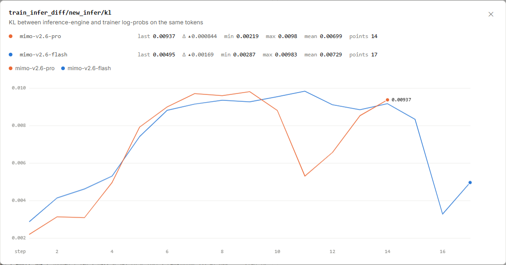
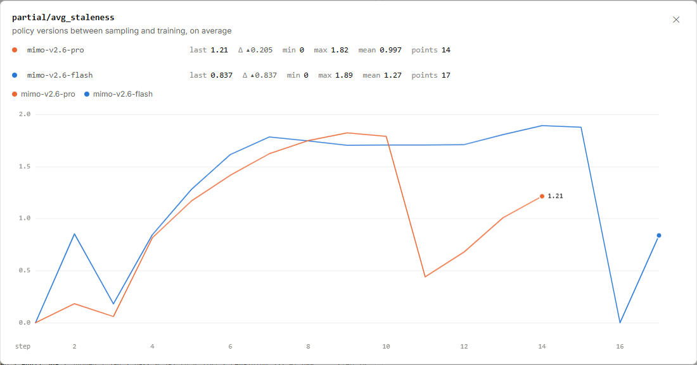

# MiMo RL 一致性：两套计算与两个策略时刻

同一批 token，生成它们的推理引擎和负责学习的训练器，可能算出略有差异的概率。
这张图里，Pro 的末点约为 **0.00937**，Flash 约为 **0.00495**。先看清比较的是哪两方，再解释数字大小。

图 1｜小米 MiMo：[https://mimo.xiaomi.com/rl/#chart/train_infer_diff%2Fnew_infer%2Fkl](https://mimo.xiaomi.com/rl/#chart/train_infer_diff%2Fnew_infer%2Fkl)。
截于 **2026 年 9 月 17 日北京时间 16:05:59**。横轴为 step，线性刻度，平滑关闭；点击图片可放大。

<!-- learning-contract -->

**学习导航**

- **适合读者**：想理解在线强化学习为什么要同时关注概率一致性和样本新鲜度的读者。
- **先修**：知道模型为 token 分配概率，训练更新会产生新的参数版本。
- **首次阅读**：认清 KL 对照双方 → 算一个分布差异 → 算版本差 → 理解调度权衡。
- **完成信号**：能区分计算路径差异与采样版本落后，并为两类问题选择不同排查步骤。
- **卡住时**：先看四份样本在版本 10 进入训练的表格。

## KL 的名字相同，对照双方要写完整

图名为 `train_infer_diff/new_infer/kl`。原站说明比较的是**同一批 token 上，推理引擎与训练器的对数概率**。
原站将它命名为 KL 一致性指标；KL 散度（Kullback–Leibler divergence）通常用于衡量概率分布差异。
这里关注训练、推理两条计算路径的一致性，具体的估计与汇总式没有在图中展开。

| 运行 | 末点所在步 | 具体值 | 图上读数 |
|---|---:|---:|---:|
| mimo-v2.6-pro，橙色 | 14 | 0.00936635 | 0.00937 |
| mimo-v2.6-flash，蓝色 | 17 | 0.00495377 | 0.00495 |

强化学习中还有一种常见 KL：比较当前策略与参考策略，用于关注行为偏离参考模型多远。
**这张图的对照对象是推理引擎和训练器，不是参考策略。** 两类 KL 的用途不同，数值也应放回各自的定义里解释。

0.00937 是按此指标定义得到的差异量。它没有百分号，不能读成“0.937% 的 token 出错”。
当前说明也没有给出一个通用合格阈值；可接受范围需要结合计算配置与实际训练影响来判断。

## 用二元分布算一次差异

**以下为教学示意，既不代表 MiMo 的词表，也不代表其实际 KL 估计式。**
在相同前缀后，只允许两个候选。假设推理端给出 $p=(0.6,0.4)$，训练端给出 $q=(0.5,0.5)$。

选定从 $p$ 到 $q$ 的方向，使用自然对数和完整二元分布：

$$D_{\mathrm{KL}}(p\Vert q)=0.6\ln\frac{0.6}{0.5}+0.4\ln\frac{0.4}{0.5}\approx0.0201.$$

若两端都给出 0.6/0.4，每个概率比都是 1，对数为 0，KL 就是 0。
这个例子说明：即使两端都更偏好同一个候选，它们对这个候选“有多大把握”仍可能不同。

在真实词表上，比较还涉及很多 token 位置及其条件前缀。
看板说明了同 token 的对照关系，尚未展开估计方向、逐位置公式和汇总权重，因此不能把上式当成原站的实现。

为什么训练团队在意这个差异？策略更新常会用到采样时与更新时的对数概率，进而计算概率比。
如果两条计算路径的数值口径没有对齐，概率比可能混入实现差异，使某些行为的学习权重偏离预期。

例如，低精度计算、不同算子或概率归一化处理都值得检查。
这些是通用排查方向；本图本身没有定位 MiMo 某个上升点的根因。

## 版本差：样本生成以后，训练向前走了几步

图 2｜小米 MiMo：[https://mimo.xiaomi.com/rl/#chart/partial%2Favg_staleness](https://mimo.xiaomi.com/rl/#chart/partial%2Favg_staleness)。
截于 **2026 年 9 月 17 日北京时间 16:05:59**。横轴为 step，线性刻度，平滑关闭；点击图片可放大。

`partial/avg_staleness` 的原站定义是：**采样与训练之间，平均相隔多少个策略版本**。
它衡量样本的新鲜度。版本差越大，意味着生成这些样本的策略在版本编号上离当前训练更远。

| 运行 | 倒数第二步 | 最后一步 |
|---|---:|---:|
| Pro，第 13 → 14 步 | 1.00741 | 1.21246，图上约 1.21 |
| Flash，第 16 → 17 步 | 0 | 0.836915，图上约 0.837 |

版本编号是离散的，平均值可以有小数。1.21 表示版本间隔的平均量，不能换算成 1.21 小时。
每个版本花费的时间可能不同；同样相隔一个版本，策略分布实际变化的幅度也可能不同。

用四份样本做一个**等权平均的教学例子**。训练器现在处理版本 10，各样本记录了生成时的策略版本：

| 样本 | 采样策略版本 | 训练策略版本 | 版本差 |
|---|---:|---:|---:|
| A | 10 | 10 | 0 |
| B | 9 | 10 | 1 |
| C | 9 | 10 | 1 |
| D | 7 | 10 | 3 |

$$\text{平均版本差}=\frac{0+1+1+3}{4}=1.25.$$

这里没有“版本 8.75”生成的样本，1.25 来自四份样本的平均。
MiMo 的 1.21246 和 0.836915 可以这样理解量纲；要复算原值，还需知道实际样本集合及其汇总权重。

## 两种差异怎样分别排查

设一份样本由版本 8 生成，到版本 10 才训练。即使固定版本时，两条计算路径完全一致，版本差仍为 2。
反过来，采样与训练都使用同一版本时，也仍要检查两端对同一 token 是否计算一致。

图中 Flash 第 16 步恰好同时报告：平均版本差为 0，训练推理 KL 为 0.0032674。
这组具体读数提醒我们，两项指标回答的是不同问题。

| 观察对象 | 优先固定什么 | 接着检查什么 |
|---|---|---|
| 推理引擎与训练器的概率差异 | 权重版本、token IDs、前缀与掩码 | 数值精度、算子、概率定义与归一化 |
| 采样到训练的策略版本差 | 每份样本的生成版本与消费版本 | 队列等待、生成耗时、参数同步和批次调度 |

例如，团队可以先用一组固定 token，在同一权重版本上逐位置比较两端对数概率。
再查看这些轨迹何时生成、何时被训练消费。前一步隔离计算问题，后一步解释时间和版本问题。

## 速度与新鲜度，需要一起决定

长轨迹生成期间，训练器可能已经更新了参数。让生成和训练并行，可以减少设备互相等待的时间，
也可能使后来进入训练的样本落后于当前策略。队列越长，这种积压越值得关注。

一种选择是更频繁地同步参数、限制待训练队列，让样本更接近当前策略。
代价是增加同步开销，或者让训练器等待较慢的轨迹。另一种选择是保留更多并行任务，让设备持续有工作。

后者需要控制样本落后程度，并让所选训练方法正确处理采样分布与当前分布的关系。
如果直接丢弃较旧轨迹，还应检查是否更容易丢掉长任务，导致训练数据组成随之改变。

这两张图提供了概率差异与平均版本差，具体排队规则、旧样本处理及修正公式尚未展开。
工程判断应把质量、等待时间和版本差分布放在一起；相同均值也可能隐藏少量特别旧的样本。

## 对着图做三道小题

1. 本页 KL 比较的是哪两方？它能直接回答模型偏离参考策略多远吗？
2. 四份样本的版本差为 0、1、1、3，平均是多少？单位是什么？
3. 某批样本版本差为 0，是否还需要检查推理端和训练端的概率一致性？

??? note "看答案"
    1. 比较推理引擎与训练器在同一批 token 上的对数概率；参考策略偏离需要另一项对应定义的统计。
    2. 平均为 1.25 个策略版本。转换为等待时间需要各版本和样本的时间记录。
    3. 需要。同版本排除了版本编号落后这一因素，计算精度、算子与概率处理仍可能带来差异。

继续阅读[强化学习中的采样数据身份](../training/reinforcement-learning.md#rollout-identity)，理解为何要保存生成时的概率；
或返回 [MiMo RL 学习专题](mimo-rl-series.md)，选择下一张图。