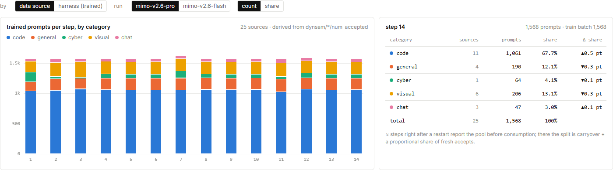
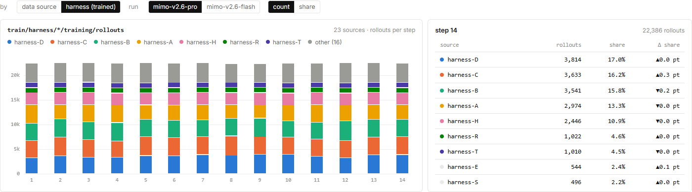

# MiMo RL 数据配比：1,568 道题怎样组成一批训练？

Pro 第 14 步的蓝色区域占了大半：代码类有 1,061 道题，占这批 1,568 道题的 67.7%。
这张图让“训练了多少”进一步变成“训练了什么”；理解成功率的变化，也需要先看题目组成。

图 1｜[小米 MiMo 原站](https://mimo.xiaomi.com/rl/#overview)，截于 **2026 年 9 月 17 日北京时间 16:05:57.657**。
当前选择 Pro、按数据来源分组、显示数量；右侧为第 14 步。点击图片可放大。

<!-- learning-contract -->

**学习导航**

- **适合读者**：想把训练成功率与实际题目组成联系起来的读者。
- **先修**：会计算百分比；知道一道题可以产生多条尝试轨迹。
- **首次阅读**：五类题目 → 入池与取用 → 执行轨迹分组 → 加权平均。
- **完成信号**：能复算 67.7%，并解释为什么更换配比也能改变整体平均值。
- **卡住时**：先做“100 加 900 减 200”的库存例子，再辨认两张图的单位。

## 先把五种颜色读成题目数

横轴每根柱子对应一个训练步，纵轴为题目数。右侧表格把最后一根柱子展开：

| 类别 | 来源 ID 数 | 题目数 | 占比 |
|---|---:|---:|---:|
| 代码 `code` | 11 | 1,061 | 67.7% |
| 通用 `general` | 4 | 190 | 12.1% |
| 网络安全 `cyber` | 1 | 64 | 4.1% |
| 视觉 `visual` | 6 | 206 | 13.1% |
| 对话 `chat` | 3 | 47 | 3.0% |
| 合计 | 25 | 1,568 | 100% |

以代码类为例，分母是这一批全部题目：

$$\frac{1,061}{1,568}\times100\%\approx67.7\%.$$

五类题目相加为 $1,061+190+64+206+47=1,568$。
代码类题量最多；视觉类虽然包含六个来源 ID，题量仍少于代码类。
来源数量和题目份额提供的是两个维度，不能用“来源多”代替“训练占比高”。

图里的 25 是来源 ID 数，不是 25 道题，也不意味着已经知道 25 个公开数据集的名称。
匿名 ID 可以帮助比较同一来源的变化；它没有提供足够信息来反推数据集身份或具体内容。

## 从接纳池到训练批次：要扣掉继续留下的题

采样器不断接纳题目，训练器按批取用，暂时没取走的题会留在池中。
因此，某一步训练用到多少题，需要同时考虑原有留存、本步接纳和本步结束后的留存。

原站按来源使用下面的关系推算训练取用量：

$$C_t=\max(0,H_{t-1}+A_t-H_t)。$$

这里 $H_{t-1}$ 是前一步留存量，$A_t$ 是本步接纳量，$H_t$ 是本步留存量。
$C_t$ 是图中估算的本步取用量；页面以 `held_prev + accepted - held_current` 计算，再将负值截到 0。
这个关系描述题目如何进出池子，接纳量本身并没有直接给出训练消耗量。
若还有过期等出池方式，也会改变库存差额；要得到实际训练消费量，仍需独立的取用记录。

### 一个可以手算的库存例子

下面是**教学示例，数值并非 MiMo 实测**。假设某来源上一步留下 100 道题，本步又接纳 900 道题。
训练器取用后，池里还留着 200 道题，且这个例子没有其他出入项。

| 环节 | 题目数 |
|---|---:|
| 上一步留存 | 100 |
| 本步新接纳 | 900 |
| 本步结束后留存 | 200 |
| 本步取用 | 800 |

$$100+900-200=800.$$

这一步消耗了 800 道题，900 则是新接纳量。
要知道原始生成工作量，还要数每道题生成了几份回答，以及哪些生成没有进入接纳池。
因此，800 不能读成生成了 800 份回答，900 也不能读成原始生成总数。

### 重启后的柱子为什么带近似说明？

图 1 右下角提示：紧接重启的步骤可能报告消耗前的池子。
这些位置的组成近似采用“结转题目 + 按比例分配的新接纳题目”。
这让读者可以继续观察配比，但它与通常的前后留存差分有不同的处理方式。
读到带这种近似说明的步骤时，应把分类占比理解为该处理下的估算，不当作逐题精确清点结果。

## 切换到 harness，为什么总数变成了 22,386？

图 2｜[小米 MiMo 原站](https://mimo.xiaomi.com/rl/#overview)，截于 **2026 年 9 月 17 日北京时间 16:08:49.813**。
仍是 Pro 第 14 步，但切换到了 `harness (trained)`，纵轴单位为执行轨迹。

一次执行轨迹（rollout）记录模型从某个任务出发的一次尝试；同一道题可以产生多条轨迹。
通用意义上的 harness 是组织任务执行和记录结果的驱动程序，这里按原站的 harness ID 分组。
字母标签没有说明背后使用了哪个厂商框架，也没有给出它与数据来源 ID 的逐项对应关系。

图上标出 **23 个来源分组、22,386 条轨迹**。右侧可滚动表格的前三行是：

| 执行分组 | 轨迹数 | 占比 |
|---|---:|---:|
| `harness-D` | 3,814 | 17.0% |
| `harness-C` | 3,633 | 16.2% |
| `harness-B` | 3,541 | 15.8% |

$$\frac{3,814}{22,386}\times100\%\approx17.0\%.$$

这里的分母已经换成轨迹数，不能沿用图 1 的 1,568。
图例将另外 16 个分组合为 `other (16)`；右侧截图也仅展示表格顶部，不是完整的 23 行。

## 三个总量，先认单位再比较

| 看板位置 | 第 14 步相关读数 | 计数口径 |
|---|---:|---|
| 数据来源组成 | 25 个来源 ID，1,568 道题 | 按来源推算的训练题目数 |
| harness 组成 | 23 个分组，22,386 条轨迹 | `train/harness/*/training/rollouts` |
| 顶部批量配置 | 1,568 × 16 = 25,088 | 题目批量乘以每题标称尝试数 |

25,088 是配置数字的乘积，22,386 是另一张图报告的轨迹汇总。
公开页面没有给出两者的逐条对应关系，不能直接把差值定性为丢失、过滤，或某类样本缺席。
25 个数据来源与 23 个 harness 分组也使用不同的分类方式，不能据此宣布少了两个数据集。

工程上若要把这些数对齐，需要追踪同一批题目的 ID、尝试轨迹与训练取用记录。
对着当前两张图，先分别读清它们各自的数量与组成，就已经能避免混淆训练题量和执行工作量。

## 配比变化，怎样让整体成功率变化？

下面仍是**教学示例**。设两类题目的平均成功率始终分别为 80% 和 20%，只调整它们的题目占比。
这两个成功率不对应图中的任何真实类别。

| 批次 | A 类占比，成功率 80% | B 类占比，成功率 20% | 整体平均成功率 |
|---|---:|---:|---:|
| 第一批 | 50% | 50% | 50% |
| 第二批 | 75% | 25% | 65% |

按题目份额加权，第二批得到：

$$0.75\times0.80+0.25\times0.20=0.65.$$

两类内部都没有改善，整体平均却上升了 15 个百分点，因为更容易成功的 A 类占比增加了。
一般写作 $\bar p=\sum_c w_c p_c$，其中 $w_c$ 是类别的题目份额，$p_c$ 是该类别的平均成功率。

计算时，份额和成功率必须来自同一组题目。图 1 是受训题目组成，不能直接拼接另一个采样池的成功率。
解释真实曲线的升降时，先看总平均，再看题目组成，最后比较同类题目的表现，才能逐步区分变化来自哪里。

## 对着图做三道小题

1. 代码类的 67.7% 与 `harness-D` 的 17.0%，各用什么分母？
2. 示例中 100 道留存、900 道新接纳、最后留下 200 道，本步消耗了多少？
3. 示例整体成功率从 50% 升到 65%，是否说明两类题目都学得更好了？

??? note "看答案"
    1. 前者用 1,568 道题，后者用 22,386 条轨迹。两者的单位与分组方式不同。
    2. 消耗 800 道题。这是训练取用量，原始生成总量还需要另外统计。
    3. 没有。两类成功率保持 80% 和 20%，上升来自 A 类份额由 50% 增至 75%。

下一步：回到 [MiMo RL 系列](mimo-rl-series.md)，继续看固定评测怎样帮助比较模型检查点。