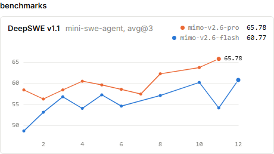
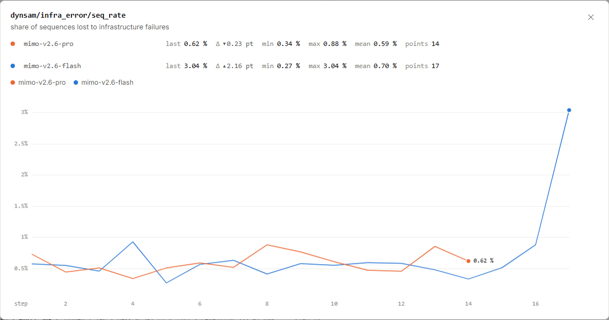
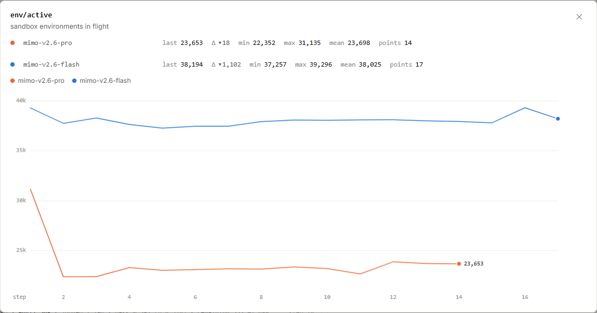

# MiMo RL 评测：65.78 属于哪个模型检查点？

评测卡片上的 Pro 是 65.78，Flash 是 60.77。要把这两个数读完整，还需要找到它们对应的检查点和评测设置。
训练摘要在继续刷新，独立评测则有自己的结果进度。

图 1｜[小米 MiMo 原站](https://mimo.xiaomi.com/rl/#overview)，截于 **2026 年 9 月 17 日北京时间 16:05:57.578**。
标题为 **DeepSWE v1.1**，旁注为 **mini-swe-agent, avg@3**。点击图片可放大。

<!-- learning-contract -->

**学习导航**

- **适合读者**：想区分训练进展、独立评测成绩和系统运行健康的读者。
- **先修**：知道检查点是训练中保存的模型版本；会计算平均值。
- **首次阅读**：检查点成绩 → 三次尝试 → 基础设施失败 → 沙箱并发与排查顺序。
- **完成信号**：能把 65.78 对应到 Pro 第 11 步，并说明基础设施错误率回答什么问题。
- **卡住时**：先做两道题、每题三次尝试的例子，再看评测曲线的横轴。

## 先把“模型、检查点、设置、分数”写在一起

图中橙线的末点在第 11 步，蓝线的末点在第 12 步。
把相应检查点的结果展开，选几个位置看变化：

| 模型 | 检查点步号 | 公开评测设置 | 分数 |
|---|---:|---|---:|
| Pro | 1 | DeepSWE v1.1；mini-swe-agent；avg@3 | 58.41 |
| Pro | 8 | DeepSWE v1.1；mini-swe-agent；avg@3 | 62.24 |
| Pro | 10 | DeepSWE v1.1；mini-swe-agent；avg@3 | 63.72 |
| Pro | 11 | DeepSWE v1.1；mini-swe-agent；avg@3 | 65.78 |
| Flash | 11 | DeepSWE v1.1；mini-swe-agent；avg@3 | 54.13 |
| Flash | 12 | DeepSWE v1.1；mini-swe-agent；avg@3 | 60.77 |

Pro 从第 1 步到第 11 步，在该分数尺度上增加了 $65.78-58.41=7.37$ 分。
Flash 从第 11 步到第 12 步增加了 $60.77-54.13=6.64$ 分；相邻检查点的评测也会明显起伏。
表中列的是选定检查点，曲线之间的连线不能代替未列出的实际评测结果。

同一时段训练摘要显示 Pro 第 14 步、Flash 第 17 步。
**65.78 属于 Pro 第 11 步，60.77 属于 Flash 第 12 步**，不能把它们自动挂到摘要里的第 14、17 步上。
保存模型、执行评测和展示成绩可以在不同时间完成；读者应跟随评测结果自己的检查点编号。

## `avg@3`：三次尝试怎样变成一个平均数？

下面是**教学示例，并非 DeepSWE 的真实题目或结果**。假设两道题各独立执行三次，通过记 1，失败记 0。

| 题目 | 三次结果 | 平均成功比例 | 三次里至少成功一次 |
|---|---|---:|---:|
| A | 1、0、0 | 1/3 | 是 |
| B | 1、1、0 | 2/3 | 是 |

先对每道题平均，再对两道题平均：

$$\text{avg@3}=\frac{1/3+2/3}{2}=50\%.$$

若问题改成“每题尝试三次，至少成功一次”，这组回答中两题都成功过，比例就是 100%。
前者描述平均一次尝试的成功程度，后者描述给定三次机会能否找到成功回答。
读到 `avg@3`，就应保留“平均”的含义，不能换成“三次取最好”的统计。

卡片提供了基准版本、代理名称和 `avg@3` 标签。这个例子只解释平均方式，没有补齐真实评测的全部协议。
要复现分数，还需要题目清单、代理配置、采样参数、失败处理与评分细节。
评测题与训练数据的重合情况也需要另行检查。

训练采样成功率与这张独立评测来自不同任务和汇总过程。
两者可以一起帮助判断训练效果，但数值接近或同时上升，并不自动说明它们测量了同一种能力。

## 基础设施错误率：有些尝试没有正常完成

图 2｜[小米 MiMo 原站](https://mimo.xiaomi.com/rl/#chart/dynsam%2Finfra_error%2Fseq_rate)，截于 **2026 年 9 月 17 日北京时间 16:06:00.226**。

原站把 `dynsam/infra_error/seq_rate` 定义为**因基础设施故障损失的序列占比**。
蓝线最后明显抬升，橙线末点则低于此前一步：

| 运行与位置 | 基础设施错误率 |
|---|---:|
| Flash 第 16 步 | 约 0.88% |
| Flash 第 17 步 | 约 3.04% |
| Pro 第 14 步 | 约 0.62% |

按显示精度，Flash 最后一次上升约为：

$$3.04\%-0.88\%=2.16\text{ 个百分点}.$$

这里增加的是故障造成的序列损失占比。它没有说 Flash 的错误回答比例增加了 2.16 个百分点。
回答被正常评分后判错，与执行环境或评分过程因基础设施故障无法完成，应分别统计。

### 能力与运行健康要分开观察

能力评测关注模型在指定任务与设置下的表现；运行健康关注任务能否可靠执行、完成并得到结果。
例如，沙箱启动失败会使一次尝试无法正常开展，即使模型原本可能写出正确解答。
这个例子解释故障类别的差异，不指定图 2 中故障的具体原因。

工程团队应保留计划尝试数、有效结果数与基础设施失败数，并按既定评测规则处理失败和重试。
只报有效结果中的成功比例，可能遗漏无法完成的工作；把所有故障都记成模型答错，又会混淆排查方向。
修复环境能改善执行覆盖与可靠性，模型解题能力是否提高仍要看相同设置下的评测。

## 在途沙箱：23,653 与 38,194 数的是什么？

图 3｜[小米 MiMo 原站](https://mimo.xiaomi.com/rl/#chart/env%2Factive)，截于 **2026 年 9 月 17 日北京时间 16:06:00.341**。

指标 `env/active` 的原站含义是**在途沙箱环境数**：Pro 第 14 步为 **23,653**，Flash 第 17 步为 **38,194**。
沙箱为任务提供隔离的执行环境。许多任务可以同时在不同环境里推进，因此图上出现数万个环境。

这些数不能读成 GPU 数量；环境与物理机器、GPU 的映射没有在图中给出。
在途数量也不能单独表示吞吐量：它需要与完成速率、任务持续时间和失败情况一起看。
例如，大量慢任务会长期占用环境，使在途数保持高位；这属于排查思路，不是对图中原因的判定。

## 运行公告怎样帮助排查？

2026 年 9 月 17 日北京时间约 **16:01** 看到的[原站运行公告](https://mimo.xiaomi.com/rl/)提到两件事：

- Flash 因某数据集一种未被识别的基础设施错误类型，从第 15 步重启。
- Pro 因一个节点的显存（VRAM）问题重跑。

公告给出了具体排查线索；要把它们与某个曲线尖峰对应起来，还需要同一时段、同一步骤的故障记录。
当前图表不足以确认这些事件共同造成了某次波动。
公告中的恢复步号也不能替代评测检查点，或据此倒推每个检查点的承接关系。

## 实际看板的阅读顺序

1. 先认运行与步号：区分训练摘要、正在进行的步骤和已有评测的检查点。
2. 再读成绩与设置：把基准版本、代理、尝试汇总方式和分数写在一起。
3. 然后检查运行健康：观察基础设施错误率、有效完成数量与在途环境。
4. 最后定位异常：结合任务与故障记录排查，再用相同评测设置检查后续模型。

这个顺序把“模型做得怎样”和“系统跑得怎样”分别读清，再将两者连起来判断。

## 对着图做三道小题

1. Pro 摘要到了第 14 步，能否把 65.78 写成第 14 步的独立评测成绩？
2. 示例中两题各试三次，结果为 1、0、0 和 1、1、0，两种统计分别是多少？
3. Flash 的 3.04% 与 38,194，分别描述什么？能否据此解释 60.77 的变化原因？

??? note "看答案"
    1. 不能。65.78 对应 Pro 第 11 步；训练摘要和评测结果的进度要分别读取。
    2. `avg@3` 为 50%；这组回答中每题至少成功一次的比例为 100%。
    3. 前者是基础设施故障损失的序列占比，后者是在途沙箱数；它们不能单独解释第 12 步评测分数的变化原因。

下一步：回到 [MiMo RL 系列](mimo-rl-series.md)，把采样、数据配比与独立评测串成完整的读图顺序。