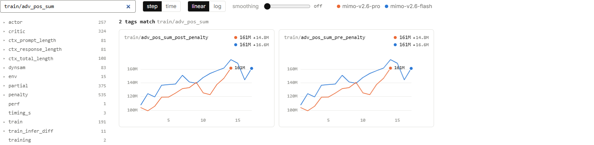

# MiMo RL：怎样从两千多个指标里找到下一张图？

在原站输入 `train/adv_pos_sum`，指标列表就缩成了两张图。
它们的结尾分别是 `pre_penalty` 和 `post_penalty`，Pro 最后都显示 **161M**。
这张筛选后的画面，适合练习怎样从一个具体问题出发查指标。

图 1｜[MiMo 原站 metrics](https://mimo.xiaomi.com/rl/#metrics)，**2026 年 9 月 17 日北京时间 16:08:50**。
搜索词为 `train/adv_pos_sum`；点击图片可放大。

<!-- learning-contract -->

**学习导航**

- **适合读者**：已经会读一两张训练图，希望自己继续探索公开页面。
- **先修**：[采样成功率](mimo-rl.md)与[奖励和优势](mimo-rl-reward.md)。
- **首次阅读**：搜索两张相关图 → 读指标层级 → 选择坐标 → 串起排查路线。
- **完成信号**：能为一个训练问题选出两到三项相关指标，并说明比较条件。
- **卡住时**：先照着截图查“惩罚前后的正优势总和是否变化”。

## 两张图很像，先比较哪一部分？

左图是 `train/adv_pos_sum_post_penalty`，右图是 `train/adv_pos_sum_pre_penalty`。
标签分别指向惩罚处理之后与之前的正优势总和。两图都显示 Pro 161M、Flash 161M。

先对齐同一运行、同一步，再比较数值。本次 Pro 第 14 步的两项都是 **161,182,000**。
这支持“这个步骤的两项汇总读数相同”。如果想知道每个 token 的处理是否相同，还需要更细的记录。

一个小例子说明汇总为什么可能掩盖细节：两个位置的权重原来为 3 和 7，后来变成 4 和 6，总和仍为 10。
此外，页面显示到 161M，也会隐藏较小的数值差异。所以查同值时，先看精确数据，再看统计范围。

## 斜杠让名字变成一条定位路径

左侧目录包括 `actor`、`critic`、`dynsam` 等大类。它们把不同阶段的观测组织在一起。
例如 `actor/code/dataset-bvg7/pg_loss` 可以拆成：

| 部分 | 用来定位什么 |
|---|---|
| `actor` | 策略更新相关的一组指标 |
| `code` | 页面标出的任务类别 |
| `dataset-bvg7` | 匿名数据来源标识 |
| `pg_loss` | 该切片的策略梯度目标统计 |

全局曲线波动时，按类别和来源展开，可以继续问“变化主要出在哪一组任务”。
目录里的标识只帮助定位；`dataset-bvg7` 对应哪些具体题目，仍需要数据说明。

同样，名字里有 `critic` 可以说明指标的归类，模型是否另有独立价值网络则需要训练架构信息。
`partial/4/...` 的数字切片、`F(tau=1.5)` 的完整定义，也应在有说明后再解释。

## 十四类指标，分别能带我们去看什么？

截图的左侧目录有十四个大类。下面按训练工作来组织它们，而不是逐个背字段。

| 想研究的问题 | 相关目录 | 对应专题 |
|---|---|---|
| 回答成功了多少，任务是否太难 | `dynsam` | [成功率](mimo-rl.md)、[题目难度与采样](mimo-rl-sampling.md) |
| 评分如何进入训练目标 | `critic`、`train`、`penalty` | [奖励与优势](mimo-rl-reward.md) |
| 参数更新是否异常 | `actor` | [熵、策略梯度与梯度范数](mimo-rl-update.md) |
| 生成时与训练时是否对得上 | `train_infer_diff`、`partial` | [概率一致性与版本差](mimo-rl-consistency.md) |
| 一条轨迹有多长 | `ctx_prompt_length`、`ctx_response_length`、`ctx_total_length` | [长回答与多轮交互](mimo-rl-trajectories.md) |
| 环境忙不忙，任务是否失败 | `env`、`dynsam` | [流水线](mimo-rl-sampling.md)、[评测与系统健康](mimo-rl-evaluation.md) |
| 数据从哪里来，进入什么执行器 | `dynsam`、`train` | [数据与 harness 配比](mimo-rl-data-mix.md) |
| 处理了多少，耗时多久 | `perf`、`timing_s`、`training` | [进度与费用](mimo-rl-progress.md)、[耗时与吞吐](mimo-rl-throughput.md) |

这些类会交叉出现，因为同一个训练问题往往同时涉及数据、模型和系统。
目录条目数表示可选标签数，标签中还包含各类切片。条目数量不能直接当成实验次数或独立能力数。

## step 和 time：同一组数据，两种问题

顶部的 `step` 把每个训练步放在等间距的位置。它适合看更新前后的变化。
切换到 `time`，图会使用时间坐标，把实际耗时也带进来。

想象三个点的时间分别是 10:00、10:10、12:00。
step 图把两段都画成“一步”；时间图则让第二段明显更长。
如果研究的是“多久才能拿到下一份结果”，时间坐标更贴近问题。

比较两条运行时还要确认时间口径。运行启动不同，步号也可能不同；
先决定要比较同一墙钟时刻、运行了相同时长，还是做了相同步数，再选择对齐方式。

## linear 和 log：是在看差值，还是倍数？

`linear` 是线性刻度：数值增加 10，图上的距离相同。
`log` 是对数刻度：数值乘以同一个倍数，图上的距离相同。

例如 1、10、100 在线性轴上的两段差值是 9 和 90；在以 10 为底的对数轴上，它们间隔相等。
跨度很大的正数指标适合检查对数图，成功率几个百分点的变化通常用线性图更直观。

如果指标有 0 或负值，普通对数没有对应实数值，必须看页面如何处理这些点。
读 `adv_neg_sum` 等负值指标时，不应在不了解处理方式的情况下用对数图解释趋势。

## 平滑可以看趋势，原始点用来找问题

`smoothing` 会弱化相邻点之间的起伏，帮助看长期走势。本组截图保持 **off**。
这样，Flash 基础设施错误率末尾的突增和策略曲线的局部回落，都仍然可见。

用三个值 1、9、2 举例：三点平均约为 4，单看平滑值就不容易发现中间那个 9。
这是平滑的直觉示例，原站具体平滑算法应另查实现。

发现异常时先关闭平滑、打开单图详情，核对 `last`、`Δ`、`points` 和时间位置。
缺失点也需要保留为缺失；补成 0 会凭空画出一次暴跌。

## 最后练一次“带着问题找图”

问题：平均奖励升高了，是否意味着训练越来越有效率？

先看 `critic/rewards/mean`，确认升高在哪一步；
再看 `ctx_total_length/mean` 与 `perf/total_num_tokens`，判断是否用了更多 token；
最后看 `timing_s/step` 与独立评测，分别了解耗时和保存模型的任务表现。

这几张图可以同时显示“训练奖励增加、回答变长、步骤变慢”。
是否值得付出这些成本，取决于固定评测和实际用途的收益。一次训练决策需要把这些量放在一起考虑。

## 自测

1. 某个全局指标下降，想知道是否只有代码任务受影响，应怎样查？
2. 两个步骤的耗时差十倍，step 轴能显示这种间隔差异吗？
3. 惩罚前后总和相同，能否直接推出每个位置的优势都没有变化？

??? note "看答案"
    1. 对齐同一运行和步数，展开该指标的 code 类别与其他类别切片，必要时再看具体来源。
    2. step 轴按步排列；需要时间坐标或计时指标才能查看耗时差异。
    3. 总和可能掩盖局部变化，显示精度也可能掩盖小差异，需要更细记录。

返回[MiMo RL 专题总览](mimo-rl-series.md)，从感兴趣的问题继续读。