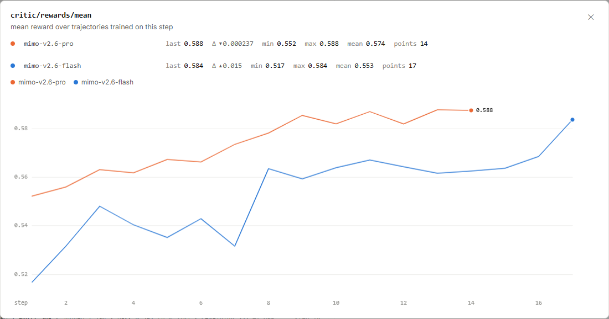
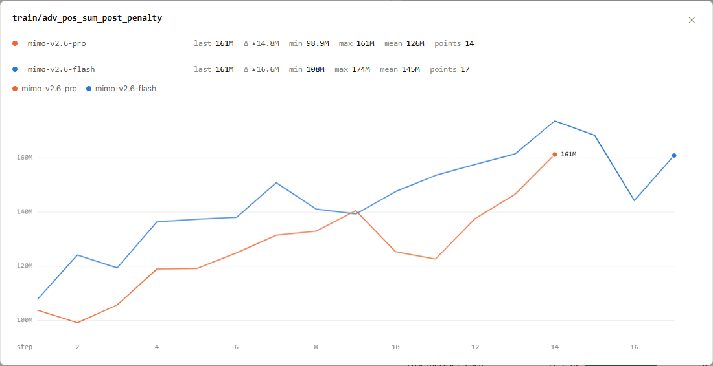

# MiMo RL 奖励：0.588 怎样变成学习信号

Pro 第 14 步的平均奖励约为 **0.588**，同一步的采样成功率却约为 **0.615**。
这两个数来自训练循环的不同位置。先看这张奖励图，弄清进入训练的轨迹拿到了怎样的反馈。

图 1｜小米 MiMo：[https://mimo.xiaomi.com/rl/#chart/critic%2Frewards%2Fmean](https://mimo.xiaomi.com/rl/#chart/critic%2Frewards%2Fmean)。
截于 **2026 年 9 月 17 日北京时间 16:05:58—16:05:59**。横轴为 step，线性刻度，平滑关闭；点击图片可放大。

<!-- learning-contract -->

**学习导航**

- **适合读者**：已经读懂采样成功率，想知道奖励怎样影响模型更新的读者。
- **先修**：会计算平均数；知道一条轨迹可以包含多轮生成和工具交互。
- **首次阅读**：认清奖励的分母 → 手算优势 → 读懂 161M → 做自测。
- **完成信号**：能解释奖励与优势的关系，以及优势总和为什么随样本规模变化。
- **卡住时**：先算下面三份回答减去 0.5 基线的例子。

## 先看奖励在什么对象上取平均

图名是 `critic/rewards/mean`，原站说明为：**本训练步实际用于训练的轨迹的平均奖励**。
橙色是 mimo-v2.6-pro，蓝色是 mimo-v2.6-flash；两条运行的末点分别为第 14、17 步。

| 运行 | 第 1 步奖励 | 最后一步奖励 | 图上显示 |
|---|---:|---:|---:|
| Pro | 0.552211 | 第 14 步：0.587569 | 0.588 |
| Flash | 0.516717 | 第 17 步：0.583729 | 0.584 |

Pro 第 13 步为 0.587806，第 14 步减少了 0.000237，所以图上显示一个很小的向下变化。
Flash 最后一步则从 0.568556 升到 0.583729，增加约 0.01517。两条曲线的首尾都在上升。

奖励是评分规则给轨迹的数值。若规则明确采用成功记 1、失败记 0，奖励均值才可直接解释成对应轨迹的成功比例。
这张图没有展开完整评分规则，因此先把 **0.588 读成平均奖励**，保留它原本的含义。

## 为什么它与采样成功率不同

在[采样成功率一课](mimo-rl.md)中，`dynsam/avg@n` 对每道采样题先算 n 次尝试的成功比例，再对题目平均。
这里的奖励均值则对进入训练的轨迹汇总。两者的计数对象、样本集合以及评分口径需要分别对齐。

| 指标 | 先看什么 | 平均的对象 |
|---|---|---|
| `dynsam/avg@n` | 每题多次尝试的成败 | 题目 |
| `critic/rewards/mean` | 用于训练的轨迹奖励 | 训练轨迹 |

例如，采样阶段保留了所有尝试的成败统计，训练阶段又选择其中一部分轨迹，就可能出现两个不同的均值。
如果每题贡献的训练轨迹数不同，轨迹平均还会给轨迹较多的题更高权重。这是解释口径差异的示意。

Pro 第 14 步的两个公开值为 0.615234 和 0.587569。它们相差约 0.02767。
这个差额不能直接解释为“惩罚扣掉的奖励”；先要知道两边是否用了相同轨迹、权重与评分规则。

## 从奖励到优势：先减去一个可比较的基线

训练器需要知道一份回答相对通常表现好多少。**优势（advantage）**就承担这样的比较作用。
一个最小教学写法是奖励减去**基线（baseline）**：

$$A_i=r_i-b.$$

这里的 $r_i$ 是第 i 份回答的奖励，$b$ 是同一道题预先设定的基线。
**以下数字和算法简化仅用于教学，不代表小米的训练配方。** 假设基线固定为 0.5，三份回答的得分如下：

| 回答 | 奖励 $r_i$ | 基线 $b$ | 优势 $A_i$ |
|---|---:|---:|---:|
| A | 0 | 0.5 | −0.5 |
| B | 0.5 | 0.5 | 0 |
| C | 1 | 0.5 | +0.5 |

在最简单的策略梯度示意中，C 的正优势提供提高其生成概率的学习信号，A 的负优势提供降低其概率的信号。
B 恰好达到基线，这一项没有提供偏向。这里描述的是各项贡献，真实模型的共享参数还会把许多贡献合在一起。

三份回答的奖励均值是 0.5，优势均值却是 0。减去基线以后，正负号表达的是相对表现。
真实训练还需要决定怎样估计基线、怎样把轨迹反馈分配到 token，以及是否归一化优势。

图名中的 `critic` 是指标分组名。当前说明确认了奖励均值的对象，尚不足以确定价值估计是否使用单独的 critic 网络。
因此，上面的减法帮助理解“相对好坏”，具体优势估计器要由算法定义来说明。

## 161M：很多位置的信号加在一起

图 2｜小米 MiMo：[https://mimo.xiaomi.com/rl/#chart/train%2Fadv_pos_sum_post_penalty](https://mimo.xiaomi.com/rl/#chart/train%2Fadv_pos_sum_post_penalty)。
截于 **2026 年 9 月 17 日北京时间 16:06:00**。横轴为 step，线性刻度，平滑关闭；点击图片可放大。

图名为 `train/adv_pos_sum_post_penalty`，对应惩罚处理后的正优势总和。`M` 表示百万，161M 约为 1.61 亿。
两条末点经过缩写看起来一样，具体数值仍有差别；同时看负优势总和，才能看见另一侧的信号规模。

| 末点 | 惩罚后正优势总和 | 惩罚后负优势总和 |
|---|---:|---:|
| Pro 第 14 步 | 161,182,000 | −181,450,000 |
| Flash 第 17 步 | 160,793,000 | −177,606,000 |

用一个**按有效 token 求和的教学例子**理解数量级。假设四个位置的优势为 $[-0.5,-0.5,0.5,0.5]$，定义：

$$S_+=\sum_i\max(A_i,0),\qquad S_-=\sum_i\min(A_i,0).$$

这四个位置给出 $S_+=1$、$S_-=-1$。把同一组位置重复 1,000 次，总和就变成 +1,000 和 −1,000。
平均优势的分布没有改变，参与相加的位置却多了 1,000 倍。增加样本数或有效 token 数，都可能放大这样的总和。

因此，161M 表示累积信号的规模，不能换算成成功回答的数量。
比较两步的总和时，需要同时看样本数、有效 token 数、优势尺度与权重；原站未展开这些总和的精确计算式。

## 惩罚前后相同，该怎样继续读

公开数值还列出了 `pre_penalty` 与 `post_penalty` 两组正、负优势总和。
在这段点列的公布精度下，同一运行的正优势前后相同，负优势前后也相同。

以 Pro 第 14 步为例，正优势两栏都是 161,182,000，负优势两栏都是 −181,450,000。
这个观察只告诉我们汇总数值的前后差为零。惩罚是否启用、作用于哪些样本、精确公式是什么，仍需具体规则解释。

工程上，可以先在同一批轨迹上并排查看原奖励、优势、惩罚项与参与计算的位置。
若希望知道惩罚改变了哪些行为，还要看受影响回答的内容，以及任务成功率和长度是否随之变化。
这样才能把“总和改变了多少”连到“哪些行为收到不同反馈”，避免仅凭一个总量评价训练质量。

## 对着图做三道小题

1. 三份回答的奖励为 0、0.5、1，固定基线为 0.5。奖励均值和优势均值各是多少？
2. 教学例子中的四个 token 重复两次，正优势总和怎样变化？这能说明成功率翻倍吗？
3. Pro 的惩罚前后正优势总和相同，能否据此确定惩罚已关闭？

??? note "看答案"
    1. 奖励均值为 0.5；优势是 −0.5、0、+0.5，均值为 0。
    2. 正优势总和从 1 变成 2。复制只扩大了统计规模，没有改变任何一次尝试的成败。
    3. 不能。相同汇总值给出了可见差额；开关、触发条件与具体作用需要惩罚规则和逐样本记录解释。

继续阅读[强化学习基础](../training/reinforcement-learning.md)，把奖励、基线和策略梯度连起来；
或返回 [MiMo RL 学习专题](mimo-rl-series.md)，选择下一张图。