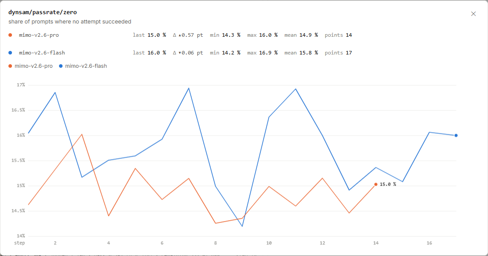
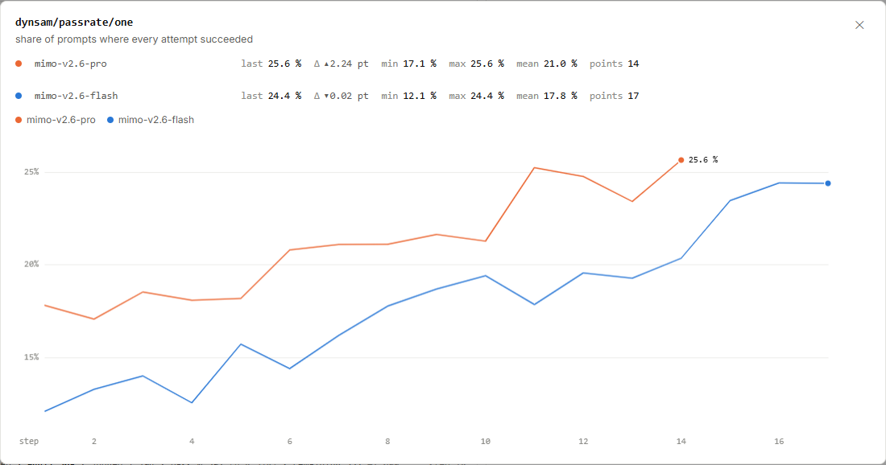
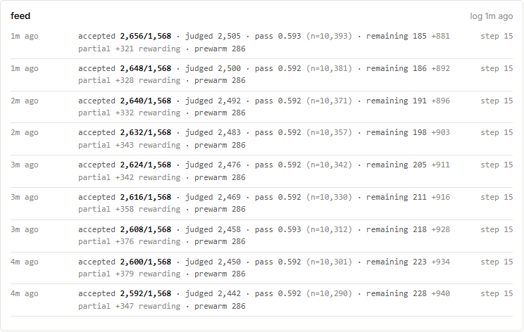
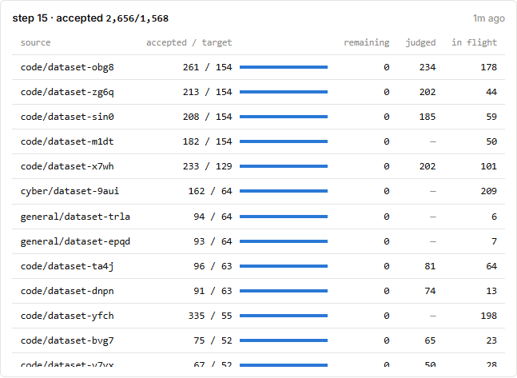

# MiMo RL 采样：哪些题还能提供有区别的反馈？

Pro 有 15.0% 的题目一次也没成功，还有 25.6% 的题目每次都成功。
把这两端放在一起看，才能发现平均成功率背后，哪些题目同时产生了成功与失败的回答。

图 1｜[小米 MiMo 原站](https://mimo.xiaomi.com/rl/#chart/dynsam%2Fpassrate%2Fzero)，截于 **2026 年 9 月 17 日北京时间 16:06:00**。点击图片可放大。

图 2｜[小米 MiMo 原站](https://mimo.xiaomi.com/rl/#chart/dynsam%2Fpassrate%2Fone)，截于 **2026 年 9 月 17 日北京时间 16:06:00**。

<!-- learning-contract -->

**学习导航**

- **适合读者**：读过平均成功率，想理解采样难度与实时任务池的读者。
- **先修**：知道同一道题可以生成多份回答；可先读[第一张成功率图](mimo-rl.md)。
- **首次阅读**：两端比例 → 二值反馈例子 → 采样日志 → 来源表。
- **完成信号**：能解释约 59.4% 的含义，并区分接纳、成功与进入训练。
- **卡住时**：先算下面三道题的组内平均奖励，再回来看实时计数。

## 先把题目分成三种结果

橙线是 Pro，图中的最后一点在第 14 步；蓝线是 Flash，最后一点在第 17 步。
下面只取 Pro 第 14 步，把两张图的末值并排读：

| 题目结果 | 原站指标 | 图上读数 |
|---|---|---:|
| 所有尝试都失败 | `dynsam/passrate/zero` | 15.0% |
| 所有尝试都成功 | `dynsam/passrate/one` | 25.6% |
| 既有成功，也有失败 | 用两端比例估算 | 约 59.4% |

这两个指标的分母都是题目数。先检查一道题的全部尝试，再判断它属于哪一端。
用截图已经四舍五入的百分数计算，中间部分约为：

$$100\%-15.0\%-25.6\%\approx59.4\%.$$

如果使用原始点值 15.0264% 和 25.6442% 再做减法，得到 59.3294%，约 59.3%。
先把各项四舍五入再相减，可能与最后才四舍五入略有差别；这里的 59.4% 是对着截图做的近似估算。

这个近似值表示有成败混合结果的题目占比，不能读成平均回答成功率。
此前的 `avg@n` 则先算每道题的成功次数占比，再对题目平均；Pro 第 14 步的数值约为 61.52%。
一个指标看平均有多容易成功，另外两个看题目有多少集中在“全失败”或“全成功”两端。

全失败也只描述这次有限次数的尝试。增加尝试次数或改变生成方式，仍可能找到成功回答。
同样，这批尝试全成功，并不保证模型以后对该题永远成功。

## 用四次尝试看懂组内相对反馈

下面是**教学示例，并非 MiMo 的实际题目或算法配置**。三道题各尝试四次，通过记 1，失败记 0。
先用同题候选的平均奖励作为参照，再看每份回答比这个参照高多少。

| 题目 | 四次奖励 | 组内平均 | 每次奖励减去组内平均 |
|---|---|---:|---|
| A | 0、0、0、0 | 0 | 0、0、0、0 |
| B | 1、1、1、1 | 1 | 0、0、0、0 |
| C | 1、0、0、0 | 0.25 | 0.75、−0.25、−0.25、−0.25 |

例如 C 的第一份回答成功，它相对本组平均值高出：

$$1-\frac{1+0+0+0}{4}=0.75.$$

在这个例子里，C 提供了可以区分候选的二值反馈；A、B 的候选在这项反馈上没有差别。
这解释了为什么训练团队会关注两端占比：平均成功率上升时，组内可比较的题目未必同时增加。

这里仅演示“奖励减组内平均”的作用，不据此指定 MiMo 使用哪种优化算法。
若还使用其他奖励或跨题反馈，全成功、全失败的轨迹也可能有用途；这张图没有给出样本取舍规则。

## 实时日志：接纳数为什么已经超过目标？

图 3｜[小米 MiMo 原站](https://mimo.xiaomi.com/rl/#overview)，截于 **2026 年 9 月 17 日北京时间 16:08:49.928**。
这是 Pro 正在进行的第 15 步，与前两张图的第 14 步汇总分开阅读。

先读最上面一条日志，再向下看此前的记录：

| 字段 | 这条日志的值 | 阅读时关注什么 |
|---|---:|---|
| `accepted / target` | 2,656 / 1,568 | 已接纳计数与目标题量 |
| `judged` | 2,505 | 日志报告的已判定计数 |
| `pass` | 0.593 | 这条实时日志的通过率，约 59.3% |
| `n` | 10,393 | 随 `pass` 一起报告的统计量 |
| `remaining` | 185 | 日志中的剩余工作计数 |
| `partial` | 881 | 部分完成的工作 |
| `rewarding` | 321 | 正在评分的工作 |
| `prewarm` | 286 | 预热工作 |

最上面两条记录中，接纳数从 2,648 增至 2,656，已判定计数从 2,500 增至 2,505。
日志刷新时，多类工作仍在推进；它展示的是一个活跃任务池的切面。

`n=10,393` 跟随这里的实时 `pass` 汇总，不能解释成每道题尝试了 10,393 次。
顶部配置中的每题 16 次属于另一层采样设置；实时 `pass` 也不能直接替代步级 `avg@n`。

### 固定批量与异步任务池分别管什么？

固定训练批量约束一次更新取用多少题。异步采样池则允许不同任务按各自速度生成、评分和等待取用。
当训练器取走一批题时，池里仍可能有已接纳题目和正在处理的工作。

因此，2,656 比目标 1,568 多出 1,088，只能直接说明接纳计数已经超过目标。
`accepted` 表示接纳，不保证候选回答全部成功，也不说明这些样本已经进入参数更新。

`judged=2,505` 与 `accepted=2,656` 要按各自统计集合和口径阅读。
不能把它们画成同一批对象逐关递减的漏斗，再要求已判定计数一定大于接纳计数。
若要追踪真实流转，需要沿同一道题、同一次尝试核对记录。

`remaining`、`partial`、`rewarding`、`prewarm` 也没有在这条日志中给出互斥关系。
保留各自读数有助于看工作积压；直接相加会把未确认的集合关系当成总工作量。

## 来源表：目标达到后，在途工作仍可能存在

图 4｜[小米 MiMo 原站](https://mimo.xiaomi.com/rl/#overview)，截于 **2026 年 9 月 17 日北京时间 16:08:50.013**。
截图显示可滚动来源表的顶部；下面只抄图中完整可见的前三行。

| 来源 ID | 接纳 / 目标 | `remaining` | `judged` | `in flight` |
|---|---:|---:|---:|---:|
| `code/dataset-obg8` | 261 / 154 | 0 | 234 | 178 |
| `code/dataset-zg6q` | 213 / 154 | 0 | 202 | 44 |
| `code/dataset-sin0` | 208 / 154 | 0 | 185 | 59 |

第一行已经接纳 261 道题，目标为 154，表中的 `remaining` 为 0，同时仍报告 178 项在途工作。
所以，这一列的零并没有表示该来源所有工作都已结束。

原站该时刻完整来源表的 `in flight` 合计为 **1,066**；合计行位于这张截图未显示的部分。
这个总数应按来源表口径保留，不能再与日志里的其他状态随意相加。
来源名称中的匿名 ID 只用来区分记录；这里无需猜测它对应哪个真实数据集。

## 对着图做三道小题

1. 约 59.4% 表示什么？它能替代 `avg@n` 吗？
2. 接纳 2,656、目标 1,568，是否说明已有 2,656 道题成功并完成训练？
3. 第一行 `remaining=0` 时为什么还要看 `in flight=178`？

??? note "看答案"
    1. 它是按截图两端比例估算的成败混合题目占比；`avg@n` 统计逐题平均成功比例，两者不能替代。
    2. 不能。2,656 是接纳计数，成功与训练取用需要分别查看对应记录。
    3. 两列描述不同方面。表中仍有 178 项在途工作，零值没有说明整个来源已空闲。

下一步：回到 [MiMo RL 系列](mimo-rl-series.md)，继续把采样池与数据配比、独立评测连起来看。