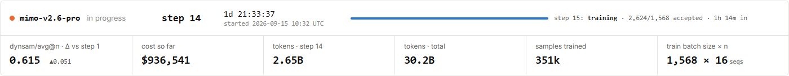

# 对着 MiMo RL 的真实图表，学一遍大模型训练

一张图显示成功率在上升，另一张图显示回答越来越长；模型还在训练，评测却停留在更早的检查点。
把这些画面放在一起，就能看见商业模型训练里同时进行的几件事：做题、评分、更新、调度和评测。

图｜[小米 MiMo 公开 RL 看板](https://mimo.xiaomi.com/rl/)，**2026 年 9 月 17 日北京时间 16:05:57**。
各篇使用当天固定时点的原站局部截图；点击图片可放大。

<!-- learning-contract -->

**学习导航**

- **适合读者**：希望借真实公司的训练图表入门强化学习与训练工程。
- **先修**：知道大模型会生成回答；公式会随例子解释。
- **首次阅读**：成功率 → 训练规模 → 奖励与更新 → 按兴趣选择系统或评测部分。
- **完成信号**：能把一张训练图放回“采样、评分、更新、评测”的流程，并解释两处实际读数。
- **卡住时**：从[第一张图：采样成功率](mimo-rl.md)的两道题例子开始。

看完这组固定图表，可以继续看[9 月 18 日的第二次回看](../evidence/mimo-rl/reviews/2026-09-18.md)：
新画面展示了新增评测、Pro 的题目组成调整，以及实时日志的新鲜度差异。
下面十一篇仍使用 9 月 17 日各自图注中的读数。

## 十一篇专题，每篇回答一个问题

| 顺序 | 对着什么画面学 | 读完能解释什么 |
|---|---|---|
| 1 | [采样成功率](mimo-rl.md) | 0.615 怎样算出，为什么曲线上升中仍有回落 |
| 2 | [训练进度、批次与费用](mimo-rl-progress.md) | 14 步怎样对应约 35 万份样本，费用怎样随时间积累 |
| 3 | [奖励、优势与惩罚](mimo-rl-reward.md) | 成败反馈怎样进入更新目标，161M 这种总和该怎样读 |
| 4 | [熵、策略梯度与梯度范数](mimo-rl-update.md) | 更新模型时同时观察哪三件事 |
| 5 | [训练与推理的一致性](mimo-rl-consistency.md) | 同一 token 的概率差异，与样本落后几个模型版本有何关系 |
| 6 | [长回答与多轮交互](mimo-rl-trajectories.md) | 平均十万 token、约六十轮交互意味着多少工作 |
| 7 | [题目难度与采样流水线](mimo-rl-sampling.md) | 全对、全错的题有什么区别，为什么接受数会超过批次目标 |
| 8 | [训练数据与执行器配比](mimo-rl-data-mix.md) | 代码任务占 67.7% 指什么，提示数与轨迹数为什么分开统计 |
| 9 | [单步耗时与整体吞吐](mimo-rl-throughput.md) | 生成、训练各花多久，局部加速怎样影响整步时间 |
| 10 | [独立评测与系统健康](mimo-rl-evaluation.md) | 65.78 对应哪个模型版本，怎样区分答错题与环境故障 |
| 11 | [指标筛选与读图方法](mimo-rl-metrics.md) | 怎样从十四类指标中找相关曲线，选择坐标和统计口径 |

## 把看板放回一次训练循环

可以按下面这条线索串读：

**组织题目 → 多次生成与环境交互 → 评分并整理候选 → 根据反馈更新参数 → 保存模型 → 独立评测。**

数据配比影响模型练什么；采样器组织多次尝试；奖励与优势把反馈带入参数更新。
与此同时，系统要处理长轨迹、环境失败、生成与训练的速度差，以及不同模型版本之间的衔接。

保存下来的模型还要在指定的题集和执行协议上评测。
因此，读图时同时关注“训练过程中发生了什么”和“某个检查点在任务上表现怎样”，会比只盯一条奖励线更完整。

## 想先了解某一方面，可以这样读

- **先学训练原理**：1 → 3 → 4 → 5，再回到[强化学习基础](../training/reinforcement-learning.md)。
- **先学工程工作量**：2 → 6 → 7 → 9，看一份回答怎样变成大规模流水线。
- **先学如何判断效果**：1 → 8 → 10 → 11，看任务组成、评测协议与统计口径。

第一篇成功率图截于 15:40；后续图主要截于 16:05—16:08，各图旁都注明时刻。
训练会继续向前运行，阅读这组专题时始终以图中的固定读数为准。

需要自己查数时，可以打开[图表与数据入口](../evidence/mimo-rl/index.md)。