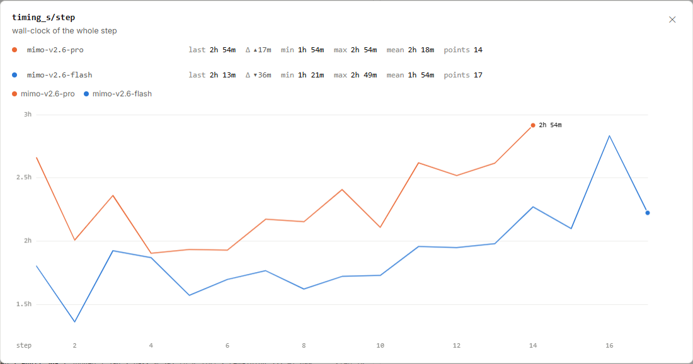

# MiMo RL：一步为什么要跑几个小时？

橙线最后一点是 **2 小时 54 分钟**，蓝线最后一点是 **2 小时 13 分钟**。
训练图里的一小步，在现实中要等几个小时。这里究竟是在等模型回答，还是在更新参数？

图 1｜[原站 `timing_s/step`](https://mimo.xiaomi.com/rl/#chart/timing_s%2Fstep)，
**2026 年 9 月 17 日北京时间 16:05:59**。横轴 step，线性刻度，平滑关闭；点击可放大。

<!-- learning-contract -->

**学习导航**

- **适合读者**：想从公开训练图理解强化学习的耗时与计算瓶颈。
- **先修**：[训练批次与工作量](mimo-rl-progress.md)。
- **首次阅读**：读单步耗时 → 拆生成与训练 → 算整体吞吐 → 判断优化方向。
- **完成信号**：能解释 token/秒的分子、分母，以及为什么它无法直接代表单卡生成速度。
- **卡住时**：先读“生成 40 分钟、训练 20 分钟”的例子。

## 每个点量的是墙上时钟走了多久

`timing_s/step` 的原站说明是整个训练步的墙钟时间，也就是现实经过的时间。
底层数值单位为秒，页面把它转换为小时和分钟。

| 运行 | 最后一步 | 精确秒数 | 图上读数 | 相对前一步 |
|---|---:|---:|---|---|
| Pro | 14 | 10,491.6 秒 | 2h 54m | 增加约 17 分钟 |
| Flash | 17 | 8,000.49 秒 | 2h 13m | 减少约 36 分钟 |

橙线从中段的一小时多走到了接近三小时。蓝线最后却明显回落。
这张图告诉我们步骤耗时发生了变化；如果同时检查数据量、轨迹长度和排队状态，才能继续寻找变化原因。

同样是一步，模型可能面对不同长度的回答、不同速度的环境、不同程度的并行工作。
所以等间距的 step 坐标，背后对应的现实时间间隔并不相等。

## 一步包含生成和参数更新

这个看板还公开了 `timing_s/outer_gen` 与 `timing_s/trainer_ops`。
前者记录生成阶段，后者记录训练器操作的耗时。把对应步的数值放在一起：

| 同一步计时 | Pro 第 14 步 | Flash 第 17 步 |
|---|---:|---:|
| 整步 `step` | 174.86 分钟 | 133.34 分钟 |
| 生成 `outer_gen` | 90.84 分钟 | 71.64 分钟 |
| 训练器 `trainer_ops` | 80.23 分钟 | 57.93 分钟 |

这些数值来自[本组曲线数据](../evidence/mimo-rl/figures/2026-09-17-series/selected-series.json)。
它们显示，生成和训练器操作都占据了很长时间。只关注反向传播，会漏掉组织候选回答这一大块工作。

生成阶段可能需要模型多次推理，还可能等待代码执行、环境交互和评分。
一般训练器会利用反馈计算目标、梯度并更新参数；公开数据没有拆出这些内部操作各自的耗时。
各计时器具体包含哪些操作和等待，仍要看它们的实现。

Pro 的两项相加约为 171.07 分钟，比整步少约 3.79 分钟。
我们可以报告这个差额，却不能仅凭相减把它命名为“网络传输时间”：
计时范围、额外操作或阶段重叠都会影响怎样解释差额。

## 把最快的一段再加速，整步能快多少？

用一个与 MiMo 数值分开的教学例子。假设某个串行训练步有：

- 生成和评分：40 分钟；
- 参数更新：20 分钟；
- 其他工作：5 分钟。

原来合计 65 分钟。即使把参数更新加速到两倍，整步也只是变成：

$$40+\frac{20}{2}+5=55\text{ 分钟。}$$

整步加速比为 $65/55\approx1.18$，约快 18%。
如果团队希望总时间减半，只优化这一段显然不够，还需要处理生成、评分和等待。

这就是读多个计时器的意义：工程团队先找耗时大头，再判断一个局部优化对整体有多大帮助。
真实流水线还可能让阶段重叠，此时需要任务时间线来分析关键路径。

## 约 25 万 token/秒，是怎样算出的？

同一步的总 token 数与总耗时可以构成一个整体吞吐指标：

$$\text{步级吞吐}=\frac{\text{该步报告的 token 总量}}{\text{该步墙钟秒数}}。$$

Pro 第 14 步有 2,649,950,000 token，因此：

$$\frac{2{,}649{,}950{,}000}{10{,}491.6}\approx252{,}578\text{ token/秒。}$$

Flash 第 17 步按同样算法约为 **332,808 token/秒**。
这个计算把一整个训练步的 token 工作量摊到了总时长上，适合描述这两个步骤各自的端到端规模。

它的分子包含该步统计的 token，分母覆盖整步工作。
单张 GPU 的生成速度、用户看到首个 token 的等待时间、设备峰值算力利用率，都有各自的计量方法。
要比较 Pro 与 Flash 的系统效率，还需要控制硬件、模型规模、任务和统计口径。

## 顺着这张图，训练团队会继续查什么？

假设某一步耗时突然从 2 小时变成 3 小时，可以沿着三个问题往下查。

**这一步工作量增加了吗？** 看 token 总量、上下文长度和交互轮数。
如果回答变长了，多出来的时间可能对应实际增加的计算工作。

**任务卡在什么阶段？** 对比生成计时和训练器计时，再看采样池里未完成和等待评分的任务。
平均速度正常时，少数特别慢的任务也可能拖长整批完成时间。

**基础设施是否出现异常？** 环境失败、设备问题与重启会影响进度。
这时应把系统健康和模型回答质量分开检查，避免把环境故障误读成模型能力退步。

上述是排查路线。图中的升降本身没有把具体原因标出来。
公开数据最适合帮助我们提出有依据的下一问。

## 两道小题

1. 一个串行步骤生成 60 分钟、训练 30 分钟。训练加速三倍后，整步加速几倍？
2. token 总量不变、整步时间增加一倍，按本页定义的吞吐会怎样变化？

??? note "看答案"
    1. 原来 90 分钟，之后 60 + 10 = 70 分钟，加速比约 1.29；生成仍是耗时大头。
    2. 吞吐减半。接下来还需要查时间增加在哪一段。

继续读[采样流水线](mimo-rl-sampling.md)，看生成过程中那些尚未结束的任务。
返回[MiMo RL 专题总览](mimo-rl-series.md)。