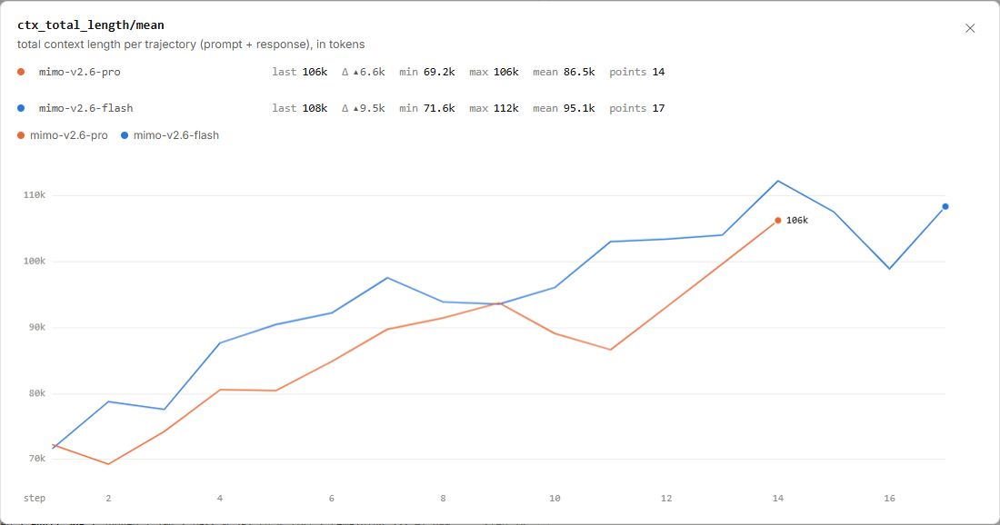
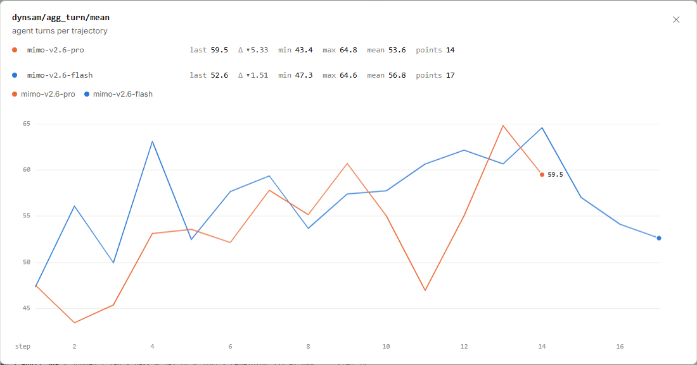

# MiMo RL 轨迹：十万 token 与几十轮交互

Pro 第 14 步的平均轨迹长度约为 **106k token**，Flash 第 17 步约为 **108k token**。
这张图把提示与响应合在一起统计。十万 token 的轨迹背后，可能有持续多轮的任务过程，值得把“多长”和“几轮”分开看。

图 1｜小米 MiMo：[https://mimo.xiaomi.com/rl/#chart/ctx_total_length%2Fmean](https://mimo.xiaomi.com/rl/#chart/ctx_total_length%2Fmean)。
截于 **2026 年 9 月 17 日北京时间 16:05:59**。横轴为 step，线性刻度，平滑关闭；点击图片可放大。

<!-- learning-contract -->

**学习导航**

- **适合读者**：想理解长轨迹、多轮 Agent 与训练数据量之间关系的读者。
- **先修**：知道 token 是模型处理文本的单位，Agent 可以反复生成内容并与环境交互。
- **首次阅读**：拆开提示和响应 → 读轮数 → 算一条示例轨迹 → 估算一个批次的量级。
- **完成信号**：能区分轨迹长度、交互轮数和产品上下文窗口，并说明更长轨迹的收益与代价。
- **卡住时**：先看四轮、9,000 token 的教学例子。

## 106k 由哪些部分组成

`ctx_total_length/mean` 的原站定义是：**每条轨迹的总上下文长度，包含 prompt 与 response，以 token 计**。
橙色对应 mimo-v2.6-pro，蓝色对应 mimo-v2.6-flash。`k` 表示千，106k 就是约 106,000。

同一批公开数据还给出了 `ctx_prompt_length/mean` 和 `ctx_response_length/mean`：

| 末点 | 提示长度均值 | 响应长度均值 | 总长度均值 |
|---|---:|---:|---:|
| Pro 第 14 步 | 4,209.61 | 101,993 | 106,203 |
| Flash 第 17 步 | 4,197.54 | 104,111 | 108,308 |

单位都是 token。按这些均值看，两条运行的响应部分约占总长的 96%，提示部分约占 4%。
例如 Pro 的 4,209.61 加上 101,993，约为 106,203；三项分别保留有限精度，末位不必强行凑齐。

这里按原站的提示、响应分类引用数据。多轮工具内容如何归类、重复前缀如何计数，还需要更细的轨迹定义说明。
读者可以先掌握当前确定的口径：这个数描述轨迹中的提示与响应长度之和。

token 由分词器切分产生，可能对应字、子词、空白或字节片段。
同一段文字换一个分词器，token 数就可能改变，因此十万 token 无法直接换算成十万个汉字。

此外，**训练轨迹长度描述这次训练中处理的样本**。
产品单次请求支持的最大上下文窗口，以及那么长的输入能否被有效利用，需要对应的接口规格与长上下文测试来回答。

### 平均数之外，还要看最长的那条

同组数据的 `ctx_total_length/max` 在 Pro 第 14 步报告 **1,048,570 token**，远高于 106,203 的均值。
这提示我们继续查看长度分布的尾部：少数很长的轨迹可能给显存、缓存和批次调度带来额外压力。
最大值只说明该指标记录到的极值，仍然不能直接填入产品支持的上下文规格。

`ctx_total_length/clip_ratio` 同时报告约 **0.000240462**，换成百分数约为 **0.0240%**。
这个标签指向长度裁剪相关的比例，页面没有展开阈值、分母和具体处理。
因此，能先做单位换算；要判断多少条轨迹被怎样裁剪，还需要相应定义，不能把它当作已经明确的样本丢弃率。

## 59.5 轮：一条轨迹里发生了多少次交互

图 2｜小米 MiMo：[https://mimo.xiaomi.com/rl/#chart/dynsam%2Fagg_turn%2Fmean](https://mimo.xiaomi.com/rl/#chart/dynsam%2Fagg_turn%2Fmean)。
截于 **2026 年 9 月 17 日北京时间 16:05:59**。横轴为 step，线性刻度，平滑关闭；点击图片可放大。

`dynsam/agg_turn/mean` 的原站定义是**每条轨迹的 Agent 轮数**。
Pro 最后一步的具体均值为 59.4873，Flash 为 52.5926，图中分别显示 59.5 和 52.6。

一条轨迹记录模型为一次任务持续行动的过程。一轮可能生成文本，也可能提出工具动作，再接收环境返回的信息。
具体轮次边界由交互协议定义；一轮也可能包含多个工具调用，所以不能把 59.5 轮直接解释成 59.5 次工具调用。

59.5 是许多轨迹的平均值。就像两条轨迹分别有 59、60 轮，平均是 59.5，单条轨迹仍按完整轮次计数。
平均值还隐藏了长尾：少量交互特别多的任务，可能占用大量生成与环境执行时间。

## 轮数减少，轨迹也可以变长

把 Pro 最后两个点并排看：

| 指标 | 第 13 步 | 第 14 步 | 变化 |
|---|---:|---:|---:|
| 总长度均值，token | 99,593.8 | 106,203 | 约增加 6,609 |
| Agent 轮数均值 | 64.8149 | 59.4873 | 约减少 5.33 |

这两个变化可以同时出现。每轮产生的内容更多，或者任务组成变化，都可能让总长增加而轮数减少。
两项统计的样本集合与权重还需要对齐，因此仅用两个均值相除，无法确定每一轮实际上变长了多少。

下面用一个**完全独立的教学示例**把两个维度拆开。示例不代表小米的任务流程或 token 计数实现。
假设提示为 1,000 token，四轮新生成内容按下表计数，已有前缀只计一次：

| 轮次 | 模型在示例中做什么 | 新增响应 token |
|---|---|---:|
| 1 | 阅读任务，提出修改计划 | 2,000 |
| 2 | 请求检查，并说明检查目标 | 1,000 |
| 3 | 根据返回结果修正方案 | 3,000 |
| 4 | 整理最终回答 | 2,000 |

$$L=1{,}000+(2{,}000+1{,}000+3{,}000+2{,}000)=9{,}000\text{ token}.$$

这是一条 4 轮、9,000 token 的示例轨迹。
另一条轨迹可以分成 8 轮，每轮只生成 1,000 token；提示相同，总长度也为 9,000 token。

轮数多一倍，总长可以保持不变。反过来，保留 4 轮、只加长其中一轮，也可以让总长增加。
这就是训练团队同时观察两条曲线的理由：轮数帮助看交互结构，长度帮助看内容和计算规模。

## 更长的轨迹，有什么收益和代价

代码任务可能需要先读项目、运行测试、分析失败，再修正方案。多轮交互给模型利用新反馈的机会。
如果额外的 token 用来比较方案、检查边界和纠正错误，更长过程可能提高任务完成率。

也有另一种情况：模型重复已经读过的内容、反复尝试同一条失败路径，或者在无关细节上持续扩写。
这些轨迹同样会抬高平均长度。要区分两类情况，需要把成功与失败轨迹按任务类型放在一起读。

更长的生成通常会增加生成计算与训练激活的负担；更多交互还可能增加工具执行与等待成本。
实际开销取决于缓存、序列组织和调度方式，不能只用一个长度均值直接推算每秒处理能力。

一个实用的检查顺序是：先看同类任务的成功率，再抽取长轨迹，最后判断哪些额外轮次真正推进了任务。
如果固定成功率下能删掉重复过程，就有机会减少成本；如果删掉的是必要检查，则可能牺牲质量。

## 从一条轨迹估算一个训练批次

当时的[原站概览](https://mimo.xiaomi.com/rl/#overview)给出 Pro 的训练批配置为 **1,568 × 16 条序列**。
先把它换成名义序列数，再乘图中约 106k 的平均长度，做一次量级估算：

$$1{,}568\times16=25{,}088.$$

$$25{,}088\times106{,}000=2{,}659{,}328{,}000\approx2.66\text{B token}.$$

`B` 表示十亿。原站 Pro 第 14 步的 `perf/total_num_tokens` 为 2,649,950,000，约为 2.65B。
估算与这个总量接近，让我们直观看到：十万 token 左右的单条长度，乘上两万多条序列，会到十亿级。

这里使用了批配置和舍入后的长度均值。实际有效序列数、有效 token 口径及聚合权重可能不同，
只有对同一组序列等权求平均，才可严格用“条数 × 平均长度”还原总量。因此，上式应保留为近似估算。

本页先建立数据量的尺度。一次训练步要花多久，还需要生成、训练与等待时间的统计，留给耗时主题继续讨论。

## 对着图做三道小题

1. Pro 的 106,203 token 是否全部属于响应？能否用它填写产品最大上下文窗口？
2. 四轮示例的响应一共多少 token？改为八轮、每轮 1,000 token 后，总长是多少？
3. 25,088 × 106k 得到约 2.66B，为什么与原站的约 2.65B 不要求完全相等？

??? note "看答案"
    1. 它包含提示与响应，响应均值为 101,993。产品窗口是另一项接口规格，轨迹均值不能替代它。
    2. 响应共 8,000 token；加上 1,000 token 提示，两种安排的总长都是 9,000 token。
    3. 这里使用名义批量和舍入均值，实际样本范围与统计权重未完全对齐；它用于理解量级。

继续阅读 [Tokenization：模型究竟看见了什么](../core/tokenization.md)，理解 token 与文本长度的关系；
或返回 [MiMo RL 学习专题](mimo-rl-series.md)，选择下一张图。