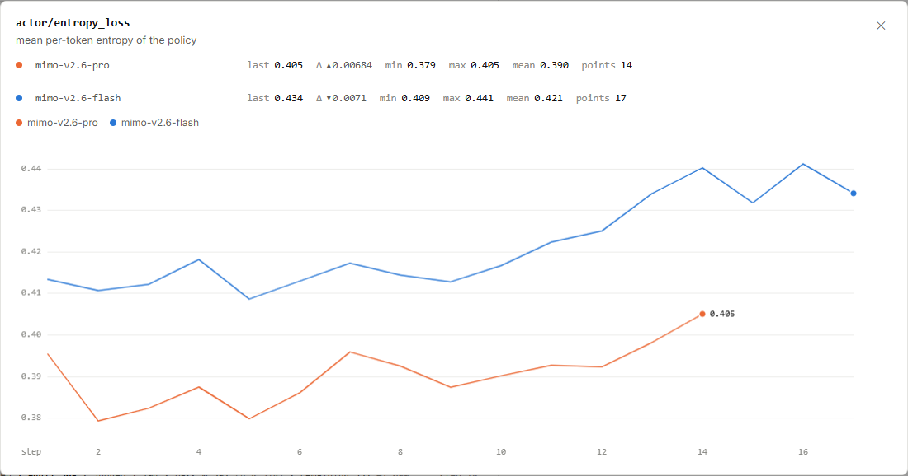
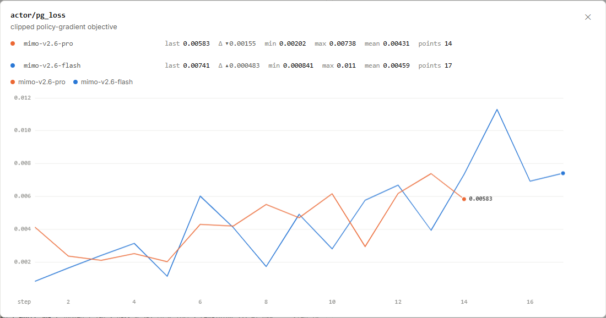
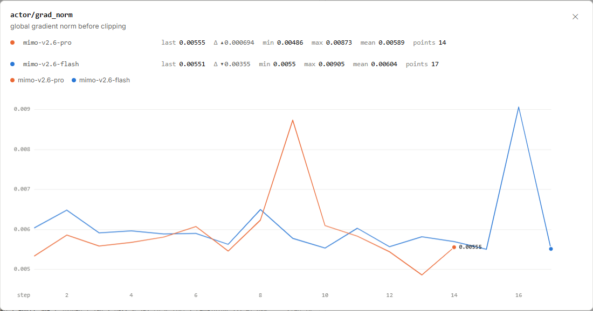

# MiMo RL 更新：把熵、目标和梯度分开读

橙线末点约为 **0.405**，蓝线约为 **0.434**。它们描述模型在生成位置上的不确定性。
同一轮训练还会报告策略梯度目标和梯度范数；三个数分别对应“怎样选择”“优化什么”和“得到多大的梯度”。

图 1｜小米 MiMo：[https://mimo.xiaomi.com/rl/#chart/actor%2Fentropy_loss](https://mimo.xiaomi.com/rl/#chart/actor%2Fentropy_loss)。
截于 **2026 年 9 月 17 日北京时间 16:05:59**。横轴为 step，线性刻度，平滑关闭；点击图片可放大。

<!-- learning-contract -->

**学习导航**

- **适合读者**：看到训练图中的 loss、entropy、grad norm，想知道各自用途的读者。
- **先修**：知道模型为候选 token 分配概率，优势可表示回答相对基线的好坏。
- **首次阅读**：二选一的熵 → 正优势的裁剪例子 → 梯度裁剪前后 → 自测。
- **完成信号**：能区分策略目标裁剪和梯度裁剪，并解释梯度范数为何不能直接当作参数步长。
- **卡住时**：先比较概率各占一半，与一个候选占九成时的选择余地。

## 熵：模型在一个位置上有多少选择余地

`actor/entropy_loss` 的原站定义是**策略的逐 token 平均熵**。
熵先衡量每个纳入统计的位置上，候选 token 概率分布的不确定性，再对这些位置取平均。

| 运行 | 倒数第二步 | 最后一步 | 最后一次变化 |
|---|---:|---:|---:|
| Pro，第 13 → 14 步 | 0.398121 | 0.404965 | +0.006844 |
| Flash，第 16 → 17 步 | 0.441110 | 0.434013 | −0.007097 |

橙色对应 mimo-v2.6-pro，蓝色对应 mimo-v2.6-flash。末点覆盖的步数不同，训练位置和题目也未必相同。
蓝线在这里较高，说明其报告的平均熵较高；任务完成得好不好，还要看奖励和独立评测。

**以下是二元分布的教学例子，不代表小米的词表或训练配方。** 只允许两个候选，概率为 $p$ 与 $1-p$：

$$H(p)=-p\ln p-(1-p)\ln(1-p).$$

本例使用自然对数。两个候选各占一半时，$H(0.5)\approx0.6931$；一个占九成时，$H(0.9)\approx0.3251$。
后者把更多概率集中在一个候选上，选择更确定，因此熵更低。

真实模型有很大的词表，同样的平均熵还可能来自不同位置的不同分布。
这张图给出了平均量，未展开对数底、位置掩码与加权细节；不能用二元例子反推出某个真实 token 的概率。

工程上，过度集中的分布可能减少探索；过于分散也可能增加无效尝试。
应结合相同任务上的回答差异与奖励，判断保留的选择余地是否有用。

## 策略梯度目标：限制一项反馈被放大多少

图 2｜小米 MiMo：[https://mimo.xiaomi.com/rl/#chart/actor%2Fpg_loss](https://mimo.xiaomi.com/rl/#chart/actor%2Fpg_loss)。
截于 **2026 年 9 月 17 日北京时间 16:05:59**。横轴为 step，线性刻度，平滑关闭；点击图片可放大。

原站把 `actor/pg_loss` 解释为**裁剪后的策略梯度目标（clipped policy-gradient objective）**。
策略梯度（Policy Gradient，PG）利用优势调整已采样行为的概率。裁剪思路则限制某些概率变化带来的目标收益。

| 运行 | 最后一步的具体值 | 图上读数 |
|---|---:|---:|
| Pro 第 14 步 | 0.00583001 | 0.00583 |
| Flash 第 17 步 | 0.00740575 | 0.00741 |

借用近端策略优化（Proximal Policy Optimization，PPO）的常见思路做一个**正优势分支的教学示例**。
设同一个已采样 token 在旧分布中的概率为 0.2，在当前分布中为 0.3，优势为 +2，概率比上界设为 1.2：

$$\rho=\frac{0.3}{0.2}=1.5,\qquad \min(\rho\times2,1.2\times2)=2.4.$$

未经裁剪时，这一项可得到 3；裁剪后只计 2.4。继续把概率比推到 1.5 以上，也不会增加这个正优势分支的收益。
这种设计降低了反复利用同一份好反馈、把概率快速推高的诱因。

例中的上界和数值都由教材设定，只演示一个分支。MiMo 的完整目标、符号约定和裁剪阈值尚未由图表说明展开。
因此，图名支持“裁剪策略梯度目标”这一读法，不能单凭名字确定它采用了哪套完整 PPO 配方。

另列的 `actor/pg_clipfrac` 是策略目标裁剪比例指标；两条运行这段公开点列的读数均为 0。
读这个比例时还需要知道统计位置和阈值。它与下面的梯度裁剪处在不同环节。

## 目标曲线为什么会上下起伏

Pro 从第 13 步的 0.0073807 降到第 14 步的 0.00583001；Flash 则在最后一步小幅上升。
整张图比平均奖励更曲折，因为目标数值还受到优势大小、正负项抵消、概率比和归一化方式的影响。

强化学习每一步又会取得新的回答。题目、轨迹长度和优势分布随之改变，相邻点通常不再是在同一份固定数据上计算。
即使每次更新都沿当前目标给出的方向前进，跨训练步的目标读数也无需单调下降。

如果要排查一次突变，可以先固定一批样本，查看优势分布、概率比及哪些位置参与目标计算。
再回到新采样任务的奖励和评测，观察参数更新有没有带来想要的行为变化。
把 `pg_loss` 越小直接读成“模型越好”，会漏掉这两层数据变化。

## 梯度范数：先看裁剪前，再问实际更新

图 3｜小米 MiMo：[https://mimo.xiaomi.com/rl/#chart/actor%2Fgrad_norm](https://mimo.xiaomi.com/rl/#chart/actor%2Fgrad_norm)。
截于 **2026 年 9 月 17 日北京时间 16:05:59**。横轴为 step，线性刻度，平滑关闭；点击图片可放大。

`actor/grad_norm` 的原站定义明确写着：**裁剪前的全局梯度范数**。
Pro 第 14 步为 0.00555057，Flash 第 17 步为 0.00550834，分别显示为 0.00555 和 0.00551。

把所有参数的梯度看成一个大向量，范数用于概括它的整体大小。
Flash 第 16 步曾到 0.00905447，随后回到约 0.00551；图中确实有一个尖峰，成因还需要当步样本和训练记录解释。

继续用**独立的教学设定**算一次：梯度向量 $g=(3,4)$，采用二范数，其大小为：

$$\lVert g\rVert_2=\sqrt{3^2+4^2}=5.$$

若把范数上限设为 1，按同一比例缩小各分量，得到 $g'=(0.6,0.8)$，裁剪后范数为 1。
再假设使用无动量、无权重衰减的普通梯度下降，学习率为 0.01，参数更新量就是：

$$\Delta\theta=-0.01g',\qquad \lVert\Delta\theta\rVert_2=0.01.$$

这三个阶段分别得到 5、1 和 0.01：裁剪前梯度、裁剪后梯度、参数更新量。
实际优化器还可能依据历史梯度缩放各分量；要算真实步长，需要学习率、优化器状态及梯度处理规则。

所以，0.00555 既没有给出 MiMo 的学习率，也没有给出它的实际参数更新范数。
两条运行的范数接近，只表示各自报告的全局大小接近；参数维度、梯度方向和优化器状态仍需分别考虑。

把三个指标连起来：**概率分布产生熵 → 反馈进入策略目标 → 对目标求导得到梯度 → 优化器更新参数**。
目标裁剪作用于目标中的项，梯度裁剪作用于求导后的向量；排查时要找准发生变化的环节。

## 对着图做三道小题

1. 二选一示例中，概率从 0.5/0.5 变成 0.9/0.1，熵怎样变化？
2. 正优势示例中，概率比为 1.5、优势为 2、上界为 1.2，目标贡献是多少？这是 MiMo 的实际阈值吗？
3. `grad_norm=0.00555` 能否直接填写为学习率，或者实际参数更新量？

??? note "看答案"
    1. 熵从约 0.6931 降到约 0.3251，表示这个位置的概率更集中。
    2. 贡献为 2.4。1.2 是本页教学设定，原图没有给出 MiMo 的实际裁剪阈值。
    3. 都不能。原站报告的是裁剪前全局梯度范数，后续裁剪和优化器计算还会影响实际更新。

继续阅读[强化学习基础](../training/reinforcement-learning.md)，学习策略梯度与完整裁剪目标；
或返回 [MiMo RL 学习专题](mimo-rl-series.md)，选择下一张图。