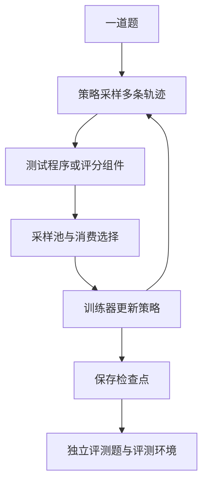

# MiMo RL 公开训练看板：怎样把曲线读成证据

<!-- learning-contract -->

**学习导航**

- **适合读者**：学过一点微调，想第一次读懂真实模型强化学习训练曲线的开发者。
- **先修**：[对齐入门](../training/alignment-basics.md)；知道模型会为同一道题采样多份回答即可。
- **首次阅读**：三个成绩单 → 两道题的手算 → 训练与推理一致性 → 阅读练习；公式细节可第二遍再读。
- **完成信号**：能为一个曲线点写出运行、版本、横轴、分母和证据边界，并复算 `avg@n` 与 `pass@k`。
- **卡住时**：先回到本页的两道题例子，再读[强化学习基础](../training/reinforcement-learning.md)。

你打开训练看板，看到采样成功率上升，训练损失也在变化，独立评测却还停留在较早的检查点。
这时怎样回答“模型进步了吗”？先找出每个数字对应哪批回答、哪个模型状态，以及谁给出了分数。

**学习入口**：[强化学习基础](../training/reinforcement-learning.md) ·
[归档与核对方法](../evidence/mimo-rl-controls.md) · [快照入口](../evidence/mimo-rl/index.md)
{ .doc-nav }

本章围绕 [MiMo 官方 RL 看板](https://mimo.xiaomi.com/rl/)中的 Pro 与 Flash 运行展开，编写日期为 2026-09-17。
产品侧字段与展示口径绑定该来源；具体读数及采集时间以快照为准。[SOURCE:xiaomi-mimo-rl-dashboard]
来源登记为待人工复核，自动采集不会把它升级为人工已核验。

本章提供读图方法和本仓库自拟的手算题。公开看板提供的是发布方报告的训练观测；本仓库没有运行 MiMo 权重、
训练器或评测环境，也没有独立复现它的质量结果。

## 先固定“这是谁在什么时候的数字”

Pro 与 Flash 是两条运行。各自的训练进度、采样池、曲线版本和评测结果需要分别阅读。
同样标成第 10 步的两个点，可以来自不同模型和不同时间；把它们放在一起还需要相同的指标与评测口径。

引用一个点时，先填下面这张小卡片：

| 问题 | 需要记录什么 |
|---|---|
| 哪条运行？ | 完整运行标识，区分 Pro 与 Flash |
| 哪份数据？ | 接口返回的版本、指标标识和快照身份 |
| 横轴是什么？ | 训练步、墙钟时间或评测检查点，保留原始坐标 |
| 谁在什么时候读到？ | 该接口的采集时间，以及整个采集窗口 |
| 指标覆盖谁？ | 采样回答、已判定回答、训练消费样本或评测题目 |

检查点（checkpoint）是保存下来的模型状态。接口数据版本用于识别一份返回数据，策略版本用于识别生成回答的模型状态。
这三种身份需要分别核对，不能从名称相似就假设一一对应。

看板持续更新，一次归档会依次读取多个接口。某条曲线和实时采样器可能处在相邻时刻。
归档保留采集前后状态与各接口时间，因此引用时可以说明这个窗口；它没有把整个训练系统冻结在同一瞬间。

## 从一道题追踪到三个成绩单

先把强化学习（Reinforcement Learning，RL）的循环展开。采样器把一道题交给策略模型，模型生成若干候选轨迹。
轨迹（trajectory）包括这次尝试中的生成与交互；工具任务可能经历多轮调用。评分组件给出反馈，训练器消费选定样本并更新策略。

这张图解释读数之间的关系，不指定 MiMo 的完整算法或内部调度实现。
沿着它会遇到三类成绩：

| 成绩 | 回答的问题 | 阅读时先核对什么 |
|---|---|---|
| 奖励（reward） | 训练评分规则给这条回答多少分？ | 评分规则、尺度、惩罚与聚合方式 |
| 采样成功率 | 当前这批已统计的尝试有多少通过指定判定？ | 题目、候选数、判定器与完成状态 |
| 留出基准成绩（held-out benchmark） | 指定检查点在另一套评测协议下表现怎样？ | 检查点、题集、采样与评分协议 |

如果训练奖励恰好是通过记 1、失败记 0，某个平均奖励可以与同一批回答的成功率一致。
加入长度惩罚、格式分、多个奖励项或不同的筛选后，它们就会衡量不同对象。
先确认规则，再比较曲线，才能解释差异来自行为变化还是统计口径变化。

“留出”描述评测数据与训练数据的隔离要求。看板报告的独立基准可用于观察泛化线索；
是否真正隔离、是否存在污染，以及评测环境是否一致，还需要数据与评测协议证据。

## 两道题手算 `avg@n` 与 `pass@k` {#avg-and-pass}

假设我们准备两道题，每题采样四份回答。测试程序只给出成功 1 或失败 0。
下面的数字是教学样例，与 MiMo 快照中的任何一个训练步无关。

| 题目 | 四份回答的结果 | 成功份数 | 该题平均成功率 |
|---|---|---:|---:|
| A | 1、0、0、0 | 1 | $1/4$ |
| B | 1、1、1、0 | 3 | $3/4$ |

### `avg@n`：平均一份回答有多大机会成功

在这个例子中，每题采样数都是 $n=4$，先计算各题成功比例，再对两道题等权平均：

$$
\operatorname{avg@4}=\frac{1}{2}\left(\frac{1}{4}+\frac{3}{4}\right)=\frac{1}{2}.
$$

共有 8 份回答、4 份成功，因此直接按回答计数也得到 $4/8$。这两个算法恰好一致的条件是每题候选数相同。
当每题采样数不同，题目等权平均与全部回答合并统计可能不同；真实字段还要核对题目权重、筛选和有效样本分母。

读看板的 `dynsam/avg@n` 时，先把它理解为采样结果的平均表现，再核对该快照的统计范围。
实时采样器显示的 `pass` 还可能只覆盖已完成判定的子集，不能直接与训练步汇总拼成同一条序列。

### `pass@k`：给多次机会，至少一次成功的比例

如果四份候选全部交给理想检查者，A、B 都至少有一份成功，所以这个固定候选集的 `pass@4` 为 1。
它比 `avg@4` 高，是因为它回答“有没有成功答案”，并不要求每份回答都可靠。

再问：从每题已有的四份候选中，等概率、无放回地选两份，至少一份成功的概率是多少？
四份选两份共有 $\binom{4}{2}=6$ 种组合：

- A 有 3 份失败，失败组合共有 $\binom{3}{2}=3$ 种，成功概率为 $1-3/6=1/2$。
- B 只有 1 份失败，无法选出两份全失败的回答，成功概率为 1。
- 对两题等权平均，得到 `pass@2` 估计值 $(1/2+1)/2=3/4$。

一般地，题目 $i$ 的 $n$ 份候选中有 $c_i$ 份成功，$m$ 道题等权平均，且 $1\le k\le n$：

$$
\widehat{\operatorname{pass@k}}
=\frac{1}{m}\sum_{i=1}^{m}
\left[1-\frac{\binom{n-c_i}{k}}{\binom{n}{k}}\right].
$$

失败份数少于 $k$ 时，分子按 0 处理。这个组合公式先描述固定候选集上的抽取概率；
要用它估计未来生成表现，还需要固定采样协议并检查候选的代表性与相关性。

`pass@k` 假设能识别正确答案。真实系统还要让选择器挑中它，因此应继续报告实际选中答案的成功率。
增加采样数会改变机会数和计算量，不能把不同 $k$ 的成绩直接解释为单次回答能力的变化。

## Actor 曲线在记录什么

Actor 是生成回答、接受策略更新的模型。训练曲线让我们观察它怎样改变概率分布，
任务是否完成则继续由评分与独立评测回答。

### 熵：模型的概率分布有多分散

若某个生成位置的候选 token 概率为 $p_j$，熵（entropy）是：

$$H(p)=-\sum_j p_j\log p_j.$$

两个 token 各占一半时，使用自然对数得到 $H=\log 2$；概率集中到其中一个时，熵趋近 0。
熵下降可能伴随选择更确定，也可能伴随重复模式增多。判断它的意义，需要同时查看成功率、回答长度与任务切片。

曲线可能对不同 token、序列或批次取平均。比较两个熵值前，要确认 mask、采样配置与汇总方式；
图上的平均熵也不能直接当成完整回答的多样性分数。

### 策略梯度损失与梯度大小

策略梯度（Policy Gradient，PG）用反馈调整已采样动作的概率。`pg loss` 是优化目标的一种记录，
其符号和尺度依赖优势估计、截断、归一化与实现约定，不能沿用分类交叉熵“越低越好”的直觉。

梯度（gradient）给出参数调整的方向；梯度范数把调整信号的大小汇总成一个数。
读 `grad` 类曲线时，先确认它是否是范数、是否已经裁剪，以及是否受混合精度缩放影响。
尖峰可以提示检查样本、数值和恢复事件，单个尖峰尚不足以确定故障原因。

把奖励、熵、策略梯度损失和梯度放在同一时间范围内，能提出更具体的问题：
例如“长度变长后，奖励增加是否伴随失败分母变化？”随后再用数据和评测检验。

## 训练侧与推理侧为何需要单独对账 {#train-infer}

采样通常由推理侧执行，更新通常由训练侧执行。即使它们使用相关的策略权重，
精度、算子、概率计算路径和版本传播也可能不同。训练要知道采样回答当时有多大概率，才能解释更新信号。

看板中的 `train_infer_diff/new_infer/kl` 关注**训练侧与推理侧的分布一致性**。
KL 展开为 Kullback–Leibler divergence，常译为相对熵；解释这个字段时要保留其比较对象与版本。
具体方向、估计方法、mask 和聚合范围仍需以来源定义核对。

[对齐进阶](../training/alignment.md)中的参考模型 KL，则比较当前策略与参考策略，常用于限制偏离原始行为。
两者承担不同职责。本看板这个字段不能用来读取“离冻结参考模型有多远”，也不能由它推断参考正则的系数。

如果训练—推理差异突然增加，可以提出版本尚未同步、数值计算路径不同等排查假设。
确认原因需要两侧权重身份、同一输入的概率对账和事件记录；曲线本身不提供这条因果链。

### `partial avg_staleness` 用什么单位

2026-09-17 核对时，指标详情把 `partial/avg_staleness` 定义为从采样到训练平均相差的策略版本数。
本地保存的运行配置响应包含该说明；公开查看器提供中文转述。单位为**策略版本数**。[SOURCE:xiaomi-mimo-rl-dashboard]

例如，教学场景中训练使用版本 10，两条参与统计的轨迹分别来自版本 8 和 9，等权平均落后量为 $(2+1)/2=1.5$。
这表示轨迹跨越了策略更新；把它换算成时间还需要版本发布时间，把它解释成训练风险还需要消费与校正规则。

具体参与样本、权重与未完成轨迹的处理规则尚未公开，指标名前缀不足以确定完整分母。
实时采样器的 `partial` 队列计数与这条步级汇总，应分别阅读。

## 批量、长度与数据组成要分三本账 {#sampling-ledgers}

### 配置容量与实际消费

若某次状态显示训练批量 1,568 个 prompt、每题采样 16 份候选，那么名义轨迹数为：

$$1{,}568\times16=25{,}088.$$

这个乘法描述批量与候选数的配置关系。实际进入更新的轨迹还取决于判定、筛选、截断、重试和消费过程。
采样池接受的数量、训练器消费的数量与已经完成优化更新的数量，应各有对应记录。

工具评测环境常称 harness。一条轨迹可以包含多次工具调用或环境交互，
因此名义轨迹数也不能直接当作 harness 的实际执行次数。

### 平均上下文与回答长度

若看板显示平均上下文约 100k token，它的口径包含 **prompt 加 response**。
长输入与长回答都可能抬高这个数。想知道模型平均回答多长，需要单独的 response 长度统计。

平均长度描述这批样本；模型允许的最大窗口和长上下文任务的有效能力，需要配置与专门评测分别回答。
同样，累计 token、页面费用计数与训练墙钟时间各有自己的口径，不能据此反推完整训练预算或硬件配置。

### 接受池与训练数据组成

数据组成界面按训练消费口径展示来源分布，并利用采样器计数作推导。
重启之后的部分步骤还涉及结转池（carryover）：此前接受的样本可以留到后续消费。
界面会用结转量与新接受样本的比例分配估计组成，需保留这类推导说明。

直接把各来源的原始 `num_accepted` 相加，会把采样池与训练消费混在一起。
比较两个步骤的数据配比时，先看是否跨越重启、使用的是消费量还是池内计数，以及该步骤是否采用估计。
来源类别只说明统计标签，具体题目、许可、去重与质量仍需要数据记录。

## 独立评测必须跟着检查点走 {#checkpoint-benchmarks}

独立基准可能比训练曲线晚更新。最新训练步已经前进，评测表仍保留较早检查点，是可以同时成立的状态。
引用分数时，先从 benchmark 返回的逐项结果中读取模型、检查点与分数，再与训练曲线关联。

推荐按下面顺序核对：

1. 找到对应运行的原始结果关联，保留检查点标识或步数。
2. 找到基准名称、指标单位与该检查点的结果；比例与百分数分别记录。
3. 检查是否有未返回、尚未完成或无法解析的项目，把它们留在缺失记录中。
4. 比较两个检查点时，再核对题集、评测环境、采样次数与评分协议是否可比。

公告文案、表格顺序与当前训练步都不能替代原始结果的检查点关联。
若公告提到的步数和结果接口不同，把差异记为待复核，避免把一个分数移到另一检查点。
本页不重复维护实时成绩表；带采集身份的记录统一放在[快照入口](../evidence/mimo-rl/index.md)。

一个基准上涨可以支持“该检查点在此协议下报告了更高成绩”。
要说明总体能力改善，还需要基准覆盖、失败切片与统计不确定性；要说明某项训练改动造成改善，还需要可比较的对照。

## 把动态看板变成能离线重读的材料

归档的目标是覆盖 Pro 与 Flash 当次可获取的全部公开标量曲线，同时保留逐运行指标目录、
采集前后状态、实时采样器数值状态和逐检查点评测。目录用于核对遗漏，避免只保存支持某个结论的几条曲线。

公开包保存数值事实投影、清单及本仓库原创的离线曲线查看器。
原站 HTTP 响应体和页面资源留在本地私有目录；第三方截图、正文与代码的再分发许可尚未确认，不进入公开包。

当前远端仅保留手动采集入口，定时采集暂不开启。手动任务将公开快照追加到独立的 `mimo-rl-archive` 分支，不自动删除旧版本。
以后需要连续观察时，可再启用每 6 小时采集；采集无法补回上游已删除的数据。操作方法见[归档与核对方法](../evidence/mimo-rl-controls.md)。

离线校验检查文件 SHA-256、覆盖范围与版本、横轴一致性。
哈希用于发现文件变化；来源真实性、训练是否真实执行、数值是否支持某个解释，仍是分别需要证据的问题。
部分采集保留缺失说明，自动化也不会替人工完成来源语义复核。

## 分三次阅读，再交一张观察卡 {#reading-exercise}

### 第一次：只花十五分钟看懂分母

手算两道题的 `avg@4`、`pass@2` 与 `pass@4`，再选一份固定快照。
打开 Pro 或 Flash 的一个采样指标，记下它统计的是题目、回答还是已判定子集。
结束时用一句话解释“这个分数上升说明哪个对象变了”。

### 第二次：用半小时追一个异常

选择同一运行、同一版本和重叠横轴上的采样成功率、actor 熵与训练—推理一致性曲线。
先写预测，再查看局部变化。遇到重启、缺点或版本切换时，把时间段断开，避免靠连线掩盖观测缺口。

把记录分成三栏：**观察到什么、提出什么假设、还要什么证据**。
例如，成功率与平均长度同时上升是观测；“更长推理带来成功率提升”是待检验假设，需长度受控的比较支持。

### 第三次：做一次离线核对

按[证据页](../evidence/mimo-rl-controls.md)下载并校验快照，导出事实投影。
选一个曲线点和一个 benchmark 结果，在清单中找到对应采集时间，并核对两者是否属于同一检查点。
保留校验输出和缺失列表，提交下面五项内容：

1. 快照身份、运行标识与采集窗口。
2. 一个带原始指标名、横轴和分母的观测。
3. 一项可以手算或直接对账的结果。
4. 一个尚未确认的解释，以及检验它需要的证据。
5. 覆盖缺口与当前结论的适用范围。

## 自测与下一步

1. 把例子中 A 的四份回答改成全部失败，`avg@4` 与 `pass@4` 各是多少？
2. 实时已判定子集的 `pass` 上升，为什么还要查看未完成与失败记录？
3. `train_infer_diff/new_infer/kl` 升高时，应该先比较哪两个计算侧？
4. `partial avg_staleness=2` 能否说明轨迹已经等待两秒？还缺哪些时间信息？
5. 为什么重启后不能把原始接受计数相加，直接发布为已训练数据配比？
6. 公告和 benchmark 原始结果给出不同检查点时，你会怎样保存这个差异？

第一题可自查：`avg@4=3/8`，`pass@4=1/2`。其余题应同时回答指标对象与所需证据。

继续学习时，先到[强化学习基础](../training/reinforcement-learning.md)理解策略梯度、PPO 与 GRPO，
再到[对齐进阶](../training/alignment.md)区分参考模型约束与偏好评测。
这些教材解释可用机制；仅凭 MiMo 曲线名称，还无法确定其精确 PPO/GRPO 变体、完整训练配方、硬件或总成本。