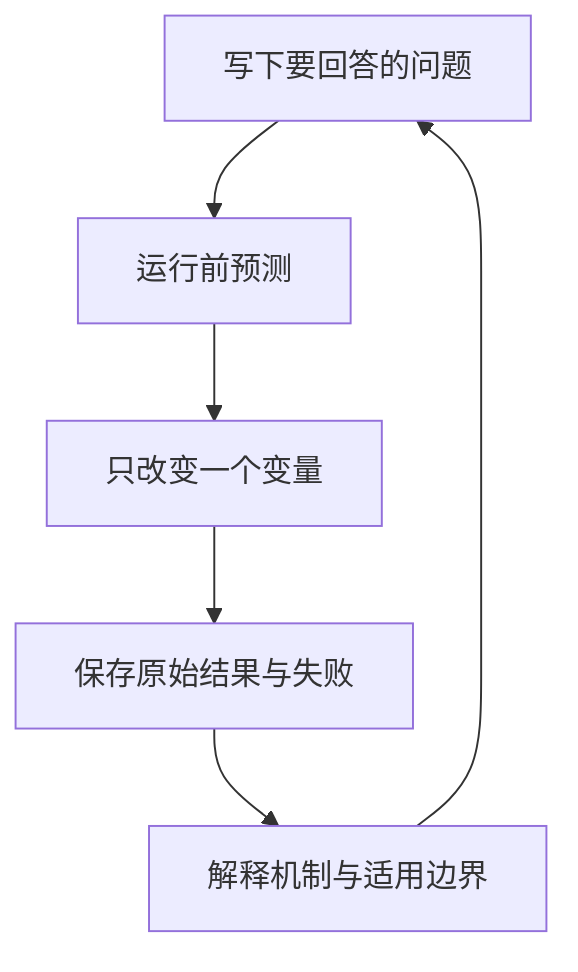

# 实验与项目

<!-- learning-contract -->

**学习导航**

- **适合读者**：希望把教材概念变成可运行观察，并逐步进入微调、RAG、Agent 或推理服务的开发者。
- **先修**：实验 0–2 只要求基本 Python；GPU、云 API 和模型下载都有本地或 CPU 前置实验。
- **首次阅读**：先找到与你当前目标对应的路线，再对每个实验执行“预测—运行—解释—写边界”。
- **完成信号**：能保存一次失败，并说明它来自公式、数据、模型、运行时还是实验设计。
- **卡住时**：把变量缩减到一个 CPU 样例，先手算预期结果，再查看程序输出。

实验不是命令清单，而是用观察修正理解的过程。每次都沿同一个循环进行：

对应项目目录会保存固定版本、完整参数和机器报告；本页只负责告诉你为什么做、先观察什么、完成后进入哪里。

**实践导航**：[选择学习路径](../guide/learning-paths.md) · [配置环境](../guide/environment.md) · [工程项目索引](project-index.md) · [生产检查表](production-checklist.md)
{ .doc-nav }

## 怎样选择实验

| 当前目标 | 从这里开始 | 预计时间 |
|---|---|---:|
| 第一次理解 loss、梯度与分类指标 | [机器学习最小闭环](../foundations/ml-dl.md#ml-minimal-loop) | 15–30 分钟 |
| 第一次观察生成模型 | [实验 0A](labs/lab-0a-sampling.md) | 30–60 分钟 |
| 理解 tokenizer 与注意力 | [实验 1](#lab-1)、[实验 2](#lab-2) | 2–4 小时 |
| 理解框架算子与 kernel 的边界 | [实验 2D](labs/lab-2d-operator-stack.md) | 1–2 小时 |
| 训练或微调模型 | [实验 3](#lab-3)、[实验 4A](labs/lab-4a-sft-sample.md) | 1–3 天 |
| 构建 RAG 或 Agent | [RAG 实验 5](labs/lab-5-rag-request.md)、[Agent 实验 6](labs/lab-6-agent-lifecycle.md) | 1–3 天 |
| 学习服务与评测 | [实验 7](#lab-7)、[实验 8](#lab-8) | 1–3 天 |

每次实验至少留下四样东西：运行配置、原始观察、一个失败样例和自己的解释。
模型下载、GPU 与网络路径可以稍后再做；CPU 基线先回答“逻辑是否正确”，目标设备再回答“实际资源与性能怎样”。

## 你正在学习 Qwen3 + nano-vLLM 时，从这里走

如果当前环境是 `Qwen3-0.6B + nano-vLLM + RTX 3070 Laptop`，不必先完成所有训练实验。
下面这条路线会把你已经能运行的模型，与教材概念逐步对齐：

| 顺序 | 实验 | 这一步把什么看清楚 |
|---:|---|---|
| 1 | [0A：从 logits 到采样](labs/lab-0a-sampling.md) | 最后一个 token 是怎样从概率分布中选出的 |
| 2 | [实验 1A：教学 Byte BPE](#lab-1) | bytes、token IDs、labels 和 loss 怎样接起来 |
| 3 | [实验 1B：真实 Qwen3 tokenizer](#lab-1b) | 同一句中文怎样经过 Qwen3 chat template 变成 29 个输入 ID |
| 4 | [实验 2](#lab-2) 与 [2B](#lab-2b) | attention、GQA、KV Cache 和停止协议怎样连接 |
| 5 | [7A：Paged KV 与 COW](labs/lab-7a-paged-kv.md) | 不加载 GPU 模型，先看 block 分配、共享和写时复制 |
| 6 | [7B：Qwen3 穿过 nano-vLLM](labs/lab-7b-nano-vllm-qwen3.md) | 固定长度输入怎样经过调度、prefill、decode 与 sampling |
| 7 | [实验 7：服务基准](#lab-7) | 在 3070 上测真实请求的显存、延迟、并发和失败终态 |

完成第 6 步时，你已经走通一条推理系统主线。实验 3–4 负责“模型怎样训练与微调”，
实验 5–6 负责“模型怎样进入 RAG 与 Agent”；它们可以按你的下一个目标插入，而不是作为 nano-vLLM 的前置条件。

## 实验 0：观察语言模型，而不是只和它聊天 { #lab-0 }

第一次只完成 0A。后续三个实验分别进入协议、云成本和工件安全，不是入门前置。

| 层级 | 实验 | 你要回答的问题 |
|---|---|---|
| 必做 | [0A：从 logits 到采样](labs/lab-0a-sampling.md) | temperature、top-k、top-p 怎样改变候选分布？ |
| 推荐 | [0B：生成、停止与流式协议](labs/lab-0b-generation-protocol.md) | EOS、长度上限、stop string 和断流如何形成终态？ |
| 工程选修 | [0C：云 API 预算、重试与对账](labs/lab-0c-cloud-budget.md) | 一次逻辑请求为什么可能产生多次调用和费用？ |
| 安全选修 | [0D：Opaque Reasoning 工件安全](labs/lab-0d-reasoning-artifact-security.md) | 哪些内部字段可以保存、重放或返回给用户？ |

交付物：一张手算表、一张状态图，以及至少一个“输出看似合理但协议已经失败”的例子。

## 实验 1：从教学 tokenizer 走到真实 Qwen3 输入 { #lab-1 }

### 1A：先用小实现看清计算

先运行仓库能够实际执行的三条命令：

~~~powershell
python projects/transformers-basics/train_byte_bpe.py `
  --text "你好🙂你好🙂" --sample "你好🙂!" --vocab-size 280
python projects/transformers-basics/trace_language_model_sample.py
python projects/transformers-basics/trace_minigpt_training_step.py
~~~

它们使用同一个 `你好🙂!` 样本，依次回答：

1. 在小语料上手算一次 pair count、tie-break 和非重叠 merge。
2. 比较字符、UTF-8 byte 与 grapheme；验证 encode/decode round trip。
3. 检查 `[BOS, text, EOS, PAD]` 怎样错开成模型输入、labels 和 loss mask。
4. 让同一组 labels 进入 MiniGPT，观察 logits、逐位置 NLL、梯度和一次 SGD 更新。
5. 修改一条输入，先预测 merge、有效预测位置和 loss 会怎样变化，再重新运行。

交付物：分词表、序列长度与掩码对照、一次参数更新账本，以及一个边界样例。能够编码后再还原原文，只说明这个
教学 tokenizer 内部自洽。它的合并规则、特殊 token 和 ID 都不属于 Qwen3。

### 1B：再看同一句中文怎样进入 Qwen3 { #lab-1b }

下面的脚本使用 Qwen3-0.6B 自己的 tokenizer 和 chat template，但不加载模型权重，也不需要 GPU：

~~~powershell
python projects/transformers-basics/trace_qwen3_tokenizer.py --local-files-only
~~~

`--local-files-only` 要求固定版本已经在 Hugging Face 缓存中。如果你的模型保存在单独目录，改用：

~~~powershell
python projects/transformers-basics/trace_qwen3_tokenizer.py `
  --model-snapshot C:\path\to\Qwen3-0.6B
~~~

第一次还没有缓存时，去掉 `--local-files-only`；程序仍会请求完整 commit
`c1899de289a04d12100db370d81485cdf75e47ca`，不会自动跟随 `main`。

默认问题是“请用一句话解释：为什么生成下一个 token 时可以复用 KV Cache？”。固定版本会先把 `user`、
消息正文、`assistant` 起始标记和关闭的 thinking 区间排成完整提示词，再编码为 **29 个 token IDs**。
输出会把每个 ID、可读片段和词表 token 排在一张表里。

这里有两个值得亲眼确认的细节：

- 加载后的类名是 `Qwen2TokenizerFast`。这表示 Qwen3 继续复用了 Transformers 中兼容的 tokenizer 实现，
  不表示脚本偷偷换成了 Qwen2 模型或权重。
- `<think>` 与 `</think>` 是保留的 added tokens，但当前 tokenizer 没把它们列入 `all_special_ids`。
  “模板控制词”和“`skip_special_tokens` 会跳过的 special token”不是同一个概念。

交付物：原始 message、渲染后的完整提示词、29 个 token IDs，以及对“教学 Byte BPE”和“目标模型
tokenizer”差异的解释。下一步进入实验 7B 时，输入会换成固定生成的 768 个 ID，以便隔离调度和 KV block；
那不是这条真实聊天消息的运行结果。

## 实验 2：从零实现注意力 { #lab-2 }

只用张量基础算子实现单头 causal attention，然后扩展到多头：

1. 为 `Q/K/V/score/output` 标出形状。
2. 手算两个 token 的 score、mask、softmax 和输出。
3. 验证修改未来 token 不会改变过去位置输出。
4. 关闭 dropout，比较逐 token cache 与完整 causal forward。
5. 让序列长度翻倍，分别记录理论中间元素数和实际运行时间。

`projects/transformers-basics/online_softmax_demo.py` 会逐块打印当前最大值、归一化因子和值累加器，
帮助你看懂 online softmax 怎样保持数值稳定。它用 NumPy 核对代数关系，不运行 FlashAttention，
也不测 GPU 内存或性能。

### 实验 2A：MoE routing 与 capacity { #lab-2a }

先在纸上为少量 token 计算 top-k 路由，再逐个改变专家容量、溢出时丢弃或改派的规则，以及输出合并方式。
每次只回答一个问题：

1. router 怎样把连续分数变成离散专家编号？
2. 被选专家的概率怎样把梯度传回 router？
3. 专家容量不足时，哪些 token 的输出会改变？

进阶实验先用一个执行全部专家的参考实现，核对稀疏路径的前向与梯度。
两者对上后，再加入跨设备 token 分发。

画图时标出 token 属于哪台设备、专家位于哪里，以及哪次集合通信负责发送和返回。
同机 CPU/Gloo 只能核对控制流。NCCL 性能和真实 MoE checkpoint 需要目标硬件与模型实测。

### 实验 2B：配置与生成协议 { #lab-2b }

先用固定配置手算标准 GQA 的 KV Cache。然后分别制造三种情况：关键字段缺失、head 数无法整除、
attention 结构改为 MLA。目标是找出标准公式在哪一步失去适用条件。

容量算清后，再对照 tokenizer、模型配置和生成配置中的 BOS、EOS、PAD、长度上限与停止规则。

交付物：一张“配置可推导 / 必须实测 / 信息不足”的表。扩大 `max_position_embeddings` 不能证明有效长上下文。

### 实验 2C：真实 checkpoint 选修 { #lab-2c }

本地已有固定小模型 snapshot 时，可以比较四条路径：首次 prefill、使用缓存的 decode、
每步重算完整序列，以及 `generate()`。保存每一步 token 和 logits，确认这些路径何时应当一致。

另一个选修是只量化一层矩阵，再观察局部数值误差怎样传播到最终 logits。

交付物：模型 revision、tokenizer/template、输入 token IDs、数值容差和资源记录。单个 prompt、单层量化或 argmax 不变都不能证明整体质量、显存收益或加速。

### 实验 2D：从 RMSNorm 走到框架算子 { #lab-2d }

如果已经能手算 Transformer，却还分不清模型模块、框架算子和设备 kernel，进入
[实验 2D](labs/lab-2d-operator-stack.md)。实验先在 CPU 上追踪非连续布局、RMSNorm 数学和两层计算图，再提供
3070 Laptop 的 CUDA 观察入口。

完成后，你会用本次运行记录描述当前路径，并把尚未测试的数据类型、形状和性能单独列出。

## 实验 3：训练微型 GPT { #lab-3 }

在公开小语料训练一个可在本机完成的 decoder：

1. 固定 train/validation split、tokenizer 和上下文长度。
2. 记录参数量、训练 token、优化器、学习率和硬件。
3. 绘制 train/validation loss，不只保存最后一个数字。
4. 只改变层数、宽度或上下文中的一个变量。
5. 保存最差生成样例，并判断问题来自数据、优化还是解码。

选修 activation patching（激活替换）时，先固定一对正常/扰动输入、连续评价指标和 hook 位置。
再加入未来位置与随机来源作为负对照。单张热图或单个样本的高恢复率只能说明这次干预改变了输出，
不足以定位普遍意义上的“事实存储层”。

## 实验 4：LoRA 领域适配 { #lab-4 }

第一次做微调时，先完成[实验 4A：追踪一个 SFT 样本](labs/lab-4a-sft-sample.md)。
它在 CPU 上追踪同一条样本：渲染对话模板、右移标签、完成 LoRA 反向传播、只保存并重载 adapter，
最后与留出样本比较。

选择一个可以自动评价的任务，例如分类、结构抽取或受限 SQL。比较同一评测集上的 base + Prompt、RAG（若适用）和 LoRA；固定 template 与 decoding。

实验顺序：

1. 检查 train/validation/test 的来源隔离、重复和模板泄漏。
2. 打印最终 token IDs、assistant labels 与截断位置。
3. 核对可训练参数、冻结基座和 optimizer step。
4. 比较训练曲线与 held-out 行为，不用同 batch loss 代替质量。
5. 独立重载 adapter，并检查通用能力与安全回归。

交付物：数据说明、基线、曲线、失败分类、资源使用和发布边界。详细实现见 [Single-GPU Finetuning](projects/single-gpu-finetuning.md)。

### 训练系统选修 { #lab-4-systems }

以下题目用于理解训练正确性，不要求基础路线全部完成：

| 题目 | 核心问题 |
|---|---|
| MinHash/LSH | 候选召回率和 exact recheck 怎样共同决定去重质量？ |
| Continual replay | 新任务质量与旧任务遗忘如何形成 Pareto 权衡？ |
| Checkpoint resume | model、optimizer、scheduler、RNG 和 data cursor 缺一项会怎样？ |
| Token-weighted accumulation | 不同有效 token 数的 micro-batch 应怎样归一化？ |
| DDP 与 `no_sync` | world-size 因子、同步边界和 global token count 在哪里进入？ |
| AMP | 为什么必须先 unscale 再 clip，overflow 时哪些状态不得前进？ |
| DataLoader prefetch | emitted、consumed 和 optimizer-committed cursor 为什么不同？ |

每题都应有 full-batch 或 uninterrupted 正对照，以及故意遗漏一个状态的负对照。具体脚本和参数在项目页维护，本页不固定录制数字。

## 实验 5：可诊断的 RAG { #lab-5 }

先完成[独立实验页：追踪一次 RAG 问答](labs/lab-5-rag-request.md)。
请求 A 拥有可用证据，依次经过授权、BM25 召回、重排、上下文组装、逐字抽取和引用检查。
请求 B 能检索到相关文字，却缺少答案证据，因此必须拒答。

完成 walkthrough 后，再把固定小语料替换成自己的 corpus：

建立一个小而可人工审阅的语料库：

1. 为问题标注 answer-bearing chunk，而不只标文档主题。
2. 先做 BM25，再加入 dense、hybrid 或 reranker。
3. 在任何正文读取和打分前执行 tenant/ACL 授权。
4. 加入无答案、冲突、过期、注入文本和跨权限案例。
5. 分别报告 retrieval、context、answer、citation 与 system 指标。

错误必须归入“语料无答案、解析错、召回漏、排序错、上下文丢失、生成越界、引用错误”之一。只报端到端总分无法指导修复。

### 实验 5A：框架公平对照 { #lab-5a }

让本仓库实现、LangChain 和 LlamaIndex 使用同一份语料、问题、授权主体与候选数量。
运行前先写下每个主体允许看到哪些文档；运行后检查无权正文是否曾进入打分器、缓存或回调，
不能只比较最终返回的文档 ID。

交付物包括框架转换前后的统一请求与结果、排序差异，以及一个故意把 ACL 放到检索后的安全负例。
接口能够接通，只证明数据结构完成了转换；框架默认安全性和检索质量仍需分别验证。

### 实验 5B：服务与真实模型选修 { #lab-5b }

为 RAG API 增加 readiness、认证主体、schema、queue deadline 和后台工作取消。然后用一个固定小模型检查“有证据需引用、无证据需拒答”。保留第一次失败，不要调好 Prompt 后只展示成功版本。

交付物包括结构化终态、生成器调用次数、面向用户与审计的两种结果，以及失败样例。
本机回环 API 只验证本地请求路径；TLS、IAM 和远端网络仍需目标环境测试。
重放策略日志也只能说明规则会怎样判断，不能反推历史线上请求一定省掉了模型调用。

## 实验 6：安全的工具 Agent { #lab-6 }

先完成[独立实验页：追踪一次 Agent 退款](labs/lab-6-agent-lifecycle.md)。
同一笔退款会经历动作提议、严格参数解析、资源 ACL、人工审批和远端执行。

最关键的分支是：远端已经受理，本地响应却超时。实验会继续追踪 `pending` 状态、远端结果核验与恢复对账。
先用固定 Planner 看清这些控制状态，再换成模型或框架；不要一开始就把整条链路藏进一个 `invoke()`。

交付物：九阶段状态图、字段信任边界、授权负例、effect receipt、恢复时间线和证据边界。

### 实验 6A：MCP 与 A2A 互操作 { #lab-6a }

MCP 实验先使用进程内传输，再切换到 stdio，最后进入本机回环 HTTP。每次只改变传输层，观察消息内容是否保持一致。
A2A 实验再加入 Agent 发现、消息和任务状态。

每种协议都先画消息序列，并标出五个检查点：schema 校验、应用允许列表、传输、身份认证和业务授权。

交付物：请求/响应序列、生命周期错误、未知工具、取消和来源边界。官方 SDK + loopback 只能证明当前路径真实执行，不等于通过 conformance、TLS/OAuth、远程或跨厂商测试。

## 实验 7：量化与服务基准 { #lab-7 }

先完成[实验 7A：Paged KV 与 COW](labs/lab-7a-paged-kv.md)。它用一条父子序列追踪真实 CPU K/V tensor，
让你先看清 block 分配、共享与写时复制。

再完成[实验 7B：Qwen3 穿过 nano-vLLM](labs/lab-7b-nano-vllm-qwen3.md)。同样的概念会进入固定模型、
真实调度器和 GPU 运行时。理解抢占与量化的小例子后，再开始服务基准：

1. 固定模型、runtime、硬件和 prompt/output 长度分布。
2. 先验证单请求 token/usage/finish，再做 open-loop 多档负载。
3. 同时报告 success rate、queue、TTFT、TPOT、吞吐和资源。
4. 断开流式客户端，分别观察请求终止、底层停算和 KV 释放。
5. 比较 BF16/FP16、8-bit、4-bit 时联合检查质量与性能。

交付物包括：

- Paged KV 预测表与 nano-vLLM 逐步轨迹；
- 负载说明、原始终态和容量曲线；
- 至少一条故障记录。

CPU 小实验中的离散步骤和逻辑字节只用于解释控制流。GPU 性能与显存必须来自目标设备实测，
本地取消也不能代表远端供应商的停算或计费行为。详细入口见 [Inference Serving](projects/inference-serving.md)。

## 实验 8：评测与指标冲突 { #lab-8 }

构造少量能手算的反例，依次比较原文完全相等、规范化后相等和 token F1。
结构化任务再分别检查 JSON schema 与字段值，RAG 任务则检查引用位置与证据支持：

1. 大小写 ID、JSON 空格和数组顺序是否应该视为等价？
2. schema 合法但字段值错误时，哪个指标必须失败？
3. 引用 span 存在但不支持 claim 时，句法与语义评价如何分开？
4. 多次查看结果、挑 slice 或比较多模型时，显著性怎样失真？

再用独立 held-out 集评价自己的系统，报告逐例结果和错误 taxonomy。七个人工编写的 case 或一个较高分数
都不能代表通用能力；指标首先要匹配任务 construct。

## 综合项目验收

一个合格项目应让别人回答：问题是什么、非 LLM 基线是什么、数据从哪里来、系统怎样失败、评价分母是什么、权限在哪里执行、服务如何降级、成本多少、怎样回滚。

最终报告至少包含：

- 问题定义、数据说明和架构图；
- 可运行基线与复现实验配置；
- 逐例结果、错误分类和负例；
- 安全边界、SLO、成本与已知限制；
- 下一项最可能推翻当前结论的实验。

项目目录可保存机器报告和可复现命令，但学习结论应写成普通人能够审阅的短文，而不是一串 hash 或“所有测试通过”。
