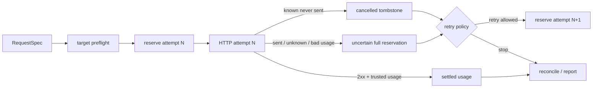

# Cloud API Contracts

**项目导航**：[返回项目索引](../project-index.md) · [云 API 契约](../../models/cloud-api-contracts.md) · [服务与流式协议](../../systems/serving.md) · [实验 0C](../labs/lab-0c-cloud-budget.md) · [实验 0D](../labs/lab-0d-reasoning-artifact-security.md)
{ .doc-nav }

## 目标

统一业务侧最小 `ChatMessage/ChatResponse`，同时显式保留 OpenAI-compatible、Anthropic Messages 与 Gemini `generateContent` 的 system、role、usage、finish 和 stream terminal 差异。把 target preflight、HTTP/SSE、重试、token/费用 reservation、outcome-uncertain 对账、opaque reasoning state 和轨迹发布分别建模；所有付费或联网行为必须显式 opt-in。

每个 retry attempt 必须拥有独立 reservation id；上一 attempt 必须在 sleep 或下一次发送前完成 terminal transition。远程 provider effect 与本地 SQLite commit 不能组成原子事务，所以 crash 后的 active reservation 默认继续占额度，等待 reconciliation。

## 三类 provider 契约 { #run }

~~~powershell
python -m about_llm.integrations.cloud_api_cli verify `
  --contracts projects/cloud-api-contracts/contracts.example.jsonl `
  --output artifacts/cloud-api/contracts.json
~~~

Fixture 使用 `.invalid` 域名与假密钥，不导入 HTTP client。成功只表示三类固定 request/response 的字段映射、strict JSON、脱敏和 text-only parser 正确：

- OpenAI-compatible：system 在 messages 中，解析 choices/message、usage 和 finish reason；
- Anthropic Messages：system 位于顶层，content blocks、usage 与 stop reason 独立；
- Gemini `generateContent`：`user/model` roles、parts、`systemInstruction` 与 `usageMetadata`。

截至教材记录日期，Gemini Interactions API 与 `generateContent` 是不同协议；不能把两者字段或流事件混用。DeepSeek/Qwen 的兼容端点也不等于其开放权重 checkpoint 或任意 OpenAI API 版本。

`RequestSpec` 复制 body/headers，拒绝 duplicate/大小写重复 header、`NaN/Infinity` 与非 JSON 值；认证 header 在 repr/report 中替换为 `<redacted>`。当前规范化响应只支持 text：tool-call-only、thinking、media 或无文本结果会失败，不会悄悄 stringify 或丢弃。

该命令不证明 DNS、TLS、认证、配额、区域、SDK 兼容、真实端点可用或当前 provider 行为。

## OpenAI Responses：typed event 不是 text chunk

Chat Completions 风格的 `messages → choices` 与 Responses 的 `response → output item → content part` 不是同一对象图。项目因此保留旧的多 provider text-only state machine，同时新增独立 reviewed replay：

~~~powershell
python projects/cloud-api-contracts/openai_responses_replay.py `
  --events projects/cloud-api-contracts/openai-responses-events.example.jsonl
~~~

固定结果：

| 证据 | 值 |
|---|---|
| 输入 | 3,208 bytes；`sha256:f2947212…5a54686` |
| 生命周期 | 15 events；2 output items；completed |
| 可见文本 | `天气：晴。` |
| 工具候选 | `lookup_weather({"city":"上海"})`；strict object=true |
| usage | 12 input + 9 output = 21 total |
| event projection | `sha256:9cc5964d…bd713e` |
| receipt | `sha256:c4829c19…42579` |

Reviewed subset 跟踪 `response.created/in_progress`，message 的 output-text/refusal content lifecycle，function-call arguments delta/done，以及 completed/incomplete/failed terminal。状态机同时核对 response identity、output/item/content index、delta/done/terminal output、usage 与 item 完成顺序；opaque reasoning/其他 item 不做语义投影。Function arguments 解析失败时仍保存原字符串，但必须是 `arguments_is_strict_object=false`，后续 runtime 不得执行。

严格 loader 对 duplicate key、non-finite number、invalid UTF-8、blank/truncated JSONL、未知/额外字段和资源超限 fail closed。连续 `sequence_number` 是本地 replay artifact 的更严格规则，不能外推成 SDK 重连或网络恢复保证。

这条命令只消费 authored SDK-shaped JSONL。它没有运行 OpenAI SDK、HTTP/SSE/WebSocket 或远程模型，不认证 provider/model/response id/usage，也不证明完整 Responses API、账单、质量、安全或生产可靠性。当前官方接口核对日期为 2026-08-14；更完整的 object graph、terminal 语义和生产 adapter 分层见 [GPT 家族](../../models/gpt.md)。

## Opaque reasoning artifact：内容加密不等于上下文绑定

~~~powershell
python -m about_llm.integrations.cloud_api_cli reasoning-replay-matrix `
  --output artifacts/cloud-api/reasoning-replay-matrix.json
~~~

本地 control 使用 AES-256-GCM、固定虚构 key/nonce/reasoning bytes 和内存 ledger，不输出 plaintext/ciphertext，也不解析任何 provider signature。16 个 case 先展示 content-only AEAD 仍会接受 cross-subject、cross-tenant、cross-session、cross-model 四类错误重放，再验证 context-bound envelope 对 identity、session、branch、predecessor、model、expiry、key、tamper 和 replay 分别 fail closed。

顶层 `passed: true` 表示观察符合预期；四个 `unsafe_acceptance_demonstrated: true` 是故意保留的弱协议反例，不是安全通过。真正的 associated data 至少要绑定 tenant/subject/session/branch/predecessor/model/policy/key/expiry，消费还要有持久 single-use ledger。

固定 key/nonce 与内存 ledger 不证明生产 nonce uniqueness、KMS/HSM、轮换/吊销、跨进程/多区域 replay protection 或 provider opaque format。Predecessor digest 也不是完整 fork/compaction/Merkle 协议。

## Trajectory publication allowlist

~~~powershell
python -m about_llm.integrations.cloud_api_cli trajectory-release-gate `
  --input projects/cloud-api-contracts/trajectory-release.example.json `
  --output artifacts/cloud-api/trajectory-release-report.json
~~~

发布 schema 只允许 `text/tool_call/tool_result/citation` block。Reasoning/thinking/signature/encrypted block、工具参数中的嵌套禁用字段、未知 block/field 都 fail closed。安全 projection 返回 0，有 finding 返回 1，输入 schema 无效返回 2。

报告不会回显任意输入值、未知类型或任意字段名，并固定 `provider_artifacts_interpreted: false`、`plaintext_values_emitted: false`。`secret_pii_scan_performed: false` 表示允许的 text 仍未做 secret/PII、版权、consent 或用途检查；这个 gate 不能直接接收 raw provider response 并宣称已完成 sanitizer。

## Retry policy：先判断能否重放

~~~powershell
python -m about_llm.integrations.cloud_api_cli retry-matrix `
  --output artifacts/cloud-api/retry-matrix.json
~~~

教学 allowlist 是 `408/429/500/502/503/504`，不是所有 4xx/5xx；`501/505` 不会仅因属于 5xx 自动重试。`max_attempts` 包含首次请求。Decision 同时考虑：

- HTTP/local error category；
- `replay_safe`；
- `outcome_uncertain`；
- 剩余 monotonic deadline；
- strict `Retry-After`；
- bounded exponential backoff 与 caller-injected jitter。

`Retry-After` 只接受非负整数 delta-seconds 或 HTTP-date，并区分 absent/valid/malformed。Valid header 覆盖本地 backoff，不额外加 jitter；等待超过 policy cap 或 deadline 就停止。Malformed header 才回退本地 policy。

只有 `replay_safe=true` 且 `outcome_uncertain=false` 才能自动重放。工具副作用、read/write timeout 后远端结果未知、或 caller 不知道能否安全重放时默认停止。即使纯生成没有业务副作用，重复请求仍可能重复生成和计费；不能假设 provider/endpoint 共享 idempotency-key 语义。

## JSON HTTP executor

`execute_json_request` 接收 caller-owned `httpx.AsyncClient`，执行以下边界：

- origin 必须 exact allowlist match；默认 HTTPS，禁止 query/userinfo/fragment；
- `follow_redirects=False`；
- 每 attempt timeout 与整体 monotonic deadline 分开；
- Pool/Connect 失败可视为确定未发送；write/read/protocol/整体 attempt timeout 保守视为 outcome uncertain；
- cancellation 原样传播，不转换成 retry；
- 2xx 必须是 object JSON，拒绝 duplicate key、non-finite、错误 Content-Type、顶层 array 和 acceptance cap 外 body；
- trace 只保留相对时间、status、稳定错误类别、request id 与 retry decision，不记录 body、credential 或 raw exception。

`max_response_bytes` 在当前非流式 `client.send` 已缓冲完整 body 后检查，只是 parser acceptance cap，不是下载过程的 ingress/memory 上限。真正限制接收内存必须使用 streaming、逐 chunk cap 并在超限时关闭 response。

## SSE framing 与三种状态机

`SSEDecoder` 接收任意 byte chunk，不假设一次 read 是一行、一个事件、一个 token 或一个 UTF-8 character。它处理 BOM、LF/CRLF/CR、comment、`event/data/id/retry`、多行 data 与跨 chunk 字符，并分别限制 line/event/total bytes。只有空行完成事件；EOF 残留半行或未终止 event 会失败。

`cloud_stream` 在 framing 上提供三种互不混用的 text-only state machine：

- OpenAI-compatible Chat Completions：content delta、usage、finish reason 与独立 `[DONE]`；
- Anthropic Messages：event/payload type、text block lifecycle、usage、stop reason 与 `message_stop`；
- Gemini `streamGenerateContent`：单 candidate、text part、usageMetadata、finishReason，并由 transport EOF 完成。

Tool/refusal/thinking/media/未知 block 会失败，不会被丢弃后伪装成完整文本。`StreamUpdate` 是 wire fragment/usage/finish/transport event；fragment/event 数都不是 token 数。

`execute_sse_request` 以 `stream=True` 发送，禁止 redirect，严格检查 `text/event-stream`，逐 chunk 解析并在成功、HTTP error、截断、超限、idle/overall timeout、protocol error 或 cancellation 时关闭 response。只有取得非 2xx headers 且尚未读取成功 body 时才可能重试；2xx stream 一旦开始，任何 partial failure 都终止且不自动重放。已经交付的 fragment 不能撤回或改标普通成功。

MockTransport/AsyncByteStream 只证明本地 close 与 partial-failure 控制流，不证明真实 TCP backpressure、HTTP/2、服务端收到取消、停止生成或停止计费。

## Token 与估算费用 reservation

`TokenPricingSnapshot` 必须由调用者人工核对并记录 `pricing_id/provider/model/revision/checked_at` 与 input/output micro-USD per million tokens。仓库不从品牌名猜价格，也不联网刷新。

`reserve_request` 从真实 `RequestSpec` 提取最大输出 cap，并与目标 tokenizer 给出的 input estimate 一起预留。Request fingerprint 绑定 billing scope、URL、完整 body 和规范化 headers；credential value 替换成占位符。Prompt/cap/URL/非敏感 header/billing scope 漂移都会改变 identity。

~~~powershell
python projects/cloud-api-contracts/usage_budget_toy.py
~~~

固定 authored pricing 为 input `$1/M`、output `$2/M`：60 input + 10 max output 预留 80 micro-USD；provider-reported 58+4 结算为 66。整数费用只对 input+output 合计向上取整一次。

只有能证明 transport 从未发送时才 `cancel_before_send`。已发送但 usage 缺失、outcome uncertain 或 parser 失败必须 `mark_usage_uncertain`，按完整 reservation 保守入账。Actual usage 超过估计并穿过 hard limit 时，ledger 先持久化已发生 usage，再抛 post-call breach；后续 reservation fail closed。

这些 micro-USD 是策略估值，不是发票。Tokenizer/template/hidden token、cache/reasoning/batch tier、最低计费单位、税费、额度与币种都可能让真实 billing 不同。

## SQLite quota 与崩溃恢复

每次 demo 使用新的数据库路径；脚本拒绝覆盖已有 reconciliation state：

~~~powershell
python projects/cloud-api-contracts/sqlite_usage_budget_demo.py `
  --database artifacts/cloud-api/durable-budget.sqlite
~~~

SQLite ledger 在 `BEGIN IMMEDIATE` 中验证 config、计算 snapshot、更新 reservation 并追加 event。同一数据库上的多进程 writer 不能同时花掉最后一份本地 capacity。Demo reserve 后用新 ledger instance reopen；active 80 micro-USD 仍占额度，随后以 usage uncertain 保守提交。

Active reservation 不按 TTL 自动释放：进程死亡或 timeout 不能证明请求未发送。运维必须结合 call id、attempt trace 与 provider usage/billing export 做 reconciliation；能证明 never sent 才 cancel，否则 mark uncertain。

SQLite 只提供单文件可达范围内的 durable atomic quota，不与 provider call 原子，也不是跨区域 distributed quota。Config/request SHA-256 没有密钥；数据库 ACL、加密、备份、签名审计和真实 billing 对账仍由部署层负责。

## 单 attempt 与逐 attempt budgeted HTTP

单-attempt reference：

~~~powershell
python projects/cloud-api-contracts/budgeted_http_demo.py `
  --database artifacts/cloud-api/budgeted-http.sqlite
~~~

Target preflight 在 reserve 前执行；非法 origin/HTTPS/query 不留下 active record。Terminal rules：

- 明确 Pool/Connect 且 trace 表示 never sent → cancelled；
- 任意 HTTP response → 已跨过“确定未发送”边界，当前 generic wrapper 保守 uncertain；
- 2xx + strict parser + 完整非负 usage → settled；
- 2xx malformed/missing usage、parser failure、task cancellation 或未知异常 → uncertain；
- post-call hard-limit breach 仍先持久化 actual usage。

Demo 的 58+4 成功 settled 66，随后一个带 request id 的 HTTP 500 uncertain 80，总 committed=146。它使用 MockTransport，不证明 HTTP 500 真实收费。

旧 wrapper 强制 `RetryPolicy(max_attempts=1)`。一次逻辑调用若内部 replay 多次却只 reserve 一次，会漏记前置 attempts 的潜在费用，因此逐 attempt orchestrator 必须创建 `logical-call:attempt:N`：

~~~powershell
python projects/cloud-api-contracts/budgeted_retry_demo.py `
  --database artifacts/cloud-api/budgeted-retry.sqlite
~~~

固定 HTTP 500→200 fixture：attempt 1 uncertain 80，attempt 2 settled 66，逻辑调用合计 146。Hard limit=140 时，attempt 1 入账后，attempt 2 的 80 reservation 在 transport 前被拒绝，所以只发生一次 MockTransport call。Connect→200 fixture 会 cancel 确定未发送的首 attempt；429 fixture证明底层 `Retry-After` delay 保留。

Orchestrator 复用底层 retry/deadline/replay/outcome 逻辑，不另写 delay policy。`before_attempt` reserve，`after_attempt` 必须在 sleep/next attempt 前 terminalize。下一次 reserve 若过不了 hard gate，网络不会发送；已成为 tombstone 的旧 id 不可复用。

这仍是 JSON-only reference，不自动重放 streaming partial output，也不解析 provider-specific error usage。`uncertain` 表示本地证据不足以证明零费用，不表示该 status 一定收费。Provider 执行后、SQLite terminal commit 前 crash 仍会留下 active reservation。

## 最小验证与故意破坏

完整项目测试：

~~~powershell
python -m pytest tests/test_cloud_api.py tests/test_cloud_api_cli.py tests/test_openai_responses_replay.py tests/test_reasoning_artifact.py tests/test_trajectory_release.py tests/test_cloud_api_retry.py tests/test_cloud_http.py tests/test_sse.py tests/test_cloud_stream.py tests/test_usage_budget.py tests/test_sqlite_usage_budget.py tests/test_budgeted_cloud.py -q
~~~

重点运行 fail-closed 路径：reasoning scope/tamper/replay、trajectory 禁用/未知 block、不安全或 uncertain request 禁止重放、2xx stream 截断/超限终止、cancel 后不得伪造零 usage、SQLite config/physical drift、逐 attempt hard gate 与 tombstone reopen：

~~~powershell
python -m pytest tests/test_reasoning_artifact.py::test_context_bound_envelope_rejects_scope_drift tests/test_reasoning_artifact.py::test_bound_claim_or_ciphertext_tampering_fails_authentication tests/test_trajectory_release.py::test_release_gate_rejects_forbidden_and_unknown_blocks_without_values -q
python -m pytest tests/test_cloud_api_retry.py::test_replay_and_uncertain_outcome_guards_fail_closed tests/test_cloud_http.py::test_stream_truncation_and_size_limit_are_terminal_and_close tests/test_cloud_http.py::test_cancellation_is_never_converted_to_retry -q
python -m pytest tests/test_budgeted_cloud.py::test_cancellation_after_reservation_never_fabricates_zero_usage tests/test_budgeted_cloud.py::test_retry_budget_gate_blocks_second_network_attempt tests/test_budgeted_cloud.py::test_retry_sqlite_attempt_tombstones_survive_reopen tests/test_sqlite_usage_budget.py::test_configuration_drift_and_physical_tamper_fail_closed -q
~~~

验收至少保存 provider/API/model revision、sanitized RequestSpec identity、attempt trace、replay/outcome decision、每 attempt reservation/tombstone、最终 local snapshot、provider request id/billing reconciliation 和一个故意失败案例。不要在 artifact、日志或异常中保存 API key、reasoning plaintext/ciphertext、raw provider body 或任意被拒绝输入值。

## 证据边界

当前项目证明 strict offline adapters、Responses typed-event authored replay、AES-GCM context-binding control、trajectory allowlist、provider-neutral retry、MockTransport JSON/SSE、内存/SQLite budget 和逐 attempt reconciliation 的本地行为。它没有执行真实 DNS/TLS/TCP、OpenAI SDK、模型调用或计费，不证明 provider 当前认证/错误/配额/idempotency/opaque-reasoning 格式、Responses 完整兼容、usage、invoice、取消完成或 endpoint 可用。Local response close 不证明 server 停算/停费；SQLite tombstone 不让 provider effect 与本地 commit 原子，也不提供 exactly-once billing。固定 key/nonce、无密钥 hash、内存 ledger 和 authored stream 不得外推为生产 key custody、持久 replay protection、真实 provider 安全或跨区域一致性。

完整实现与精确状态账本见 [projects/cloud-api-contracts](https://github.com/NightLemon/about-llm/tree/main/projects/cloud-api-contracts)。
