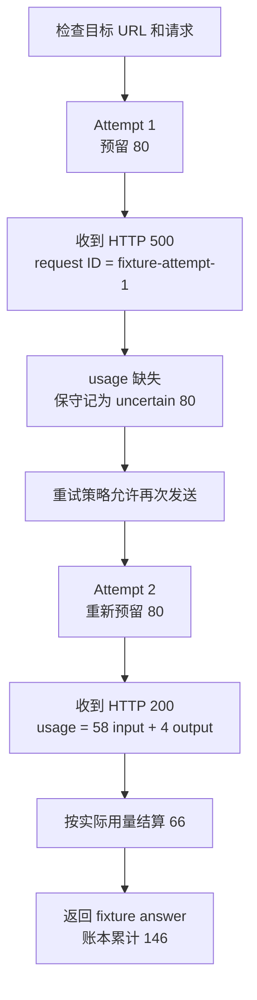

# Cloud API Contracts：失败以后，能不能再试一次？

**项目导航**：[项目索引](../project-index.md) · [云 API 契约](../../models/cloud-api-contracts.md) ·
[服务请求生命周期](../../systems/serving.md) · [实验 0C](../labs/lab-0c-cloud-budget.md) ·
[实验 0D](../labs/lab-0d-reasoning-artifact-security.md)
{ .doc-nav }

假设应用调用云模型生成客服回复。第一次请求得到 HTTP 500，重试后第二次成功。用户最终只看到一条回答，但系统需要回答：

- 第一次请求是否已经消耗 token 或产生费用？
- 为什么第二次发送前还要重新预留预算？
- 如果第一次不是 500，而是已经交付半段 SSE 后断线，还能照样重试吗？

这个项目用本地固定响应、`httpx.MockTransport` 和 SQLite 重现这些边界。默认命令不会访问真实 Provider；联网和产生费用
必须由调用者另外启用。

## 先跟完一次有重试的调用 { #run }

每次运行使用一个新的数据库文件：

```powershell
python projects/cloud-api-contracts/budgeted_retry_demo.py `
  --database artifacts/cloud-api/first-budgeted-retry.sqlite
```

脚本模拟一次逻辑调用。输入估算为 60 tokens，请求最多生成 10 tokens，每次发送前最多预留 80 micro-USD。



输出中最值得对照的是：

| 记录 | Attempt 1 | Attempt 2 |
|---|---:|---:|
| Reservation ID | `logical-call:attempt:1` | `logical-call:attempt:2` |
| HTTP 状态 | 500 | 200 |
| 是否允许继续 | 是，`retryable_status` | 已成功，无需重试 |
| 账本终态 | `uncertain` | `settled` |
| 本地估算费用 | 80 | 66 |

因此最终账本累计为 `80 + 66 = 146` micro-USD。第一次返回的是可重试状态码，同时缺少完整 usage。Provider 的最终
计费尚未确定，账本便保守保留 80 的最大估值。

这揭示了三个不同问题：

| 决策 | 它在问什么 |
|---|---|
| API 结果 | 这次请求是否得到完整、可用的响应？ |
| Retry policy | 在当前 deadline、次数和重放语义下，能否再发送一次？ |
| Budget reconciliation | 上一次发送最终消耗了多少 token 和费用？ |

HTTP 500 可以允许重试，同时让费用保持 `uncertain`。这两个状态并不矛盾。

## 一次逻辑调用为什么包含多个 attempt

“用户点了一次发送”是逻辑调用；每次真正经过网络的请求是一个 attempt。两者不能共用一条费用记录：

```text
logical call
├── attempt 1: reserve → send → 500 → uncertain
└── attempt 2: reserve → send → 200 → settle
```

Attempt 1 必须先进入 `cancelled`、`settled` 或 `uncertain`，Attempt 2 才能占用新预算。否则，内部重试两次却只记一次
最大费用，会让预算门禁在最需要保护时失效。

进程如果在发送后、写入终态前崩溃，SQLite 中会留下 `active` reservation。它继续占额度，因为“进程已经退出”无法
证明请求没有到达 Provider。

## 发送以前，先固定请求身份

在占用预算之前，程序先检查目标地址和请求对象。`RequestSpec` 会复制调用方传入的 body 与 headers，随后创建稳定的
请求 fingerprint。这样，调用方稍后修改原字典，不会悄悄改变已经记录的请求。

边界检查包括：

- 目标 origin 必须精确匹配允许列表；
- 默认只允许 HTTPS，并关闭重定向；
- URL 不接受 query、userinfo 和 fragment；
- Header 名不能重复，credential 写入日志前替换为 `<redacted>`；
- JSON 不接受重复字段、`NaN`、`Infinity`、顶层数组和未知 Content-Type；
- 单次请求超时与整个逻辑调用的 deadline 分开记录。

非法目标会在 reservation 之前停止，因此不会留下占用预算的记录。

非流式 `max_response_bytes` 需要特别理解：当前实现先缓冲 body，再检查大小。它限制解析器接受的结果，却不是网络下载
过程的内存上限。真正的下载上限需要逐块读取、累计字节，并在超限时关闭响应。

## Provider adapter 统一什么，保留什么

先运行三种文本协议的本地映射：

```powershell
python -m about_llm.integrations.cloud_api_cli verify `
  --contracts projects/cloud-api-contracts/contracts.example.jsonl `
  --output artifacts/cloud-api/contracts.json
```

三个样例都问 “What is RAG?”；域名使用 `.invalid`，密钥也是虚构值。程序只把共同的文本对话语义映射成
`ChatMessage` 与 `ChatResponse`：

| 协议 | System 放在哪里 | 文本、用量和结束原因在哪里 |
|---|---|---|
| OpenAI-compatible Chat | `messages` | `choices/message`、usage、finish reason |
| Anthropic Messages | 顶层 `system` | content blocks、usage、stop reason |
| Gemini `generateContent` | `systemInstruction` | parts、`usageMetadata`、finish reason |

共同对象适合表达“文本回答是什么、用了多少 token、为何结束”，不应伪装所有协议都相同。工具调用、reasoning、媒体、
拒答或无文本结果需要各自的类型。只支持文本的 adapter 遇到这些对象时应明确失败。

同一品牌也可能拥有不同协议。例如 Gemini Interactions 与 `generateContent` 的请求和事件结构不能混用。
运行下面的固定 Interactions 回放：

```powershell
python projects/cloud-api-contracts/gemini_interactions_replay.py
```

这次“查询上海天气”的流以函数调用结束。输出会同时显示
`stream_terminal_event=interaction.completed` 和 `resource_status=requires_action`：流已经收尾，客户端却仍需
校验并执行工具。两段 `arguments_delta` 只有在 `step.stop` 后才组成完整 JSON，不能边接收边调用函数。完整过程见
[Gemini Interactions API](../../models/gemini-interactions.md)。

## 什么失败允许重试

运行九组固定决策：

```powershell
python -m about_llm.integrations.cloud_api_cli retry-matrix `
  --output artifacts/cloud-api/retry-matrix.json
```

Retry policy 同时考虑已观察到的错误、请求能否重放、结果是否未知、当前 attempt、剩余时间和 `Retry-After`：

| 已观察到的情况 | 默认处理 |
|---|---|
| Connect 或 pool failure，能证明尚未发送 | 在次数和 deadline 内重试 |
| 408、429、500、502、503、504，且请求可重放 | 按 `Retry-After` 或本地退避重试 |
| Write、read 或 protocol timeout | 结果可能已经发生，停止自动重放并对账 |
| 已向用户交付部分 SSE | 保留部分输出，停止自动重放 |
| 工具副作用或重放语义未知 | 停止自动重放 |
| Schema、认证或业务拒绝 | 修改请求，不重复原调用 |

允许列表不是“所有 4xx 和 5xx”。例如 400 与 501 在固定矩阵中都不重试；503 也会因为请求不可安全重放而停止。

`Retry-After` 只接受非负秒数或合法的 HTTP date。有效值优先于本地退避时间；如果等待会越过整体 deadline，本次逻辑
调用直接结束。退避和 jitter 的作用是控制重试节奏，不能把不安全的请求变成可重放请求。

## 半截 SSE 为什么比 HTTP 500 更难处理

一次网络 read 可能只包含半个 UTF-8 字符，也可能同时包含多个 SSE event。下面四种对象必须分开：

```text
网络 byte chunk ≠ SSE event ≠ 文本增量 ≠ 模型 token
```

`SSEDecoder` 可以跨任意字节边界恢复 UTF-8，并处理 BOM、CR/LF/CRLF、comment、`event/data/id/retry` 和多行 data。
只有空行结束事件；EOF 若留下半行或未完成事件，会返回明确错误。

在 framing 之上，三种 Provider stream 仍有不同的完成信号：

| 协议 | 需要跟踪的内容 |
|---|---|
| OpenAI-compatible Chat Completions | content delta、usage、finish reason、`[DONE]` |
| Anthropic Messages | message/content-block 生命周期、usage、`message_stop` |
| Gemini `streamGenerateContent` | 单 candidate text parts、`usageMetadata`、finish reason |
| Gemini Interactions | named event、step 生命周期、函数参数增量、resource status、`[DONE]` |

Tool、拒答、reasoning、媒体和未知 block 不会被删除后冒充纯文本回答。

一旦 2xx stream 已经向上层交付部分文字，自动重试可能让用户看到重复开头，也可能产生第二笔生成费用。客户端关闭连接
只证明本地资源已经释放，不能证明 Provider 停止 GPU 工作或计费。因此，这条路径进入 terminal failure 与费用对账。

## 预算为什么要先 reserve，再 settle

`TokenPricingSnapshot` 由调用者根据具体 Provider、模型和版本人工核对。仓库不会按品牌名猜价格，也不会联网刷新单价。

运行最小预算例子：

```powershell
python projects/cloud-api-contracts/usage_budget_toy.py
```

发送前，程序用目标 tokenizer 的输入估算和请求的最大输出上限预留费用。响应结束后按证据选择终态：

| 已经知道什么 | 账本怎样处理 |
|---|---|
| 能证明请求从未发送 | `cancel_before_send`，释放预留 |
| 返回完整、非负的 usage | 按实际用量 settle |
| 已发送但 usage 缺失 | `usage_uncertain`，保留最大估值 |
| 解析失败或取消，且已越过发送边界 | 保守记为 uncertain |
| Actual usage 超过 hard limit | 先记录已经发生的费用，再报告超限 |

示例中的 micro-USD 是本地策略估值，不是 Provider 发票。Reasoning tokens、cache 计价、最低计费单位、套餐、税费和
tokenizer 差异都可能改变真实账单。

## 重启以后，旧 reservation 仍要有去处

```powershell
python projects/cloud-api-contracts/sqlite_usage_budget_demo.py `
  --database artifacts/cloud-api/durable-budget.sqlite
```

SQLite 账本在一个事务中检查预算配置、创建 reservation 并追加事件。同一数据库上的并发 writer 不能同时花掉最后一份
本地额度。重新打开文件以后，未终结的 reservation 仍然存在。

TTL 只能说明记录已经很旧，不能证明 Provider 没有收到请求，因此程序不会按 TTL 自动释放预算。Operator 需要结合：

- 逻辑调用与 attempt ID；
- 本地请求 trace 和 Provider request ID；
- Provider usage 或 billing export；
- 业务系统实际状态。

对账后，记录才能进入 `cancelled`、`settled` 或 `uncertain`。SQLite 提供的是单文件范围内的本地原子性；跨区域配额以及
本地记录与远端请求之间的一致性，需要另外设计。

## OpenAI Responses 不能当成 Chat delta 解析

Responses API 的层次是 `response → output item → content part`，不同于 Chat Completions 的
`messages → choices`。运行本地事件回放：

```powershell
python projects/cloud-api-contracts/openai_responses_replay.py `
  --events projects/cloud-api-contracts/openai-responses-events.example.jsonl
```

状态机会分别跟踪响应、输出项、文字或拒答片段、函数参数增量、完成事件和 usage。函数参数解析失败时仍保留原字符串，
同时写入 `arguments_is_strict_object=false`；下游 Runtime 不得执行这份参数。

这是一段纯离线事件回放：输入是仓库准备的 SDK-shaped JSONL，执行对象是本地状态机。在线 Responses API 的事件版本、
网络行为和目标模型表现需要另行验证。

## 会话记录能保存，不等于可以公开

Provider 原始响应可能含 reasoning、signature 或客户端不理解的 block。两个离线程序分别检查使用和发布边界：

```powershell
python -m about_llm.integrations.cloud_api_cli reasoning-replay-matrix `
  --output artifacts/cloud-api/reasoning-replay-matrix.json

python -m about_llm.integrations.cloud_api_cli trajectory-release-gate `
  --input projects/cloud-api-contracts/trajectory-release.example.json `
  --output artifacts/cloud-api/trajectory-release-report.json
```

第一条命令说明：密文保持完整时，仍要核对用户、租户、会话、上一条消息、允许模型、有效期和消费状态。完整解释见
[看不见的 Reasoning Block](../../quality/reasoning-artifact-security.md)。

第二条命令只接受已经重新构造的发布对象。允许的 block 是 `text`、`tool_call`、`tool_result` 和 `citation`；reasoning、
signature、encrypted 和未知字段会使发布停止。

报告中的 `secret_pii_scan_performed: false` 提醒你：字段形状通过以后，可见文字仍需进行 secret、个人信息、版权、
用户同意和用途审查。这个 gate 不是原始 Provider 响应的自动脱敏器。

## 修改项目后怎样验证

```powershell
python -m pytest `
  tests/test_cloud_api.py `
  tests/test_gemini_interactions_replay.py `
  tests/test_cloud_api_cli.py `
  tests/test_openai_responses_replay.py `
  tests/test_reasoning_artifact.py `
  tests/test_trajectory_release.py `
  tests/test_cloud_api_retry.py `
  tests/test_cloud_http.py `
  tests/test_sse.py `
  tests/test_cloud_stream.py `
  tests/test_usage_budget.py `
  tests/test_sqlite_usage_budget.py `
  tests/test_budgeted_cloud.py -q
```

这些测试优先守住会改变结论的边界：

- 结果未知或已经交付部分输出的请求停止自动重放；
- 截断、超限和取消后的 stream 保持失败终态；
- 已发送请求缺少 usage 时不会被记成免费；
- 每个 attempt 拥有独立 reservation 和终态记录；
- 数据库配置漂移、重复字段和物理篡改会在继续处理前停止；
- reasoning 的错误上下文、篡改和第二次消费会被拒绝。

一次可审计运行至少保存：

- 具体 Provider、API 和模型版本；
- 脱敏的请求身份；
- 每次发送的 trace 与重试决定；
- 费用预留、Provider request ID 和账单对账结果。

普通日志应排除 API key、原始 reasoning 内容和被拒绝输入值。

## 这些离线实验还没有证明什么

| 已经实际运行 | 仍需在目标环境验证 |
|---|---|
| 三种固定文本协议的 adapter | 真实 SDK、端点和模型输出 |
| 固定 Interactions 函数调用事件回放 | 在线 request、工具执行、background 与 resume |
| `MockTransport` 的 JSON、SSE 与 retry | DNS、TLS、代理、连接池和取消传播 |
| SQLite 的逐 attempt 预算 | Provider usage、发票与跨区域配额 |
| 固定 Responses 事件回放 | 在线事件版本与长时间 stream |
| 本地 reasoning 与发布门禁 | 当前 Provider 的 opaque 格式和真实数据治理 |

完整代码和命令索引位于
[projects/cloud-api-contracts](https://github.com/NightLemon/about-llm/tree/main/projects/cloud-api-contracts)，固定结果与版本边界见
[Cloud API 证据页](../../evidence/cloud-api-controls.md)。
