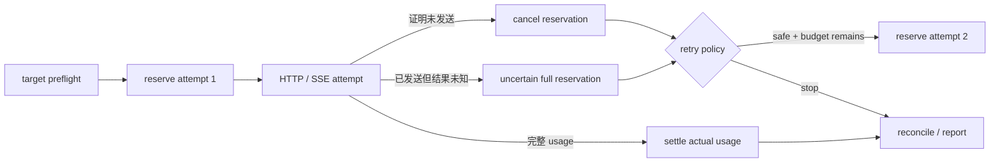

# Cloud API Contracts：一次请求怎样安全重试、计费和收尾

**项目导航**：[项目索引](../project-index.md) · [云 API 契约](../../models/cloud-api-contracts.md) ·
[服务请求生命周期](../../systems/serving.md) · [实验 0C](../labs/lab-0c-cloud-budget.md) ·
[实验 0D](../labs/lab-0d-reasoning-artifact-security.md)
{ .doc-nav }

假设应用调用云模型生成一段客服回复。SSE 已经返回半句话，连接突然中断。此时有三个不能靠猜的问题：

1. 用户到底收到了多少内容，响应能否算完成？
2. Provider 是否继续生成或计费？
3. 客户端能否自动重试，还是会产生第二次生成和第二笔费用？

这个项目不访问真实 Provider。它用 strict JSON、MockTransport、authored SSE 与 SQLite 把上述边界做成可运行控制。
所有联网或付费行为都必须由调用者显式 opt-in。

## 一次逻辑调用的状态账本



每个 attempt 有独立 reservation ID。Attempt 1 必须先变成 `cancelled`、`settled` 或 `uncertain`，才能 sleep
并开始 attempt 2。进程崩溃留下的 active reservation 默认继续占额度，因为崩溃不能证明请求没有发送。

## 第一步：统一业务对象，不抹平 Provider 差异 { #run }

```powershell
python -m about_llm.integrations.cloud_api_cli verify `
  --contracts projects/cloud-api-contracts/contracts.example.jsonl `
  --output artifacts/cloud-api/contracts.json
```

Fixture 使用 `.invalid` 域名与假密钥，不会导入 HTTP client。它把三种协议映射到业务侧最小
`ChatMessage/ChatResponse`：

| Provider family | System 与 role | Response/usage/terminal 的主要位置 |
|---|---|---|
| OpenAI-compatible Chat | System 在 `messages` | `choices/message`、usage、finish reason |
| Anthropic Messages | System 是顶层字段 | Content blocks、usage、stop reason |
| Gemini `generateContent` | `user/model` roles、`systemInstruction` | Parts、`usageMetadata`、finish reason |

统一对象只保留真正共享的业务语义。Tool-only、thinking、media 或无文本结果不会被悄悄 stringify；text-only adapter
会明确失败。Gemini Interactions 与 `generateContent` 也是不同协议，不能仅因品牌相同就混用字段。

`RequestSpec` 会复制 body/headers，拒绝 duplicate header、non-finite number 和非 JSON value，并在日志中将 credential
替换为 `<redacted>`。这个离线结果没有验证 DNS、TLS、认证、配额或真实 endpoint 行为。

## 第二步：先决定这次失败能否重放

```powershell
python -m about_llm.integrations.cloud_api_cli retry-matrix `
  --output artifacts/cloud-api/retry-matrix.json
```

Retry decision 同时使用：error category、`replay_safe`、`outcome_uncertain`、monotonic deadline、`Retry-After`、
bounded exponential backoff 和 jitter。

| 观察 | 默认处理 |
|---|---|
| Pool/connect 明确未发送 | 在 deadline 内可按策略重试 |
| 408/429/部分 5xx，且请求可重放 | 尊重 `Retry-After` 与 attempt cap |
| Write/read/protocol timeout | Outcome uncertain，先停止并对账 |
| 已交付 partial SSE | 不自动重放 |
| 工具副作用或未知重放语义 | 不自动重放 |
| Schema/认证/业务拒绝 | 修复请求，不做相同重试 |

教学 allowlist 是 `408/429/500/502/503/504`，不是“所有 4xx/5xx”。即使纯文本生成没有业务副作用，
重复请求仍可能重复生成与计费；Provider 是否支持 idempotency key 必须按具体接口确认。

`Retry-After` 只接受非负 delta-seconds 或合法 HTTP-date。有效 header 覆盖本地 delay；若等待会越过 deadline，
本次逻辑调用直接结束。

## 第三步：把 JSON HTTP 边界做窄

`execute_json_request` 接收 caller-owned `httpx.AsyncClient`，并执行这些约束：

- Origin 必须 exact allowlist match；默认 HTTPS，URL 不允许 query、userinfo 或 fragment；
- Redirect 默认关闭；attempt timeout 与 overall deadline 分开；
- 2xx body 必须是 object JSON；duplicate key、`NaN/Infinity`、错误 Content-Type 和顶层 array 都失败；
- Trace 只保存相对时间、status、稳定错误类别、request ID 与 retry decision；
- Cancellation 原样传播，不伪装成普通错误或 retry。

非流式 `max_response_bytes` 在 body 已缓冲后才检查，因此只是 parser acceptance cap，不是下载过程的内存上限。
真正限制 ingress 需要 streaming read、逐 chunk 计数并在超限时关闭 response。

## 第四步：SSE chunk、token 与完成事件是三回事

`SSEDecoder` 接收任意 byte chunks。一次网络 read 可能只有半个 UTF-8 character，也可能包含多个 SSE events；
它从不假设“一 chunk = 一 token”。

Decoder 处理 BOM、CR/LF/CRLF、comment、`event/data/id/retry`、多行 data 与资源上限。只有空行完成事件；
EOF 若留下半行或未终止 event，会明确报错。

`cloud_stream` 在 framing 之上分别实现：

- OpenAI-compatible Chat Completions 的 content delta、usage、finish reason 与 `[DONE]`；
- Anthropic message/content-block lifecycle、usage 与 `message_stop`；
- Gemini 单 candidate text parts、`usageMetadata` 与 finish reason。

Tool、refusal、thinking、media 或未知 block 会失败，不会被丢掉后把剩余文本冒充完整回答。

一旦 2xx stream 开始，partial failure 会关闭 response 并终止，不自动重放。客户端 close 只能证明本地资源释放，
不能证明服务器停止 GPU 工作或停止计费。

## 第五步：先 reserve 最大可能费用

`TokenPricingSnapshot` 由调用者人工核对，记录 provider/model/revision、checked-at 以及 input/output 单价。
仓库不会按品牌名猜价格，也不会联网刷新。

运行预算 toy：

```powershell
python projects/cloud-api-contracts/usage_budget_toy.py
```

一次 reservation 使用目标 tokenizer 的 input estimate 与请求中的最大 output cap。完成响应后：

| 结果 | Ledger 怎样记 |
|---|---|
| 能证明从未发送 | `cancel_before_send`，释放 reservation |
| 返回完整非负 usage | 按 actual usage settle |
| 已发送但 usage 缺失 | `usage_uncertain`，保守占满 reservation |
| Parser 失败或取消 | 若已越过发送边界，同样 uncertain |
| Actual 超过 hard limit | 先持久化已发生费用，再报告 post-call breach |

这些 micro-USD 是本地策略估值，不是发票。Hidden/reasoning tokens、cache tier、最低计费单位、税费和 tokenizer
差异都可能让账单不同。

## 第六步：让预算在重启后仍然存在

每次 demo 使用新数据库路径：

```powershell
python projects/cloud-api-contracts/sqlite_usage_budget_demo.py `
  --database artifacts/cloud-api/durable-budget.sqlite
```

SQLite ledger 在事务中验证 config、创建 reservation 并追加 event。同一文件上的并发 writer 不能同时花掉最后一份
本地 capacity。脚本 reopen 后，未终结 reservation 仍占额度，随后由 operator 标为 cancelled、settled 或 uncertain。

Reservation 不按 TTL 自动释放。TTL 只说明“本地记录旧了”，没有证明 Provider 没收到请求。对账要结合 call ID、
attempt trace、Provider usage/billing export 和 request ID。

SQLite 解决单文件可达范围内的 quota atomicity，不提供跨区域 distributed quota，也无法和远端请求组成原子事务。

## 第七步：每次 retry 都要单独占预算

先看单 attempt wrapper：

```powershell
python projects/cloud-api-contracts/budgeted_http_demo.py `
  --database artifacts/cloud-api/budgeted-http.sqlite
```

Target preflight 在 reservation 前运行，因此非法 origin/URL 不留下 active record。只要收到 HTTP response，generic
wrapper 就认为越过了“确定未发送”边界；2xx 且 parser/usage 完整时 settle，其余保守 uncertain。

再看逐 attempt retry：

```powershell
python projects/cloud-api-contracts/budgeted_retry_demo.py `
  --database artifacts/cloud-api/budgeted-retry.sqlite
```

逻辑调用为每次发送创建 `logical-call:attempt:N`。Attempt 1 必须 terminalize，Attempt 2 才能 reserve；若第二次
reservation 过不了 hard gate，网络不会发送。Connect failure 可以释放“确定未发送”的 attempt，而 HTTP 500
在通用 wrapper 中保守记 uncertain。

这套设计防止“内部重试两次、预算只记一次”。Provider 执行后、SQLite terminal commit 前 crash 仍可能留下 active
reservation，需要后续 reconciliation。

## OpenAI Responses：Event graph 不是 text delta

Responses API 使用 `response → output item → content part`，与 Chat Completions 的 `messages → choices` 不同。
运行 reviewed replay：

```powershell
python projects/cloud-api-contracts/openai_responses_replay.py `
  --events projects/cloud-api-contracts/openai-responses-events.example.jsonl
```

State machine 跟踪 response lifecycle、message text/refusal parts、function-call argument deltas、item completion、
terminal output 与 usage。Function arguments 即使 JSON 解析失败也会保留原字符串，但标记
`arguments_is_strict_object=false`，后续 Runtime 不得执行。

这条命令只消费 authored SDK-shaped JSONL；没有运行 OpenAI SDK、HTTP 或远程模型。精确 events、fingerprints 和
reviewed subset 见[项目控制台账](../../evidence/project-controls.md)。

## Opaque reasoning artifact：密文也要绑定上下文

```powershell
python -m about_llm.integrations.cloud_api_cli reasoning-replay-matrix `
  --output artifacts/cloud-api/reasoning-replay-matrix.json
```

本地 control 先故意演示 content-only AEAD：密文没有被修改，却可以被跨 subject、tenant、session 或 model 重放。
随后 context-bound envelope 把 tenant、subject、session、branch、predecessor、model、policy、key 和 expiry 放进
associated data，并用 single-use ledger 阻止 replay。

固定虚构 key/nonce 与内存 ledger 只用于教学。它没有验证生产 nonce uniqueness、KMS/HSM、轮换、跨进程 replay
protection 或任何 Provider 的 opaque format。

## 发布轨迹时只允许审过的 block

```powershell
python -m about_llm.integrations.cloud_api_cli trajectory-release-gate `
  --input projects/cloud-api-contracts/trajectory-release.example.json `
  --output artifacts/cloud-api/trajectory-release-report.json
```

发布 Schema 只允许 `text/tool_call/tool_result/citation`。Reasoning、thinking、signature、encrypted 或未知 block
fail closed；嵌套禁用字段也会被拒绝。

报告不回显被拒绝值，并明确记录 `secret_pii_scan_performed: false`。因此通过 allowlist 只说明 block shape 可发布，
不代表 text 已完成 secret/PII、版权、consent 或用途审查。

## 最小验证与故意破坏

完整项目回归：

```powershell
python -m pytest `
  tests/test_cloud_api.py `
  tests/test_cloud_api_cli.py `
  tests/test_openai_responses_replay.py `
  tests/test_reasoning_artifact.py `
  tests/test_trajectory_release.py `
  tests/test_cloud_api_retry.py `
  tests/test_cloud_http.py `
  tests/test_sse.py `
  tests/test_cloud_stream.py `
  tests/test_usage_budget.py `
  tests/test_sqlite_usage_budget.py `
  tests/test_budgeted_cloud.py -q
```

优先保留这些高风险负例：

- Reasoning scope/tamper/replay 被拒绝；
- Unsafe 或 outcome-uncertain request 不自动重放；
- 2xx SSE 截断、超限和取消保持 terminal failure；
- Cancel 后不伪造零 usage；
- 每个 attempt 都有 reservation/tombstone；
- SQLite config drift 与物理篡改 fail closed。

一次可审计运行至少保存 provider/API/model revision、脱敏 RequestSpec identity、attempt trace、retry/outcome decision、
每 attempt reservation、Provider request ID 和 billing reconciliation。API key、reasoning plaintext/ciphertext、
raw Provider body 与被拒绝输入值不进入普通 artifact 或异常日志。

本项目证明的是离线 adapter、typed-event replay、MockTransport JSON/SSE、AES-GCM context-binding control、
trajectory allowlist 和 SQLite budget 的本地行为。真实 DNS/TLS、SDK、模型、配额、取消传播、usage 与 invoice
仍需要目标 Provider 环境验证。

完整代码位于 [projects/cloud-api-contracts](https://github.com/NightLemon/about-llm/tree/main/projects/cloud-api-contracts)。
