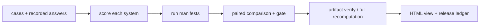

# Evaluation Gate：把“感觉更好”变成一次可复算的发布决定

**项目导航**：[项目索引](../project-index.md) · [评测总览](../../quality/evaluation.md) ·
[评测方法](../../quality/evaluation-methodology.md) · [评测测量学](../../quality/evaluation-measurement.md)
{ .doc-nav }

假设团队比较客服系统的 baseline 和 candidate。Candidate 在演示中回答得更流畅，但有两条中文退款 case 退化，
平均延迟也略高。现在要做的不是挑几条漂亮答案，而是给出一个别人能够重算的发布结论。

这个项目把一次决定拆成五层：



每一层回答不同问题：模型是否执行过、分数能否重算、统计比较是否一致、文件是否来自可信发布链，不能互相代替。

## 开始前先写一页评测协议

在看到 candidate 结果前固定：

- 决策：这个 gate 控制全量发布、canary 还是继续实验？
- 系统身份：base/model、Prompt、RAG index、tools 与 runtime revision；
- Case 与抽样单位：请求、用户、文档还是完整 task；
- Estimand：candidate − baseline 的哪个平均差；
- 主指标与方向：越高越好还是越低越好；
- Minimum meaningful effect 与 non-inferiority 边界；
- Protected slices、安全/故障上限与缺失分母；
- 最大样本量、bootstrap seed，以及是否允许中途查看。

这些定义若在看到结果后变化，p-value、区间和发布结论就不再对应原来的问题。

## 端到端主线 { #run }

### 第 1 步：给两套 recorded answers 打分

从仓库根目录运行：

```powershell
New-Item -ItemType Directory -Force artifacts/evaluation | Out-Null

python -m about_llm.evaluation.cli score `
  --cases projects/evaluation-gate/cases.example.jsonl `
  --answers projects/evaluation-gate/answers.baseline.example.jsonl `
  --results artifacts/evaluation/baseline.results.jsonl `
  --report artifacts/evaluation/baseline.report.md `
  --manifest artifacts/evaluation/baseline.run-manifest.json `
  --system-id deployed-baseline@exact-revision

python -m about_llm.evaluation.cli score `
  --cases projects/evaluation-gate/cases.example.jsonl `
  --answers projects/evaluation-gate/answers.candidate.example.jsonl `
  --results artifacts/evaluation/candidate.results.jsonl `
  --report artifacts/evaluation/candidate.report.md `
  --manifest artifacts/evaluation/candidate.run-manifest.json `
  --system-id deployed-candidate@exact-revision
```

CLI 不调用模型或付费 API。它消费已保存输出，并把有序 case、answers、逐例 results、metric/scorer revision 与
`system_id` 绑定到 run manifest。`system_id` 是调用者提供的标签，不是模型来源认证。

默认的 normalized exact match 会折叠部分大小写、标点和空白差异，token F1 又会忽略一部分结构。
需要逐字复制时加 `--metric literal_exact_match`；需要 JSON 正确时使用 JSON parser/schema/value metric，
不要从三个分数中事后挑最高的叫“准确率”。

先打开两侧 `results.jsonl`，找出同一个 `case_id` 上的改善与退化。总体均值只是一层汇总，不能代替逐例调查。

### 第 2 步：做 paired comparison

```powershell
python -m about_llm.evaluation.cli compare `
  --cases projects/evaluation-gate/cases.example.jsonl `
  --baseline-results artifacts/evaluation/baseline.results.jsonl `
  --candidate-results artifacts/evaluation/candidate.results.jsonl `
  --baseline-manifest artifacts/evaluation/baseline.run-manifest.json `
  --candidate-manifest artifacts/evaluation/candidate.run-manifest.json `
  --quality-metric exact_match `
  --minimum-quality-difference 0 `
  --maximum-latency-increase 0.10 `
  --protected-slice zh `
  --maximum-slice-regression 0 `
  --bootstrap-samples 10000 `
  --seed 7 `
  --output artifacts/evaluation/gate.json
```

同一 case 上的两个结果组成一对，比较的是逐 case difference。输出 `comparison.v2` 保存 resampling unit、
bootstrap 参数、阈值、slice、manifest identity、统计结果和每个失败原因。

进程退出码也属于接口：

| Exit code | 含义 |
|---:|---|
| 0 | Gate 通过 |
| 1 | 评测有效，但 candidate 未满足门槛 |
| 2 | Schema、证据或运行错误，无法作发布判断 |

CI 不能把 1 和 2 合并。前者是在有效评测下拒绝发布，后者表示评测本身坏了。

### 第 3 步：先验 comparison，再重算证据图

只检查 comparison 自身：

```powershell
python -m about_llm.evaluation.cli verify-comparison `
  --input artifacts/evaluation/gate.json
```

它会严格检查 Schema、内部算术、gate 判定和 fingerprint，包括未知字段与非法数值；但不会重开
cases/results，也不会重跑 bootstrap。
回执会明确写 `verification_scope: artifact_only`。

需要确认上游文件与当前实现仍能产生同一结论时，运行：

```powershell
python -m about_llm.evaluation.cli verify-evidence `
  --cases projects/evaluation-gate/cases.example.jsonl `
  --baseline-answers projects/evaluation-gate/answers.baseline.example.jsonl `
  --candidate-answers projects/evaluation-gate/answers.candidate.example.jsonl `
  --baseline-results artifacts/evaluation/baseline.results.jsonl `
  --candidate-results artifacts/evaluation/candidate.results.jsonl `
  --baseline-manifest artifacts/evaluation/baseline.run-manifest.json `
  --candidate-manifest artifacts/evaluation/candidate.run-manifest.json `
  --comparison artifacts/evaluation/gate.json
```

`verify-evidence` 重开输入、按 case 顺序重算 identity 和 scores，再按 comparison 中记录的配置重建最终工件。
成功范围是 `full_local_recomputation`。它仍不重新调用模型，也不认证 `system_id` 是否真实。

### 第 4 步：把 JSON 渲染成人看的报告

```powershell
python -m about_llm.evaluation.cli render-comparison-html `
  --input artifacts/evaluation/gate.json `
  --output artifacts/evaluation/comparison.html
```

HTML 是 deterministic、自包含的派生视图，适合 code review 或发布会议。Canonical decision 仍是 JSON comparison；
页面颜色、四舍五入值和截图都不能反向替代 verifier。

### 第 5 步：故意改坏一份证据

一个可靠的 gate 必须能发现自洽但错误的工件。至少运行一组负例：

```powershell
python -m pytest `
  tests/test_evaluation_cli.py::test_verify_evidence_rejects_recorded_answer_drift `
  tests/test_evaluation_cli.py::test_verify_evidence_rejects_self_consistent_manifest_with_wrong_scores `
  tests/test_evaluation_comparison_artifact.py::test_gate_threshold_tampering_invalidates_existing_fingerprint -q
```

这三条分别修改 recorded answer、伪造自洽分数和篡改 gate threshold。它们能被拒绝，比只跑 happy path 更能说明
证据图真正绑定了什么。

## Structured output：格式通过后还要检查值

运行固定 JSON 反例：

```powershell
python -m about_llm.evaluation.cli score `
  --cases projects/evaluation-gate/structured-metrics.cases.jsonl `
  --answers projects/evaluation-gate/structured-metrics.answers.jsonl `
  --results artifacts/evaluation/structured.results.jsonl `
  --report artifacts/evaluation/structured.report.md `
  --manifest artifacts/evaluation/structured.run-manifest.json `
  --system-id authored-structured-fixture@v1 `
  --metric literal_exact_match `
  --metric exact_match `
  --metric token_f1 `
  --metric json_schema `
  --metric json_value_exact
```

观察五种差别：Object key order/whitespace、错误 value、duplicate key、`NaN` 和 array order。

- `json_schema` 回答结构是否符合 closed contract；
- `json_value_exact` 比较拒绝重复字段和非法数值后得到的 canonical value；
- 两者都不验证数据库 ID、权限、事实或实时业务状态。

Parser 拒绝 duplicate key 与 `NaN/Infinity`。Object key 顺序和空白可忽略，array order 与 scalar type 仍保留。

## Citation span：指到文本不代表文本支持结论

```powershell
python -m about_llm.evaluation.cli score `
  --cases projects/evaluation-gate/citation-evidence-span.cases.jsonl `
  --answers projects/evaluation-gate/citation-evidence-span.answers.jsonl `
  --results artifacts/evaluation/citation-span.results.jsonl `
  --report artifacts/evaluation/citation-span.report.md `
  --manifest artifacts/evaluation/citation-span.run-manifest.json `
  --system-id authored-citation-span-fixture@v1 `
  --metric citation_evidence_span
```

Metric 检查 source membership、zero-based/end-exclusive offsets 与 exact quote。一个 claim 即使把 `Earth is round.`
中的 `Earth` 定位得完全正确，也可能错误地声称“The moon is cheese.”。

所以 span metric 证明的是 evidence identity，不是 entailment、claim correctness、source truth 或 ACL provenance。

## 固定 Qwen 运行：观察真实模型，不把七条样例当成总体

通用 CLI 只处理 recorded outputs。若本地已有固定 Qwen2.5-0.5B-Instruct snapshot，可以让模型实际运行七个 case：

```powershell
python projects/evaluation-gate/run_qwen_target_behavior_evaluation.py `
  --local-files-only

python projects/evaluation-gate/run_qwen_target_behavior_evaluation.py `
  --verify projects/evaluation-gate/target-qwen-behavior.recorded-report.json
```

它以 CPU FP32、batch 1、greedy 真实调用 `GenerationMixin.generate()`，保留 raw output、token identity 与
EOS/length terminal。固定 cases 包含中英文算术/事实、空证据拒答、大小写复制和 JSON，故意展示 literal exact、
normalized exact 与 token F1 会给出不同结论。

这七条 case 由本仓库编写，用来观察固定模型路径；它们不是代表性 benchmark，也没有 baseline/candidate、
统计功效、GPU/vLLM 或真实流量。
精确 snapshot/hash、逐例结果和证据等级保留在[项目控制台账](../../evidence/project-controls.md)。

## 先用反例确认自己测的是什么 { #measurement-control }

```powershell
python projects/evaluation-gate/measurement_toy.py
python -m pytest tests/test_evaluation_measurement.py -q
```

Toy 先给出一个反直觉例子：两位 rater 对四条样本完全一致，Cohen's κ=1，但相对外部 criterion 全部判断错误。
这说明 reliability 回答“是否稳定一致”，criterion validity 回答“是否接近外部标准”。

随后它为 fixed-horizon paired sign test 计算 exact rejection threshold、power 与所需 informative pairs。
要注意：informative pairs 是去掉 tie 后的数量，不是总 cases；MDE 是在固定 alpha、power 和模型下的设计分辨力，
也不是 minimum meaningful business effect。

在真实实验前填写[measurement plan](../../quality/evaluation-measurement.md#measurement-plan)，固定 construct、
operationalization、criterion、sampling unit、effect、power 与 missingness。

## 同一用户贡献多条 case 时

如果一个用户或文档贡献多行，case 不是独立抽样单位。把稳定 cluster ID 写入 metadata，并明确 estimand：

```powershell
python -m about_llm.evaluation.cli compare `
  --cases artifacts/evaluation/cases.jsonl `
  --baseline-results artifacts/evaluation/baseline.results.jsonl `
  --candidate-results artifacts/evaluation/candidate.results.jsonl `
  --baseline-manifest artifacts/evaluation/baseline.run-manifest.json `
  --candidate-manifest artifacts/evaluation/candidate.run-manifest.json `
  --quality-metric exact_match `
  --cluster-metadata-key user_id `
  --cluster-weighting case `
  --cluster-exact-max 6 `
  --bootstrap-samples 10000 `
  --seed 7 `
  --output artifacts/evaluation/cluster-gate.json
```

`case` weighting 估计随机请求的平均差；`equal` 先算每个 cluster mean，估计随机用户/文档的平均差。
它们是两个问题，不是看到哪个区间更好就选哪个。

以下小例子给出可以手算或完整枚举的参考结果，分别检查 cluster bootstrap、paired/cluster randomization、
Holm correction 和 sequential peeking：

```powershell
python projects/evaluation-gate/clustered_bootstrap_toy.py
python projects/evaluation-gate/paired_randomization_toy.py
python projects/evaluation-gate/clustered_randomization_toy.py
python projects/evaluation-gate/holm_correction_toy.py
python projects/evaluation-gate/sequential_peeking_toy.py
```

它们用于检查公式与假设，没有自动进入 comparison release decision。若生产门禁依赖这些方法，就把 hypothesis family、
look schedule、原始/调整后 p-value 和 effect threshold 写入版本化工件。

## 可选：Calibration 与选择性回答

```powershell
python -m about_llm.evaluation.cli calibrate `
  --input projects/evaluation-gate/calibration.example.jsonl `
  --bins 5 `
  --output artifacts/evaluation/calibration.json
```

输出包含 Brier score、equal-width ECE、非空 bins 和 risk-coverage curve。ECE 依赖分桶方案；模型自述的“90%
信心”也不会自动成为可校准概率。用于 abstention 时，同时报告 coverage、risk、样本数和关键 slice。

## 可选：认证 release history

```powershell
$env:PYTHONPATH = "src"
python projects/evaluation-gate/authenticated_release_ledger_toy.py
```

Ledger 用 HMAC-SHA256 绑定连续 sequence、artifact bytes、decision、key ID 与前一条 MAC。理解验证范围：

| 验证结果 | 能说明什么 |
|---|---|
| Authenticated chain | 相对 caller-supplied keys，链与顺序未被修改 |
| Rehashed artifacts | 当前引用 bytes 与 ledger identity 相同 |
| External trusted head matched | 能发现合法前缀截断或历史回滚 |

公开的样例 key 不是生产 secret。HMAC 也不提供公钥不可否认性、真实时间或 key custody；生产系统仍需 KMS/HSM、
轮换/吊销、可信时间与外部 immutable anchor。

## 最终验收

```powershell
python -m pytest `
  tests/test_evaluation_cli.py `
  tests/test_evaluation_comparison_artifact.py `
  tests/test_evaluation_comparison_html.py `
  tests/test_evaluation_release_ledger.py `
  tests/test_evaluation_measurement.py `
  tests/test_clustered_bootstrap.py `
  tests/test_paired_randomization.py `
  tests/test_clustered_randomization.py `
  tests/test_holm_correction.py `
  tests/test_sequential_peeking.py -q
```

一次可交付评测至少保存：

- 评测协议与完整命令；
- Cases、recorded answers、results 与两侧 manifests；
- Comparison JSON 和 machine-readable verifier receipt；
- 一个故意失败的 tamper test；
- 最终发布判断，以及不超过五行的证据边界。

本地重算可以发现 artifact 漂移和计算链不一致，HMAC/rehash/trusted head 可以提高文件链与历史回滚的可检测性。
它们都不证明样本代表真实流量、metric 具有 construct validity、模型当时真实执行、统计假设成立或上线会产生因果收益。

完整代码位于 [projects/evaluation-gate](https://github.com/NightLemon/about-llm/tree/main/projects/evaluation-gate)。
