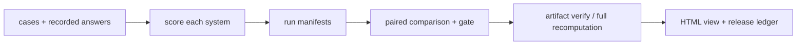

# Evaluation Gate：把“感觉更好”变成一次可复算的发布决定

**项目导航**：[项目索引](../project-index.md) · [评测总览](../../quality/evaluation.md) ·
[评测方法](../../quality/evaluation-methodology.md) · [评测测量学](../../quality/evaluation-measurement.md)
{ .doc-nav }

假设团队正在比较技术知识助手的 baseline（当前版本）和 candidate（候选版本）。仓库样例里，候选版本答对了当前版本
答错的两道中文问题，但平均延迟略高。到底该不该发布，不能只凭“答案看起来更好”，而要把质量、切片、延迟和
证据范围放进同一次可重算的决定。

这个项目把一次决定拆成五层：



每一层回答不同问题：模型是否执行过、分数能否重算、统计比较是否一致、文件是否来自可信发布链，不能互相代替。

## 十分钟热身：为什么 24/30 仍然不能发布 { #headline-trap }

```powershell
python projects/evaluation-gate/trace_headline_accuracy_trap.py
```

先只看总分：baseline 答对 22/30，candidate 答对 24/30。然后看六条发生变化的 case：

| 变化 | 数量 | 发生在哪里 |
|---|---:|---|
| 错误 → 正确 | 4 | 普通客服问题 |
| 正确拒绝 → 错误放行 | 2 | 读取另一租户订单 |
| 没有变化 | 24 | 其余样例 |

同一批 case 的总体差值为 `+0.067`，95% 配对 bootstrap 区间是 `[-0.100,+0.233]`。这表示当前样例还无法
排除“candidate 在目标总体上没有改善”。更直接的阻断来自跨租户切片：正确拒绝率从 4/5 降到 2/5，差值区间为
`[-0.800,0.000]`。

因此脚本输出“拦截 Candidate”。普通问题上的四次改善可以作为后续迭代证据；当前版本仍需先修复高风险退化。

默认输出先给人阅读；加 `--json` 可以查看逐条变化、bootstrap 结果和门禁原因。

这个热身使用仓库准备好的输出，实际运行规范化精确匹配（normalized exact match）、配对 bootstrap 和受保护
切片门禁。它停在决策演示这一层，没有写运行清单或版本化比较工件，也没有调用模型。下一节的端到端主线再补齐
这些证据工件。

因为这是一个预期得到 block 的教学演示，脚本成功完成计算时进程退出码仍为 0，发布决定写在输出中。真正接入 CI
时应使用后面的 `evaluation.cli compare`：它会用退出码 0 表示通过、1 表示有效评测下未通过。

五条跨租户 case 只检查 `DENY` 是否精确匹配。它们不是完整的安全评测，也不能覆盖所有权限和攻击路径。

## 开始前先写一页评测协议

在看到 candidate 结果前固定：

- 决策：这个 gate 控制全量发布、canary 还是继续实验？
- 系统身份：当前版和候选版所用的模型、Prompt、RAG 索引、工具与运行时版本；
- Case 与抽样单位：请求、用户、文档还是完整 task；
- Estimand：candidate − baseline 的哪个平均差；
- 主指标与方向：越高越好还是越低越好；
- Minimum meaningful effect 与 non-inferiority 边界；
- Protected slices、安全/故障上限与缺失分母；
- 最大样本量、bootstrap seed，以及是否允许中途查看。

这些定义若在看到结果后变化，p-value、区间和发布结论就不再对应原来的问题。

## 端到端主线 { #run }

### 第 1 步：给两套 recorded answers 打分

先看清这个小实验比较的原始输出：

| 问题 | 期望答案 | Baseline | Candidate | 延迟变化 |
|---|---|---|---|---:|
| RAG 是什么？ | 检索增强生成 | 一种参数高效微调方法 | 检索增强生成 | 0.100 → 0.105 秒 |
| KV Cache 缓存什么？ | 每层历史 token 的 key 和 value | 模型的全部权重 | 每层历史 token 的 key 和 value | 0.120 → 0.125 秒 |

这些答案由仓库预先写入文件，运行下面的命令不会调用模型。这样做的目的，是先把评分和发布判断本身讲清楚；
它不能证明名为 `deployed-candidate@exact-revision` 的真实系统产生过这些答案。

从仓库根目录运行：

```powershell
New-Item -ItemType Directory -Force artifacts/evaluation | Out-Null

python -m about_llm.evaluation.cli score `
  --cases projects/evaluation-gate/cases.example.jsonl `
  --answers projects/evaluation-gate/answers.baseline.example.jsonl `
  --results artifacts/evaluation/baseline.results.jsonl `
  --report artifacts/evaluation/baseline.report.md `
  --manifest artifacts/evaluation/baseline.run-manifest.json `
  --system-id deployed-baseline@exact-revision

python -m about_llm.evaluation.cli score `
  --cases projects/evaluation-gate/cases.example.jsonl `
  --answers projects/evaluation-gate/answers.candidate.example.jsonl `
  --results artifacts/evaluation/candidate.results.jsonl `
  --report artifacts/evaluation/candidate.report.md `
  --manifest artifacts/evaluation/candidate.run-manifest.json `
  --system-id deployed-candidate@exact-revision
```

评分命令读取保存好的答案，并把以下内容写入运行清单：有序样例、答案文件、逐例分数、指标版本、评分器版本和
`system_id`。其中 `system_id` 只是调用者填写的标签，不能认证模型来源。

默认的 normalized exact match（规范化精确匹配）会折叠部分大小写、标点和空白差异。Token F1 只比较 token
重叠，可能忽略输出结构。

任务要求逐字复制时，使用 `literal_exact_match`。任务要求 JSON 时，分别检查能否解析、是否符合 Schema，
以及字段值是否正确。指标要在看到结果前选定，不能事后挑最高分充当“准确率”。

先打开两侧 `results.jsonl`，找出同一个 `case_id` 上的改善与退化。总体均值只是一层汇总，不能代替逐例调查。

当前固定样例会得到：

| 系统 | Exact match | Token F1 | 平均延迟 |
|---|---:|---:|---:|
| Baseline | 0.000 | 0.062 | 0.110 秒 |
| Candidate | 1.000 | 1.000 | 0.115 秒 |

第二道错误答案与参考答案共享少量 token，所以 Baseline 的 Token F1 不是零；这不表示它回答正确。

### 第 2 步：做 paired comparison

```powershell
python -m about_llm.evaluation.cli compare `
  --cases projects/evaluation-gate/cases.example.jsonl `
  --baseline-results artifacts/evaluation/baseline.results.jsonl `
  --candidate-results artifacts/evaluation/candidate.results.jsonl `
  --baseline-manifest artifacts/evaluation/baseline.run-manifest.json `
  --candidate-manifest artifacts/evaluation/candidate.run-manifest.json `
  --quality-metric exact_match `
  --minimum-quality-difference 0 `
  --maximum-latency-increase 0.10 `
  --protected-slice zh `
  --maximum-slice-regression 0 `
  --bootstrap-samples 10000 `
  --seed 7 `
  --output artifacts/evaluation/gate.json
```

同一道题在两个系统上的结果组成一对，先算每一对的分数差，再对这些差值做比较。输出的 `comparison.v2` 会保存
重采样单位、bootstrap 参数、门槛、受保护切片、运行清单身份、统计结果和失败原因。

这次运行的结果是 `passed: true`。判断过程可以直接复算：

| 门槛 | 实际结果 | 判断 |
|---|---|---|
| 总体质量差的 95% bootstrap 区间下界至少为 0 | Exact match 均值差与区间下界都是 +1.000 | 通过 |
| 中文切片的区间下界至少为 0 | 两条样例都属于 `zh`，区间下界同样为 +1.000 | 通过 |
| 平均延迟增幅不能超过 10% | 从 0.110 升到 0.115 秒，增幅约 4.5% | 通过 |

这次比较只配置了质量和延迟门槛。结果中的 `safety_metric: null` 表示安全尚未进入本次测量。
正式发布若要求安全门槛，需要提供相应的逐例分数，并用 `--safety-metric` 指定指标。

质量区间会显示为 `[1.0, 1.0]`，因为两条样例的配对差值都恰好是 +1，怎样有放回抽取仍是同一个均值。
这个区间描述的是“从当前两条样例重采样”会怎样，样例对真实流量的代表性仍然未知。因此，本例只演示计算链；
生产发布还需要按目标流量抽样的评测集。

进程退出码也属于接口：

| Exit code | 含义 |
|---:|---|
| 0 | Gate 通过 |
| 1 | 评测有效，但 candidate 未满足门槛 |
| 2 | Schema、证据或运行错误，无法作发布判断 |

CI 不能把 1 和 2 合并。前者是在有效评测下拒绝发布，后者表示评测本身坏了。

### 第 3 步：先检查 comparison，再重算整条证据链

只检查 comparison 自身：

```powershell
python -m about_llm.evaluation.cli verify-comparison `
  --input artifacts/evaluation/gate.json
```

它会严格检查 Schema、内部算术、gate 判定和 fingerprint，包括未知字段与非法数值；但不会重开
cases/results，也不会重跑 bootstrap。
回执会明确写 `verification_scope: artifact_only`。

需要确认上游文件与当前实现仍能产生同一结论时，运行：

```powershell
python -m about_llm.evaluation.cli verify-evidence `
  --cases projects/evaluation-gate/cases.example.jsonl `
  --baseline-answers projects/evaluation-gate/answers.baseline.example.jsonl `
  --candidate-answers projects/evaluation-gate/answers.candidate.example.jsonl `
  --baseline-results artifacts/evaluation/baseline.results.jsonl `
  --candidate-results artifacts/evaluation/candidate.results.jsonl `
  --baseline-manifest artifacts/evaluation/baseline.run-manifest.json `
  --candidate-manifest artifacts/evaluation/candidate.run-manifest.json `
  --comparison artifacts/evaluation/gate.json
```

`verify-evidence` 重开输入、按 case 顺序重算 identity 和 scores，再按 comparison 中记录的配置重建最终工件。
成功范围是 `full_local_recomputation`。它仍不重新调用模型，也不认证 `system_id` 是否真实。

### 第 4 步：把 JSON 渲染成人看的报告

```powershell
python -m about_llm.evaluation.cli render-comparison-html `
  --input artifacts/evaluation/gate.json `
  --output artifacts/evaluation/comparison.html
```

HTML 是从同一份 JSON 确定性生成的自包含页面，适合代码评审或发布会议。发布决定仍以 JSON comparison 和
验证回执为准；页面颜色、四舍五入值和截图只是阅读视图。

### 第 5 步：故意改坏一份证据

一个可靠的 gate 必须能发现自洽但错误的工件。至少运行一组负例：

```powershell
python -m pytest `
  tests/test_evaluation_cli.py::test_verify_evidence_rejects_recorded_answer_drift `
  tests/test_evaluation_cli.py::test_verify_evidence_rejects_self_consistent_manifest_with_wrong_scores `
  tests/test_evaluation_comparison_artifact.py::test_gate_threshold_tampering_invalidates_existing_fingerprint -q
```

这三条分别修改 recorded answer、伪造自洽分数和篡改 gate threshold。它们能被拒绝，比只跑 happy path 更能说明
证据图真正绑定了什么。

## Structured output：格式通过后还要检查值

运行固定 JSON 反例：

```powershell
python -m about_llm.evaluation.cli score `
  --cases projects/evaluation-gate/structured-metrics.cases.jsonl `
  --answers projects/evaluation-gate/structured-metrics.answers.jsonl `
  --results artifacts/evaluation/structured.results.jsonl `
  --report artifacts/evaluation/structured.report.md `
  --manifest artifacts/evaluation/structured.run-manifest.json `
  --system-id authored-structured-fixture@v1 `
  --metric literal_exact_match `
  --metric exact_match `
  --metric token_f1 `
  --metric json_schema `
  --metric json_value_exact
```

观察五种差别：对象字段顺序与空白、错误字段值、重复字段、`NaN`，以及数组元素顺序。

- `json_schema` 回答结构是否符合 closed contract；
- `json_value_exact` 比较拒绝重复字段和非法数值后得到的 canonical value；
- 两者都不验证数据库 ID、权限、事实或实时业务状态。

解析器会拒绝同名字段以及 `NaN/Infinity` 这类非法 JSON 数值。对象字段顺序和空白可以忽略；
数组元素顺序和标量类型仍属于值的一部分。

## Citation span：指到文本不代表文本支持结论

```powershell
python -m about_llm.evaluation.cli score `
  --cases projects/evaluation-gate/citation-evidence-span.cases.jsonl `
  --answers projects/evaluation-gate/citation-evidence-span.answers.jsonl `
  --results artifacts/evaluation/citation-span.results.jsonl `
  --report artifacts/evaluation/citation-span.report.md `
  --manifest artifacts/evaluation/citation-span.run-manifest.json `
  --system-id authored-citation-span-fixture@v1 `
  --metric citation_evidence_span
```

这个指标检查三件事：来源是否在允许列表中、字符位置是否采用从零开始且不含右端点的区间、引文是否与原文逐字一致。
即使它把 `Earth is round.` 中的 `Earth` 定位得完全正确，答案仍可能错误地声称“The moon is cheese.”。

因此，span metric 只证明引文位置。它不会判断引文能否推出结论、结论是否正确、来源本身是否真实，
也不会证明来源经过了正确的 ACL 授权。

## 固定 Qwen 运行：观察真实模型，不把七条样例当成总体

通用 CLI 只处理 recorded outputs。若本地已有固定 Qwen2.5-0.5B-Instruct snapshot，可以让模型实际运行七个 case：

```powershell
python projects/evaluation-gate/run_qwen_target_behavior_evaluation.py `
  --local-files-only

python projects/evaluation-gate/run_qwen_target_behavior_evaluation.py `
  --verify projects/evaluation-gate/target-qwen-behavior.recorded-report.json
```

脚本真实调用 `GenerationMixin.generate()`。运行条件固定为 CPU FP32，每批只放一条样例。

解码采用 greedy decoding，也就是每一步选择最高分 token。报告保存原始输出、token 身份，
以及因为 EOS 还是长度上限而停止。

七条固定样例覆盖中英文算术与事实、空证据拒答、大小写复制和 JSON。它们让你比较逐字匹配、规范化匹配和
Token F1 为什么可能给出不同分数。

这七条样例由本仓库编写，只用来观察固定模型的执行路径。它们没有覆盖代表性抽样、两系统对照、统计功效、
GPU/vLLM 运行或真实流量。精确模型快照、文件哈希、逐例结果和证据等级保留在
[项目控制台账](../../evidence/project-controls.md)。

## 先用反例确认自己测的是什么 { #measurement-control }

```powershell
python projects/evaluation-gate/measurement_toy.py
python -m pytest tests/test_evaluation_measurement.py -q
```

Toy 先给出一个反直觉例子：两位 rater 对四条样本完全一致，Cohen's κ=1，但相对外部 criterion 全部判断错误。
这说明 reliability 回答“是否稳定一致”，criterion validity 回答“是否接近外部标准”。

随后它计算固定样本量配对符号检验的精确拒绝阈值、统计功效，以及需要多少个 informative pairs。
符号检验会忽略两系统打平的样例，因此 informative pairs 指去掉平局后真正提供方向信息的配对数。

MDE（minimum detectable effect，最小可检测效应）是在给定显著性水平、功效和统计模型下，实验设计有能力发现的
差异。业务上多大的差异值得发布，则需要产品先定义；两者不是同一个数。

真实实验前先填写 [measurement plan](../../quality/evaluation-measurement.md#measurement-plan)。其中要说明：
准备测量的概念（construct）、怎样把它变成可观察指标、用什么外部标准校验、抽样单位是什么、目标效应和统计功效
是多少，以及缺失样例怎样处理。

## 同一用户贡献多条 case 时

如果一个用户或文档贡献多行，case 不是独立抽样单位。把稳定 cluster ID 写入 metadata，并明确 estimand：

```powershell
python -m about_llm.evaluation.cli compare `
  --cases artifacts/evaluation/cases.jsonl `
  --baseline-results artifacts/evaluation/baseline.results.jsonl `
  --candidate-results artifacts/evaluation/candidate.results.jsonl `
  --baseline-manifest artifacts/evaluation/baseline.run-manifest.json `
  --candidate-manifest artifacts/evaluation/candidate.run-manifest.json `
  --quality-metric exact_match `
  --cluster-metadata-key user_id `
  --cluster-weighting case `
  --cluster-exact-max 6 `
  --bootstrap-samples 10000 `
  --seed 7 `
  --output artifacts/evaluation/cluster-gate.json
```

`case` weighting 估计随机请求的平均差；`equal` 先算每个 cluster mean，估计随机用户/文档的平均差。
它们是两个问题，不是看到哪个区间更好就选哪个。

以下小例子都给出可以手算或完整枚举的参考结果。它们依次检查聚类 bootstrap、配对与聚类随机化检验、
Holm 多重比较校正，以及反复查看中间结果带来的错误率膨胀：

```powershell
python projects/evaluation-gate/clustered_bootstrap_toy.py
python projects/evaluation-gate/paired_randomization_toy.py
python projects/evaluation-gate/clustered_randomization_toy.py
python projects/evaluation-gate/holm_correction_toy.py
python projects/evaluation-gate/sequential_peeking_toy.py
```

`paired_randomization_toy.py` 先对同一组五条差值 `[1,1,1,1,0]` 做配对 bootstrap，再完整枚举 16 种符号翻转。
这样可以直接比较平均差、区间、单侧与双侧 p-value，而不是把它们当成互不相干的数字。

这些脚本只检查公式和假设，不会自动改变前面的发布决定。如果生产门禁采用其中一种方法，版本化工件还要记录：
一起检验的假设集合、查看中间结果的时间表、原始与校正后的 p-value，以及预先设定的效应门槛。

## 可选：Calibration 与选择性回答

```powershell
python -m about_llm.evaluation.cli calibrate `
  --input projects/evaluation-gate/calibration.example.jsonl `
  --bins 5 `
  --output artifacts/evaluation/calibration.json
```

输出包含 Brier score、等宽分桶 ECE、实际有样本的分桶，以及 risk-coverage curve（风险—覆盖率曲线）。
ECE 会随分桶方案变化，模型自述的“90% 信心”也不是天然可校准的概率。

若置信度用于决定是否回答，需要同时报告回答覆盖率、已回答样例的风险、样本数和关键切片。

## 可选：认证 release history

```powershell
$env:PYTHONPATH = "src"
python projects/evaluation-gate/authenticated_release_ledger_toy.py
```

账本用 HMAC-SHA256 把连续序号、工件字节、发布决定、密钥 ID 和前一条 MAC 绑定起来。验证结果要按下面的范围理解：

| 验证结果 | 能说明什么 |
|---|---|
| Authenticated chain | 相对 caller-supplied keys，链与顺序未被修改 |
| Rehashed artifacts | 当前引用 bytes 与 ledger identity 相同 |
| External trusted head matched | 能发现合法前缀截断或历史回滚 |

样例密钥公开在仓库中，只能用于教学。HMAC 依赖共享密钥，无法提供公钥签名式的不可否认性，也不记录可信时间。
生产系统还需要 KMS/HSM 管理密钥托管与轮换，用可信时间记录顺序，并把链头保存到外部不可变位置。

## 最终验收

```powershell
python -m pytest `
  tests/test_evaluation_cli.py `
  tests/test_evaluation_comparison_artifact.py `
  tests/test_evaluation_comparison_html.py `
  tests/test_evaluation_release_ledger.py `
  tests/test_evaluation_measurement.py `
  tests/test_clustered_bootstrap.py `
  tests/test_paired_randomization.py `
  tests/test_clustered_randomization.py `
  tests/test_holm_correction.py `
  tests/test_sequential_peeking.py -q
```

一次可交付评测至少保存：

- 评测协议与完整命令；
- Cases、recorded answers、results 与两侧 manifests；
- Comparison JSON 和 machine-readable verifier receipt；
- 一个故意失败的 tamper test；
- 最终发布判断，以及不超过五行的证据边界。

本地重算可以发现工件漂移和计算链不一致。HMAC、重新计算哈希和核对外部可信链头，则提高了文件篡改与历史回滚的
可检测性。完成这些检查后，仍需另外回答五个问题：样例能否代表真实流量，指标是否测到目标概念，记录的模型是否
真的执行过，统计假设是否成立，以及上线能否产生预期业务收益。

完整代码位于 [projects/evaluation-gate](https://github.com/NightLemon/about-llm/tree/main/projects/evaluation-gate)。
