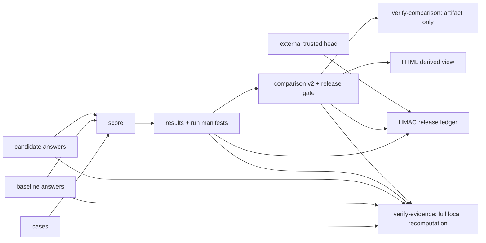

# Evaluation Gate

**项目导航**：[返回项目索引](../project-index.md) · [评测方法](../../quality/evaluation-methodology.md) · [最小验收路径 C](../project-index.md#acceptance-evaluation)
{ .doc-nav }

## 目标

把 case、recorded answer、score、run manifest、统计比较、发布门禁、HTML 报告与 release ledger 绑定成一张可复算证据图。模型执行、文件自洽、本地复算和工件认证是不同命题，不能用其中一层替代另一层。

开始前先写清楚：决策问题、candidate − baseline 的方向、最小有意义 effect、case 或 cluster 抽样单位、cluster weighting、protected slices、多指标 family、最大样本量和 look schedule。看到结果后再切换这些定义，会让置信区间、p-value 和发布结论失去原来的解释。

## 固定 Qwen：真实执行不等于代表性 Benchmark

本项目的通用 CLI 只消费 recorded answers。为了把这套工件纪律接到真实目标权重，仓库另提供一个严格隔离的七 case control：复用固定 Qwen2.5-0.5B-Instruct revision、7-file/999,586,347-byte snapshot 与 checkpoint manifest；加载前逐文件重哈希，再以 CPU FP32/eager、batch 1、greedy、`max_new_tokens=12` 逐条执行 `GenerationMixin.generate()`。

~~~powershell
python projects/evaluation-gate/run_qwen_target_behavior_evaluation.py `
  --local-files-only

python projects/evaluation-gate/run_qwen_target_behavior_evaluation.py `
  --verify projects/evaluation-gate/target-qwen-behavior.recorded-report.json
~~~

Suite fingerprint 是 `sha256:27ada9b1b16cebca8dd9135a5b875de11f412fc9a0f10c6acc462ff76b316201`，report fingerprint 是 `sha256:dd30a278cbc076c973c0b0babc9e752b1063d8bfb114c852b34ea42b2cd85c43`。逐例结果不 repair：

| Case | 目标 | Raw output | literal / normalized / F1 |
|---|---|---|---:|
| 中文算术 | `42` | `42` | 1 / 1 / 1 |
| 英文算术 | `42` | `112` | 0 / 0 / 0 |
| 中文事实 | `北京` | `北京` | 1 / 1 / 1 |
| 英文事实 | `Paris` | `Paris` | 1 / 1 / 1 |
| 空证据拒答 | `无法回答` | `无法回答` | 1 / 1 / 1 |
| 大小写复制 | `LLM-2026` | `llm-2026` | 0 / 1 / 1 |
| JSON | `{"answer":42}` | `{"answer": 42}` | 0 / 0 / 1 |

因此总体 literal exact=`4/7`、normalized exact=`5/7`、token F1=`6/7`。这组差异是指标语义的可执行反例：normalized exact 的 case-folding 会容忍大小写错误，token F1 会忽略 JSON 标点与空格结构。JSON 合规必须另做 parse/schema/semantic 检查；需要逐字复制时必须使用 literal decoded-string exact。原始响应 byte identity 是另一层证据，需要另存 bytes 后比较，不能与 decoded-string equality 混写，也不能从三个指标里挑最高值当“准确率”。

报告保存 raw output、prompt/continuation token identity、EOS/length terminal 和 slice 聚合，但刻意不保存 latency，避免把一次 CPU 小样本运行包装成性能基准。七条 case 由作者构造，不是外部预注册、独立抽样、held-out、代表性或有统计功效的 benchmark；没有 baseline/candidate、置信区间、judge/人工标注、真实用户分布、长上下文、安全红队、GPU/vLLM、RAG/tool/training。它只证明固定权重和固定路径执行，并暴露固定 case 的成功与失败，不证明总体质量、泛化、校准、生产安全、许可或来源认证。

## 从 score 到 comparison { #run }

从仓库根目录创建输出目录，并分别给 baseline 与 candidate 的已记录输出打分：

~~~powershell
New-Item -ItemType Directory -Force artifacts/evaluation | Out-Null

python -m about_llm.evaluation.cli score `
  --cases projects/evaluation-gate/cases.example.jsonl `
  --answers projects/evaluation-gate/answers.baseline.example.jsonl `
  --results artifacts/evaluation/baseline.results.jsonl `
  --report artifacts/evaluation/baseline.report.md `
  --manifest artifacts/evaluation/baseline.run-manifest.json `
  --system-id deployed-baseline@exact-revision

python -m about_llm.evaluation.cli score `
  --cases projects/evaluation-gate/cases.example.jsonl `
  --answers projects/evaluation-gate/answers.candidate.example.jsonl `
  --results artifacts/evaluation/candidate.results.jsonl `
  --report artifacts/evaluation/candidate.report.md `
  --manifest artifacts/evaluation/candidate.run-manifest.json `
  --system-id deployed-candidate@exact-revision
~~~

CLI 只处理 recorded outputs，不调用模型或付费 API。默认指标是 normalized exact match 与 token F1；大小写/标点/空格必须保真的任务应显式加 `--metric literal_exact_match`，也可再加 `--metric exact_match` 同时保存两种结论。Literal v1 比较 decoded string equality，不是原始 response byte identity。Run manifest 绑定 ordered case 的完整语义、recorded answers、ordered results、metric/scorer revision 和调用者提供的 `system_id`；`system_id` 是 label，不是模型来源认证。

### Structured output：schema 合法不等于值正确

运行五条固定反例：

~~~powershell
python -m about_llm.evaluation.cli score `
  --cases projects/evaluation-gate/structured-metrics.cases.jsonl `
  --answers projects/evaluation-gate/structured-metrics.answers.jsonl `
  --results artifacts/evaluation/structured.results.jsonl `
  --report artifacts/evaluation/structured.report.md `
  --manifest artifacts/evaluation/structured.run-manifest.json `
  --system-id authored-structured-fixture@v1 `
  --metric literal_exact_match `
  --metric exact_match `
  --metric token_f1 `
  --metric json_schema `
  --metric json_value_exact
~~~

| Case | literal | normalized | F1 | schema v2 | value v1 |
|---|---:|---:|---:|---:|---:|
| object key order/whitespace | 0 | 0 | 1 | 1 | 1 |
| wrong value | 0 | 0 | 0.5 | 1 | 0 |
| duplicate object key | 0 | 0 | 2/3 | 0 | 0 |
| `NaN` | 0 | 0 | 0.5 | 0 | 0 |
| reversed array order | 0 | 0 | 1 | 1 | 0 |

`about-llm.json-schema-metric.v2` 先 strict parse，拒绝 duplicate object key、`NaN/Infinity`；只允许 local `$ref/$dynamicRef`，拒绝 `$id` 与 external schema resolution。Invalid schema 是 case 配置错误；`format` 仍是 annotation，当前不启用 `FormatChecker`。`about-llm.json-value-exact.v1` 再比较 canonical parsed values：忽略 object key order/JSON whitespace，保留 array order、scalar type 与 parser 的 integer/float distinction。两项互不隐式调用，value exact 也不等于业务语义、权限或实时状态正确。

Answers 中的 `latency_seconds=0.0` 是 authored 非性能占位值。该 fixture 没有模型/provider、网络、用户抽样或发布比较，只证明固定 strict parser/scorer 的差异。

### Citation evidence span：定位正确不等于语义支持

再运行独立的 strict span fixture：

~~~powershell
python -m about_llm.evaluation.cli score `
  --cases projects/evaluation-gate/citation-evidence-span.cases.jsonl `
  --answers projects/evaluation-gate/citation-evidence-span.answers.jsonl `
  --results artifacts/evaluation/citation-span.results.jsonl `
  --report artifacts/evaluation/citation-span.report.md `
  --manifest artifacts/evaluation/citation-span.run-manifest.json `
  --system-id authored-citation-span-fixture@v1 `
  --metric citation_evidence_span
~~~

`about-llm.citation-evidence-span-metric.v1` 要求输出为 strict JSON `claims[]`，逐 claim 检查唯一 ID、非空 text 和至少一个 evidence；逐 evidence 检查 supplied `citation_sources` membership、零基/end-exclusive Python string offsets 与 exact quote。五例分数为 `[1,0,0,0,1]`：合法 Unicode span 通过，unknown source、offset/quote mismatch 与 duplicate key 失败；“The moon is cheese.” 绑定 `Earth is round.` 中的 exact `Earth` 仍通过。最后一例锁定了证据边界：它证明 span identity，不证明 entailment、claim correctness、source truth/currentness 或 ACL snapshot provenance。

Cases/answers 固定为 1,015/1,138 bytes，SHA-256 `ceb3ff9d…89e8` / `c61507ec…2661`。`latency_seconds=0.0` 仍只是 authored 占位；fixture 不调用模型、judge、权限服务或 provider。

随后对同一组 case 做 paired comparison，并把质量、延迟和 protected slice 阈值写入工件：

~~~powershell
python -m about_llm.evaluation.cli compare `
  --cases projects/evaluation-gate/cases.example.jsonl `
  --baseline-results artifacts/evaluation/baseline.results.jsonl `
  --candidate-results artifacts/evaluation/candidate.results.jsonl `
  --baseline-manifest artifacts/evaluation/baseline.run-manifest.json `
  --candidate-manifest artifacts/evaluation/candidate.run-manifest.json `
  --quality-metric exact_match `
  --minimum-quality-difference 0 `
  --maximum-latency-increase 0.10 `
  --protected-slice zh `
  --maximum-slice-regression 0 `
  --bootstrap-samples 10000 `
  --seed 7 `
  --output artifacts/evaluation/gate.json
~~~

输出是严格的 `about-llm.evaluation-comparison.v2`，不是可随手修改的报告。它绑定 resampling unit、bootstrap 参数、全部 gate/slice 阈值、两侧 manifest、metric revision、统计结果和全部失败原因。命令在门禁通过时返回 0、门禁失败时返回 1、schema 或证据错误时返回 2；CI 必须保留这一差异，不能把“候选退化”和“评测坏了”合并成同一种成功或失败。

如果使用安全指标，先确认该指标是否“越高越安全”，再同时传入 `--safety-metric` 与 `--maximum-safety-regression`。系统错误或缺失 metric 会阻断比较，不会被静默当成 0 分平均。

## 两种验证不是同一个命题

先严格重载 comparison 自身：

~~~powershell
python -m about_llm.evaluation.cli verify-comparison `
  --input artifacts/evaluation/gate.json
~~~

`verify-comparison` 拒绝 duplicate key、未知/缺失字段、`NaN/Infinity`、非法嵌套类型、内部算术或 gate 判定不一致、固定 evidence boundary 漂移和 fingerprint 不一致。成功回执明确写出 `verification_scope: artifact_only`、`referenced_manifests_revalidated: false` 和 `statistics_recomputed: false`：它没有重开 cases、results 或 manifests，也没有重跑 bootstrap。

需要重建完整本地证据图时运行：

~~~powershell
python -m about_llm.evaluation.cli verify-evidence `
  --cases projects/evaluation-gate/cases.example.jsonl `
  --baseline-answers projects/evaluation-gate/answers.baseline.example.jsonl `
  --candidate-answers projects/evaluation-gate/answers.candidate.example.jsonl `
  --baseline-results artifacts/evaluation/baseline.results.jsonl `
  --candidate-results artifacts/evaluation/candidate.results.jsonl `
  --baseline-manifest artifacts/evaluation/baseline.run-manifest.json `
  --candidate-manifest artifacts/evaluation/candidate.run-manifest.json `
  --comparison artifacts/evaluation/gate.json
~~~

它重开所有输入，按 case 顺序重算 answer/case identity，要求 manifest revision 与当前可执行 metric 实现精确一致，重新评分，再使用 comparison 中记录的 resampling 和 gate 配置重建最终工件。只有重建结果完全一致才返回 `verification_scope: full_local_recomputation`。

| 验证层 | 会做什么 | 明确不会做什么 |
|---|---|---|
| `verify-comparison` | 严格 schema、内部算术、判定、canonical fingerprint | 不重开引用工件，不重算分数或统计 |
| `verify-evidence` | 重开本地证据图、重新评分、重跑统计、重建 comparison | 不调用模型/provider，不认证 `system_id` 或文件来源 |
| HMAC release ledger | 相对 supplied keys 认证链，可选重哈希引用 bytes | 不证明 key custody、统计有效性或真实发生时间 |
| 外部 trusted head | 检测合法前缀截断或回滚 | 不证明模型执行、样本代表性或线上因果影响 |

## HTML 是派生视图

~~~powershell
python -m about_llm.evaluation.cli render-comparison-html `
  --input artifacts/evaluation/gate.json `
  --output artifacts/evaluation/comparison.html
~~~

Renderer 先严格加载 comparison，再生成 deterministic、自包含、无 JavaScript/外部资源的页面；动态文本经过 HTML escape，CSP 默认拒绝所有资源，只允许当前内联 CSS。回执范围是 `artifact_only_render`：页面没有调用 `verify-evidence`、验证 HMAC 或重算统计。HTML 可被覆盖，也不是 canonical decision identity；发布判断必须回到 JSON artifact 与 verifier，不能从页面颜色或四舍五入后的值反推。

## Cluster、随机化与多重检验

若同一用户、文档或会话贡献多条 case，不要把这些行默认当成独立样本。在 case metadata 中记录稳定的 cluster id，并显式选择 estimand：

~~~powershell
python -m about_llm.evaluation.cli compare `
  --cases artifacts/evaluation/cases.jsonl `
  --baseline-results artifacts/evaluation/baseline.results.jsonl `
  --candidate-results artifacts/evaluation/candidate.results.jsonl `
  --baseline-manifest artifacts/evaluation/baseline.run-manifest.json `
  --candidate-manifest artifacts/evaluation/candidate.run-manifest.json `
  --quality-metric exact_match `
  --cluster-metadata-key user_id `
  --cluster-weighting case `
  --cluster-exact-max 6 `
  --bootstrap-samples 10000 `
  --seed 7 `
  --output artifacts/evaluation/cluster-gate.json
~~~

`case` weighting 回答“随机请求”的平均差，每个重采样的分母随抽中的 cluster size 改变；`equal` 先求每个 cluster 的均值，回答“随机用户/文档”的平均差。二者是不同 estimand，不是看到结果后可切换的方差选项。运行以下透明 oracle，先手算固定反例：

~~~powershell
python projects/evaluation-gate/clustered_bootstrap_toy.py
python projects/evaluation-gate/paired_randomization_toy.py
python projects/evaluation-gate/clustered_randomization_toy.py
python projects/evaluation-gate/holm_correction_toy.py
python projects/evaluation-gate/sequential_peeking_toy.py
~~~

- Cluster bootstrap fixture 用 5 条 `+1` 与 1 条 `-1` 展示 case-weighted ratio 和 equal-cluster mean 的不同区间；exact enumeration 只验证重采样与 quantile 口径，不证明小样本 coverage。
- Paired randomization fixture 对非零 paired differences 做 sign flip；clustered 版本让同 cluster 的 case 联合翻转，避免把重复用户伪装成独立单位。它们都依赖相应 exchangeability 假设。
- Holm fixture 展示 stable sort、rank multiplier、running maximum 和映回输入顺序；它在原始 p-value 有效时控制预定义 family 的 FWER，不修复无效检验或事后挑 family。
- Sequential fixture 在固定 i.i.d. fair-sign null 下精确算出五次 naive 0.05 peeking 的总体假阳性约为 0.1010，预设 Bonferroni split fixture 约为 0.0152。它不是 confidence sequence，也不证明真实 case 独立、功效足够或候选系统改善。

这些 randomization、Holm 和 sequential controls 是独立的透明统计对照，当前不会自动写入 comparison release decision。生产系统若依赖它们，必须把 hypothesis family、look schedule、原始/调整后 p-value、effect threshold 和选择协议纳入版本化工件。

## 可选：校准与选择性回答

~~~powershell
python -m about_llm.evaluation.cli calibrate `
  --input projects/evaluation-gate/calibration.example.jsonl `
  --bins 5 `
  --output artifacts/evaluation/calibration.json
~~~

输出包含 Binary Brier score、equal-width ECE、非空 bin 和 tie-aware risk-coverage curve。样例是公式 fixture，不是某个模型的真实校准结果。ECE 依赖 bin 配置；模型自述“90% 信心”也不会自动成为可校准概率。用于 abstention 时要同时报告 coverage、risk、样本数与关键切片。

## 认证发布链

运行固定三记录、末条 key rotation 的离线 control：

~~~powershell
$env:PYTHONPATH = "src"
python projects/evaluation-gate/authenticated_release_ledger_toy.py
~~~

`release-ledger.example.json` 用 domain-separated HMAC-SHA256 绑定连续 sequence、唯一 release/artifact id、原始 artifact byte size/SHA-256、decision、调用者给出的 RFC 3339 `recorded_at`、`key_id` 和前一条 MAC。公开 fixture key 只是测试值，不是生产 secret。

验证结果必须分三层解释：

1. `authenticated_chain=true`：只表示相对 caller-supplied HMAC keys，链和顺序通过认证；
2. `referenced_artifacts_rehashed=true`：还传入了 artifact id 完全匹配的 path mapping，并重新读取当前 bytes；
3. `trusted_head_matched=true`：还从 ledger 外提供并匹配了预期 `(sequence, record_mac)`，因而能发现合法前缀截断。

HMAC 是共享密钥认证，不提供公钥不可否认性；被 MAC 的 timestamp 不是真实时间证明。Exclusive-create 与 file `fsync` 也不等于 parent-directory durability、目录级原子发布或 verify 后无 TOCTOU。生产系统仍需 KMS/HSM、权限与轮换/吊销协议、外部 transparency/object-lock anchor、可信时间和消费端 verify-then-open。

## 最小验证与故意破坏

完整的项目级测试入口：

~~~powershell
python -m pytest tests/test_evaluation_cli.py tests/test_evaluation_comparison_artifact.py tests/test_evaluation_comparison_html.py tests/test_evaluation_release_ledger.py tests/test_clustered_bootstrap.py tests/test_paired_randomization.py tests/test_clustered_randomization.py tests/test_holm_correction.py tests/test_sequential_peeking.py -q
~~~

不要只验证 happy path。以下测试分别证明 recorded answer 漂移、自洽但错误的 score、自洽但错源的 comparison、阈值篡改、artifact byte 漂移和合法前缀截断会 fail closed：

~~~powershell
python -m pytest tests/test_evaluation_cli.py::test_verify_evidence_rejects_recorded_answer_drift tests/test_evaluation_cli.py::test_verify_evidence_rejects_self_consistent_manifest_with_wrong_scores tests/test_evaluation_cli.py::test_verify_evidence_rejects_self_consistent_comparison_summary_drift -q
python -m pytest tests/test_evaluation_comparison_artifact.py::test_gate_threshold_tampering_invalidates_existing_fingerprint tests/test_evaluation_release_ledger.py::test_exact_artifact_mapping_and_byte_drift_fail_closed tests/test_evaluation_release_ledger.py::test_trusted_head_is_required_to_detect_valid_prefix_truncation -q
~~~

验收时至少保存：运行环境和完整命令、cases/answers/results/manifests/comparison、机器可读 verifier 回执、一个故意失败的反例、最终发布判断，以及不超过五行的证据边界。终端截图和 HTML 页面都不能替代 canonical JSON 工件。

## 证据边界

本地复算能发现工件漂移和计算链不一致，HMAC + artifact rehash + external trusted head 能提高文件链与历史回滚的可检测性；它们仍不证明模型/provider 当时真实执行、`system_id` 真实、样本代表目标流量、judge 或 metric 具有 construct validity、cluster/exchangeability 假设成立、统计功效充分、线上因果影响或业务收益。仓库 fixtures 用于验证协议、公式和失败路径，不代表任何真实模型质量、延迟、安全性或生产发布历史。

完整实现、schema 和扩展说明见 [projects/evaluation-gate](https://github.com/NightLemon/about-llm/tree/main/projects/evaluation-gate)。
