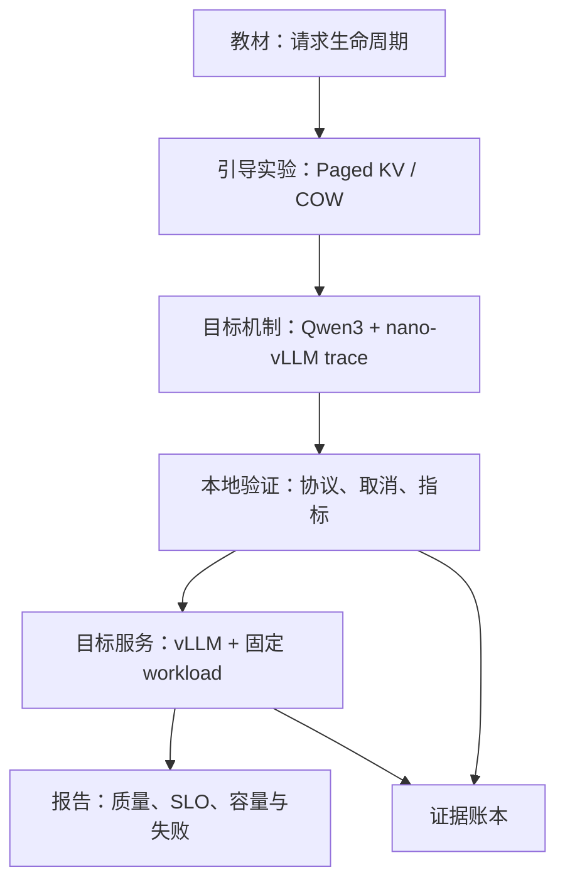

# Inference Serving：从一个请求到容量报告

**项目导航**：[项目索引](../project-index.md) ·
[请求生命周期](../../systems/inference-request-lifecycle.md) ·
[Paged KV 实验](../labs/lab-7a-paged-kv.md) ·
[Qwen3 + nano-vLLM 实验](../labs/lab-7b-nano-vllm-qwen3.md) ·
[vLLM 部署](../../systems/vllm-serving.md) ·
[证据账本](../../evidence/inference-serving-controls.md)
{ .doc-nav }

这个项目的目标不是“成功启动一个模型 API”，而是交付一条可以解释、复算和故障收口的推理服务路径。

完成后，你应该能用同一份请求 trace 回答：

- 请求在客户端、网关、scheduler、model runner 和 streamer 中分别发生了什么；
- Prefill、decode、KV block 与输出 token 怎样对齐；
- TTFT、TPOT、吞吐和失败率的分母是什么；
- 断连后 HTTP、生成任务和 KV 资源是否分别结束；
- 结论来自可手算的 CPU 参考结果、本地集成，还是目标 GPU 实测。

## 最终交付物

不要把完整终端日志当作项目报告。最终交付以下六项：

1. 一张端到端请求图，以及一次成功请求的逐阶段 trace。
2. 一份 Paged KV/COW 实验记录，包含预测、结果和容量失败负例。
3. 一份 Qwen3 穿过 nano-vLLM 的 GPU trace，包含 prefix drift 与 chunked-prefill 对照。
4. 一份固定 model/tokenizer/runtime/hardware 的 workload contract。
5. 原始 attempts、服务端 trace 和质量/性能/失败汇总。
6. 一页结论：当前容量点、主要瓶颈、回滚配置和证据边界。

## 项目怎样分层



- **教材**建立共同语言，不保存完整测试矩阵。
- **引导实验**隔离一个机制，要求先预测再运行。
- **项目路径**组合组件并形成可交付成果。
- **证据页**记录手算结果、对应测试和这些结果的适用范围。

不要用后一层的命令代替前一层的理解，也不要用前一层的 CPU 结果冒充目标 GPU 证据。

## 阶段 0：先能复述一次请求 { #run }

阅读[一次请求如何穿过 LLM 推理引擎](../../systems/inference-request-lifecycle.md)，
然后不看正文画出下面的时间线：

```text
offered -> dispatch -> admission -> prefill -> first token
        -> decode ... -> terminal -> sequence/KV release
```

对 (P=4,O=3) 的请求写出三轮模型工作，并解释为什么模型处理 6 个 positions、API 却返回 3 个输出 token。

完成标准：能把输出 token、KV 长度、block table 和四个时间戳放到同一张表中。

接着运行[实验 1B](../labs.md#lab-1b)。默认中文 message 经过 Qwen3 chat template 后会得到 29 个 ID。
这一步只执行 tokenizer。

实验 7B 会改用 768 个固定生成的 ID，让前缀命中和 256-token block 账本容易复算。前一组输入解释文本编码，
后一组输入解释 runtime 调度。

进入 GPU 实验前，先用 CPU 账本复算三种情况：

~~~powershell
python projects/inference-serving/generation_work_ledger.py
~~~

先对照三行结果：

- 没有前缀复用：`768 prefill + 7 decode = 775` 个计算位置；
- 精确复用前两个 256-token block：`256 + 7 = 263` 个；
- 索引 256（从 0 开始）发生漂移，只能复用第一个 block：`512 + 7 = 519` 个。

这一步没有运行 Qwen3 或 nano-vLLM，它的作用是让你先把 GPU trace 中应该出现的数量算清楚。

## 阶段 1：运行 Paged KV 引导实验

先完成[实验 7A](../labs/lab-7a-paged-kv.md)，不要直接跳到测试命令。

~~~powershell
python projects/inference-serving/paged_kv_tensor_toy.py
~~~

你需要解释的不是 `true`，而是：

- 为什么五 token prefix 使用两个 block；
- 为什么 fork 后 logical references 多于 physical blocks；
- 为什么 A append 时发生 `1 -> 2` 的 partial-tail COW；
- 为什么 B 的 tensor 保持不变；
- 为什么 11 logical tokens 只对应 8 个 physical token values；
- 为什么 dense parity 不等于执行了 GPU PagedAttention。

再运行容量不足负例：

~~~powershell
python -m pytest `
  tests/test_paged_kv_torch.py::test_capacity_failure_preserves_allocator_and_tensor_state `
  -q
~~~

完成标准：异常发生后 allocator 与 K/V tensor 都没有留下半更新状态。

## 阶段 1B：让 Qwen3 真正穿过 nano-vLLM

完成[实验 7B](../labs/lab-7b-nano-vllm-qwen3.md)。它会加载固定的 Qwen3-0.6B 权重，并通过 CUDA、
FlashAttention 和 Triton 执行真实模型计算。

这一阶段只研究推理引擎内部的请求。HTTP 服务和 OpenAI-compatible endpoint 留到后面接入。

先根据上面的 CPU 账本写下四个预测，再运行长实验：

```text
exact prefix 应命中几个 256-token block？
position 256 漂移后还剩几个命中？
batch budget 256 时各需要几次 prefill？
8-token 输出需要几次 decode？
```

~~~bash
python projects/inference-serving/nano_vllm_study.py collect \
  --manifest projects/inference-serving/nano-vllm-qwen3-0.6b.study.json \
  --source-root /path/to/nano-vllm \
  --model-snapshot /path/to/Qwen3-0.6B/snapshot \
  --output artifacts/inference/nano-vllm-study.json

python projects/inference-serving/nano_vllm_study.py verify \
  --manifest projects/inference-serving/nano-vllm-qwen3-0.6b.study.json \
  --report artifacts/inference/nano-vllm-study.json

python projects/inference-serving/nano_vllm_study.py explain \
  --manifest projects/inference-serving/nano-vllm-qwen3-0.6b.study.json \
  --report artifacts/inference/nano-vllm-study.json \
  --execution-mode eager \
  --max-num-batched-tokens 256 \
  --prefix-variant one_token_drift
~~~

先用 `explain` 阅读一条并发 1 的逐 step 表格，再比较 32 个 case 的汇总指标。这样能先确认性能变化对应哪次
prefill、decode 或 KV 分配，而不是直接从中位数猜原因。

完成标准：

- 能从任一测量轨迹中指出首 token 提交边界、每次 KV 分配与释放，以及前缀命中的失效点；
- 能说明 eager 与 CUDA Graph 实际走了哪条分支，并让报告通过离线验证；
- 某个并发档失败时，保留带类型的终态，并把它计入容量曲线。

## 阶段 2：把协议和终态跑通

这一阶段不要求 GPU。先离线复核三份录制报告：

~~~powershell
python projects/inference-serving/run_qwen_target_service.py --verify `
  projects/inference-serving/qwen2.5-0.5b-service.recorded-report.json
python projects/inference-serving/incremental_streaming_control.py --verify `
  projects/inference-serving/incremental-streaming.recorded-report.json
python projects/inference-serving/transformers_thread_cancellation_control.py --verify `
  projects/inference-serving/transformers-thread-cancellation.recorded-report.json
~~~

下面三个验证程序分别回答不同问题：

| 验证程序 | 可以观察什么 | 还需要怎样验证 |
|---|---|---|
| 固定 Qwen HTTP | 指定权重、tokenizer、loopback API 和 generate audit | vLLM/CUDA、增量生成、质量与性能 |
| 模拟 async stream | ASGI/backend task 能观察断连并停止模拟 token | 模型 forward、不可中断 kernel、KV 释放 |
| Tiny Transformers thread | 显式 event/StoppingCriteria 下 generate thread 退出 | 未修改 runtime、目标模型或 GPU 资源回收 |

### 主动制造一次断连

运行 live 验证程序后，让 client 在首个内容 delta 后关闭连接。报告中分开记录：

```text
response task terminal
backend generation terminal
worker/thread terminal
sequence/KV/permit released or unobserved
```

若只能证明前三项中的一部分，就把其余项标为 unobserved，不能根据“请求已经断开”推断资源已释放。

完成标准：成功、取消、协议错误和超时都有唯一终态，且未定义指标不被填成 0。

## 阶段 3：建立 workload contract

在发压前固定：

| 维度 | 需要记录的内容 |
|---|---|
| Identity | model/tokenizer/template/runtime/container/driver/hardware |
| Input | Prompt/output 长度联合分布、语言与模板 |
| Arrival | Burst、constant、Poisson 或生产 trace |
| Concurrency | Client in-flight 与 server admission 上限 |
| Generation | Temperature、top-k/top-p、stop、最大输出 |
| Timing | Offered、started、first-token、terminal 的定义 |
| Failure | 429、timeout、5xx、protocol、client cancel 是否进入分母 |
| Quality | 任务 case、基线、错误 taxonomy 和通过门槛 |

先用合成 attempts 验证分析口径：

~~~powershell
python -m about_llm.inference_analysis_cli `
  --attempts projects/inference-serving/attempts.example.jsonl `
  --benchmark-started-at 0 `
  --benchmark-completed-at 2 `
  --minimum-success-rate 0.75 `
  --maximum-ttft-p95 0.5 `
  --maximum-e2e-p95 1.5 `
  --maximum-tpot-p95 0.3 `
  --maximum-client-queue-p95 0.2 `
  --maximum-successful-offered-ttft-p95 0.6 `
  --maximum-offered-to-terminal-p95 1.5 `
  --output artifacts/inference/workload-report.json
~~~

这份固定输入包含 3 个成功 attempt 和 1 个 429。它用于核对分析器的分母、时钟和门禁，
不能证明任何真实服务达到这些阈值。

完成标准：能解释为什么快速 429 可能降低 offered-to-terminal，同时服务质量反而更差。

## 阶段 4：在目标 GPU 上启动 vLLM

按[vLLM 部署页](../../systems/vllm-serving.md#first-start)固定版本并启动服务。
先完成单请求 token/usage/finish 对账，再运行负载发生器：

~~~powershell
python -m pip install -e ".[api]"

python projects/inference-serving/benchmark_openai.py `
  --model my-model --requests 20 --concurrency 1

python projects/inference-serving/benchmark_openai.py `
  --model my-model --requests 100 --concurrency 8 `
  --arrival-process constant --request-rate 4

python projects/inference-serving/benchmark_openai.py `
  --model my-model --requests 100 --concurrency 8 `
  --arrival-process poisson --request-rate 4 --arrival-seed 7
~~~

按 `1 -> 2 -> 4 -> 8 -> ...` 逐级扫描并发，不要直接跳到目标最大值。
每一级都保存全部 attempts 和 server trace，而不是只保留聚合 dashboard。

### 每个容量点都报告什么

```text
成功率与各类失败计数
client queue / offered TTFT / dispatch TTFT
TPOT / E2E / requests per second / output tokens per second
输入输出长度切片
GPU utilization / peak memory / KV blocks / preemption
质量与安全回归
原始失败样例
```

找到吞吐增加但 TTFT/TPOT、失败率、KV preemption 或 OOM 首次越过门槛的拐点。
最后一个仍满足全部门槛的档位，是当前 workload 下的候选容量，而不是跨环境承诺。

完成标准：报告明确指出饱和点由哪个指标首先暴露，以及回退到哪组配置。

## 阶段 5：只改变一个优化变量

从[推理优化](../../systems/inference-optimization.md)选择一个与当前瓶颈匹配的改动：

- TTFT 被重复 system prompt 主导：评估 prefix cache。
- KV 容量先到上限：评估更短 context、GQA 模型、KV/weight quantization 或 admission。
- 小批量 decode 明显受带宽或 kernel 启动开销限制：评估批处理策略、兼容 kernel 或 CUDA Graph。
- Target decode 串行成本主导：在接受率与 draft 成本可测时评估 speculative decoding。

保持 workload、质量 case 和其他配置不变，重新运行同一容量扫描。

完成标准：同时报告收益、质量/失败回归和不适用切片，而不是只挑最好的一档性能。

## 故意破坏清单

一个有学习价值的项目必须保留负例。至少完成其中四项：

1. 把 KV 总 block 降到 COW 无法预留，确认失败前没有 mutation。
2. 删除成功 attempt 的 token usage，确认 TPOT/吞吐分析拒绝继续。
3. 混用有/无 `offered_at` 的 attempts，确认分析器拒绝模糊时钟。
4. 流式收到首 token 后断连，检查哪些生命周期真正结束。
5. 使用错误 model name、过长请求和非法采样字段，保存 typed error。
6. 把 arrival rate 提到过载区，比较 429、queue age 与成功延迟。
7. 修改 tokenizer/template revision，观察 token ids、usage 或输出是否漂移。
8. 在 canary 中注入错误配置，执行实际回滚而不只描述步骤。

失败路径的预期结果应在运行前写下。否则很容易把任何异常都解释成“实验成功”。

## 报告模板

```markdown
# 单卡推理服务验收

## 目标与 SLO
任务、用户体验目标、质量/安全门槛。

## Identity 与 workload
模型、tokenizer、runtime、硬件、长度、到达、并发、采样。

## 一次请求 trace
协议、admission、prefill、decode、KV、stream、terminal。

## 容量曲线
各并发档的成功率、TTFT、TPOT、吞吐、显存和 preemption。

## 失败与取消
429、timeout、OOM、断连和资源回收证据。

## 优化对照
只改变的变量、收益、退化和不适用切片。

## 结论与回滚
当前可接受容量、最可能瓶颈、回退配置、证据边界。
```

## 项目完成标准

- 能沿一次请求解释模型工作、KV 和用户可见事件。
- 至少一个机制实验包含预测、负例与解释。
- 目标 workload 的身份、分母和失败终态固定。
- 质量、安全、延迟、吞吐、显存和成本没有互相替代。
- 结论只绑定当前模型、硬件、版本和 workload。
- 回滚经过实际演练。

精确测试与每条 claim 的证据等级见[推理服务证据与准确性账本](../../evidence/inference-serving-controls.md)。
项目目录的完整实现说明位于
[projects/inference-serving](https://github.com/NightLemon/about-llm/tree/main/projects/inference-serving)。
