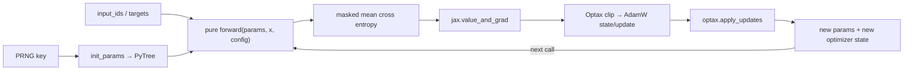

# JAX MiniGPT：纯函数训练、跨框架对账与精确恢复

**项目导航**：[返回项目索引](../project-index.md) · [JAX 与 Optax](../../training/jax-optax.md) · [Transformer](../../core/transformer.md) · [分布式训练](../../systems/distributed-training.md) · [环境矩阵](../../guide/environment.md)
{ .doc-nav }

本项目不用 Flax 封装，直接以 JAX arrays、PyTree、显式 PRNG key、`value_and_grad`、Optax transformation 和 `jax.jit` 实现一个最小 decoder-only Transformer。随后用三个相互独立的 controls 回答：PyTorch/JAX 是否真在算同一个函数、optimizer trajectory 是否对齐、跨进程 checkpoint 是否恢复了完整训练语义。

!!! warning "四层证据不能合并"
    tiny-batch overfit、plain-SGD parity、shared-mask AdamW parity 与 strict resume 是四个不同实验。前一层不能替后一层作证；四层合起来也没有执行 CUDA/TPU、多设备 sharding、目标模型或生产训练。

## 四层学习与证据地图

| 层 | 入口 | 核心问题 | 已验证 | 仍未验证 |
|---|---|---|---|---|
| 原生 JAX 闭环 | `train_tiny.py` | PyTree、autodiff、Optax、JIT 是否接通 | 632 参数 CPU float32 tiny batch 60 步 overfit | 泛化、生成质量、目标硬件性能 |
| 架构/梯度 parity | `cross_framework_parity.py` | 两框架是否执行同一数学函数 | 同解析参数、20 个 unique parameters、plain SGD 一步 | AdamW、dropout/RNG、JIT |
| Optimizer trajectory parity | `cross_framework_training_parity.py` | clipping/moments/schedule 是否逐步对齐 | 三步 shared-mask AdamW、错误 mask 反例 | native RNG equivalence、decay mask、checkpoint |
| 跨进程 resume | `checkpoint_resume_control.py` | 权重之外的状态是否完整 | params/Optax/typed PRNG/permutation/cursor/step bit-exact | Orbax、分片 checkpoint、断电原子性、来源认证 |

## JAX 训练心智模型

与隐式持有参数和 optimizer 的对象式训练相比，这里每一步都显式接收旧 `params/optimizer_state` 并返回新值。Python 变量重新绑定不等于原地修改 device array；checkpoint 也必须保存两棵状态树及所有影响未来 batch/随机性的状态。

PRNG key 同样是值。调用方必须 split、消费并保存新 key；重复使用旧 key 会重复随机流。Typed JAX key 的内部 data 可以进入 checkpoint，但这不意味着它与 PyTorch、NumPy、worker 或 accelerator RNG 是同一种算法或同一个状态机。

## 从零实现的模型

### 参数 PyTree

`init_params(key, config)` 依次建立：

- token embedding `[vocab, dim]`；
- position embedding `[context, dim]`；
- 每层 fused QKV `[dim, 3×dim]`、attention output `[dim, dim]`；
- MLP up/down `[dim, ratio×dim]` 与 `[ratio×dim, dim]`；
- attention/MLP/final RMSNorm scale。

`blocks` 最终转为 tuple，使树结构稳定。当前核心没有 Linear bias 或 norm bias，LM head 与 token embedding 通过转置矩阵乘法绑定；这与仓库 PyTorch MiniGPT 的默认 LayerNorm 架构并不相同。

### 纯函数前向

给定 `input_ids [B,T]`：

1. token embedding 与前 `T` 个 position embedding 相加；
2. pre-norm attention：fused QKV → `[B,H,T,D_h]` → causal score → softmax → output projection → residual；
3. pre-norm MLP：approximate GELU → down projection → residual；
4. final RMSNorm；
5. 与 `token_embedding.T` 相乘得到 logits `[B,T,V]`。

Causal mask 只允许位置 \(t\) 访问 \(j\le t\)。专项测试把后两个 input token 改掉，前两个位置 logits 仍在容差内相同。当前实现使用 `-1e30` 屏蔽未来位置；它没有覆盖全 padding row、低精度 sentinel 或 fused attention kernel。

### Masked token mean

对非 `ignore_index=-100` 的 token 集合 \(M\)，loss 是

\[
\mathcal L=-\frac{1}{|M|}\sum_{(b,t)\in M}
\log p_\theta(y_{b,t}\mid x_{b,\le t}).
\]

实现把 ignored target 暂替换为 0 以安全 gather，再乘 mask；分母最小为 1，因此全 ignored batch 返回 0，而不是除零。真实训练仍应在数据门禁处拒绝没有监督 token 的 batch，不能把有限的 0 loss 当成有效更新。

### JIT train step

`make_train_step(config, optimizer)` 用闭包捕获静态 config/optimizer，动态参数是 PyTree、Optax state、input IDs 与 targets。内部顺序是：

~~~text
loss, grads = value_and_grad(loss_fn)(params)
preclip_norm = optax.tree.norm(grads)
updates, new_state = optimizer.update(grads, state, params)
new_params = optax.apply_updates(params, updates)
~~~

Optimizer 是 `optax.chain(clip_by_global_norm, adamw)`；报告中的 gradient norm 是裁剪前值。教学入口对全部参数采用同一 weight decay，未实现生产常见的 norm/bias-like exclusion mask。

## 原生 JAX 最小运行 { #run }

### 1. 安装与环境

~~~powershell
python -m pip install -e ".[dev,torch,jax]"
python scripts/doctor.py
~~~

安装成功只表明当前 wheel/backend 可导入。报告里的 `backend/device` 才说明本次走了哪个设备；CPU 结果不得外推 CUDA、TPU 或多设备。

### 2. Overfit 一个确定性 tiny batch

~~~powershell
python projects/jax-minigpt/train_tiny.py `
  --steps 60 `
  --learning-rate 0.02 `
  --seed 11
~~~

本次实跑环境为 JAX/JAXlib `0.11.0`、Optax `0.2.8`、CPU `cpu:0`。固定两条相同 `[0,1,2,3]→[1,2,3,4]` 样本，632 个参数的 loss 从 `2.108591318130493` 降到 `0.0030041998252272606`，ratio 约 `0.00142474`；最终 pre-clip gradient norm 为 `0.011140906251966953`。

该脚本**不生成文本**。它输出参数量、loss、梯度范数和计时；旧版页面所说的“检查生成结果”不是实际交付，已删除。Tiny overfit 可发现梯度断开、target shift 或 optimizer 未更新，但不能证明泛化或语言质量。

### 3. 正确测量 JAX 时间

JAX dispatch 通常是异步的。脚本每步调用 `loss.block_until_ready()` 后再停止计时，因此首次 `compile + step` 与后续同步 step 分开。本次约为 `0.8622 s` 与 `0.000406 s`；这些是当前小 shape/CPU/热状态观测，不是 benchmark、吞吐或 GPU 性能证据。若不等待结果，只测到 Python enqueue latency。

## PyTorch↔JAX 同权重前向、反向与 SGD parity

~~~powershell
python projects/jax-minigpt/cross_framework_parity.py
python -m pytest tests/test_gpt_cross_framework_parity.py -q
~~~

### 为什么不能比较两个随机模型

两个框架各自随机初始化后，即使 loss 都有限，也无法判断差异来自权重、架构、数值约定还是实现错误。该 control 用 name-ordered sin/cos 解析参数生成 PyTorch 权重，再显式映射到 JAX：

| 必须对齐的约定 | Control 选择 |
|---|---|
| normalization | affine LayerNorm，含 mean subtraction、scale/bias，epsilon=`1e-5` |
| Linear layout | PyTorch `[out,in]` 映射为 JAX `[in,out]` |
| activation | tanh-approximate GELU |
| attention | 相同 causal mask 与 head reshape |
| LM head | tied token embedding |
| loss | 一个 `-100` target 的 masked token mean |
| optimizer | plain SGD，lr=`0.025`，无 momentum/decay |
| runtime | 强制 CPU float32；不使用 framework RNG |

当前 11-vocab、2-layer、8-dim、2-head fixture 对账 logits、loss、20 个 unique parameters 的 gradients、一步参数与 post-step forward：

| 比较项 | max absolute difference | 门槛 |
|---|---:|---:|
| initial logits | `7.636845111846924e-08` | `2e-6` |
| initial loss | `0` | `2e-6` |
| all gradients | `2.384185791015625e-07` | `2e-6` |
| post-SGD params | `7.450580596923828e-09` | `2e-6` |
| post-step logits | `7.450580596923828e-08` | `2e-6` |
| post-step loss | `2.384185791015625e-07` | `2e-6` |

Report fingerprint 为 `sha256:63408e2e…40277e5`。通过只证明这个对齐 contract；不能写成“PyTorch 与 JAX 天然等价”。

### RMSNorm 反事实

原生 JAX MiniGPT 使用不减均值、无 bias、epsilon=`1e-6` 的 RMSNorm。把同一主干权重直接送入原生路径，RMSNorm 反事实 logits 最大差为 `0.37747739627957344`，远大于 parity 容差。它证明“同名 Transformer”不足以建立等价；normalization、epsilon、bias、GELU、mask、weight tying 和 loss reduction 都是模型身份的一部分。

## 三步 AdamW trajectory parity

~~~powershell
python projects/jax-minigpt/cross_framework_training_parity.py
python -m pytest tests/test_gpt_cross_framework_training_parity.py -q
~~~

该 control 在已对齐的 LayerNorm 主干上加入：

- NumPy PCG64 seed `20260814` 外部物化的三张 embedding inverted-dropout masks；
- dropout rate `0.25`，每步 kept elements 为 `54/50/45`；
- global-norm clip `0.08`；
- AdamW beta `0.9/0.95`、epsilon `1e-8`、weight decay `0.03`；
- `0.02→0.01→0.005` schedule；
- 三步 raw/clipped gradients、first/second moments、count、params 与 post-step forward。

裁剪公式为

\[
g'_t=g_t\min\left(1,\frac{c}{\lVert g_t\rVert_2}\right),
\]

三个 pre-clip norm 约为 `1.9000/1.7592/1.3206`，都大于 \(c=0.08\)，所以 clipping 真实生效。Across-step maxima：raw/clipped gradient `3.129243850708008e-07/1.862645149230957e-08`，first/second moments `2.561137080192566e-09/8.003553375601768e-11`，参数 `2.5480985641479492e-06`，post-step logits `1.564621925354004e-07`，均通过 `5e-6` 门槛。Report fingerprint 为 `sha256:68ffa8093a1f2b98…e175c609`。

把 JAX mask 最后一维循环移位的负例产生 `0.06900620367377996` 最终参数差。共享 mask 的作用是隔离随机输入变量；它不证明 **native RNG equivalence**，也不验证两框架 PRNG state advance、全部 dropout site、JIT 或 accelerator kernel。当前 control 还对所有参数 decay，不能借此宣称生产式 norm/bias decay mask 已对齐。

## Strict checkpoint 与跨进程 bit-exact resume

~~~powershell
python projects/jax-minigpt/checkpoint_resume_control.py
python -m pytest tests/test_jax_training_resume.py -q
~~~

### 需要保存哪些状态

| 状态面 | 本 control |
|---|---|
| 参数 | 完整 params PyTree leaves/treedef identity |
| optimizer | Optax count、first/second moments |
| 随机性 | typed dropout key data、data-shuffle key data |
| 数据进度 | permutation、cursor |
| 训练进度 | global step、模型/optimizer/dataset identity |
| 未覆盖 | Python/NumPy/worker/accelerator RNG、分片拓扑 |

### Artifact 格式

`ALLMJAX1` 单文件由 canonical JSON manifest、连续 little-endian array payload 和 outer SHA-256 组成。Manifest 绑定每个 array 的 name、shape、dtype、offset、size 与 SHA-256。Loader 在构造 JAX arrays 前拒绝 duplicate/non-canonical JSON、未知/缺失字段、顺序/shape/dtype/digest 漂移、截断与 trailing bytes；writer 使用 exclusive create 与 file `fsync`。

File `fsync` 不等于目录项已 durable，也不证明断电原子性。Outer/inner SHA-256 检测漂移但不认证发布者；有写权限的攻击者可以协同重算无密钥 hash。

### 当前实跑结果

固定 7 examples、batch 2、dropout `0.2`、clip+AdamW 六步，在 step 3 由第一个 spawn process 写出 `13,476 bytes` artifact，SHA-256 为 `e9252e5dddfa4aa5…70568a35`；第二个独立进程加载并完成后三步。

Uninterrupted/resumed sample IDs 都是 `[[0,4],[3,2],[5,1],[6,3],[2,1],[6,4]]`，六步 loss/gradient trace 与最终 full-state fingerprint `sha256:720817cca4c067cf…71d058f33` bit-exact。报告只发布 distinct worker count=2，不发布 raw PID。

仅把 dropout key 重置为初始 seed 的 wrong PRNG 负例，最终参数差为 `0.037261832505464554`；仅把 cursor 从 6 重置为 0 的 wrong cursor 负例，差为 `0.03700308472616598`。这证明“权重和 Optax state 能加载”仍不足以保证训练连续。

## 专项测试与故障定位

~~~powershell
python -m pytest `
  tests/test_gpt_jax.py `
  tests/test_gpt_cross_framework_parity.py `
  tests/test_gpt_cross_framework_training_parity.py `
  tests/test_jax_training_resume.py -q
~~~

| 现象 | 优先检查 | 不能据此下的结论 |
|---|---|---|
| loss 不下降 | target shift、mask 分母、gradient tree、optimizer state 是否回传 | 一次下降不等于泛化 |
| 首步很慢 | compile 与执行是否拆分、shape/dtype 是否变化 | enqueue time 不等于计算时间 |
| parity 失败 | norm/epsilon/bias、Linear transpose、GELU、mask、tied weight、reduction | 不能先调大容差掩盖身份差异 |
| AdamW 前两步对、后续漂移 | schedule count、moment count、clipping 顺序、mask/RNG | shared mask 不证明 native RNG |
| checkpoint 能打开但 trace 漂移 | PRNG、permutation/cursor、step、Optax state、dataset identity | 可反序列化不等于 exact resume |
| accelerator OOM/重编译 | mesh/sharding、static shape、dtype、batch/sequence、compile cache | CPU tiny 结果不能预测设备峰值 |

## 扩展到真实 JAX/Flax 训练

### 参数与 optimizer policy

为 PyTree leaves 建立可审计的 path/type/shape identity；显式定义 weight-decay mask，通常把 norm scale 与 bias-like 参数分开。Schedule count、gradient accumulation position、loss-scaling state 和 EMA 若影响未来更新，也必须进入 checkpoint 与 parity test。

### 数据与随机性

为每个 dropout site、数据 shuffle、augmentation 和 sampling 建立 key split 约定。多设备时还需明确 fold-in 的 process/device/step/example identity，避免所有设备重复随机流或恢复后重新使用 key。Shared materialized mask 适合隔离数学差异，不是最终 RNG 设计。

### JIT、shape 与性能

把 compile、warm steady state、host↔device transfer、collective 和 checkpoint I/O 分开测量；记录 shape/dtype/sharding/mesh identity与同步点。一次 CPU 的 `block_until_ready()` 计时不能证明 GPU/TPU 性能，也不能证明没有 shape-triggered recompilation。

### Sharding 与 checkpoint

在目标多设备环境验证 mesh、replication/partition rules、global/local shapes、batch divisibility 与 collective semantics。若采用 Orbax/TensorStore，应另测 save/restore、异步完成、拓扑变化 reshard、partial write、preemption 与 object-store consistency；本项目的单文件 `ALLMJAX1` 不能替这些组件作证。

## 项目验收与求职讲法

- [ ] 能画出 params/Optax/PRNG/data cursor 的纯函数状态流；
- [ ] 能解释为何 `block_until_ready()` 决定计时含义；
- [ ] 能列出跨框架 parity 需要对齐的模型身份，而不只说“同样是 GPT”；
- [ ] 能区分 shared-mask optimizer parity 与 native RNG equivalence；
- [ ] 能用 wrong-mask、RMSNorm、wrong-PRNG、wrong-cursor 四个反例解释因果；
- [ ] 能说明 bit-exact resume 需要比较 trace 和 full state，而不只是最终 loss；
- [ ] 能把 CPU、单 accelerator、多设备、目标模型证据分栏；
- [ ] 能说明 strict hash artifact 的完整性、真实性与 durability 是三个不同问题。

面试中可按“纯函数状态 → tiny overfit → 模型身份 parity → optimizer trajectory → checkpoint state surface → accelerator/sharding 扩展”讲解。简历若只有当前证据，应写“在 CPU tiny fixture 上实现并验证”，不能写“完成大模型 JAX 分布式训练”或“性能优于 PyTorch”。

## 证据边界

当前证据覆盖本机 CPU 上 JAX/JAXlib `0.11.0`、Optax `0.2.8` 的单设备 tiny-batch JIT 训练，强制 CPU 的 PyTorch/JAX LayerNorm/SGD 与 shared-mask AdamW controls，以及 authored `ALLMJAX1` 跨进程 bit-exact resume。

它不证明原生 PyTorch/JAX RNG 等价、生产式 decay mask、Flax/Orbax/TensorStore、directory `fsync`/断电、来源认证、CUDA/TPU、混合精度、多设备 mesh/sharding、数据并行效率、目标模型收敛、生成质量或生产性能。每个未执行项都需要目标环境与独立验收。

完整实现说明见 [projects/jax-minigpt](https://github.com/NightLemon/about-llm/tree/main/projects/jax-minigpt)。
