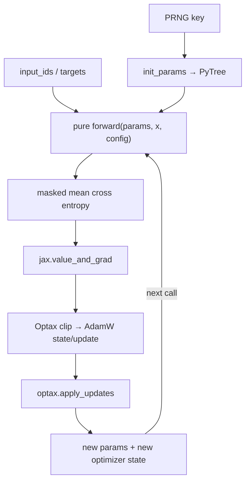

# JAX MiniGPT：纯函数训练、跨框架对账与精确恢复

**项目导航**：[项目索引](../project-index.md) · [JAX 与 Optax](../../training/jax-optax.md) ·
[Transformer](../../core/transformer.md) · [分布式训练](../../systems/distributed-training.md) ·
[环境矩阵](../../guide/environment.md)
{ .doc-nav }

<!-- learning-contract -->
<div class="learning-contract" markdown="1">

**学习导航**

- **适合读者**：想从 PyTorch 迁移到 JAX，或需要验证训练恢复正确性的开发者。
- **先修**：Transformer 前向、反向传播、AdamW 和基本 checkpoint 概念。
- **首次阅读**：先跟一次“训练 3 步后退出，再继续 3 步”的任务理解完整状态，再运行四个实验。
- **完成信号**：能解释 params、Optax state、PRNG key 和 data cursor 各自怎样影响下一步更新。
- **卡住时**：先忽略跨框架 parity，只运行 `train_tiny.py`，画出一个 train step 的输入与输出。

</div>

设想一个具体任务：MiniGPT 已经训练 3 步，现在进程退出。新进程加载 checkpoint 后继续训练 3 步。
如果恢复正确，第 4—6 步读取的样本、dropout mask、loss、梯度和参数，都应与从未中断的运行一致。

本项目不借助 Flax 封装，而是直接组合下面几项能力：

| JAX 组件 | 在项目中的作用 |
|---|---|
| JAX array | 保存参数、输入和中间结果 |
| PyTree | 组织嵌套参数与 optimizer state |
| PRNG key | 显式传递随机状态 |
| `value_and_grad` | 同时计算 loss 与 gradients |
| Optax | 维护 clipping、AdamW 更新和 moments |
| `jax.jit` | 编译 train step |

这样实现最小 decoder-only Transformer，目的不是少写框架代码，而是让训练状态都出现在函数输入或输出中。

在第 \(t\) 步开始时，可以把完整状态写成：

\[
S_t=(\theta_t, o_t, k_t, \pi_t, c_t, t),
\]

| 符号 | 第 \(t\) 步开始时的含义 |
|---|---|
| \(\theta_t\) | 模型参数 |
| \(o_t\) | Optax 的 optimizer state |
| \(k_t\) | 下一次随机操作要使用的 PRNG key |
| \(\pi_t\) | 当前 epoch 的样本排列 |
| \(c_t\) | 排列中的读取位置 |
| \(t\) | Global step |

少恢复其中任何一项，第 4 步以后都可能走向另一条训练轨迹。

!!! note "本项目的范围"
    四个实验依次检查训练接线、跨框架数学、optimizer 轨迹和中断恢复。它们都运行在 CPU tiny 模型上；
    CUDA、TPU、多设备 sharding 和目标大模型属于后续验收。

## 四层学习与证据地图

| 实验 | 它只改变或检查什么 | 通过时可以说什么 |
|---|---|---|
| Tiny-batch overfit | 一套 JAX 模型能否反向传播并更新 | PyTree、autodiff、Optax 和 JIT 已接通 |
| Plain-SGD parity | 两框架使用相同解析权重、输入和公式 | 这一小模型的 forward、gradient 与一步 SGD 对齐 |
| Shared-mask AdamW parity | 两框架使用同一批 dropout masks | Clipping、moments、schedule 与三步更新轨迹对齐 |
| 跨进程 resume | 第 3 步保存并由新进程继续 | 本实验列出的完整状态足以 bit-exact 续跑 |

四个实验是递进关系，却不能互相替代。Overfit 成功仍可能掩盖公式差异；一步 SGD 对齐也没有检查
AdamW moments；optimizer 对齐后，遗漏数据 cursor 仍会让恢复后的训练分叉。

## 先跟一个 batch 走完一步 { #one-train-step }

`train_tiny.py` 使用两条完全相同的训练样本：

```text
input_ids = [[0, 1, 2, 3],
             [0, 1, 2, 3]]
targets   = [[1, 2, 3, 4],
             [1, 2, 3, 4]]

batch = 2, sequence = 4, vocabulary = 8
model parameters = 632
```

用 seed 11、学习率 0.02 只训练一步时，真实执行顺序是：

1. 旧参数完成前向计算，得到 `[2, 4, 8]` 的 logits；
2. 八个监督位置的平均交叉熵为 `2.1085913181`；
3. `value_and_grad` 同时返回这份 loss 和形状与参数树一致的梯度树；
4. 裁剪前的全局梯度范数为 `1.6481350660`，超过阈值 1.0，因此先缩放梯度；
5. Optax 根据梯度与旧 optimizer state 产生 updates 和新 state；
6. `apply_updates` 得到新参数，重新前向计算后的 loss 为 `1.9567849636`。

第三步返回的 loss 属于**更新前**的参数。训练面板若把它标成 `post_step_loss`，就会把两个时间点混在一起。
脚本为了报告一步后的结果，会用新参数再计算一次 `final_loss`。

这个最小拟合实验不使用随机失活（dropout），每一步也读取同一批数据。PRNG key 只在初始化 632 个参数时
使用，不属于这里的 `train_step` 参数。后面的恢复实验加入随机失活和数据洗牌后，随机键、样本排列与
读取位置才会随步骤变化，并进入完整状态 \(S_t\)。

## JAX 训练心智模型



对象式训练器常把参数和 optimizer state 藏在实例内部。这里的 train step 显式接收旧 `params` 与
`optimizer_state`，再返回两棵新树。Python 变量重新绑定，不表示 device array 被原地修改。

同样，checkpoint 也不只是“保存模型权重”。凡是会改变下一批数据、随机 mask 或参数更新的状态，
都必须随 \(S_t\) 一起恢复。

PRNG key 同样是一份显式状态。调用方先 split key，把其中一份交给当前随机操作，再把另一份保存给未来。
重复使用旧 key，会重复同一段随机流。

JAX 的类型化随机键（typed key）可以把底层数组写进检查点，但它只恢复 JAX 管理的随机流。

如果训练还调用 PyTorch、NumPy、数据加载进程或加速器随机算子，就要分别保存那些组件的状态。
一份 JAX 随机键不能替它们恢复。

## 从零实现的模型

### 参数 PyTree

`init_params(key, config)` 依次建立：

- token embedding `[vocab, dim]`；
- position embedding `[context, dim]`；
- 每层 fused QKV `[dim, 3×dim]`、attention output `[dim, dim]`；
- MLP up/down `[dim, ratio×dim]` 与 `[ratio×dim, dim]`；
- attention/MLP/final RMSNorm scale。

这些数组按名称嵌套成 PyTree。`blocks` 最终使用 tuple，确保树的路径和叶子顺序保持稳定。

当前 JAX 模型使用不带偏置的线性层和 RMSNorm。输出词表分数时，它直接转置 token embedding，
因此输入嵌入与输出头共享权重。仓库中的 PyTorch MiniGPT 默认采用 LayerNorm；跨框架对账前，
必须先把归一化、偏置和权重共享方式改成同一套约定。

### 纯函数前向

给定 `input_ids [B,T]`：

1. Token embedding 与前 `T` 个 position embedding 相加；
2. Pre-norm attention：融合 QKV → `[B,H,T,D_h]` → causal score → softmax → 输出投影 → 残差；
3. Pre-norm MLP：近似 GELU → down projection → 残差；
4. Final RMSNorm；
5. 与 `token_embedding.T` 相乘得到 logits `[B,T,V]`。

Causal mask 只允许位置 \(t\) 访问 \(j\le t\)。专项测试先记录所有 logits，再只改输入的后两个 token。
如果前两个位置的 logits 保持不变，说明未来 token 没有越过 mask 影响过去。

当前实现用 `-1e30` 屏蔽未来位置。这个 CPU float32 实验没有覆盖全 padding row、低精度 mask 值或
融合 attention 算子；迁移实现时要重新检查这些边界。

### Masked token mean

对非 `ignore_index=-100` 的 token 集合 \(M\)，loss 是

\[
\mathcal L=-\frac{1}{|M|}\sum_{(b,t)\in M}
\log p_\theta(y_{b,t}\mid x_{b,\le t}).
\]

JAX 的 gather 仍会读取稍后被 mask 的位置。实现先把 `-100` target 临时替换为合法 ID 0，完成索引后
再乘监督 mask。

这个替换只用于安全索引。Ignored token 仍不进入 loss 的分子与分母。

如果整批 target 都是 `-100`，分母 \(|M|\) 为 0。可见 target 越过词表时，索引同样无效。
`make_train_step` 的 Python wrapper 会在进入已编译更新前拒绝这两类输入。

这一步避免把零监督误报成 `loss=0`，也避免 AdamW 的 weight decay 在错误 batch 上修改参数。

### JIT train step

`make_train_step(config, optimizer)` 把训练过程中不变的模型配置和 optimizer 放进闭包。
每一步只传入四项会变化的值：参数树、Optax 状态、输入 token ID 和目标 token ID。核心顺序是：

~~~text
loss, grads = value_and_grad(loss_fn)(params)
preclip_norm = optax.tree.norm(grads)
updates, new_state = optimizer.update(grads, state, params)
new_params = optax.apply_updates(params, updates)
~~~

Optimizer 使用 `optax.chain(clip_by_global_norm, adamw)`。因此先按全局范数裁剪 gradient，再交给 AdamW；
报告中的 gradient norm 是裁剪前的值。

教学入口对所有参数采用同一个 weight decay。真实训练通常会明确哪些 norm、bias 或 embedding 不衰减，
并把这份 mask 当作 optimizer 配置的一部分。

## 原生 JAX 最小运行 { #run }

### 1. 安装与环境

~~~powershell
python -m pip install -e ".[dev,torch,jax]"
python scripts/doctor.py
~~~

安装成功只表示 Python 能导入当前 wheel 和 backend。实际运行报告中的 `backend/device` 才说明计算落在哪个设备。
本页录制的是 CPU 结果，CUDA、TPU 和多设备需要各自重跑。

### 2. Overfit 一个确定性 tiny batch

~~~powershell
python projects/jax-minigpt/train_tiny.py `
  --steps 60 `
  --learning-rate 0.02 `
  --seed 11
~~~

本页录制运行使用 JAX/JAXlib `0.11.0`、Optax `0.2.8` 和 CPU `cpu:0`。训练数据只有两条相同的
`[0,1,2,3]→[1,2,3,4]` 样本。632 参数模型训练 60 步后，loss 从约 `2.1086` 降到 `0.0030`。

这个脚本只训练，不生成文本。它输出参数量、loss、梯度范数和计时。
Tiny overfit 能暴露梯度断开、target shift 或 optimizer 没有更新，却不衡量泛化与语言质量。

### 3. 正确测量 JAX 时间

JAX dispatch 通常是异步的：Python 把工作提交给 backend 后，可以在设备尚未完成时继续运行。
如果立刻停止计时，测到的可能只是 enqueue 时间。

脚本在每一步调用 `loss.block_until_ready()`，等设备真正完成后再停止计时。它还把首次
`compile + step` 与后续已编译 step 分开。这里的 CPU tiny shape 只用于解释计时方法，不能预测 GPU 或 TPU 吞吐。

## PyTorch↔JAX 同权重前向、反向与 SGD parity

~~~powershell
python projects/jax-minigpt/cross_framework_parity.py
~~~

### 为什么不能比较两个随机模型

让 PyTorch 和 JAX 各自随机初始化，得到的本来就是两个函数。即使两边 loss 都有限，也无法判断差异来自
随机权重、架构约定、数值误差还是实现 bug。

这个实验先按参数名称生成确定性的 sin/cos 数值，作为唯一源权重。PyTorch 直接加载这些数组，JAX 则按照
下表显式转换：

| 必须对齐的约定 | 本实验的选择 |
|---|---|
| 归一化 | Affine LayerNorm：减均值，含 scale/bias，epsilon=`1e-5` |
| Linear 权重布局 | PyTorch `[out,in]` 转置为 JAX `[in,out]` |
| 激活函数 | Tanh-approximate GELU |
| Attention | 相同 causal mask 和 head reshape |
| LM head | 与 token embedding 共享权重 |
| Loss | 含一个 `-100` target 的 masked token mean |
| Optimizer | Plain SGD，lr=`0.025`，无 momentum 与 decay |
| 执行环境 | 强制 CPU float32，不调用框架随机数 |

固定输入使用词表 11、两层、hidden size 8、两个 attention heads 的模型。对账沿一次更新逐层推进：

1. 比较初始 logits 与 loss；
2. 比较 20 组独立参数的 gradients；
3. 比较 SGD 更新后的全部参数；
4. 用新参数再次比较 logits 与 loss。

| 比较项 | max absolute difference | 门槛 |
|---|---:|---:|
| initial logits | `7.636845111846924e-08` | `2e-6` |
| initial loss | `0` | `2e-6` |
| all gradients | `2.384185791015625e-07` | `2e-6` |
| post-SGD params | `7.450580596923828e-09` | `2e-6` |
| post-step logits | `7.450580596923828e-08` | `2e-6` |
| post-step loss | `2.384185791015625e-07` | `2e-6` |

完整报告的 fingerprint 为 `sha256:63408e2e…40277e5`。这些误差证明的是上表定义的小模型与单步 SGD
在给定容差内对齐，不是“PyTorch 与 JAX 天然执行相同函数”。

### RMSNorm 反事实

原生 JAX MiniGPT 使用 RMSNorm：只按均方根缩放，不减均值，也没有偏置，epsilon 为 `1e-6`。
把 LayerNorm 实验中的主干权重直接送入这条路径后，两边 logits 的差异远远超过允许误差。

这个反例说明，“都是 decoder-only Transformer”还不足以对账。至少要逐项核对：

- 归一化方法与 epsilon；
- Bias 和 GELU；
- Attention mask；
- Weight tying；
- Loss reduction。

## 三步 AdamW trajectory parity

~~~powershell
python projects/jax-minigpt/cross_framework_training_parity.py
~~~

普通 SGD 的一步更新没有一阶、二阶矩，也不会暴露随步数变化的学习率问题。因此，第二个对账实验在
已经对齐的 LayerNorm 主干上连续更新三步，专门检查 AdamW 状态能否保持同步。

- 用 NumPy PCG64 seed `20260814` 预先生成三张 embedding inverted-dropout masks；
- Dropout rate 为 `0.25`，三步分别保留 `54/50/45` 个元素；
- Global-norm clip 为 `0.08`；
- AdamW beta 为 `0.9/0.95`，epsilon 为 `1e-8`，weight decay 为 `0.03`；
- Learning rate 依次为 `0.02→0.01→0.005`；
- 每一步都比较裁剪前后 gradient、一阶与二阶 moments、step count、params 和更新后 logits。

裁剪公式为

\[
g'_t=g_t\min\left(1,\frac{c}{\lVert g_t\rVert_2}\right),
\]

三步裁剪前的梯度范数都高于 `0.08`，所以每一步都实际执行了裁剪。两边逐项比较裁剪前后的梯度、
AdamW 一阶与二阶矩、更新后的参数和 logits，误差均落在录制的 Float32 容差内。

各项精确误差在脚本输出的 `comparison` 与 `assertions` 里；整份报告的摘要则是顶层的 `report_fingerprint` 字段。
覆盖面结论另见[项目控制台账](../../evidence/project-controls.md)。

`report_fingerprint` 的用法是**跨运行比较**：同一环境重跑应得到同一串；一旦变了，就说明固定输入、
容差或实现有改动，需要先解释差异再继续引用旧结论。它不证明 PyTorch 与 JAX bitwise 相同。

为了确认 parity 不是“容差太宽”，实验还把 JAX 使用的三张 mask 循环移位。最终参数随即出现明显差异。

两边共享预先生成的 mask，只是把“随机输入不同”这个变量排除掉。它没有比较 PyTorch 与 JAX 的原生 RNG，
也没有覆盖所有 dropout 位置、JIT 或 accelerator 算子。

当前实验对所有参数做 decay。生产常见的 norm/bias decay mask 需要另行验证。

## 可校验 checkpoint 与跨进程 bit-exact resume

~~~powershell
python projects/jax-minigpt/checkpoint_resume_control.py
~~~

### 需要保存哪些状态

开头的 \(S_t\) 到这里变成实际文件。第 3 步结束时，本实验保存：

| 状态 | 文件中保存的内容 |
|---|---|
| 参数 | Params PyTree 的全部 leaves 和 treedef identity |
| Optimizer | Optax step count、first/second moments |
| 随机性 | Typed dropout key data、data-shuffle key data |
| 数据进度 | permutation、cursor |
| 训练进度 | global step、模型/optimizer/dataset identity |

Python、NumPy、data worker、accelerator RNG 和分片拓扑没有进入这份文件。如果实际训练使用了它们，
就要扩展状态面，不能照搬当前清单。

### Artifact 格式

`ALLMJAX1` 是本仓库为教学实现的单文件格式：

| 区域 | 保存什么 |
|---|---|
| Header + canonical manifest | Schema、训练身份和每个 PyTree leaf 的描述 |
| 连续 little-endian arrays | Params、Optax 和其他状态的原始字节 |
| Outer digest | 绑定 manifest 与全部 array payload |

Manifest 为每个 leaf 记录名称、shape、dtype、offset、字节数和独立 digest。

Loader 在创建 JAX arrays 前，先检查字段、叶子顺序、shape/dtype、offset、文件截断和多余尾部。

Writer 使用 exclusive create 避免覆盖已有文件，并对文件内容调用 `fsync`。

文件 `fsync` 只推进文件内容的持久化，不保证目录项已经落盘，也不等于整个保存过程具备断电原子性。
内外两层 SHA-256 可以发现无意损坏；拥有写权限的人仍能修改内容并重新计算 hash，所以它们不认证发布者。

### 当前实跑结果

实验使用 7 条样本、batch size 2、dropout `0.2` 和 clip+AdamW，共训练 6 步：

```text
不中断基线：process A ───────── step 1 → 2 → 3 → 4 → 5 → 6
恢复路径：  process B ───────── step 1 → 2 → 3 → save
                                      new process C → load → 4 → 5 → 6
```

第一个恢复进程在 step 3 写出 `13,476 bytes` 文件，SHA-256 为 `e9252e5dddfa4aa5…70568a35`。
另一个独立进程加载文件并完成后三步。

恢复路径与不中断基线在以下项目上均 bit-exact：

- Sample IDs 与六步 loss/gradient trace；
- Params 与 Optax state；
- PRNG keys；
- Data permutation 与 cursor。

报告只保留不同 worker 的数量，不公开 PID。

两个负例解释了为什么要保存完整 \(S_t\)：

- 只把 dropout key 重置为初始 seed，最终参数最大差为 `0.037261832505464554`；
- 只把 data cursor 从 6 重置为 0，最终参数最大差为 `0.03700308472616598`。

两次运行都能加载模型权重和 Optax state，但下一步使用了不同随机 mask 或样本，所以已经不是同一条训练轨迹。

## 专项测试与故障定位

~~~powershell
python -m pytest `
  tests/test_gpt_jax.py -q
~~~

这组快速测试检查因果 mask、loss 边界和参数更新，进入日常 CPU 门禁。三个跨框架与跨进程控制更慢，
放在 extended 层：

~~~powershell
python -m pytest `
  tests/test_gpt_jax_controls.py -q
~~~

扩展测试会真正运行同权重的一步 SGD 对账、三步 AdamW 对账和跨进程恢复，并检查报告中的全部断言。
它还执行四个反例：改用 RMSNorm、错位随机失活 mask、重置 PRNG key，以及重置数据读取位置。
这些反例必须让相应轨迹出现分叉。

| 现象 | 优先检查 | 不能据此下的结论 |
|---|---|---|
| loss 不下降 | target shift、mask 分母、gradient tree、optimizer state 是否回传 | 一次下降不等于泛化 |
| 首步很慢 | 编译与执行是否拆分、shape/dtype 是否变化 | Enqueue time 不等于计算时间 |
| parity 失败 | norm/epsilon/bias、Linear transpose、GELU、mask、tied weight、reduction | 不能先调大容差掩盖身份差异 |
| AdamW 前两步对、后续漂移 | schedule count、moment count、clipping 顺序、mask/RNG | shared mask 不证明 native RNG |
| checkpoint 能打开但 trace 漂移 | PRNG、permutation/cursor、step、Optax state、dataset identity | 可反序列化不等于 exact resume |
| accelerator OOM/重编译 | mesh/sharding、static shape、dtype、batch/sequence、compile cache | CPU tiny 结果不能预测设备峰值 |

## 扩展到真实 JAX/Flax 训练

### 参数与 optimizer policy

为每个 PyTree leaf 记录稳定的 path、type 和 shape，并显式定义 weight-decay mask。

学习率调度步数、梯度累积位置、动态 loss scaling 状态和指数移动平均（EMA）都会改变后续参数。
训练使用其中任何一项时，都应写入 checkpoint，并加入恢复前后的对账。

### 数据与随机性

为每个 dropout site、数据 shuffle、augmentation 和 sampling 规定怎样 split key。

多设备训练还要说明 fold-in 使用哪些 identity，例如 process、device、step 和 example。明确这些维度，
可以避免不同设备重复随机流，也可以避免恢复后再次使用已经消费过的 key。

预先生成并共享 mask 很适合隔离跨框架数学差异，却不是生产训练的最终 RNG 设计。

### JIT、shape 与性能

性能报告应分别测量首次编译、预热后的稳定执行、主机与设备间传输、集合通信和 checkpoint 读写。
每项结果都要记录输入形状、数据类型、分片规则、设备 mesh 和实际同步点。

一次 CPU `block_until_ready()` 计时只说明这个小实验等待了设备完成。它既不能预测 GPU/TPU 性能，
也没有覆盖 shape 改变后触发的重新编译。

### Sharding 与 checkpoint

扩展到多设备后，先在目标环境检查 mesh 与 partition rules。随后分别对账全局与本地 shape、
batch 可整除性和 collective 语义。

如果采用 Orbax 或 TensorStore，还要测试异步保存、拓扑变化后的 reshard、部分写入、preemption 和
object-store consistency。单文件 `ALLMJAX1` 只服务于当前教学实验，不能代表这些组件已经正确。

## 项目验收与求职讲法

- [ ] 能画出 params/Optax/PRNG/data cursor 的纯函数状态流；
- [ ] 能解释为何 `block_until_ready()` 决定计时含义；
- [ ] 能列出跨框架 parity 需要对齐的模型身份，而不只说“同样是 GPT”；
- [ ] 能区分 shared-mask optimizer parity 与 native RNG equivalence；
- [ ] 能用 wrong-mask、RMSNorm、wrong-PRNG、wrong-cursor 四个反例解释因果；
- [ ] 能说明 bit-exact resume 需要比较 trace 和 full state，而不只是最终 loss；
- [ ] 能把 CPU、单 accelerator、多设备、目标模型证据分栏；
- [ ] 能说明带完整字段和 hash 的 artifact，其完整性、真实性与 durability 是三个不同问题。

面试中可以沿一条因果链讲解：纯函数状态 → tiny overfit → 模型身份对账 → optimizer 轨迹 →
checkpoint 状态面 → accelerator/sharding 扩展。

当前项目适合写成“在 CPU tiny 固定输入上实现并验证 JAX 训练与跨进程精确恢复”。
“完成大模型 JAX 分布式训练”或“性能优于 PyTorch”需要目标模型、多设备和性能证据，当前实验尚未覆盖。

## 证据边界

本页录制了三类 CPU 证据：

- JAX/JAXlib `0.11.0` 与 Optax `0.2.8` 的单设备 tiny-batch JIT 训练；
- 强制 CPU 的 PyTorch/JAX LayerNorm-SGD 与 shared-mask AdamW 对照；
- `ALLMJAX1` 跨进程 bit-exact resume。

下一阶段可以分三条线推进：

| 方向 | 仍要验证什么 |
|---|---|
| 训练语义 | 原生 PyTorch/JAX RNG、生产 weight-decay mask、混合精度 |
| 系统与恢复 | Flax/Orbax/TensorStore、目录持久化、断电恢复、来源认证 |
| 目标环境 | CUDA/TPU、多设备 sharding、目标模型收敛、生成质量和性能 |

这些问题都需要在目标环境中验收，不能从 CPU tiny 结果外推。

完整实现说明见 [projects/jax-minigpt](https://github.com/NightLemon/about-llm/tree/main/projects/jax-minigpt)。
