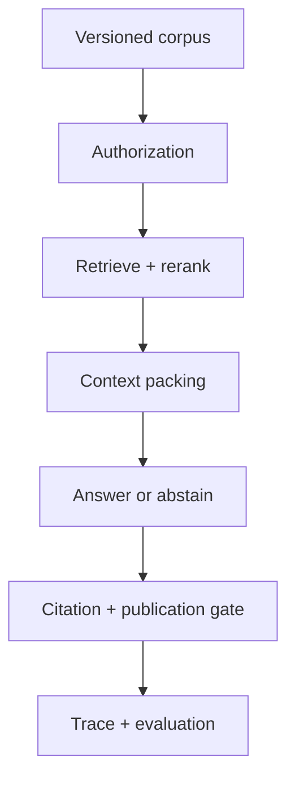

# RAG Foundations：从一次问答到可审计服务

**项目导航**：[返回项目索引](../project-index.md) ·
[RAG 总览](../../applications/rag.md) ·
[请求生命周期](../../applications/rag-request-lifecycle.md) ·
[实验 5](../labs/lab-5-rag-request.md) ·
[运行手册](https://github.com/NightLemon/about-llm/blob/main/projects/rag-foundations/README.md) ·
[证据页](../../evidence/rag-answer-controls.md)
{ .doc-nav }

这个项目只回答一条主问题：一份带权限的资料怎样经过检索、重排、装箱与引用检查，最后成为可发布回答或明确拒答。
第一次阅读先完成二十分钟主线；摄取、持久化、服务和真实模型都是按问题进入的后续路线。

## 你会构建什么



完成后，你应能指出：

1. 当前调用者能看哪些 source；
2. 正确证据在哪一层进入或离开候选集；
3. Packed context 怎样绑定短 source ID；
4. 有相关文本却没有充分证据时，为什么应拒答；
5. 一次固定样例支持哪些结论，不能外推到哪里。

## 二十分钟最小路径 {#run}

在仓库根目录运行：

~~~powershell
python -m pip install -c constraints/ci.txt -e .
python projects/rag-foundations/rag_request_walkthrough.py
~~~

不要顺序阅读整份 JSON。沿下面七个字段追踪第一个请求，再用同一顺序查看拒答案例：

```text
trusted_security_context
→ retrieval.candidates
→ rerank.results
→ packing.source_map
→ answer
→ citation
→ final
```

| 检查点 | 先预测 | 运行后确认 |
|---|---|---|
| Authorization | 跨租户或无权限文档是否可能影响分数 | 未授权内容在评分前退出候选集 |
| Retrieval/rerank | 哪些 source 应进入 top-k | 排序结果仍绑定 query、chunk 与 scorer identity |
| Packing | 两个 chunk 怎样映射为 `S1/S2` | Token 预算没有切断来源映射 |
| Answer | 有相关文本是否就足够回答 | 一个请求回答，另一个因证据不足拒答 |
| Publication | 引用缺失时能否继续发布 | Answer、abstain 与 reject 是不同终态 |

Walkthrough 使用固定小语料、BM25、录制重排分数和逐字抽取，不调用 embedding provider、learned reranker 或 LLM。
精确分数与固定输入在[证据页](../../evidence/rag-answer-controls.md)查阅；完整参数、文件和排错命令由
[项目 README](https://github.com/NightLemon/about-llm/blob/main/projects/rag-foundations/README.md)维护。

## 一次请求中各层负责什么

| 层次 | 唯一问题 | 失败时先去哪里 |
|---|---|---|
| 身份与 ACL | 哪些文档允许进入候选集 | [RAG 生产](../../applications/rag-production.md) |
| Retrieval | 相关来源是否进入 top-k | [RAG 检索](../../applications/rag-retrieval.md) |
| Rerank | 更贵的排序是否改善 held-out qrels | [RAG 检索](../../applications/rag-retrieval.md) |
| Packing | 哪些证据真正进入 Prompt | [RAG 生成](../../applications/rag-generation.md) |
| Generation | 回答、拒答还是错误 | [RAG 生成](../../applications/rag-generation.md) |
| Publication | 引用和业务规则是否允许发布 | [请求生命周期](../../applications/rag-request-lifecycle.md) |

项目页只帮助你沿一次请求选择下一步，不在这里重讲各层机制。

## 分开评测检索和回答 {#retrieval-reranking-metrics}

检索评测与回答评测必须分账：

| 问题 | 先看什么 | 不能据此推出 |
|---|---|---|
| 标注来源是否进入候选 | Recall@k、MRR、nDCG、all-evidence recall | 模型一定会使用证据 |
| 最终动作是否正确 | Answer/abstain/reject、引用与字段结果 | 检索器本身已经最优 |
| 失败分母是否完整 | Error、timeout、parse failure、unjudged | 只对成功回答算出的质量 |
| Rerank 是否改善 | 同一 qrels 下的前后配对结果 | Recorded score 代表真实模型质量 |

无答案 case 即使检索到主题相关文本，也可能应该拒答。反过来，引用 ID 可解析只说明映射存在，
不证明 claim 得到语义支持。完整命令在 README 的“分别评价检索和回答”，指标定义见
[评测总览](../../quality/evaluation.md)。

## 选修：用可手算输入理解检索表示学习 {#retriever-learning-control}

只有在能解释主线的授权、检索和拒答后，再进入 dense retriever 选修。这个固定实验把 InfoNCE、negative、
MaxSim 与 padding mask 分开，让你观察：

- 正例和负例怎样改变一个 query 的训练目标；
- False negative 为什么会给相关文档错误梯度；
- Late interaction 为何不能用单向量相似度代替；
- Padding 若进入 pooling 或 MaxSim，分数怎样被污染。

它只验证小型固定向量与公式，不证明目标 encoder、ANN 索引或线上阈值。运行入口和测试命令见
[README 的脚本索引](https://github.com/NightLemon/about-llm/blob/main/projects/rag-foundations/README.md#根据当前问题选择入口)，
机制解释见[检索表示学习](../../applications/retrieval-learning.md)。

## 其余路线什么时候进入

| 路线 | 何时进入 | 完成信号 |
|---|---|---|
| 摄取与 SQLite | 需要更新、删除和重建来源 | 能解释 source version、稳定 chunk ID 与冲突处理 |
| 备份与恢复 | 数据库已经成为发布工件 | 能校验文件、schema、row fingerprint 和恢复后查询 |
| Localhost ASGI | 需要观察认证、deadline 与背压 | 身份来自可信会话，超时和取消有明确终态 |
| Tokenized packing | 需要目标 tokenizer 的真实预算 | 保存完整 Prompt identity 与输出预留 |
| 固定 Qwen | 想观察真实模型第一次失败 | 能区分模型输出、引用 gate 与离线回放 |
| Generation trace | 需要复核一次发布决定 | Trace 能回到请求、chunk、Prompt 和原始输出身份 |

这些路线的完整命令、输入输出和故障表只在
[项目 README](https://github.com/NightLemon/about-llm/blob/main/projects/rag-foundations/README.md)维护。
历史 Qwen 结果和每项不可外推边界只在[证据页](../../evidence/rag-answer-controls.md)维护。

## 三个入口怎样分工

| 入口 | 负责什么 |
|---|---|
| 本页 | 学习顺序、关键观察、路线选择与交付标准 |
| [项目 README](https://github.com/NightLemon/about-llm/blob/main/projects/rag-foundations/README.md) | 安装、完整命令、文件清单、故障排查和测试 |
| [RAG 证据页](../../evidence/rag-answer-controls.md) | 固定输入、精确结果、运行身份和不可外推边界 |

## 项目交付物

不要只提交终端截图。至少保留：

1. 请求 A/B 的阶段表和最终 action；
2. 去掉 principal 的权限负例；
3. 一个 query/content binding 破坏实验；
4. Retrieval 与 answer 分层报告；
5. Corpus/index/model/policy identity；
6. 一条失败 trace 的第一个错误环节；
7. 已证明、未证明和目标环境待验证清单。

作品集可以描述“构建先授权再检索的 RAG 参考链路，并用跨租户、证据不足和过期评分负例验证边界”。
不要写“彻底解决幻觉”或“生产级零泄漏”；固定本地样例无法支持这类结论。
