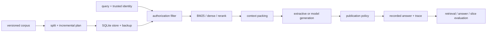

# RAG Foundations

**项目导航**：[返回项目索引](../project-index.md) · [RAG 总览](../../applications/rag.md) · [检索与重排](../../applications/rag-retrieval.md) · [生产 RAG](../../applications/rag-production.md) · [实验 5](../labs.md#lab-5)
{ .doc-nav }

## 目标

用透明、可替换、可审计的组件构建 RAG，而不是先把摄取、权限、检索、packing、生成和评测藏进同一条框架链。每层必须保存自己的 identity、输入输出和失败原因；tenant/principal ACL 必须在任何 scorer、reranker、context 或 generator 看到正文前执行。

| 层 | 当前仓库证据 | 明确不代表 |
|---|---|---|
| 检索与摄取 | CPU BM25/RRF、稳定 chunk、SQLite 事务、ACL-before-ranking | learned embedding、远端向量库或多副本一致性 |
| 回答与引用 | exact authorized span、citation syntax、recorded judgment 聚合 | claim-evidence entailment、来源权威或生成质量 |
| 目标模型 | 固定 Qwen CPU FP32 两个失败 case | 总体质量、GPU/vLLM、延迟或生产安全 |
| 发布策略 | counterfactual replay + 独立 guarded runtime control | provider 调用节省、计费、线上因果收益 |

## 最小运行 { #run }

先执行 authorization-first BM25 检索：

~~~powershell
python -m about_llm.rag.cli retrieve `
  --corpus projects/rag-foundations/sample_corpus.jsonl `
  --query "RAG 为什么要先做 ACL 权限过滤" `
  --tenant tenant-a `
  --principal engineering `
  --top-k 3
~~~

输出应包含 rank、score、稳定 chunk/source/version、heading path、授权后的 `<source>` context 和 `[S1]` 映射。先预测结果：`tenant-b-secret` 即使词面高度相关也不能进入 tenant-a 候选；没有 engineering principal 时，受限的 `rag-security` 不能被评分。空 ACL 只表示租户内公开，不表示跨租户公开。

再运行不依赖 LLM 的 exact-span 回答与离线评测：

~~~powershell
python -m about_llm.rag.cli answer-extractive `
  --corpus projects/rag-foundations/sample_corpus.jsonl `
  --query-id metrics-and-entailment `
  --query "RAG 为什么既要评测 Recall nDCG，又不能把合法引用当成语义蕴含" `
  --tenant tenant-a `
  --principal engineering

python -m about_llm.rag.cli evaluate-extractive `
  --corpus projects/rag-foundations/sample_corpus.jsonl `
  --cases projects/rag-foundations/sample_eval.jsonl
~~~

Answer baseline 只能从已授权且已 packed 的 chunk 按字符 offset 复制原文 span，再附短引用；被 budget 丢弃或未授权的文档不可能提供答案。当前 5 条 authored fixture 得到 3 次 answer、2 次 abstain，action accuracy、grounded-answer pass rate 与 recorded gate pass rate 都是 1.0。它只证明固定小语料的机械回归：exact substring 不证明来源真实、语义相关、答案完整或阈值校准。

## 摄取、版本与显式删除

Markdown splitter 保留 heading path，对超长段落做无损兜底；chunk id 绑定稳定 source、heading、内容和同内容 occurrence，不直接使用列表顺序。插入无关段落不会让后续全部 chunk 重命名，修改内容、移动标题或重复次数变化会产生新 identity。

单机 reference store 使用 SQLite schema-v1。每次演练使用全新数据库文件名：

~~~powershell
New-Item -ItemType Directory -Force artifacts/rag | Out-Null
python -m about_llm.rag.cli store-upsert `
  --database artifacts/rag/rag-demo.db `
  --corpus projects/rag-foundations/sample_corpus.jsonl `
  --tenant tenant-a `
  --source-id rag-security `
  --expect-absent

python -m about_llm.rag.cli store-retrieve `
  --database artifacts/rag/rag-demo.db `
  --query "ACL 权限过滤" `
  --tenant tenant-a `
  --principal engineering `
  --top-k 3
~~~

首次写入要求 source 不存在；更新与删除必须携带读取到的 `expected-current-version`。`BEGIN IMMEDIATE` 串行化 writer，source fingerprint 同时绑定原文、ACL、metadata、chunk size 和 chunker revision；同 version 换内容或切分配置会 fail closed。删除只能显式执行，空抓取或空切分不会被推断为“删除全部来源”：

~~~powershell
python -m about_llm.rag.cli store-delete `
  --database artifacts/rag/rag-demo.db `
  --tenant tenant-a `
  --source-id rag-security `
  --expected-current-version 1
~~~

Store 先按 tenant 限定 DB 行，再按 principal ACL 缩小候选，之后才创建 BM25。数据库仍含正文与 ACL，默认没有加密；生产环境必须另做文件权限、加密、审计、删除与密钥管理。它没有 embedding/ANN、replication、在线 alias、跨进程 lease 或远端索引事务。

## 可验证备份与恢复

在删除前可对数据库演练一致快照。如果上一节已经执行 delete，请换一个全新数据库文件重新运行 upsert，再开始本节。Backup、manifest 和 restored path 都必须不存在，工具不会覆盖旧工件：

~~~powershell
New-Item -ItemType Directory -Force artifacts/rag/backups | Out-Null
python -m about_llm.rag.cli store-backup `
  --database artifacts/rag/rag-demo.db `
  --backup artifacts/rag/backups/rag-snapshot.db `
  --manifest artifacts/rag/backups/rag-snapshot.manifest.json

python -m about_llm.rag.cli store-verify-backup `
  --backup artifacts/rag/backups/rag-snapshot.db `
  --manifest artifacts/rag/backups/rag-snapshot.manifest.json

python -m about_llm.rag.cli store-restore `
  --backup artifacts/rag/backups/rag-snapshot.db `
  --manifest artifacts/rag/backups/rag-snapshot.manifest.json `
  --database artifacts/rag/rag-restored.db
~~~

Backup 使用 SQLite online backup API，再检查 `quick_check`、foreign keys、精确 schema object 集合和逻辑 source/chunk invariant。Manifest 绑定文件 byte size/SHA-256、row counts 与不依赖 page layout 的 ordered-row fingerprint；源库在快照后继续更新不会改变 backup。

这不是完整 disaster recovery。无密钥 manifest 不认证来源，`created_at_utc` 是本机自报时间，单文件 `fsync` 不证明 parent-directory durability；一次 tiny restore 不证明 RPO/RTO。远端 vector index、object store、cache、trace、删除传播和流量切换都未包含。

## 检索、重排与指标分母

Recorded-score rerank control 让 scorer 前再次执行 tenant/ACL gate，并严格绑定 query、candidate rank/chunk/content 和 scorer identity：

~~~powershell
python -m about_llm.rag.cli rerank-recorded `
  --corpus projects/rag-foundations/sample_corpus.jsonl `
  --scores projects/rag-foundations/reranker-scores.example.jsonl `
  --query "RAG 为什么要先做 ACL 权限过滤" `
  --tenant tenant-a `
  --principal engineering `
  --candidate-k 3 `
  --top-k 2
~~~

缺分、余分、重复 document、非连续 rank、非有限 score、旧 query 或旧内容全部拒绝；score tie 回退到原 candidate rank。示例分数是 authored plumbing fixture，没有运行 learned reranker、目标 tokenizer 或质量/延迟评测。CrossEncoder adapter 可以复用同一 authorization-first core，但仍需固定 revision、truncation 和 held-out qrels。

运行 source-level retrieval evaluation：

~~~powershell
python -m about_llm.rag.cli evaluate `
  --corpus projects/rag-foundations/sample_corpus.jsonl `
  --cases projects/rag-foundations/sample_eval.jsonl `
  --top-k 3
~~~

指标先按 chunk 排序、再按 source 去重，避免长文档多个 chunk 重复占位。Answerable cases 报告 Recall@k、MRR@k、graded nDCG@k、Precision@k 与 all-evidence recall@k；no-answer cases 单独报告 zero-result accuracy，不能共用分母。

- Precision@k 分母是实际返回并检查的前 k 个去重 source；零结果定义为 0，不固定除以 k。
- All-evidence recall 是 query-level 完整集合命中率，所有 `required_source_ids` 都出现才记 1。
- `acl_blocked` gold 表示 case 权限上下文与标注不一致，不能通过放宽 ACL 修复召回。
- 未标注 top result 是 `unjudged`，不自动叫 false positive；真实 qrels 需 pooling 与补标。
- 主题相关但知识库缺少所问事实时仍可能召回文档，zero-result accuracy 不等于 end-to-end abstention quality。

## Context packing：byte 与目标 token 是两种预算

依赖无关的 CPU 演示使用序列化 UTF-8 bytes：

~~~powershell
python -m about_llm.rag.cli pack `
  --corpus projects/rag-foundations/sample_corpus.jsonl `
  --query "ACL 引用" `
  --tenant tenant-a `
  --principal engineering `
  --candidate-k 20 `
  --budget-bytes 500 `
  --max-chunks-per-source 1
~~~

每个候选都记录 `selected / duplicate_document / source_quota / budget`，并保留 prospective cost、canonical source map 和剩余预算。Byte budget 不能称为 model token budget。

真实部署应把目标 tokenizer、完整 system/user chat template 和输出预留一起纳入 prospective prompt 重计数：

~~~powershell
python -m about_llm.rag.cli pack-tokenized `
  --corpus projects/rag-foundations/sample_corpus.jsonl `
  --query "RAG 为什么要先做 ACL 权限过滤" `
  --tenant tenant-a `
  --principal engineering `
  --candidate-k 20 `
  --max-total-tokens 4096 `
  --reserved-output-tokens 512 `
  --tokenizer C:\path\to\deployed-model-or-tokenizer `
  --tokenizer-revision exact-checkpoint-revision `
  --local-files-only `
  --system-prompt-file projects/rag-foundations/system-prompt.example.txt `
  --user-prompt-template-file projects/rag-foundations/user-prompt-template.example.txt `
  --max-chunks-per-source 2
~~~

不能把各 chunk 独立 token 数相加，因为 chat template、分隔符和 context position 会改变最终 prompt。报告绑定 tokenizer/template identity、逐候选总成本、最终 prompt IDs 和 output reservation。Caller-supplied local revision 与无密钥 hash 不认证来源，工具也不会从 tokenizer 猜模型 context window；这个上限必须来自已固定的 model/runtime contract。

## Recorded answer、generation trace 与 citation audit

~~~powershell
python -m about_llm.rag.cli evaluate-answers `
  --corpus projects/rag-foundations/sample_corpus.jsonl `
  --cases projects/rag-foundations/sample_eval.jsonl `
  --answers projects/rag-foundations/sample_answers.jsonl

python -m about_llm.rag.cli audit-traces `
  --corpus projects/rag-foundations/sample_corpus.jsonl `
  --cases projects/rag-foundations/sample_eval.jsonl `
  --answers projects/rag-foundations/sample_answers.jsonl `
  --traces projects/rag-foundations/generation-traces.example.jsonl

python -m about_llm.rag.cli audit `
  --answer-file projects/rag-foundations/sample_answer.md `
  --source-id S1 `
  --source-id S2
~~~

Recorded answer 对 case exact join，并把 `answer / abstain / error` 全部留在分母。Context source 必须在当前 tenant/principals 下 visible；claim 引用必须属于可见 context；supplied verdict 还要带 judgment provenance。`sample_answers.jsonl` 是手写 fixture，`supported` 标签不是评测器自己推断的 entailment，也没有独立人工双标。

Generation trace 进一步绑定 query/security、逐 chunk source/version/content hash、canonical context、prompt/raw output identity 和 answer fingerprint。Audit 会从当前 corpus 重建 context 并核对这些 join，但 authored regex-hash token IDs 不是部署 tokenizer；unsigned、可共同改写的文件不能证明真实模型调用或生产 provenance。

Citation audit 只检查短 ID 是否已授权、是否未知和段落是否漏引。Syntax pass 绝不等于 claim-evidence entailment；语义忠实度仍需人工标注集、judge 校准、误报/漏报和切片分析。

## Persistent extractive ASGI service

先用 SQLite store 准备数据，再从环境变量注入 localhost demo token：

~~~powershell
$env:ABOUT_LLM_RAG_DEMO_TOKEN = "replace-with-a-long-local-demo-token"
python projects/rag-foundations/serve_extractive.py `
  --database artifacts/rag/rag-demo.db `
  --tenant tenant-a `
  --subject local-demo-user `
  --principal engineering
~~~

Request body 不允许自报 tenant 或 principals，它们只能来自 `AuthResolver`；多余字段为 422。`/health/live` 只检查进程响应，`/health/ready` 会重开 SQLite 并验证 schema。每次 query 同样重开数据库、先 ACL 后 BM25，并返回 server-generated request id、answer/citations、retrieved IDs、完整 artifact/fingerprint 和 `Cache-Control: no-store`。

运行不打开 TCP socket 的可复现 control：

~~~powershell
python projects/rag-foundations/rag_service_control.py
~~~

它真实执行 FastAPI/Starlette/HTTPX ASGI dispatch 与 SQLite reopen；engineering/anonymous 分别只看到 2/1 个授权 source，body tenant injection=422、缺 credential=401。同步 SQLite/BM25 在线程中执行：HTTP 504 或 client cancellation 不能杀死 thread，因此 permit 会一直占用到后台工作真正结束，避免表面并发上限失真。

Static Bearer 只适合 loopback demo，不是 JWT/OAuth/IAM；ASGITransport 不打开 TCP/TLS。进程内 semaphore 也不是多 worker/replica 全局 admission。生产需要可信 proxy identity、集中认证授权、cooperative cancellation 或进程隔离、全局容量控制和受控 trace store。

## 固定 Qwen：失败、反事实策略与真实 guard

### 1. 保留原始失败

~~~powershell
python projects/rag-foundations/run_qwen_rag_control.py --local-files-only
python -m pytest tests/test_rag_transformers_control.py -q
~~~

Control 固定 Qwen2.5-0.5B-Instruct revision、7 个文件和 999,586,347 bytes，在 CPU FP32 eager 下真实执行 authorization-first BM25、目标 tokenizer packing、逐步 greedy/KV cache 与 `GenerationMixin.generate()` 对照。录制 report fingerprint 为 `sha256:829663e2…e5b60`。

Attempt-1 没有为追求漂亮结果调 prompt：answerable case 复述正确证据却漏掉 `[S1]`；no-answer case 的授权 context 为空，却生成无来源 Kubernetes 步骤并在 64-token cap 停止。行为 gate 是 **0/2**。这证明“检索为零不自动拒答”和“内容看似正确不等于引用合格”，不是模型质量通过。

### 2. Counterfactual publication-policy replay

~~~powershell
python projects/rag-foundations/replay_qwen_rag_publication_policy.py `
  --verify projects/rag-foundations/qwen2.5-0.5b-rag.publication-policy-replay.json
python -m pytest tests/test_rag_generation_policy.py -q
~~~

Replay fingerprint 为 `sha256:ed4d16ad…b13239`。相同已录制输入/输出经过 fail-closed policy 后：有 context 但漏引的 case 是 `post_generation/reject`、logical generator call count=1；空 context case 是 `pre_generation/abstain`、count=0。Audit projection 可保留 raw output，public projection 只允许固定 response/action/stage/boundary 字段。

它必须称为 counterfactual replay：没有观察 guard 当时真实包裹 Qwen，也没有测得 provider/GPU 调用或费用被省掉。

### 3. 独立 guarded runtime control

~~~powershell
python projects/rag-foundations/run_qwen_guarded_rag_control.py --local-files-only
python -m pytest tests/test_rag_guarded_transformers_control.py -q
~~~

独立 report fingerprint 为 `sha256:00706d00…f29ede`。有证据 case 的 callback 与 `GenerationMixin.generate` API 各调用 1 次，Qwen 因漏引被 post-generation reject；空证据 case 的 prompt 只为审计计算，generator/framework generate 都是 0 次并 pre-generation abstain。Public projection 不含 raw output 或 finding text。

这里的 1/0 是 Python API invocation count，不是 forward/kernel/provider request 或 billing count。Verifier 不重放模型 decode；两个 query 共享 authored corpus 与设计过程，也不是代表性质量集。三层证据都不证明 claim-evidence entailment、总体质量、GPU/vLLM、性能、远程取消或生产安全。

## 最小验证与故意破坏

完整 RAG 项目测试入口：

~~~powershell
python -m pytest tests/test_rag.py tests/test_rag_ingestion.py tests/test_rag_sqlite_store.py tests/test_rag_sqlite_backup.py tests/test_rag_citations.py tests/test_rag_reranking.py tests/test_rag_context_packing.py tests/test_rag_cli.py tests/test_rag_extractive.py tests/test_rag_answer_eval.py tests/test_rag_trace.py tests/test_rag_service.py tests/test_rag_service_control.py tests/test_rag_transformers_control.py tests/test_rag_generation_policy.py tests/test_rag_guarded_transformers_control.py -q
~~~

至少运行这些 fail-closed 反例：ACL 必须在 ranking/scorer 前执行；SQLite 中途失败必须回滚旧 version/chunks；backup 即使协同重算 manifest 也要发现语义 row/schema 漂移；budget 会丢弃的候选仍必须先授权；body 不得注入 tenant；trace/content、Qwen audit 与 framework invocation count 漂移都必须拒绝：

~~~powershell
python -m pytest tests/test_rag.py::test_bm25_filters_principal_acl_before_ranking tests/test_rag_reranking.py::test_reranker_filters_tenant_and_acl_before_scorer_call tests/test_rag_context_packing.py::test_every_candidate_is_authorized_even_when_budget_would_drop_it -q
python -m pytest tests/test_rag_sqlite_store.py::test_database_trigger_failure_rolls_back_delete_and_version tests/test_rag_sqlite_backup.py::test_backup_verification_rejects_semantically_corrupted_rows_even_if_rehashed tests/test_rag_sqlite_backup.py::test_backup_verification_rejects_unversioned_schema_objects_even_if_rehashed -q
python -m pytest tests/test_rag_service.py::test_body_cannot_self_report_security_context_and_auth_errors_are_closed tests/test_rag_trace.py::test_audit_detects_chunk_identity_version_and_content_changes tests/test_rag_transformers_control.py::test_report_cooperative_raw_output_rehash_cannot_hide_stale_local_audit tests/test_rag_guarded_transformers_control.py::test_cooperative_rehash_cannot_hide_semantic_drift -q
~~~

验收不能只看答案文本。至少保存：corpus/source/chunker identity、trusted caller identity、授权后 candidate count、retrieval/rerank/packing ledger、prompt/output/answer trace、指标分母、一个越权或篡改反例，以及不超过五行的证据边界。

## 证据边界

当前项目证明了 authored corpus 上的 ACL-before-ranking/scoring、透明 BM25/RRF/packing/metric、SQLite schema-v1 事务与本地备份恢复、extractive/ASGI control，以及固定 Qwen CPU FP32 的两条真实失败和独立 fail-closed guard。它没有完成 learned embedding/reranker 的目标语料消融、远端向量库事务/灾备、claim-evidence entailment、代表性生成评测、生产 IAM/TLS、多副本 admission、目标 GPU/vLLM、容量、延迟或 SLO。无密钥 hash 与 caller-supplied identity 不认证来源；CPU、ASGI、loopback 与少量 authored case 不得外推为生产安全、模型质量或性能结论。

完整实现、schema 与逐项账本见 [projects/rag-foundations](https://github.com/NightLemon/about-llm/tree/main/projects/rag-foundations)。
