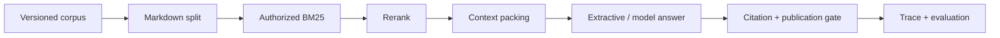

# RAG Foundations：从一次问答到可审计服务

**项目导航**：[返回项目索引](../project-index.md) ·
[RAG 总览](../../applications/rag.md) ·
[请求生命周期](../../applications/rag-request-lifecycle.md) ·
[实验 5](../labs/lab-5-rag-request.md) ·
[证据页](../../evidence/rag-answer-controls.md)
{ .doc-nav }

这个项目不是“用框架把 PDF 接到聊天模型”。它用小而透明的组件回答五个工程问题：

1. 当前调用者能看哪些资料？
2. 答案证据在哪一层进入或离开候选集？
3. Context 和 citation 怎样绑定到精确 source？
4. 有结果但没答案时，系统怎样拒答？
5. 一次结果能支持什么结论，不能支持什么结论？

## 你会构建什么



项目同时提供一条离线教材路径和三条进阶路径：

| 路径 | 先解决什么 | 是否需要模型/GPU |
|---|---|---|
| 请求 walkthrough | 权限、召回、重排、packing、引用、拒答 | 否 |
| 摄取 walkthrough | 稳定片段 ID、增量更新、版本冲突、ACL 读取 | 否 |
| 持久化与服务 | 版本、删除、备份、认证、deadline | 否 |
| 目标 tokenizer packing | 完整 Prompt token 预算 | 需要 tokenizer，可离线 |
| 固定 Qwen 运行 | 真实模型的引用与拒答失败 | 需要本地约 1 GB snapshot，不需要 GPU |

第一次只完成请求 walkthrough。其余路径在你能解释 A/B 两个请求后再进入。

## 二十分钟最小路径 { #run }

安装基础依赖：

~~~powershell
python -m pip install -c constraints/ci.txt -e .
~~~

运行同一 corpus 上的一次 answer 与一次 abstain：

~~~powershell
python projects/rag-foundations/rag_request_walkthrough.py
~~~

不要从 JSON 第一行读到最后一行。按下面顺序观察：

```text
requests[0].trusted_security_context
requests[0].retrieval
requests[0].rerank
requests[0].packing.source_map
requests[0].answer
requests[0].citation
requests[0].final
```

请求 A 的关键结果是：

```text
query                 RAG 为什么要先做 ACL 权限过滤
BM25 stable sources   rag-security, rag-evaluation, rag-security
rerank top-2          rag-security, rag-security
source map            S1/S2 -> 两个不同 security chunks
coverage              1.0
final                  answer
```

请求 B 问 Kubernetes 灾备步骤。它仍有三个主题相关结果，但有效 query token 覆盖只有 `2/9`，
所以 final action 是 `abstain`。

它的 `citation.syntax_status` 是 `not_applicable`，表示拒答不进入引用门禁。引用门禁只处理回答动作：
答案必须至少带一个已知 source ID 并通过语法检查；缺少引用时，最终动作会变成 `reject`。

这条路径没有执行 Embedding、learned reranker 或 LLM。
它先证明固定小语料上的控制流和 exact-span provenance。

## 先读懂四个输入文件

| 文件 | 用途 | 不要误解为 |
|---|---|---|
| `sample_corpus.jsonl` | 四份 versioned source 与 ACL | 代表性生产语料 |
| `sample_eval.jsonl` | Answerable/no-answer、qrels 与 security context | 独立人工 benchmark |
| `reranker-scores.example.jsonl` | Query/chunk 绑定的人工 score | Learned model 输出 |
| `sample_answers.jsonl` | Recorded action、claim 与 supplied verdict | 自动语义判断结果 |

打开 `sample_corpus.jsonl`，先预测 `tenant-a / engineering` 能看到哪些 source。
`tenant-b-secret` 即使关键词最多，也不能进入在线请求的查询期统计和排序。

## 选修：用可手算输入理解检索表示学习 { #retriever-learning-control }

想理解 dense retriever 的训练目标时，再运行：

~~~powershell
python projects/rag-foundations/retriever_learning_toy.py
python -m pytest tests/test_retriever_learning.py -q
~~~

这个小实验使用仓库提供的向量，分别演示：

- 单正例与多正例 InfoNCE 怎样计算；
- 损失对 query 向量的解析梯度；
- hard negative 和 false negative 为什么不能混为一谈；
- ColBERT 的 MaxSim 与 SPLADE pooling 怎样聚合 token 分数。

脚本不执行 encoder、ANN 检索或 GPU kernel，准备好的向量也不代表真实检索质量。完整推导见
[检索表示学习](../../applications/retrieval-learning.md)。

## 路径一：拆开观察一次请求

### 只看 authorization-first BM25

~~~powershell
python -m about_llm.rag.cli retrieve `
  --corpus projects/rag-foundations/sample_corpus.jsonl `
  --query "RAG 为什么要先做 ACL 权限过滤" `
  --tenant tenant-a `
  --principal engineering `
  --top-k 3
~~~

输出会列出每个 chunk 的排名、稳定来源 ID、文档版本和标题路径，并把最终上下文编号为 `S1..Sn`。

去掉 `--principal engineering` 再运行。Query 没变，`rag-security` 应消失；
不要把安全上下文变化误诊为相关性变化。

### 单独看 recorded rerank

~~~powershell
python -m about_llm.rag.cli rerank-recorded `
  --corpus projects/rag-foundations/sample_corpus.jsonl `
  --scores projects/rag-foundations/reranker-scores.example.jsonl `
  --query "RAG 为什么要先做 ACL 权限过滤" `
  --tenant tenant-a `
  --principal engineering `
  --candidate-k 3 `
  --top-k 2
~~~

进入 reranker 前会再次检查权限。样例分数同时绑定查询文本、chunk 字节和评分器身份。
查询或内容发生变化、某个候选缺分或多分、分数出现 `NaN/Infinity` 时，命令都会失败。

这个固定样例用于检查 query、chunk 和 score 的绑定能否正常工作。要声称质量提升，必须在 held-out qrels 上
比较排序与延迟。

### 单独看 packing

~~~powershell
python -m about_llm.rag.cli pack `
  --corpus projects/rag-foundations/sample_corpus.jsonl `
  --query "ACL 引用" `
  --tenant tenant-a `
  --principal engineering `
  --candidate-k 20 `
  --budget-bytes 500 `
  --max-chunks-per-source 1
~~~

每个候选会得到：

```text
selected
duplicate_document
source_quota
budget
```

`budget-bytes` 使用 UTF-8 bytes，只用来直观演示 packing 取舍，不能称为模型 token budget。

### 单独看逐字答案

~~~powershell
python -m about_llm.rag.cli answer-extractive `
  --corpus projects/rag-foundations/sample_corpus.jsonl `
  --query-id acl-before-ranking `
  --query "RAG 为什么要先做 ACL 权限过滤" `
  --tenant tenant-a `
  --principal engineering
~~~

输出工件保存原文字符位置、来源与哈希、query 覆盖率、上下文装包决定，以及最终是回答还是拒答。
在线 API 不接收 qrels 或 `answerable` 标签，防止参考答案直接控制系统行为。

## 路径二：分别评价召回与回答 { #retrieval-reranking-metrics }

### Source-level retrieval evaluation

~~~powershell
python -m about_llm.rag.cli evaluate `
  --corpus projects/rag-foundations/sample_corpus.jsonl `
  --cases projects/rag-foundations/sample_eval.jsonl `
  --top-k 3
~~~

报告把 answerable 与 no-answer 分开：

- Answerable：Recall、MRR、nDCG、Precision 与 all-evidence recall。
- No-answer：zero-result 只是检索信号，不等于最终拒答正确。
- 参考来源状态：区分当前用户可见、被 ACL 阻止，以及租户语料中本来就不存在。
- 未标注结果：称为 unjudged，不自动视为 false positive。

### End-to-end extractive evaluation

~~~powershell
python -m about_llm.rag.cli evaluate-extractive `
  --corpus projects/rag-foundations/sample_corpus.jsonl `
  --cases projects/rag-foundations/sample_eval.jsonl
~~~

固定五条 case 产生三次 answer、两次 abstain。全绿只说明这组人工编写的小数据没有回归，
不说明阈值、来源与语义适合真实业务。

### Recorded answer gate

~~~powershell
python -m about_llm.rag.cli evaluate-answers `
  --corpus projects/rag-foundations/sample_corpus.jsonl `
  --cases projects/rag-foundations/sample_eval.jsonl `
  --answers projects/rag-foundations/sample_answers.jsonl
~~~

这条门禁先按 ID 精确连接样例与输出，再检查回答使用的是已授权上下文、每条 claim 带有合法引用，
以及人工判断来自哪份记录。

`supported` 结论由样例文件提供。评测器会验证它的绑定关系，但不会自动做语义蕴含判断。

## 路径三：把 Prompt identity 也纳入 packing

Byte budget 不能回答目标模型是否超窗。使用目标 tokenizer：

~~~powershell
python -m about_llm.rag.cli pack-tokenized `
  --corpus projects/rag-foundations/sample_corpus.jsonl `
  --query "RAG 为什么要先做 ACL 权限过滤" `
  --tenant tenant-a `
  --principal engineering `
  --candidate-k 20 `
  --max-total-tokens 4096 `
  --reserved-output-tokens 512 `
  --tokenizer C:\path\to\deployed-model-or-tokenizer `
  --tokenizer-revision exact-revision `
  --local-files-only `
  --system-prompt-file projects/rag-foundations/system-prompt.example.txt `
  --user-prompt-template-file projects/rag-foundations/user-prompt-template.example.txt
~~~

每尝试加入一个候选 chunk，程序都会重新渲染完整对话。报告保存 tokenizer 和模板身份、最终 token ID，
以及为模型回答预留的空间。

Caller 提供的 revision 与无密钥 hash 不认证实际模型来源；最大 context 也不能从 tokenizer 自动猜出。

## 路径四：版本化摄取与 SQLite

先让项目中的 `rag-security` 来源经历一次真实更新：

~~~powershell
python projects/rag-foundations/rag_ingestion_walkthrough.py
~~~

按顺序比较 `version_1.chunks`、`version_2.chunks`、`incremental_plan` 和 `sqlite`。
未改的引用段保持相同片段 ID，但由于来源版本和顺序变化仍要更新；被编辑的段落获得新 ID，旧 ID 被删除。
匿名主体看不到私有片段，`engineering` 可以读取更新后的三个片段。完整讲解见
[数据摄取、切分与索引生命周期](../../applications/rag-ingestion.md)。

理解这份固定结果后，再用 CLI 创建自己的数据库：

创建全新数据库：

~~~powershell
New-Item -ItemType Directory -Force artifacts/rag | Out-Null
python -m about_llm.rag.cli store-upsert `
  --database artifacts/rag/rag-demo.db `
  --corpus projects/rag-foundations/sample_corpus.jsonl `
  --tenant tenant-a `
  --source-id rag-security `
  --expect-absent
~~~

从持久化 store 检索：

~~~powershell
python -m about_llm.rag.cli store-retrieve `
  --database artifacts/rag/rag-demo.db `
  --query "ACL 权限过滤" `
  --tenant tenant-a `
  --principal engineering `
  --top-k 3
~~~

更新与删除需要 expected current version。空抓取或空 split 不会被推断为“删除所有来源”。

~~~powershell
python -m about_llm.rag.cli store-delete `
  --database artifacts/rag/rag-demo.db `
  --tenant tenant-a `
  --source-id rag-security `
  --expected-current-version 1
~~~

SQLite reference 证明单库事务、版本冲突与授权读取，不证明远端 ANN、多副本或跨存储原子性。

## 路径五：备份与恢复演练

如果上一节已经删除 source，请使用新数据库重新 upsert。输出路径必须不存在：

~~~powershell
New-Item -ItemType Directory -Force artifacts/rag/backups | Out-Null
python -m about_llm.rag.cli store-backup `
  --database artifacts/rag/rag-demo.db `
  --backup artifacts/rag/backups/rag-snapshot.db `
  --manifest artifacts/rag/backups/rag-snapshot.manifest.json

python -m about_llm.rag.cli store-verify-backup `
  --backup artifacts/rag/backups/rag-snapshot.db `
  --manifest artifacts/rag/backups/rag-snapshot.manifest.json

python -m about_llm.rag.cli store-restore `
  --backup artifacts/rag/backups/rag-snapshot.db `
  --manifest artifacts/rag/backups/rag-snapshot.manifest.json `
  --database artifacts/rag/rag-restored.db
~~~

备份清单绑定文件字节、数据库结构、行数和按固定顺序计算的逻辑指纹。它用于发现备份内容漂移。
这份清单没有签名和加密，也没有覆盖远端索引、缓存或流量切换；完整灾备还需要另外演练这些组件。

## 路径六：本地 Persistent ASGI service

先准备 SQLite，再为 loopback demo 注入 token：

~~~powershell
$env:ABOUT_LLM_RAG_DEMO_TOKEN = "replace-with-a-long-local-demo-token"
python projects/rag-foundations/serve_extractive.py `
  --database artifacts/rag/rag-demo.db `
  --tenant tenant-a `
  --subject local-demo-user `
  --principal engineering
~~~

这个服务把身份信任边界放在请求正文之外：客户端不能自行声明 tenant 或 principal。`/health/live` 只回答进程是否存活，
`/health/ready` 才回答依赖是否已经准备好。

受保护路由会先执行认证依赖。服务还会检查 Host 允许列表，把 ASGI 请求正文限制在 64 KiB，并在响应中加入服务端
request ID、`Cache-Control: no-store` 和安全响应头。只有允许公开的字段才会进入响应。

生产环境仍要由反向代理提供 TLS、真实 IAM、请求大小和速率限制。应用内部上限只能保护应用自身，
不能替代边缘入口的流量准入。

运行一个不打开 TCP socket 的固定验证程序：

~~~powershell
python projects/rag-foundations/rag_service_control.py
~~~

这个验证程序真实走过 FastAPI、Starlette 和 HTTPX 的内存 ASGI 调用链。它还会关闭并重新打开 SQLite，
检查本地持久化是否仍能读取。

先比较 `engineering` 和 `anonymous`：同一问题会因权限不同而使用不同来源。再看 `pressure`：第一个慢请求返回
`504 execution_timeout` 后，后台线程继续占用唯一许可；第二个请求因此得到 `503 queue_saturated`。
线程结束并释放许可后，第三个请求恢复为 200。这个顺序说明 HTTP 终态与后台工作终态不能混为一谈。

这个过程不创建 TCP/TLS 服务。JWT/OAuth、多 worker 全局容量和远端取消也需要单独验证。

## 路径七：保留真实模型的第一次失败

本地已有固定 Qwen snapshot 时运行：

~~~powershell
python projects/rag-foundations/run_qwen_rag_control.py --local-files-only
python -m pytest tests/test_rag_transformers_control.py -q
~~~

固定结果不是漂亮 Demo：

- Answerable case 复述证据却漏引。
- Empty-context case 仍编造 Kubernetes 灾备步骤。
- 行为 gate 为 `0/2`。

接着比较两种不同证据：

~~~powershell
python projects/rag-foundations/replay_qwen_rag_publication_policy.py `
  --verify projects/rag-foundations/qwen2.5-0.5b-rag.publication-policy-replay.json

python projects/rag-foundations/run_qwen_guarded_rag_control.py --local-files-only
~~~

第一条是 counterfactual replay，没有观察 guard 当时包裹模型；
第二条真实包裹 `GenerationMixin.generate()`，但只运行两个本仓库编写的 case，也没有 GPU/vLLM 证据。

## Generation trace 与 citation audit

~~~powershell
python -m about_llm.rag.cli audit-traces `
  --corpus projects/rag-foundations/sample_corpus.jsonl `
  --cases projects/rag-foundations/sample_eval.jsonl `
  --answers projects/rag-foundations/sample_answers.jsonl `
  --traces projects/rag-foundations/generation-traces.example.jsonl

python -m about_llm.rag.cli audit `
  --answer-file projects/rag-foundations/sample_answer.md `
  --source-id S1 `
  --source-id S2
~~~

Trace 把查询与安全上下文、chunk 内容与版本、渲染后的上下文、Prompt 和原始输出身份绑定起来。
本节使用仓库手写的协议样例。无签名哈希可以发现内容变化，模型执行者仍需独立认证；语义蕴含也要由另一层评测完成。

## 代码阅读顺序

| 读者问题 | 文件 |
|---|---|
| 文档怎样切成稳定 chunk？ | `src/about_llm/rag/ingestion.py` |
| ACL 怎样影响 BM25 统计？ | `src/about_llm/rag/bm25.py` |
| Scorer 前怎样二次授权？ | `src/about_llm/rag/reranking.py` |
| Budget 和 source quota 怎样决定 context？ | `src/about_llm/rag/context_packing.py` |
| Exact span 与 abstain 怎样形成？ | `src/about_llm/rag/extractive.py` |
| Citation syntax 检查什么？ | `src/about_llm/rag/citations.py` |
| Publish/abstain/reject 怎样分开？ | `src/about_llm/rag/generation_policy.py` |
| SQLite 版本与删除怎样实现？ | `src/about_llm/rag/sqlite_store.py` |

按请求流向读，不要先逐文件通读全部测试。

## 最小测试门禁

~~~powershell
python -m pytest `
  tests/test_rag.py `
  tests/test_rag_reranking.py `
  tests/test_rag_context_packing.py `
  tests/test_rag_citations.py `
  tests/test_rag_extractive.py `
  tests/test_rag_answer_eval.py `
  tests/test_rag_generation_policy.py `
  tests/test_rag_request_walkthrough.py `
  -q
~~~

完整专项还覆盖摄取、SQLite、备份、服务、Trace 和固定 Qwen 实验。阅读测试时要问它验证了哪个具体结论，
不要用测试总数代替对结论范围的理解。

## 项目交付物

不要只提交终端截图。一个可评审的结果应包含：

```text
1. 请求 A/B 的阶段表和最终 action
2. 去掉 engineering principal 的权限负例
3. 一个 query/content binding 破坏实验
4. Retrieval 与 answer 指标的分层报告
5. Corpus/index/model/policy identity
6. 一条失败 trace 的第一个错误环节
7. 已证明、未证明和目标环境待验证清单
```

可以写进简历的是具体证据，例如：

> 构建一条先授权再检索的 RAG 参考链路：语料有版本，BM25 候选经过重排和 token 预算装包，回答绑定原文位置，
> 证据不足时返回明确拒答。通过跨租户访问、有检索结果但无答案、以及过期评分三个负例验证控制边界。

不要写“彻底解决幻觉”或“生产级零泄漏”。这些本地固定样例无法支持这类结论。
