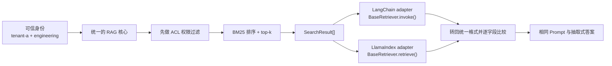

# 同一次 RAG 问答怎样通过 LangChain 与 LlamaIndex

**项目导航**：[项目索引](../project-index.md) · [RAG Foundations](rag-foundations.md) ·
[RAG 检索](../../applications/rag-retrieval.md) · [RAG 生产化](../../applications/rag-production.md) ·
[实验 5A](../labs.md#lab-5a)
{ .doc-nav }

<!-- learning-contract -->
<div class="learning-contract" markdown="1">

**学习导航**

- **适合读者**：已经理解基本 RAG 流程，正在接入 LangChain、LlamaIndex 或其他编排框架的开发者。
- **先修**：先完成 [RAG Foundations](rag-foundations.md#run)，理解权限过滤、检索、Prompt 和引用的先后顺序。
- **首次阅读**：运行一次完整对照，顺着 Engineering 请求看完两条框架路径，再学习字段映射。
- **完成信号**：能解释框架适配层应该保留哪些信息，以及为什么“最终答案相同”还不足以证明接入正确。
- **卡住时**：先把 LangChain 和 LlamaIndex 当成两种不同的运输容器，只比较文档 ID、正文和顺序。

</div>

设想我们已经写好一个小型 RAG 系统。Engineering 用户问：

> RAG 检索为什么要在排序前做权限过滤？

系统先根据可信身份过滤资料，再用 BM25 排序。现在团队想接入 LangChain，也想试试 LlamaIndex。
真正的问题不是“哪个框架更流行”，而是：**同一次安全检索经过两套框架后，结果有没有被悄悄改变？**

本项目让一份检索结果分别经过 LangChain 和 LlamaIndex，然后把两边的对象转换回来。你会亲眼检查：

- Engineering 用户是否始终看到同样的两份资料；
- Anonymous 用户是否只能看到公开资料；
- 文档 ID、正文、分数、顺序和权限信息是否完整保留；
- 两个框架最终渲染出的 Prompt 是否逐字节相同；
- 哪些结论来自这次实验，哪些仍需要在真实模型和生产流量中验证。

## 先看懂这一条请求



图中的“统一 RAG 核心”是本项目自己拥有的领域逻辑。源码把这套统一对象称为
**canonical objects**：它们规定一份文档和一条检索结果在业务中到底是什么。

LangChain `Document` 和 LlamaIndex `TextNode` 只是框架各自的表示。它们可以帮助我们接入 Retriever、Prompt
和后续编排，但不应该重新决定租户、权限、排名或文档身份。

## 二十分钟最小路径 { #run }

### 1. 安装依赖

~~~powershell
python -m pip install -e ".[dev,torch,rag,langchain,llamaindex]"
~~~

### 2. 先预测结果

实验只有四份文档：

| 文档 | 所属租户 | 谁能读取 | 在实验中的作用 |
|---|---|---|---|
| `acl-before-ranking` | `tenant-a` | 所有人 | 回答问题的公开资料 |
| `citation-binding` | `tenant-a` | `engineering` | Engineering 可见的补充资料 |
| `finance-secret` | `tenant-a` | `finance` | 与查询很相似，但当前用户无权读取 |
| `other-tenant` | `tenant-b` | 所有人 | 租户不同，不能参与当前请求 |

在运行脚本前，先写下你的预测：

```text
Engineering -> acl-before-ranking, citation-binding
Anonymous   -> acl-before-ranking
```

`finance-secret` 的关键词即使最匹配，也不能先进入评分再被删除。`other-tenant` 标记为 public，
也只表示对 `tenant-b` 的用户公开，不表示跨租户公开。

### 3. 让请求真实经过两个框架

~~~powershell
python projects/rag-framework-adapters/parity_control.py
~~~

脚本真实调用 LangChain `BaseRetriever.invoke()`、LlamaIndex `BaseRetriever.retrieve()` 和两边的
`PromptTemplate`。当前录制结果来自 `langchain-core==1.5.3` 与 `llama-index-core==0.14.23`。

先不要从 JSON 第一行读到最后一行，只看以下位置：

```text
cases.engineering.canonical_document_ids
cases.engineering.langchain_document_ids
cases.engineering.llamaindex_document_ids
cases.anonymous.*_document_ids
assertions
scope
```

你应该看到：

| 请求 | 统一核心 / LangChain / LlamaIndex | Prompt bytes | 最终答案 |
|---|---|---:|---|
| Engineering | `acl-before-ranking, citation-binding` | 385 | `RAG 检索必须在排序前执行租户和主体权限过滤。 [S1]` |
| Anonymous | `acl-before-ranking` | 277 | 同一答案，只引用公开来源 |

三条路径的文档 ID 和顺序完全相同。Engineering Prompt 的 SHA-256 是
`b9c8cb77…e1e8e19c`，Anonymous Prompt 是 `1e33ed13…e396d8fd`。
这些哈希不是让人背诵的答案；它们帮助程序发现模板、正文或换行是否在升级后发生变化。

因此**你算出的哈希与这里不同并不一定是错**：换了 LangChain / LlamaIndex 版本、或本仓库改过模板，都会让它变。判断标准是同一环境内**两套框架的哈希彼此相同**，而不是与本文档相同。

### 4. 再读结果的边界

报告中的 `assertions` 表示本次运行实际检查了什么。`scope` 中的 `false` 也很重要：本实验没有运行
Embedding 模型、向量数据库、learned reranker 或生成模型，也没有施加生产并发。

固定四文档样例的 Recall@4 和 nDCG@4 都是 1.0。这只表示预先写好的相关性答案与当前检索结果一致，
不表示 LangChain 或 LlamaIndex 的检索质量是 100%，更不表示系统已经达到生产水平。

## 为什么权限必须先于评分

设 \(A(t,p)\) 是服务器根据租户 \(t\) 和主体集合 \(p\) 算出的授权文档集合。正确顺序是：

\[
\operatorname{TopK}_{d\in A(t,p)} s(q,d).
\]

先对全库取 top-k、最后再删掉无权文档，执行的是另一件事：

\[
\operatorname{Filter}_{A(t,p)}\left(\operatorname{TopK}_{d\in D}s(q,d)\right).
\]

用本实验就能看出差别。假设 `finance-secret` 因关键词最多占据第一名，先取 top-2 再过滤会让它挤掉一份
用户本来有权看到的资料。更严重的是，无权正文已经进入 scorer，随后还可能进入 trace 或 cache。

因此，Prompt 中补一句“请忽略无权内容”没有用。模型看到这段内容时，越界已经发生。

## 一条检索结果怎样装进两种框架对象

统一核心输出 `SearchResult[]`。Adapter 的工作只是把这些字段放到框架期待的位置：

| 业务中的信息 | LangChain | LlamaIndex | 为什么必须保留 |
|---|---|---|---|
| 文档 ID | `Document.id` 与 metadata | `TextNode.node_id` 与 metadata | 绑定来源、去重和引用 |
| 正文 | `page_content` | `TextNode.text` | 防止格式化过程改写证据 |
| 租户与 ACL | metadata | metadata | 供后续审计，不重新充当授权判断 |
| 检索分数 | metadata | `NodeWithScore.score` 与 metadata | 解释排序，发现数值漂移 |
| 从 1 开始的排名 | metadata | metadata | 发现框架重排或漏项 |
| 检索器来源 | metadata | metadata | 知道结果由哪套检索逻辑产生 |

业务 metadata 不能提前塞入 `document_id`、`tenant_id`、`acl`、`retrieval_score`、
`retrieval_rank` 或 `retriever`。否则我们无法判断同名值来自业务数据还是适配层，程序会直接报错。

输入本身也要满足几个简单条件：文档 ID 不能重复，rank 必须是 `1..N`，score 必须是有限实数。
程序拒绝 `NaN`、正负无穷和布尔值，不会猜测怎样修复含糊结果。

### LlamaIndex 的 metadata exclusion 不是权限系统

LlamaIndex 在为 Embedding 或 LLM 组装文本时，可以把 metadata 一并渲染进去。本项目把上述控制字段加入
`excluded_embed_metadata_keys` 和 `excluded_llm_metadata_keys`，避免租户、ACL 和检索分数默认混入模型文本。

这项配置只影响当前 node 的默认文本构造。自定义 formatter、callback、日志或 Prompt 仍然可以读取 metadata。
所以它能减少意外拼接，却不能代替身份认证、权限检查或日志脱敏。

## 为什么要把框架对象再转换回来

只比较最终答案会漏掉很多错误。例如，Adapter 丢失了 `tenant_id`，但模型恰好仍生成同一句答案；
或者两份文档的顺序反了，但短答案没有变化。这些都不应该被“答案一样”掩盖。

本项目按三层比较：

1. **结果集合**：文档 ID、数量和顺序是否相同；
2. **每条结果**：正文、租户、ACL、分数、rank 和来源是否相同；
3. **下游输入**：两个框架渲染的 Prompt bytes 和抽取式答案工件是否相同。

这就是 round trip（往返检查）：先把统一对象装进框架对象，再取出来与原对象逐字段对照。
它能发现当前适配过程中的丢字段、改正文和重排，却不能认证最初那份统一检索结果一定来自可信系统。
如果攻击者能同时篡改“原结果”和框架对象，两边仍可能看起来一致；这需要签名、受控存储或独立审计解决。

想只观察对象转换，可以运行：

~~~powershell
python projects/rag-framework-adapters/demo.py
~~~

`demo.py` 不调用 Retriever，也不渲染 Prompt。它适合第一次看对象结构，不是完整的端到端实验。

## 什么时候才是在比较两个框架

当前实验故意固定检索结果，只比较两套框架能否无损承载它。因此，两边结果相同是正确现象，
不是一场框架质量竞赛。

如果你想比较 LangChain 与 LlamaIndex 各自的原生索引和查询引擎，实验问题已经变了。至少要固定：

| 需要固定的部分 | 原因 |
|---|---|
| 同一份 corpus、切块版本和权限策略 | 防止输入或可见集合不同 |
| 同一批 held-out queries 与 qrels | 防止用演示问题代替评测集 |
| 各自的 Embedding、索引和 reranker 版本 | 解释候选与分数来自哪里 |
| 相同的 Prompt、模型和生成参数 | 把检索差异与生成差异分开 |
| 相同的并发、超时和冷热启动条件 | 公平比较延迟与失败率 |

此时不应再要求两边的 raw score 数字相等，因为不同检索器的分数未必在同一尺度。应比较 Recall、nDCG、
答案质量、延迟、资源和失败切片，并保留每条请求的候选与版本信息。

## 把教学实验扩展成真实系统

每接入一层，就新增一种可能漂移或泄漏的位置。

### 换成 learned retrieval

继续让统一 `SearchResult` 作为出口，同时记录 index snapshot、Embedding 和 reranker 版本、候选内容哈希、
授权决定、原始分数和最终 rank。模型不同却都叫 `score`，不表示这些值可以直接比较或相加。

### 接入生成模型

固定 tokenizer、chat template、模型 revision、采样参数、停止条件和 source map。保存原始输出与引用解析结果。
本实验中的答案由确定性的抽取规则生成，`answer_artifact_fingerprint` 不能当作真实 LLM 调用证明。

### 接入异步服务与 tracing

把同步、异步、批处理、流式、取消和重试当成不同路径分别观察。Callback 在异常路径中可能执行零次或多次，
需要用请求 ID 去重并核对终态。

Trace 里的 Prompt、metadata 和正文可能包含敏感信息。为它们设置访问控制、脱敏规则、保留期和租户隔离。

### 接入生产权限

租户和主体必须来自可信认证层，不能由请求 body 自报。Cache key 还要包含租户可见域、权限策略版本、
索引和模型等会改变结果的身份。框架 metadata 适合携带审计信息，不是新的权限事实来源。

## 代码阅读顺序

| 读者问题 | 文件 |
|---|---|
| 统一的文档和检索结果长什么样？ | `src/about_llm/integrations/rag_frameworks.py` 中的领域对象 |
| LangChain / LlamaIndex 怎样接收结果？ | 同文件中的 Adapter 与 Retriever wrapper |
| 往返检查比较了哪些字段？ | 同文件中的 round-trip validation |
| 完整请求怎样串起来？ | `projects/rag-framework-adapters/parity_control.py` |
| 最小对象转换怎样运行？ | `projects/rag-framework-adapters/demo.py` |
| 错误输入怎样被拒绝？ | `tests/test_rag_framework_adapters.py` |

按这张表顺着一次请求读代码。第一次不用从测试文件第一行开始，也不用先研究两个框架的全部生态。

## 用负例确认自己真的理解了

运行专项测试：

~~~powershell
python -m pytest tests/test_rag_framework_adapters.py -q
~~~

测试会故意制造几类错误：

- 业务 metadata 伪造受保护字段；
- rank 中间断开、文档 ID 重复、score 是 `NaN` 或无穷；
- LangChain 中的排名被改写；
- LlamaIndex 中的正文或 metadata exclusion keys 被改写；
- 用户租户为空、主体重复，或把布尔值当作 `top_k`；
- 无权文档进入评分边界。

建议自己再做一个实验：把 LangChain 对象中的正文改一个字，但保持文档 ID 不变。预测程序会在哪一层失败，
再运行对应测试。这样比记住“要做字段校验”更容易建立直觉。

## 这个项目说明了什么

这条本地 CPU 实验真实执行了两套框架的 Retriever 和 Prompt API。

同一进程还运行统一 BM25、授权优先检索、对象往返检查和确定性抽取答案。最后，脚本用固定相关性答案
计算 Recall@4 与 nDCG@4。

它说明：在这四份文档和当前依赖版本下，两套框架能够承载同一次统一检索，而没有改变项目检查的字段、
Prompt 和答案工件。

| 本次没有运行的部分 | 仍需单独回答的问题 |
|---|---|
| 真实 Embedding、向量数据库和 learned reranker | 两套原生检索器的质量与资源成本 |
| Provider 或本地 LLM | 模型回答是否可靠，引用是否受证据支持 |
| 网络、持久化和并发负载 | 延迟、故障恢复、扩展性与生产安全 |
| 框架自带的安全功能 | 默认配置能否满足真实身份和权限策略 |

面试或项目评审时，可以沿着这一条请求讲：

```text
为什么要拥有统一领域对象
→ 为什么 ACL 在评分前
→ 两种框架对象怎样映射
→ 为什么要往返比较
→ 一个字段漂移负例
→ 怎样扩展到真实模型与生产服务
```

重点不是背诵框架 API，而是说明便利层与业务事实之间的边界。

完整运行说明见
[projects/rag-framework-adapters](https://github.com/NightLemon/about-llm/tree/main/projects/rag-framework-adapters)。
