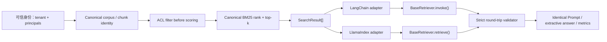

# RAG Framework Adapters：Canonical-first 的 LangChain/LlamaIndex 集成

**项目导航**：[项目索引](../project-index.md) · [RAG Foundations](rag-foundations.md) ·
[RAG 检索](../../applications/rag-retrieval.md) · [RAG 生产化](../../applications/rag-production.md) ·
[实验 5A](../labs.md#lab-5a)
{ .doc-nav }

本项目不把“换一个框架”误当作新的检索算法。它先固定一套框架无关的 canonical `Document`、`SearchResult`、ACL、BM25 排序、Prompt 和评测口径，再把同一次检索结果接入 LangChain 与 LlamaIndex，逐字段验证 adapter 没有改变安全与语义边界。

!!! warning "Parity 的含义"
    本页的 parity 是“同一 canonical retrieval 经两个框架 API 后保持 ID、正文、metadata、rank/score、Prompt 和 answer artifact 一致”。它不是 LangChain 与 LlamaIndex 的质量或性能排名，也不证明两个框架的 native index/query engine 等价。

## 学习目标

完成本项目后，应能解释并实现：

- 为什么领域对象、授权和评测不能由某个框架的数据类垄断；
- 为什么授权集合必须在评分与 top-k 之前形成；
- `SearchResult` 如何无损映射到 LangChain `Document` 与 LlamaIndex `TextNode + NodeWithScore`；
- 为什么 LlamaIndex 的 metadata exclusion 是 Prompt/embedding 内容控制，不是业务授权；
- 如何用 round-trip validator、Prompt hash 和 answer artifact 检测 adapter 漂移；
- 如何公平比较 orchestration 层，同时把 learned retrieval、LLM generation 与生产性能留在各自证据层。

## 架构：领域核心是权威，框架对象是运输值

安全查询应写成：

\[
\operatorname{TopK}_{d\in A(t,p)} s(q,d),
\]

其中 \(A(t,p)\) 是服务器根据 tenant \(t\) 与 principals \(p\) 得到的授权文档集合。先在全库取 top-k 再过滤，等价于

\[
\operatorname{Filter}_{A(t,p)}\left(\operatorname{TopK}_{d\in D}s(q,d)\right),
\]

两者通常不同：无权高分文档会占用候选名额，而且它已经进入 scorer、trace 或缓存边界。Prompt 中写“请忽略无权内容”不能修复这个越界。

## Canonical 对象与字段映射

| Canonical 字段 | LangChain | LlamaIndex | 验证要求 |
|---|---|---|---|
| `document_id` | `Document.id` + metadata | `TextNode.node_id` + metadata | exact，且结果内不重复 |
| 正文 | `page_content` | `TextNode.text` | exact，不允许 formatter 静默改写 |
| `tenant_id` / `acl` | metadata | metadata | 保留供审计，不能由业务 metadata 覆盖 |
| `score` | `metadata.retrieval_score` | `NodeWithScore.score` + metadata | 必须为 finite real number |
| `rank` | `metadata.retrieval_rank` | metadata | 输入顺序必须是连续 one-based rank |
| retriever identity | `metadata.retriever` | metadata | 与 canonical `source` exact |
| 业务 metadata | metadata | metadata | 原样保留，但不得碰保护键 |

六个保护键是 `document_id`、`tenant_id`、`acl`、`retrieval_score`、`retrieval_rank`、`retriever`。若原始业务 metadata 已含这些键，adapter 直接失败，而不是让框架值覆盖 canonical 值。

LlamaIndex 默认内容构造可能包含 metadata。本项目把保护键同时加入 `excluded_embed_metadata_keys` 与
`excluded_llm_metadata_keys`，避免默认 embed/LLM content 因控制面字段而变化。

这只约束当前 node 配置。自定义 formatter、callback、serializer 或 Prompt 仍可能主动读取 metadata；
exclusion 不是授权边界。

## 运行路径 { #run }

### 1. 安装两个可选集成

~~~powershell
python -m pip install -e ".[dev,torch,rag,langchain,llamaindex]"
~~~

仓库使用兼容范围方便教学环境安装；生产实验应把实际 lock/constraints、Python、框架和依赖版本写入运行 artifact。未来版本可改变对象校验、Prompt 渲染或 callback 行为，源码仍通过并不自动证明跨版本 parity。

### 2. 先看最小对象转换

~~~powershell
python projects/rag-framework-adapters/demo.py
~~~

`demo.py` 只展示 canonical result 到两种对象的映射。它没有执行框架 Retriever API、Prompt、answer 或 metrics，因此适合检查字段，不是端到端证据。

### 3. 运行真实双框架 Retriever parity control

~~~powershell
python projects/rag-framework-adapters/parity_control.py
~~~

当前 control 固定四条 authored 文档、一个 tenant 和同一中文 query，真实调用：

- LangChain `BaseRetriever.invoke()`；
- LlamaIndex `BaseRetriever.retrieve()`；
- 两个框架各自的 `PromptTemplate`；
- canonical BM25/ACL、严格 round trip、deterministic extractive answer；
- authored qrels 上的 Recall@4 与 nDCG@4。

本次本地运行报告的 framework versions 为 `langchain-core==1.5.3`、`llama-index-core==0.14.23`。版本是运行环境事实，不是仓库对未来版本的保证。

### 4. 先预测授权结果，再读报告

固定语料包含：

| 文档 | tenant | ACL | 特点 |
|---|---|---|---|
| `acl-before-ranking` | `tenant-a` | public | 所有人可见的正确证据 |
| `citation-binding` | `tenant-a` | `engineering` | engineering 可见 |
| `finance-secret` | `tenant-a` | `finance` | lexical overlap 很高，但 engineering/anonymous 无权 |
| `other-tenant` | `tenant-b` | public | tenant 错误，必须在评分前排除 |

因此 engineering 应得到 `acl-before-ranking → citation-binding`，anonymous 只得到 `acl-before-ranking`。当前真实报告中三条路径的 ID exact：

| case | canonical / LangChain / LlamaIndex | Prompt bytes | Prompt SHA-256 | answer artifact |
|---|---|---:|---|---|
| engineering | `acl-before-ranking, citation-binding` | 385 | `b9c8cb77…e1e8e19c` | `sha256:d1045446…48180cca` |
| anonymous | `acl-before-ranking` | 277 | `1e33ed13…e396d8fd` | `sha256:ed8e3f45…8441e8c` |

engineering 的 Recall@4 与 nDCG@4 都是 1.0，两例 extractive coverage 也都是 1.0。这里的满分来自四文档 authored fixture 与 authored qrels，只是协议回归；不能写成“框架检索质量 100%”或“RAG 已达到生产质量”。

### 5. 理解 round-trip gate 到底检查什么

LangChain validator 对照结果数量，以及每个位置的 `id`、`page_content` 和完整 metadata。LlamaIndex validator
再对照 `node_id`、正文、`NodeWithScore.score`、metadata 与两组 exclusion keys。Supplied expected results
本身先经过 canonical gate：

- rank 必须严格为 `1..N`；
- document ID 不得重复；
- score 必须是非 bool 的有限实数；
- tenant 必须非空；
- principals 不得为空字符串或重复；
- `top_k` 必须是正整数，`True` 不能冒充整数 1。

这些检查能发现本地 adapter 丢字段、重排或 mutation。它们不能认证 supplied expected results 的来源；若攻击者能同时改写 canonical expected 与框架对象，普通 round trip 不会提供签名或独立审计证明。

## 专项验证与负例

~~~powershell
python -m pytest tests/test_rag_framework_adapters.py -q
~~~

专项测试覆盖：

- 两种对象字段与 LlamaIndex exclusion keys；
- 业务 metadata 伪造 `tenant_id` 时 fail closed；
- LangChain metadata rank 被改写时拒绝；
- LlamaIndex node text 被改写时拒绝；
- rank gap、duplicate ID、NaN/±Inf 与 bool score；
- LlamaIndex LLM metadata exclusion-key drift；
- public、allowed、denied 与 other-tenant 的 authorization-first retrieval；
- 空 tenant、重复 principal 与 bool `top_k`；
- 两个 Retriever API、Prompt identity、answer artifact 与 machine-readable scope。

评审时还应主动构造结果数变化、ID 漂移、正文漂移和 embedding exclusion-key drift。一个“最终返回 ID 恰好一样”的 post-filter 实现仍应判失败，因为无权文档已经进入评分边界；安全属性不能只靠最终输出快照证明。

## 公平比较 LangChain、LlamaIndex 与原生实现

若目标是比较 orchestration，而不是比较检索器，应固定：

1. corpus bytes、chunk ID/version 与 ingestion snapshot；
2. server-resolved tenant/principals、query、top-k 与 authorization policy revision；
3. 同一次 canonical `SearchResult[]`；
4. context packing、Prompt bytes、model/provider revision 与 generation config；
5. qrels、answer cases、judge/rubric 与缺失样本规则；
6. cold/warm 状态、并发、超时、重试、采样窗口和资源环境。

本项目只让两个框架承担 adapter、Retriever/Prompt API 与 orchestration，因此“结果相同”是预期不变量。
若要比较各自 native embedding/index/query engine，就不再是 adapter parity；需要分别记录 index/embedding identity、
candidates、score semantics、filters、rerank、Prompt、raw output、usage、失败和 latency，并在同一 held-out cases 上比较。

## 从教学 control 扩展到工程系统

### 接入 learned retrieval

保持 canonical `SearchResult` 作为出口。每个 adapter 把 query hash、index snapshot、embedding/reranker identity、
candidate content hash、authorization decision、raw/normalized score 与 rank 写入 trace。不同模型的 score
不一定同尺度，不能只因字段同名就直接比较或融合。

### 接入生成模型

复用同一 context/source map，并固定 tokenizer、chat template、model/provider revision、sampling、stop、最大输出、
retry 与 usage。保存 raw output 和 citation parsing；当前 `answer_artifact_fingerprint` 来自 deterministic
extractive baseline，不是 Provider/local LLM 调用证明。

### 接入异步、callback 与 tracing

分别测试 sync/async/batch/stream 路径，不假设 callback 在异常、取消和重试时恰好一次。Trace 中的 Prompt、metadata 与正文可能含敏感内容，需要 redaction、访问控制、保留期与 tenant 隔离；“用了 tracing 平台”本身不证明可观测性安全。

### 接入生产权限

Tenant/principals 来自可信认证层，并与 policy/index revision 一起绑定到 retrieval call。请求 body 不能自报安全
身份，framework metadata 也不是授权事实。Cache identity 还要包含 tenant/visibility domain、policy revision、
query/index/model/template 等会改变结果的字段。

## 框架选择决策表

| 问题 | 原生 canonical core | LangChain adapter | LlamaIndex adapter |
|---|---|---|---|
| 领域对象与 ACL | 应作为权威实现 | 复用，不重写 | 复用，不重写 |
| provider/tool orchestration | 自己维护 | 可评估 Runnable/provider 生态是否降低维护成本 | 可通过自定义边界接入 |
| ingestion/node/index abstraction | 自己维护 | 需要额外组件或自定义 | 可评估其数据/index abstraction |
| 审计可见性 | 最透明，但自建成本高 | 取决于 adapter/callback/trace 设计 | 取决于 adapter/callback/trace 设计 |
| 选择依据 | 系统简单、强控制 | 团队已有相关编排需求与能力 | 团队已有数据/index/query 抽象需求 |

这张表描述决策维度，不是框架能力排行榜。最终选择应来自本项目的真实依赖、运行、调试、升级与故障成本，而不是 GitHub 热度或一次 demo 的代码行数。

## 项目验收与面试讲法

一个可交付的 adapter 项目至少回答：

- [ ] canonical object、source/index/policy identity 在哪里定义？
- [ ] ACL 是否在 scorer、reranker、cache 和 Prompt 之前执行？
- [ ] adapter 是否拒绝保护字段覆盖、rank gap、duplicate ID 和 non-finite score？
- [ ] LangChain/LlamaIndex round trip 是否逐字段 fail closed？
- [ ] metadata 是否可能进入 embedding、Prompt、trace 或日志？
- [ ] 两条框架路径是否绑定同一 Prompt bytes、answer cases 与 qrels？
- [ ] native framework retrieval 与 canonical adapter parity 是否被明确区分？
- [ ] 依赖升级、异常、取消、超时、重试和 callback 是否有回归测试？
- [ ] 运行报告是否把真实执行与未执行的 embedding、LLM、网络、性能分开？

面试中可按“为什么 canonical-first → ACL-before-ranking 公式 → 两种对象映射 → round-trip/Prompt/artifact gate → 负例 → 扩展证据边界”讲解。关键不是背 API，而是说明为什么框架便利层不能成为安全事实源。

## 证据边界

该 control 在当前环境真实执行 `langchain-core` 与 `llama-index-core` 的 Retriever/Prompt API、canonical BM25/ACL、
strict round trip、deterministic extractive answer 与 Recall@k/nDCG。Learned embedding/vector index/reranker、
Provider/local LLM、network、concurrency、persistence 与 load performance 尚未进入这条实验。

因此它不证明框架默认 ACL、metadata 不泄漏、native retrieval 等价、模型生成质量、生产延迟/吞吐、规模扩展或生产安全。CPU 本地 authored fixture 也不得外推到目标向量库、模型、GPU 或线上流量。

完整实现说明见 [projects/rag-framework-adapters](https://github.com/NightLemon/about-llm/tree/main/projects/rag-framework-adapters)。
