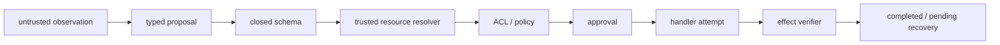

# Safe Agent：从模型提案到可恢复的副作用

**项目导航**：[项目索引](../project-index.md) · [退款生命周期](../../applications/agent-task-lifecycle.md) ·
[Agent Runtime](../../applications/agent-runtime.md) · [互操作协议](../../applications/agent-interoperability.md) ·
[实验 6](../labs/lab-6-agent-lifecycle.md)
{ .doc-nav }

这个项目不训练模型。它研究模型已经提出工具调用之后，系统怎样安全地把提案变成真实动作。

你会处理同一笔 300 元退款：Schema 和权限都通过，Provider 也真的受理了退款，但响应在网络中丢失。
Runtime 必须阻止盲目重试，查询远端 receipt，最后把本地 `pending` 恢复成 `completed`。

模型在这里始终只是 Planner。它可以提出 `{tool_name, arguments}`，执行权属于独立控制面：



## 第一次只跑这笔退款 { #refund-lifecycle }

```powershell
python projects/safe-agent/refund_lifecycle.py
python -m pytest tests/test_agent_refund_lifecycle.py -q
```

在输出中依次找到：

```text
observation → proposal → schema → ACL → approval
→ execution → idempotency → verifier → recovery
```

关键状态变化是：

```text
provider effect count = 1
execution = failed / local ledger = pending
same-call replay = fenced
provider query verifier = passed
reconciliation = externally_confirmed
final replay = cached
```

“Execution failed”只表示 Runtime 没拿到可确认响应。Provider effect count 已经是 1，因此系统不能把 timeout 告诉
用户为“退款失败”，也不能直接再发一笔。

逐阶段解释见[一次 Agent 退款任务](../../applications/agent-task-lifecycle.md)。实验 6 会要求你先预测每一步的
可信数据、可否产生副作用和失败终态，再查看 JSON trace。

## 这条主线建立了哪些不变量

| 不变量 | 失败时会发生什么 |
|---|---|
| Default deny | Policy 未配置或结果不确定时不进入 handler |
| 身份来自可信控制面 | 模型不能伪造 tenant、subject 或 capability |
| Approval 绑定 execution identity | 参数、资源或 policy 漂移后旧审批失效 |
| Claim 发生在 handler 前 | 重启和并发不能绕过同一逻辑动作的 fence |
| Timeout 保留 `pending` | 未确认远端结果前不会盲目重放 |
| Completion 由 verifier 建立 | 模型或远端文本不能自报任务成功 |
| Cache replay 重新授权 | 撤权后不能借旧 cache 取回 payload |

这条离线主线真实执行 closed Schema、资源级 ACL、approval binding、SQLite ledger 和 reconciliation。
Planner 与退款 Provider 都是进程内模拟器，因此这个运行用于检查控制流和状态变化；它不代表生产支付系统已经获得 exactly-once。

## 路线 A：故障、pending 与人工对账 { #run }

想观察更多成功和失败 case 时，为每次运行创建新的 SQLite ledger：

```powershell
python -m about_llm.agents.cli run `
  --scenario projects/safe-agent/scenario.example.jsonl `
  --ledger artifacts/agent/scenario-001.db `
  --max-tool-calls 5

python -m about_llm.agents.cli pending `
  --ledger artifacts/agent/scenario-001.db `
  --older-than-seconds 0
```

Scenario 包含只读调用、缺审批、合法 grant、cache replay、撤权、跨 tenant 和 handler timeout。
找到 `uncertain-1`：它必须保持 `pending`，因为 timeout 不能说明远端 effect 没有发生。

Operator 随后查询 provider audit、业务数据库或 outbox。下面的 `abandoned` 只适用于已经确认没有外部副作用的
离线确认文字：

```powershell
python -m about_llm.agents.cli resolve `
  --ledger artifacts/agent/scenario-001.db `
  --call-id uncertain-1 `
  --resolution abandoned `
  --note "offline fixture verified: no external operation exists"

python -m about_llm.agents.cli inspect `
  --ledger artifacts/agent/scenario-001.db `
  --call-id uncertain-1
```

若外部已完成，使用 `external` 并提供 canonical JSON receipt；若随后完成逆向业务动作，记录为 `compensated`。
旧 `call_id` 永不重新执行。新的业务尝试要获得新 identity 与 approval，同时保留与旧事故的关联。

## 路线 B：Planner loop、预算与 checkpoint

```powershell
python -m about_llm.agents.cli loop `
  --cases projects/safe-agent/loop.example.jsonl
```

Loop 分开限制 decision steps、模型 token/cost、active wall time、handler attempts、重复 action 和 cycle。
只有 verifier `PASSED` 才能写 `completed=true`。

高影响动作会在 handler 前暂停：

```powershell
python -m about_llm.agents.cli pause-loop `
  --cases projects/safe-agent/loop.example.jsonl `
  --case-id approval-pause `
  --ledger artifacts/agent/loop-001.db `
  --checkpoint artifacts/agent/loop-001.checkpoint.json

python -m about_llm.agents.cli resume-loop `
  --cases projects/safe-agent/loop.example.jsonl `
  --case-id approval-pause `
  --ledger artifacts/agent/loop-001.db `
  --checkpoint artifacts/agent/loop-001.checkpoint.json
```

Checkpoint 保存 pending decision、预算、usage、handler counter、event history 与 execution fingerprint。
Resume 先执行当前授权，再使用原 decision；不会重复计算 Planner token/cost。

这里的 checkpoint 解析器会拒绝重复字段、非法数值和未知字段，但 fingerprint 不是签名，checkpoint 与 SQLite
也不是同一原子事务。这个例子用于学习 restart control flow，不等于跨节点 durable workflow。

## 路线 C：严格的模型输出边界

```powershell
python projects/safe-agent/model_planner_control.py
```

`StrictJSONModelPlanner` 把模型文本转换为 typed action。它拒绝 Markdown fence、重复字段、非有限数值、
未知字段/工具和无效 evidence ID，并检查实际 model revision、usage、cost 与 finish reason。

Request identity 绑定 prompt revision、task state、剩余预算、tool/schema/validator revision 与 output cap。
Runtime 随后仍会执行 Schema、resource resolver、policy、approval 和 budget。无歧义的 JSON 只解决 proposal 传输，
不是授权边界。

`JSONSchemaToolContract` 使用 Draft 2020-12、closed root object 和 local references。它不做类型 coercion、
不应用 `default`，也不判断 tenant ownership 或业务关系。

## 路线 D：LangChain 与 LlamaIndex 接到同一 Runtime { #framework-tool-adapters }

先只看 tool adapter：

```powershell
python projects/safe-agent/framework_tool_adapter_control.py
python -m pytest tests/test_agent_framework_tool_adapters.py -q
```

LangChain `StructuredTool` 与 LlamaIndex `FunctionTool` 都只生成 proposal。Subject、tenant、capability、resource resolver、
policy 和 handler 仍留在 canonical `AgentRuntime` 中。

这个验证程序检查三类 case：公共资源成功并可 cache；跨 tenant 在 handler 前被拒绝；未知 tool 被 allowlist 拒绝。
还保留一个有意的类型错误，提醒你“框架展示了 Schema”不表示所有入口都强制执行完全相同的 Schema。

再运行真实 framework loop：

```powershell
python projects/safe-agent/framework_agent_loop_control.py
```

它进入 LangChain/LangGraph 与 LlamaIndex 的 `model → tool → model` 控制流，但 model 仍是确定性的脚本模拟器。
独立 verifier 只接受本地 `completed/cached` receipt；即使 scripted model 自称成功，cross-tenant 与 unknown-tool
也不能完成任务。

这证明真实框架控制流能接入同一可信执行层，不代表框架默认提供 ACL、幂等或生产安全。

## 路线 E：Outbox 的 ack-before-crash 窗口

```powershell
python projects/safe-agent/outbox_demo.py `
  --database artifacts/agent/outbox-demo-001.db
```

Worker A 调用模拟 Provider 成功，却在本地 ack 前 crash。Lease 过期后 Worker B 重新领取，用相同 `effect_id`
再次发送。你会看到两个 Provider request、同一个 idempotency key、一个业务 effect，最终 outbox 为 `delivered`。

Outbox 让本地 task state 与 pending effect row 在同一数据库事务提交。它不能把远端 Provider 纳入事务；若 Provider
不 honor idempotency key，重投仍可能产生第二个 effect。详细协议见[Agent Runtime](../../applications/agent-runtime.md#exactly-once)。

## 路线 F：用可穷举状态理解决策理论 { #decision-theory-control }

```powershell
python projects/safe-agent/decision_theory_toy.py
python -m pytest tests/test_agent_decision_theory.py -q
```

这个 toy 在有限 hidden states 上计算 Bayesian belief update、expected utility、EVSI 与 observation cost，随后用 hard
allow-mask 排除 forbidden action。Transition graph 还分别检查 reachable forbidden、terminal reachability、dead end、
cycle 和 guaranteed termination。

它用于手算“先观察还是直接行动”和“可能结束与保证结束”的差别，不调用模型或工具，也不从数据学习 probability
与 utility。完整推导见[Agent 决策理论](../../applications/agent-decision-theory.md)。

## 路线 G：MCP 与 A2A transport { #mcp-a2a }

在理解 Runtime 后，再比较 transport：

```powershell
python projects/safe-agent/mcp_sdk_memory_control.py
python projects/safe-agent/mcp_sdk_stdio_control.py
python projects/safe-agent/mcp_sdk_streamable_http_control.py
python projects/safe-agent/mcp_stdio_control.py
python projects/safe-agent/mcp_streamable_http_control.py
python projects/safe-agent/a2a_loopback_control.py --verify-official-schema
```

| 验证程序 | 主要观察 |
|---|---|
| MCP SDK memory | 官方 client/server types 与内存流 |
| MCP SDK stdio | 独立 subprocess 的 stdin/stdout transport |
| MCP SDK HTTP | Loopback HTTP、session 与 POST/GET/DELETE |
| 手写 stdio parser | Malformed framing、UTF-8，以及重复字段和非法数值 |
| 手写 Streamable HTTP server | Origin/Bearer/session/version 与 cancel |
| A2A loopback | Agent Card、SendMessage/GetTask 与 schema hash |

Official SDK 示例与手写 parser 运行的是不同代码路径：前者观察真实 SDK，后者覆盖特定 framing 负例，
两边的结论不能直接互换。
Loopback token 也不是 OAuth、TLS、远程互操作或业务授权。学习顺序与协议边界见
[Agent 互操作](../../applications/agent-interoperability.md)。

## Recorded trajectory 怎样评测

```powershell
python -m about_llm.agents.cli evaluate `
  --traces projects/safe-agent/trajectory.example.jsonl
```

报告为每个比例保留 numerator/denominator，分母为零时 value 为 `null`。Task success 与安全 guardrail 分开统计；
越权 handler、未审批 effect、重复 effect、未解决 pending 和超预算不能被平均成功率抵消。

`handler_attempted` 只说明进入了 handler。`effect_applied` 必须来自模拟状态、Provider audit 或业务 verifier，
不能根据“completed”字符串猜测。

## 最小回归与故意破坏

第一次修改 Runtime 后，至少运行：

```powershell
python -m pytest `
  tests/test_agent_refund_lifecycle.py `
  tests/test_agent_runtime.py `
  tests/test_agent_policy.py `
  tests/test_agent_schema.py `
  tests/test_agent_loop.py `
  tests/test_sqlite_agent_ledger.py `
  tests/test_agent_outbox.py -q
```

高风险负例要能回答：

- 撤权后 cache replay 是否重新授权？
- 相同 call ID 换参数、主体或版本是否冲突？
- Approval 过期或 execution 漂移是否在 handler 前拒绝？
- Resume 是否重复计算 usage 或再次调用 handler？
- Handler 返回非 JSON 时，claim 是否仍保持 pending？
- Provider success、ack 前 crash 是否只按 at-least-once 处理？
- 远端自称 completed 时，本地 verifier 是否仍可拒绝？

更完整的 framework、MCP/A2A 与 artifact 回归命令保留在
[项目控制台账](../../evidence/project-controls.md)，日常修改无需先跑所有 transport 矩阵。

## 完成这个项目后应保存什么

- Trusted subject/resource context；
- Proposal 与 execution identity；
- Schema、policy、approval revision；
- Handler attempt、预算与 Provider request ID；
- Effect verifier 的独立观察；
- Pending、reconciliation、checkpoint 与 outbox timeline；
- 至少一个越权、篡改、timeout 或 crash 负例。

仓库证明的是 scripted/recorded Planner、local policy/approval/verifier、SQLite ledger/outbox 和固定 loopback transport
的局部契约。真实模型稳定性、集中 IAM、签名审批、TLS/OAuth、远程 conformance、多区域恢复与生产副作用都需要
目标环境证据。

完整代码位于 [projects/safe-agent](https://github.com/NightLemon/about-llm/tree/main/projects/safe-agent)。
