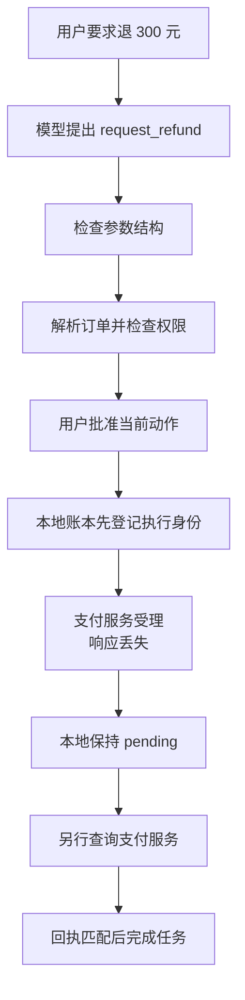

# Safe Agent：一笔退款怎样安全完成

**项目导航**：[项目索引](../project-index.md) · [退款生命周期](../../applications/agent-task-lifecycle.md) ·
[Agent Runtime](../../applications/agent-runtime.md) · [互操作协议](../../applications/agent-interoperability.md) ·
[实验 6](../labs/lab-6-agent-lifecycle.md)
{ .doc-nav }

这个项目不训练模型。它从模型已经提出工具调用的时刻开始，研究系统怎样把一条建议变成可授权、可执行、可恢复的动作。

贯穿本页的是一笔 300 元退款。在离线模拟中，支付服务已经受理退款，但响应恰好在返回途中丢失。本地 Runtime 看到的是
超时，外部世界却已经发生了一次退款。接下来应该重试、宣布失败，还是等待核对？



模型在整条链路中只是 Planner。它负责提出 `request_refund` 和参数，不提供自己的用户身份、权限、审批或执行结果。

## 先运行，再带着问题读结果 { #refund-lifecycle }

```powershell
python projects/safe-agent/refund_lifecycle.py
python -m pytest tests/test_agent_refund_lifecycle.py -q
```

运行前先回答：支付服务已经受理退款，而本地只收到 `TimeoutError`，此时“退款失败”这句话是真的吗？

输出是一份 JSON walkthrough。先找这五个字段：

```text
stages.execution.status = failed
stages.execution.provider_effect_count = 1
stages.execution.local_ledger_state = pending
stages.idempotency.handler_attempted_on_replay = false
stages.recovery.replay_after_reconciliation.status = cached
```

它们合起来表达一个反直觉但很常见的状态：**本地调用失败，业务动作可能已经成功。** `failed` 描述的是本次调用没有取得
可确认响应；它不能直接当成退款结果。系统先保留 `pending`，再查询支付服务，避免多退一次。

## 先认清链路上的几个身份

同一笔退款会出现多种 ID 和 fingerprint。它们回答的问题不同：

| 名称 | 本次运行中的例子 | 识别什么 |
|---|---|---|
| Task ID | `after-sale-20260820-001` | 整个售后任务 |
| Call ID | `refund-order-1001-attempt-1` | 这一次逻辑工具调用，也是模拟支付服务的幂等键 |
| Proposal fingerprint | `sha256:…` | 工具名与规范化参数是否仍是同一份提案 |
| Execution fingerprint | `sha256:…` | 提案、工具版本、可信身份、订单版本和策略决定是否仍是同一执行 |
| Approval ID | `approval-refund-1001-v1` | 哪次批准绑定了当前 Call ID 与 execution fingerprint |
| Provider refund ID | `refund-provider-7001` | 支付服务实际创建的退款记录 |

两个 fingerprint 都是稳定 hash，不是数字签名。它们用于发现对象是否漂移，不能单独认证是谁创建了对象。

## 第一步：把用户文字与可信状态分开

用户只说：

> 商品坏了，帮我退 300 元。

Runtime 还需要认证系统和订单服务提供的状态：

| 数据 | 来源 | 本次取值 |
|---|---|---|
| 当前主体 | 已认证请求上下文 | `user-42` |
| 当前租户 | 已认证请求上下文 | `tenant-shop-a` |
| 能力 | 服务端授权上下文 | `refund:request` |
| 订单所有者、金额和版本 | 订单服务快照 | `user-42`、300 元、`order@7` |

离线 Planner 只提出工具名、订单、退款金额和原因。`subject_id`、`tenant_id`、capability、Call ID 与 approval 都由
控制面提供。这样，Prompt 里的“我是管理员”不会变成系统权限。

## 第二步：先检查参数，再解析真实订单

`request_refund` 使用封闭的 JSON Schema。正常参数可以通过；多出的未知字段会被
`additionalProperties` 规则拒绝。

Schema 只回答“参数形状是否符合约定”。随后，资源解析器才根据 `order_id` 找到订单快照，策略再比较当前租户、订单
所有者和所需 capability。

主线里还运行了一次跨租户反例：模型请求 `tenant-shop-b` 的 `order-9001`。结果是
`policy_reason: tenant_mismatch`，并且 `provider_attempts_after_acl` 仍为 0。换句话说，越权请求在支付 handler 之前就停了。

## 第三步：批准的是当前执行，不是一句“同意退款”

退款属于高影响动作。第一次预检查会返回 `needs_approval`，同时计算 execution fingerprint。批准记录绑定：

- 当前用户；
- Call ID；
- execution fingerprint；
- 过期时间。

实验随后把退款金额从 300 元改成 299 元，再尝试复用旧批准。参数变化导致 execution fingerprint 改变，因此得到
`approval_execution_mismatch`。此时支付服务的调用次数仍为 0。

这个反例说明，审批界面展示的订单、金额和原因必须来自将要执行的同一对象。批准以后再修改参数，应该重新审批。

## 第四步：先 claim，再调用支付服务

进入 handler 前，本地 SQLite 账本先用 Call ID 和 execution fingerprint 登记这次执行。登记成功以后，模拟支付服务
收到同一个 Call ID 作为幂等键，创建退款 `refund-provider-7001`。

接下来故意丢失响应，于是出现两种同时成立的事实：

```text
本地：handler 抛出 TimeoutError，账本保持 pending
远端：provider request = 1，provider effect = 1
```

如果进程立刻用同一 Call ID 重跑，账本会看到 `pending`，返回“先核对外部状态”，不会再次进入 handler。实验中的
`handler_attempted_on_replay: false` 和保持为 1 的 provider request 数量证明了这一点。

这里的关键不是把所有失败都当成成功，而是承认：超时只说明结果未知。`pending` 给系统留下核对空间。

## 第五步：由可信回执决定是否完成

Verifier 使用原 Call ID 查询模拟支付服务，并逐项核对：

- 幂等键；
- 订单 ID；
- 金额与退款原因；
- 支付服务状态；
- provider refund ID 是否存在。

只把状态写成 `accepted` 还不够。实验故意把回执金额改成 299 元，Verifier 会返回
`provider_receipt_mismatch`。真实回执全部匹配以后，本地才记录 `externally_confirmed`，并生成安全的最终答复：

> 退款已由支付服务确认受理，退款单号 refund-provider-7001。

此后再处理同一 Call ID，会读取已经确认的结果，状态为 `cached`，handler 不会重跑。Cache 返回前仍要重新检查当前权限；
实验撤销 `refund:request` 后，旧结果会以 `missing_capability` 被拒绝。

## 这笔退款建立了哪些规则

| 规则 | 它防止什么 |
|---|---|
| 默认拒绝 | 策略缺失或结果不确定时进入 handler |
| 身份来自可信控制面 | 模型伪造用户、租户或 capability |
| 资源解析发生在服务端 | 模型用字符串冒充自己拥有的订单 |
| Approval 绑定 execution fingerprint | 批准后替换金额、订单或策略版本 |
| Claim 发生在 handler 前 | 重启或并发绕过同一逻辑动作的 fence |
| Timeout 保留 `pending` | 结果未知时盲目重试 |
| Verifier 建立 completion | 模型文本或远端状态字符串自报成功 |
| Cache replay 重新授权 | 撤权后继续读取旧结果 |

这条主线真实执行了 Schema、资源级 ACL、审批绑定、SQLite claim 和对账流程。Planner、订单服务和支付服务都是
进程内模拟器，所以这里验证的是控制流与状态变化。生产支付系统的 exactly-once、并发和故障恢复仍要在目标环境验证。

## 手动处理一条 pending 记录 { #run }

完整场景文件还包含只读调用、缺少审批、Cache replay、撤权、跨租户和 handler timeout。为每次实验选择新的 SQLite
文件，避免读到旧结果：

```powershell
python -m about_llm.agents.cli run `
  --scenario projects/safe-agent/scenario.example.jsonl `
  --ledger artifacts/agent/scenario-001.db `
  --max-tool-calls 5

python -m about_llm.agents.cli pending `
  --ledger artifacts/agent/scenario-001.db `
  --older-than-seconds 0
```

找到 `uncertain-1`。在真实系统中，Operator 应先查询 provider audit、业务数据库或 outbox。下面的 `abandoned` 只适用于
已经确认没有外部动作的离线样例：

```powershell
python -m about_llm.agents.cli resolve `
  --ledger artifacts/agent/scenario-001.db `
  --call-id uncertain-1 `
  --resolution abandoned `
  --note "offline example verified: no external operation exists"
```

外部动作已完成时使用 `external` 并提供可信回执；已经执行逆向业务动作时记录为 `compensated`。旧 Call ID 始终保留，
后续新的业务尝试需要新的身份和审批。

## 暂停等待审批后怎样恢复

Planner loop 会分别限制决策步数、模型 token 与费用、运行时间、handler 次数、重复动作和循环。只有 Verifier 通过，
任务才能写入 `completed=true`。

下面的两条命令把等待审批的任务保存下来，再从同一个 checkpoint 恢复：

```powershell
python -m about_llm.agents.cli pause-loop `
  --cases projects/safe-agent/loop.example.jsonl `
  --case-id approval-pause `
  --ledger artifacts/agent/loop-001.db `
  --checkpoint artifacts/agent/loop-001.checkpoint.json

python -m about_llm.agents.cli resume-loop `
  --cases projects/safe-agent/loop.example.jsonl `
  --case-id approval-pause `
  --ledger artifacts/agent/loop-001.db `
  --checkpoint artifacts/agent/loop-001.checkpoint.json
```

Checkpoint 保存待执行决定、累计预算、调用次数和事件历史。恢复时先检查当前授权，再继续原来的决定，因此不会把同一次
Planner 调用重复计费。

解析器会拒绝重复字段、非法数值和未知字段；execution fingerprint 用来发现恢复对象漂移。这个本地例子用于学习进程
重启后的控制流。分布式持久工作流还需要签名或可信存储，以及 checkpoint 与业务账本之间明确的事务协议。

## Outbox 解决的是另一个崩溃窗口

Checkpoint 回答“Agent loop 从哪一步继续”，outbox 回答“已经批准的副作用怎样可靠投递”。运行：

```powershell
python projects/safe-agent/outbox_demo.py `
  --database artifacts/agent/outbox-demo-001.db
```

Worker A 调用模拟 Provider 成功，却在本地确认投递前崩溃。Lease 过期后，Worker B 使用同一个 `effect_id` 重新发送。
最终会看到两次请求、同一个幂等键、一个业务 effect，以及状态为 `delivered` 的 outbox。

本地可以用一个数据库事务同时提交任务状态和待投递的 outbox 记录，远端支付服务却不属于这个事务。如果支付服务没有
按幂等键去重，重新投递仍可能产生第二次业务动作。详细协议见[Agent Runtime](../../applications/agent-runtime.md#exactly-once)。

## 把其他组件接到同一个可信 Runtime { #framework-tool-adapters }

LangChain 和 LlamaIndex 可以改变 Planner 与工具的接线方式，但不应改变权限边界：

| 实验 | 观察重点 |
|---|---|
| `framework_tool_adapter_control.py` | 两种 Tool adapter 怎样生成同一种 proposal |
| `framework_agent_loop_control.py` | 两种真实框架控制流怎样调用同一个 Runtime |
| `model_planner_control.py` | 模型文本怎样经过严格 JSON 边界变成 typed action |

这些实验中的模型仍是确定性的脚本模拟器。跨租户请求和未知工具即使进入框架 loop，也会在可信 Runtime 中停止。框架负责
编排，不会自动替业务系统提供 ACL、审批和幂等。

安装方法、完整命令和排错表见[项目 README](https://github.com/NightLemon/about-llm/tree/main/projects/safe-agent)。

### 用有限状态理解“先观察还是直接行动” { #decision-theory-control }

```powershell
python projects/safe-agent/decision_theory_toy.py
python -m pytest tests/test_agent_decision_theory.py -q
```

这个小程序只有有限个隐藏状态，因此可以手算：观察后怎样更新概率、哪项动作的期望收益更高，以及一次额外观察是否值得。
允许动作集合会先排除禁止动作，再比较剩余动作。程序还检查坏状态是否可达，以及任务是“可能结束”还是“保证结束”。

它帮助理解决策公式，不调用模型和工具，也不从数据学习概率。完整推导见
[Agent 决策理论](../../applications/agent-decision-theory.md)。

### MCP 与 A2A 只改变跨系统接线 { #mcp-a2a }

理解本地 Runtime 以后，再看 transport：

| 仓库实验 | 实际检查的路径 |
|---|---|
| MCP 官方 SDK：memory、stdio、Streamable HTTP | SDK 的初始化、发现、调用、会话与取消 |
| 手写 stdio / Streamable HTTP | 消息边界、UTF-8、重复字段、非法数值、Origin 与版本 |
| A2A loopback | Agent Card、`SendMessage`、`GetTask` 和官方 schema |

官方 SDK 和手写 parser 运行不同代码路径；前者不能替后者证明畸形消息处理，后者也不能代表 SDK 行为。Loopback 只验证
本机协议往返。认证、业务授权和跨厂商互操作仍要另外验证。

完整命令见[项目 README](https://github.com/NightLemon/about-llm/tree/main/projects/safe-agent)，协议边界见
[Agent 互操作](../../applications/agent-interoperability.md)，精确请求与负例记录见
[项目控制台账](../../evidence/project-controls.md)。

## 评测时把任务成功与安全违规分开

```powershell
python -m about_llm.agents.cli evaluate `
  --traces projects/safe-agent/trajectory.example.jsonl
```

这个文件保存了三条退款轨迹：正常退款并命中幂等缓存、跨租户退款被执行前拦截，以及远端已退款但本地超时后通过对账确认。
把三条轨迹放在一起，是为了比较“模型提出了动作”“Handler 尝试执行”和“业务效果已经发生”这三个不同事件。

报告保留每个比例的分子和分母；没有样本时写 `null`。任务成功率与安全检查分别统计，因为一次越权 handler、未审批
effect、重复 effect 或长期 pending，都不应被其他成功任务平均掉。

`handler_attempted` 只说明程序进入了 handler。`effect_applied` 必须来自模拟状态、Provider audit 或业务 Verifier，
不能从 assistant 写出的 “completed” 推断。

## 修改 Runtime 后先跑哪些测试

```powershell
python -m pytest `
  tests/test_agent_refund_lifecycle.py `
  tests/test_agent_runtime.py `
  tests/test_agent_policy.py `
  tests/test_agent_schema.py `
  tests/test_agent_loop.py `
  tests/test_sqlite_agent_ledger.py `
  tests/test_agent_outbox.py -q
```

测试失败时，不要只看绿色用例数量。确认这些高风险问题仍有明确答案：

- 撤权以后，Cache replay 会不会重新授权？
- 相同 Call ID 换参数、主体或版本时，会不会被当成冲突？
- Approval 过期或执行身份漂移时，handler 是否保持未调用？
- Resume 会不会重复计算 usage 或再次调用 handler？
- Provider 成功而本地确认丢失时，系统是否仍按至少一次投递处理？
- 远端自称 completed 时，本地 Verifier 能否拒绝不匹配的结果？

框架与协议的完整回归命令保存在[项目控制台账](../../evidence/project-controls.md)。修改退款 Runtime 时无需先跑所有
transport 矩阵；改到共享 adapter 或协议代码时，再运行相应专项。

## 完成项目后，你应该能画出这张证据链

```text
可信用户与订单
→ 模型提案
→ 参数和资源验证
→ 策略决定与批准
→ 本地 claim
→ Provider attempt
→ pending 或可信回执
→ Verifier
→ 完成、补偿或人工处理
```

每个箭头都要能回到具体记录：模型提案、提案指纹、执行指纹、策略与审批版本。还要保存 handler 调用记录、支付服务
请求 ID、独立回执，以及等待、恢复和投递的时间线。

仓库当前证明的是离线 Planner、进程内 Provider、本地策略与 Verifier、SQLite 账本，以及固定 loopback transport 的
局部行为。真实模型稳定性、集中身份系统、生产支付副作用、多区域恢复和远端互操作仍需要目标环境证据。

完整代码位于 [projects/safe-agent](https://github.com/NightLemon/about-llm/tree/main/projects/safe-agent)。
