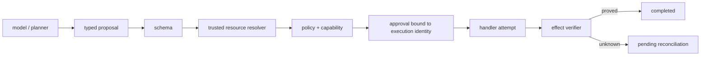

# Safe Agent

**项目导航**：[返回项目索引](../project-index.md) · [Agent 架构](../../applications/agent-architecture.md) · [Agent Runtime](../../applications/agent-runtime.md) · [互操作协议](../../applications/agent-interoperability.md) · [实验 6](../labs.md#lab-6)
{ .doc-nav }

## 目标

把模型建议、typed proposal、schema validation、可信资源解析、policy、人工审批、handler attempt、effect verification 和恢复分别建模。模型或 Agent 框架只能提出 `ToolCall`；获得执行权的是独立控制面，而不是“JSON 看起来合法”或模型自述已获授权。

核心不变量：default deny；ACL/capability 不来自模型参数；approval 绑定 subject/resource/tool/arguments/policy version/expiry；handler 一旦 claim 就消耗预算；`completed` 必须由 verifier 建立；相同 call id 换身份或参数是冲突，不能覆盖。

## 故障、pending 与人工对账 { #run }

每次使用全新的 SQLite ledger：

~~~powershell
python -m about_llm.agents.cli run `
  --scenario projects/safe-agent/scenario.example.jsonl `
  --ledger artifacts/agent/scenario-001.db `
  --max-tool-calls 5

python -m about_llm.agents.cli pending `
  --ledger artifacts/agent/scenario-001.db `
  --older-than-seconds 0
~~~

离线 scenario 覆盖只读调用、缺审批、typed grant、同 call id cache、撤权后 cache replay 拒绝、跨 tenant 拒绝，以及 handler timeout 后外部状态未知。`uncertain-1` 必须保持 pending；timeout/exception 不能伪装成“未执行”或成功。

真实 operator 先查 provider audit、业务数据库或 outbox，再选择 resolution。下面只适用于已知没有真实副作用的 fixture：

~~~powershell
python -m about_llm.agents.cli resolve `
  --ledger artifacts/agent/scenario-001.db `
  --call-id uncertain-1 `
  --resolution abandoned `
  --note "offline fixture verified: no external operation exists"

python -m about_llm.agents.cli inspect `
  --ledger artifacts/agent/scenario-001.db `
  --call-id uncertain-1
~~~

`external` resolution 必须提供 canonical JSON value；`compensated` 表示副作用发生后已完成逆向操作。Resolved call id 永不重新执行；放弃或补偿后的新尝试必须使用新 call id 和新 approval。

## Typed planner loop 与 checkpoint resume

~~~powershell
python -m about_llm.agents.cli loop `
  --cases projects/safe-agent/loop.example.jsonl
~~~

Loop 分开限制 decision step、supplied model token/cost、monotonic active wall time、handler attempt、重复 action、`A/B/A/B` cycle 和连续 policy error。只有 verifier `PASSED` 才能 `completed=true`。Fixture token/cost、固定 clock 和 exact verifier 不代表 provider usage、真实账单、线上延迟或开放语义判断；四步 cycle detector 也不证明发现任意长周期或语义等价循环。

Approval pause 必须发生在 handler 前，并保存 pending decision、原预算、累计 usage/handler counter、event/action history 和 execution fingerprint：

~~~powershell
python -m about_llm.agents.cli pause-loop `
  --cases projects/safe-agent/loop.example.jsonl `
  --case-id approval-pause `
  --ledger artifacts/agent/loop-001.db `
  --checkpoint artifacts/agent/loop-001.checkpoint.json

python -m about_llm.agents.cli resume-loop `
  --cases projects/safe-agent/loop.example.jsonl `
  --case-id approval-pause `
  --ledger artifacts/agent/loop-001.db `
  --checkpoint artifacts/agent/loop-001.checkpoint.json
~~~

Resume 先重新授权，再执行原 pending decision，不重复 planner token/cost。Checkpoint 是 exclusive-create strict JSON，但 fingerprint 不是签名；checkpoint 与 SQLite 不原子，fixture approval 未签名，等待 downtime 不计 active wall time。它证明 deterministic restart control flow，不是 durable workflow、一次性 grant service 或跨节点 session 恢复。

## Strict JSON model planner boundary

~~~powershell
python projects/safe-agent/model_planner_control.py
~~~

`StrictJSONModelPlanner` 把模型文本转换为 typed action。Request identity 绑定 prompt/revision、task、剩余预算、tool/schema/validator revision、最近 event、输出 cap 与预期 model revision。Tool observation 明确标为 untrusted；真正授权仍来自 `ExecutionContext`、server-resolved resource、policy、approval 和 runtime validator。

Response 必须带 exact model revision、provider request id、input/output usage、cost 与允许的 finish reason。Parser 只接受一个 closed-schema object，拒绝 Markdown fence、duplicate key、non-finite、未知字段/工具和无效 evidence id。Provider output usage 不得超过 request cap。

`JSONSchemaToolContract` 要求 Draft 2020-12、root object 与 closed fields；只允许 local `$ref`，拒绝 `$id`/remote retrieval，并限制 schema/instance canonical bytes。Validation 不 coercion、不应用 default、不做授权。Control 的四个负例证明 request/state replay 漂移、fenced JSON、runtime `const` rejection 和缺 capability 都在 handler 前 fail closed。

Authored 62 tokens、0.03 cost 和 request id 都是 fixture metadata；无密钥 fingerprints 不认证 provider、来源或语义正确性。Raw response 可能敏感，生产审计需加密、访问控制和 retention。

## LangChain / LlamaIndex 工具适配 { #framework-tool-adapters }

~~~powershell
python projects/safe-agent/framework_tool_adapter_control.py
python -m pytest tests/test_agent_framework_tool_adapters.py -q
~~~

Control 真实执行 `langchain==1.3.14` / `langchain-core==1.5.3` 的 `StructuredTool` 与 `llama-index-core==0.14.23` 的 `FunctionTool` / `ToolSelection`。两边共用 strict Pydantic 参数模型，但框架函数只生成 `{tool_name, arguments}` proposal；`subject_id`、tenant、capabilities、可信 resource resolver、policy 与 handler 不进入模型参数，仍由 canonical `AgentRuntime` 掌握。

固定 `key=public` 在两边各执行一次并返回同一 value；同 framework call/tool id 重放为 `cached`。`key=private` 虽通过参数 schema，却解析到 tenant-b，两个路径都在 handler 前 `policy_denied`。选择未知 tool name 也由 adapter allowlist 在调用已绑定工具前拒绝。

一个重要负例是 `key=7`：当前 LangChain path 在 framework Pydantic validation 拒绝；当前 LlamaIndex 的直接 `FunctionTool.call()` 会先进入 Python function，随后才被 canonical Draft 2020-12 gate 拒绝。LlamaIndex `fn_schema` 保留 closed root，但当前 `get_parameters_dict()` projection 省略 `additionalProperties: false`。所以“框架展示了 schema”不能写成“所有调用入口都强制执行完全相同的 schema”；升级时必须复跑 disclosure、proposal transport 和 effect authorization 三层负例。

这里没有执行 LangGraph 或 LlamaIndex Agent loop、模型/provider、异步取消、网络、remote tool、人工审批或真实副作用，也不证明框架默认 ACL、幂等、生产安全、性能或跨版本兼容。两框架在 authored fixture 上 parity，只说明 canonical core 没被 adapter 改写。

## LangChain / LlamaIndex Agent loop { #framework-agent-loops }

上节的 proposal-only adapter 仍没有运行 Agent loop；下面是另一条、证据更高一层的 control：

~~~powershell
python projects/safe-agent/framework_agent_loop_control.py
~~~

它固定 `langchain==1.3.14`、`langchain-core==1.5.3`、`langgraph==1.2.10` 与 `llama-index-core==0.14.23`，真实进入 LangChain `create_agent()`/LangGraph 和 LlamaIndex `FunctionAgent.run()` 的 model→tool→model 控制流。两个 model 都是确定性的进程内 scripted fixture，不是 provider/目标模型；tool 最终仍委托同一 canonical runtime 执行 schema、可信 resource resolver、policy 与 call-id cache。

authorized case 两边都是 `completed` 且 verifier 通过；same-id replay 都是 `completed → cached`，handler 只执行一次；cross-tenant 都是 `policy_denied`；unknown-tool 都产生 framework error 且没有 canonical receipt。后两组 scripted model 仍声称 `fixture:public`，但独立 verifier 只接受本地 `completed/cached` receipt 与 exact value，因此拒绝完成。

LangChain 用 `InjectedToolCallId` 作为 canonical ID，并显式回归 postponed annotation 下的运行时 ID injection。当前 LlamaIndex `FunctionTool` handler 不收到 `ToolSelection.tool_id`，所以 control 从可信 fixture case/action 派生 canonical ID；它不是通用生产幂等方案，同参但有意重复的业务动作仍需可信 orchestrator 分配不同 identity。当前 LlamaIndex Workflow 每 case 触发 73 次 Pydantic deprecated-field warnings；报告捕获它们并要求无其他 warning，升级时必须复跑。

这里没有真实模型/provider、网络、remote tool、外部副作用、persistent checkpointer/resume、streaming、parallel tools、interrupt、cancel/deadline、性能、费用或质量证据，也不证明 framework 默认 authorization、幂等、生产安全或跨版本兼容。准确表述只能是“真实框架控制流 + scripted model + canonical runtime 的本地回归”。

## Recorded trajectory gate

~~~powershell
python -m about_llm.agents.cli evaluate `
  --traces projects/safe-agent/trajectory.example.jsonl
~~~

报告为每个比例保留 numerator/denominator；分母为零时 value 是 `null`。Task success 与安全 guardrail 分开：出现 policy-denied handler、over-refusal、未审批副作用、重复 effect、未解决 pending、预算超限或 unjudged case 时，不能用平均任务成功率抵消。

`handler_attempted` 只表示进入 handler；`effect_applied` 必须来自模拟状态、provider audit 或业务 verifier，不能从远端 `completed` 字符串猜。手写 trajectory 只验证 artifact/metric contract，不证明生产 policy、真实 effect observer 或防篡改 recorder。

## Transactional outbox 与 crash window

~~~powershell
python projects/safe-agent/outbox_demo.py `
  --database artifacts/agent/outbox-demo-001.db
~~~

同一 SQLite transaction 写 local task state 与 pending effect。Worker A claim lease、模拟 provider 成功后在 ack 前 crash；worker B reopen 后于 lease expiry 重领，并以相同 `effect_id` 作为 provider idempotency key。固定结果是 attempts=2、provider calls=2、provider effect count=1、最终 delivered，timeline 为 `enqueued → claimed → lease_expired → claimed → delivered`。

这是 local SQLite + simulated idempotent provider 的 at-least-once 证据。Outbox 只能让本地状态与待投递 row 原子，不能和 provider 构成事务；lease 不是 exactly-once。只有 provider 真正 honor idempotency key 时重投才可能折叠，supplied receipt 也不认证外部 effect。

## MCP 与 A2A 证据矩阵

~~~powershell
python projects/safe-agent/mcp_sdk_memory_control.py
python projects/safe-agent/mcp_sdk_stdio_control.py
python projects/safe-agent/mcp_sdk_streamable_http_control.py
python projects/safe-agent/mcp_stdio_control.py
python projects/safe-agent/mcp_streamable_http_control.py
python projects/safe-agent/a2a_loopback_control.py --verify-official-schema
~~~

| Control | 实际执行 | 仍未证明 |
|---|---|---|
| MCP official SDK memory | `mcp==1.29.0` client/server/generated types + AnyIO memory streams | OS transport、网络、auth、conformance |
| MCP official SDK stdio | 独立 subprocess、真实 stdin/stdout pipe | malformed framing、cancel、supervisor、remote |
| MCP official SDK HTTP | 独立 subprocess、真实 loopback HTTP、stateful POST/GET/DELETE | MCP auth、TLS、resumption、conformance |
| Authored strict stdio | LF/UTF-8/strict JSON、schema/error/framing 负例 | 官方 SDK/完整 schema、remote/auth |
| Authored Streamable HTTP | Origin/Bearer/session/version、POST/GET SSE、cancel/DELETE | OAuth、TLS、event store、跨厂商 |
| A2A official SDK loopback | Agent Card、SendMessage/GetTask、v1.0 schema hash | TCK、SSE/REST/gRPC、签名 card、remote interop |

这些 controls 不能互相借证据：自写 stdio 的 malformed framing 测试不等于 official SDK transport 已测；official SDK 身份也不能贴到 authored parser。测试用随机 token/Bearer 不是 OAuth、tenant、scope 或业务授权。Loopback、schema-valid、远端 completed 与无密钥 fingerprint 都不证明业务正确、身份真实或生产安全。

## 最小验证与故意破坏

~~~powershell
python -m pytest tests/test_agent_runtime.py tests/test_agent_policy.py tests/test_agent_schema.py tests/test_agent_loop.py tests/test_model_planner.py tests/test_agent_framework_tool_adapters.py tests/test_agent_outbox.py tests/test_sqlite_agent_ledger.py tests/test_agent_cli.py tests/test_agent_evaluation.py tests/test_mcp_sdk_memory.py tests/test_mcp_sdk_stdio.py tests/test_mcp_sdk_streamable_http.py tests/test_mcp_stdio.py tests/test_mcp_streamable_http.py tests/test_a2a_loopback.py -q
~~~

重点反例：撤权后 cached result 必须重新授权；同 call id 换参数/身份/版本冲突；approval 漂移或过期拒绝；resume 不得重复 usage；handler 非 JSON 结果保持 pending；provider success/ack 前 crash 只允许 at-least-once 重投；schema-invalid 必须在 handler 前停止；远端 completed 不能跳过本地 verifier：

~~~powershell
python -m pytest tests/test_agent_policy.py::test_cached_replay_is_reauthorized_after_capability_revocation tests/test_agent_runtime.py::test_call_id_reuse_with_changed_arguments_is_rejected tests/test_agent_policy.py::test_approval_rejects_expiry_subject_and_argument_drift -q
python -m pytest tests/test_agent_loop.py::test_checkpoint_round_trip_restart_and_resume_without_double_usage tests/test_agent_runtime.py::test_invalid_handler_result_stays_pending_without_reexecution tests/test_agent_outbox.py::test_crash_after_provider_success_causes_redelivery_not_exactly_once -q
python projects/safe-agent/model_planner_control.py
python -m pytest tests/test_agent_loop.py::test_loop_requires_verifier_pass_before_completion -q
~~~

验收至少保存：trusted subject/resource context、proposal/execution identity、schema/policy/approval revision、handler attempt 与 budget、effect verifier、pending/reconciliation、checkpoint/outbox timeline，以及一个越权、篡改或 crash 反例。不能只保存模型对话截图。

## 证据边界

仓库证明 scripted/recorded planner、strict JSON/schema、local policy/approval/verifier、SQLite ledger/outbox，以及固定 MCP/A2A loopback controls 的局部契约。它不证明真实模型稳定遵循协议、provider usage/账单、集中 IAM、签名/一次性审批、外部 broker、远程互操作、完整 conformance、TLS/OAuth、多区域恢复或 exactly-once side effect。Local hash/checkpoint/receipt 不认证来源；loopback/SQLite/simulated provider 不得外推为生产 Agent 安全、真实任务成功或副作用可靠性。

完整实现与每条 control 的精确边界见 [projects/safe-agent](https://github.com/NightLemon/about-llm/tree/main/projects/safe-agent)。
