# Single-GPU Finetuning：从数据到可发布 Adapter

**项目导航**：[返回项目索引](../project-index.md) · [微调总览](../../training/finetuning.md) · [SFT 数据管线](../../training/sft-data-pipeline.md) · [PEFT/QLoRA 工程](../../training/peft-qlora-engineering.md) · [评测项目](evaluation-gate.md) · [实验 4](../labs.md#lab-4)
{ .doc-nav }

本项目把“能启动训练”拆成一条可审计的交付链：训练数据与 held-out 数据分权、readiness artifact、目标 tokenizer 的 assistant mask、Trainer 最终 labels、LoRA/QLoRA 训练、adapter 重载、偏好优化以及独立评测。默认先跑不下载权重的前置检查，再选择离线 tiny control、固定 Qwen recorded control 或目标 GPU 实验。

!!! warning "先读证据边界"
    仓库已经真实执行 CPU、CPU/Gloo、tiny Transformer 和固定 Qwen2.5-0.5B-Instruct 的若干控制实验；当前工作区没有提供 CUDA/QLoRA 峰值、NCCL、多卡、真实业务数据或生产质量证据。不同 control 不能拼接成一个更宽的“完整训练已验证”结论。

## 学完后应能交付什么

一次可复核的微调项目至少要交付五类对象，而不只是 adapter 文件或一条 loss 曲线：

| 对象 | 最小内容 | 它能证明什么 | 它不能自动证明什么 |
|---|---|---|---|
| 数据发布包 | train-only JSONL、combined audit identity、split/group/exact/lexical/governance 报告 | trainer 读到的 train 顺序与审核对象绑定，已运行声明的门禁 | 语义去重、法律许可、consent、完整 PII/secret 检测 |
| Token/label 审计 | tokenizer/revision/template identity、`input_ids`、assistant mask、最终 `-100` labels | 当前模板与 collator 在固定输入上的监督区域 | span 的语义选择正确、未见 schema 也正确 |
| 训练运行包 | immutable model revision、依赖版本、seed、超参数、checkpoint/恢复语义、资源测量 | 哪个程序在什么配置下产生了什么状态 | 质量提升、确定性复现、任意硬件等价 |
| Adapter 发布包 | PEFT config、权重、base identity、tokenizer/template、文件清单与重载测试 | 当前 bundle 结构完整且能在绑定基座上重载 | 发布者真实性、任务质量、部署兼容性与 TOCTOU 消除 |
| 对比评测包 | base/Prompt/RAG/adapter 的同一 cases、manifest、逐例结果与 gate | 当前样本与阈值下的相对结果 | 线上因果收益、分布外泛化与长期安全性 |

## 系统边界

```mermaid
flowchart LR
    A["审计身份：可读 train + validation/test"] --> B["split / duplicate / governance / readiness"]
    B -->|"只发布 train + readiness"| C["训练身份：不可读 held-out 原文"]
    C --> D["tokenizer + reviewed chat template"]
    D --> E["assistant mask + final-label audit"]
    E --> F["LoRA / QLoRA / DPO"]
    F --> G["adapter + config + tokenizer/template"]
    G --> H["独立评测身份：base vs adapter"]
    H --> I["comparison artifact + release gate"]
```

这里的“身份”表示权限边界，不要求一定拆成三台机器。关键是训练进程不应为了验证 readiness 而重新读取 validation/test 原文；评测也不应复用训练时看过的样本来证明泛化。

## 运行前准备

基础 CPU 路径：

~~~powershell
python -m pip install -e ".[dev,torch,transformers,finetune]"
python scripts/doctor.py
~~~

真实 QLoRA 还需要在支持的 CUDA 环境安装 `.[qlora]`，并核对 PyTorch、CUDA、driver、bitsandbytes 与 compute capability。安装成功不等于目标训练已跑通；峰值显存、kernel 路径和吞吐必须在目标 GPU 上重新记录。

## 端到端主线 { #run }

### 0. 先冻结问题、基线和接受标准

在接触训练超参数之前，写下：目标任务、不可退化项、切分单位、主指标、最小有意义差异、失败预算与上线门槛。至少比较同一 base checkpoint 的 zero/few-shot、Prompt、RAG（若任务依赖更新事实）和 adapter；否则无法知道收益来自训练、检索、提示还是评测漂移。

### 1. 由审计身份生成 train-only readiness

下面的 fixture 是作者构造的 schema/control 数据，不是可训练出有用模型的语料：

~~~powershell
python -m about_llm.finetuning_cli prepare-training `
  --train-jsonl projects/single-gpu-finetuning/train.example.jsonl `
  --audit-jsonl projects/single-gpu-finetuning/audit.example.jsonl `
  --profile nfc_whitespace `
  --ngram-size 5 `
  --threshold 0.9 `
  --governance-policy projects/single-gpu-finetuning/governance-policy.example.json `
  --governance-evaluated-at 2026-08-06T12:00:00Z `
  --output-dir artifacts/sft-prepare
~~~

成功会发布 `sft-split-audit.json`、`sft-data-binding.json`、`sft-near-duplicate-audit.json`、`sft-governance-audit.json` 与 `sft-training-readiness.json`。当前 fixture 的 readiness 是 v3，绑定 2 条有序 train 记录且不嵌入 held-out 原文；`gate_passed=true` 只说明已定义门禁通过，不能改写成“数据已获法律许可”“无 PII/secret”或“没有语义污染”。

### 2. 由训练身份做零下载 data preflight

固定 model revision，但先不下载 tokenizer 或权重：

~~~powershell
python projects/single-gpu-finetuning/train_trl_sft.py `
  --model-id Qwen/Qwen2.5-0.5B-Instruct `
  --revision 7ae557604adf67be50417f59c2c2f167def9a775 `
  --train-jsonl projects/single-gpu-finetuning/train.example.jsonl `
  --readiness-json artifacts/sft-prepare/sft-training-readiness.json `
  --output-dir artifacts/sft-preflight `
  --data-preflight-only
~~~

该路径已在本仓库实跑：trainer 只读取 train 与 readiness，生成 `sft-data-audit.json` 和 readiness 副本；若顺序、内容、版本、字段集合、gate 或 fingerprint 漂移，就在导入训练依赖前失败。它尚未验证 tokenizer、assistant mask、GPU 或训练质量。

### 3. 在任何 backward 前审计 template、mask 与最终 labels

Qwen2.5-0.5B-Instruct 的 checkpoint-native template 不含 ``；本项目固定的三条 tool-aware fixture 上，请求 assistant mask 会得到全零。审核模板 `qwen2.5-generation-aware-sft.jinja` 必须保持完整 `input_ids` 不变，只标记 assistant serialization。先核对 recorded report：

~~~powershell
python projects/single-gpu-finetuning/run_qwen_target_sft_label_control.py `
  --verify projects/single-gpu-finetuning/qwen2.5-0.5b-sft-label.recorded-report.json
python -m pytest tests/test_target_sft_label_control.py -q
~~~

正式入口先在 Python record 上渲染，再构造只含整数特征的 Arrow Dataset，避免异构 tool arguments 被 Arrow 扩成带 `null` 的统一 struct。TRL 0.29.1 对预分词数据配置 `assistant_only_loss=False`，但 configured collator 仍消费预计算 mask；入口随后写 `sft-template-mask-audit.json` 与 `sft-final-label-audit.json`，逐位置确认 assistant label 等于 input ID，其他有效 token 和 padding 都是 `-100`。

`--verify` 只验证仓库中已录制 artifact 的闭合契约，不是重新执行目标模型 forward。要复现实跑，需要本地固定 checkpoint bytes，并去掉 `--verify`、增加 `--local-files-only --output-report <path>`；这仍是 CPU FP32 no-grad label control，不是训练。

### 4. 先跑离线 tiny SFT 与 PEFT 发布控制

~~~powershell
python projects/single-gpu-finetuning/smoke_trl_sft.py
python projects/single-gpu-finetuning/smoke_peft.py `
  --steps 8 `
  --artifact-root artifacts/peft-export-control
~~~

第一条用本地 WordLevel tokenizer、随机 tiny GPT-2 和真实 TRL optimizer 检查 `messages → assistant_masks → labels → step`；第二条检查冻结基座、adapter 保存/重载、merge、tokenizer/template 与 strict manifest。tiny loss 下降和数值重载等价只证明控制流与 artifact plumbing，不证明目标模型收益。

### 5. 核对固定 Qwen LoRA 单步证据

~~~powershell
python projects/single-gpu-finetuning/run_qwen_target_lora_control.py `
  --verify projects/single-gpu-finetuning/qwen2.5-0.5b-lora.recorded-report.json
python -m pytest tests/test_target_lora_control.py -q
~~~

该录制 control 真实执行 CPU FP32 assistant-only backward、一次 AdamW step、冻结基座检查、标准 PEFT adapter 发布和新基座重载。270,336 个 `q_proj/v_proj` adapter 参数完成导出，重载 logits max error=0；但固定单样本 loss 从约 0.003864 升到 0.584557。正确结论是“目标权重训练与发布链路执行过”，不是“LoRA 改善了模型”。

### 6. 估算容量，再进入目标 GPU SFT/QLoRA

先用无需下载和 GPU 的分项估算筛掉明显不可行配置：

~~~powershell
python projects/single-gpu-finetuning/train_qlora.py `
  --model-id illustrative/model `
  --revision immutable-commit-placeholder `
  --num-parameters 7000000000 `
  --num-layers 32 `
  --hidden-size 4096 `
  --max-length 1024 `
  --micro-batch-size 1 `
  --gradient-accumulation 16 `
  --rank 16 `
  --alpha 32 `
  --target-modules q_proj,k_proj,v_proj,o_proj `
  --target-linears-per-layer 4 `
  --estimate-only
~~~

当前公式示例输出约 3.85 GiB 量化基座、0.25 GiB adapter 与 optimizer、0.70 GiB 激活、1.38 GiB temporary/runtime reserve，总计约 6.18 GiB。它是启发式筛选，不包含目标 kernel、logits、allocator 碎片或运行时峰值；不得写成“7B QLoRA 只需 6.18 GiB”。QLoRA 也不是全部 4-bit：adapter、梯度、optimizer、激活和部分算子仍使用更高精度。

目标 GPU 上的 SFT 命令要显式绑定 revision、模板、readiness 和输出目录：

~~~powershell
python projects/single-gpu-finetuning/train_trl_sft.py `
  --model-id Qwen/Qwen2.5-0.5B-Instruct `
  --revision 7ae557604adf67be50417f59c2c2f167def9a775 `
  --train-jsonl projects/single-gpu-finetuning/train.example.jsonl `
  --readiness-json artifacts/sft-prepare/sft-training-readiness.json `
  --chat-template-path projects/single-gpu-finetuning/qwen2.5-generation-aware-sft.jinja `
  --output-dir artifacts/sft-run `
  --batch-size 1 `
  --gradient-accumulation 16 `
  --rank 16 `
  --alpha 32
~~~

这里的 fixture 仍不能训练出有用模型。换入真实数据后，应先 dry-run 一个 optimizer update，再逐步提高 sequence length 或有效 batch；记录峰值显存、有效监督 token/s、OOM 配置、依赖版本与实际 adapter module tree。不要把 `q_proj,k_proj,v_proj,o_proj` 当成所有 checkpoint 的通用模块名。

### 7. 偏好数据、DPO 与 RM 是另一条契约

偏好训练不能把 tie/invalid 静默改成 winner，也不能直接把 combined artifact 交给 trainer：

~~~powershell
python -m about_llm.preference_cli prepare-training `
  --train-jsonl projects/single-gpu-finetuning/preference.train.example.jsonl `
  --audit-jsonl projects/single-gpu-finetuning/preference.example.jsonl `
  --profile nfc_whitespace `
  --ngram-size 5 `
  --threshold 0.9 `
  --governance-policy projects/single-gpu-finetuning/governance-policy.example.json `
  --governance-evaluated-at 2026-08-06T12:00:00Z `
  --output-dir artifacts/preference-prepare
python projects/single-gpu-finetuning/smoke_trl_dpo.py
python projects/single-gpu-finetuning/run_qwen_target_dpo_control.py `
  --verify projects/single-gpu-finetuning/qwen2.5-0.5b-dpo.recorded-report.json
~~~

固定 Qwen DPO control 真实执行 TRL 0.29.1、LoRA backward 与一个 AdamW step，authored pair 的 loss 下降；同时把 `reference replay max-abs drift=0.547077` 单列。冻结参数与配置 fingerprint 不变，所以该 drift 不能称为 reference 权重改变，也不能被隐藏成 bit-exact replay。该控制数据中的 `good/bad` 不是人类偏好或安全标签。

正式 DPO/RM 入口分别是 `train_trl_dpo.py` 与 `train_reward_model.py`。先加 `--data-preflight-only`，再做 tokenizer preflight、module mapping、显存测量与目标 GPU 小步运行；`--qlora` 路径在本仓库当前环境未实跑，不能借用 CPU LoRA 或 DPO control 的证据。

### 8. 用独立 held-out 评测决定是否交付

训练结束后不要用 train loss 选上线版本。复用 [Evaluation Gate](evaluation-gate.md)，在同一 case identity、解码配置和评分契约下比较 base、Prompt/RAG baseline 与 adapter。至少报告任务指标、格式合法率、拒答/安全切片、通用能力回归、逐例变化、峰值显存、训练时间与 adapter 大小；多次试验选择、缺失样本和人工排除必须进入 manifest。

一个可接受的结论示例是：“在固定 held-out artifact 和预注册阈值上，adapter 相对 base 的任务指标通过 gate，通用/安全切片未越界；资源结果只适用于记录的 GPU/runtime。”不要写成“模型已经学会领域知识”“不会幻觉”或“可直接生产部署”。

## 常见失败与定位顺序

| 现象 | 先检查 | 不应采取的做法 |
|---|---|---|
| readiness 拒绝 | train 顺序、combined binding、版本、未知字段、decision time | 重新生成 hash 掩盖数据漂移 |
| assistant mask 全零 | checkpoint template 是否含 generation span；抽查 tool/multi-turn serialization | 把所有非 padding token 都设为 label |
| final label 数不对 | Arrow 前预分词、collator、padding side、`-100` 投影 | 只看 dataset 的 mask，不看 Trainer batch |
| 首步 loss 异常 | shift、EOS、监督 token 数、LR、dtype、重复样本 | 用单步下降宣称收敛 |
| OOM | micro-batch→checkpoint/attention→长度→target/rank→小模型 | 悄悄改变 baseline 名称或评测集 |
| resume 后漂移 | optimizer/scheduler/scaler、RNG、sampler cursor、pending gradients、commit boundary | 只保存 adapter 权重却称 exact resume |
| adapter 能加载但答案退化 | base identity、template、generation config、held-out slices | 用 reload 成功替代质量评测 |

## 机制控制与失败对照 { #controls }

下面的实验用于隔离 reduction、AMP、DDP、DataLoader、checkpoint 与目标权重问题。它们是主线的部件级证据，不是同一条完整生产训练运行。

### 变长监督 token 的 reduction control

~~~powershell
python projects/single-gpu-finetuning/gradient_accumulation_toy.py
python -m pytest tests/test_gradient_accumulation.py -q
~~~

固定两个 micro-batch 的有效 token 数为 `[1,3]`，另有三个 ignored/padding 位置。若目标是 token mean，正确权重是 `1/4,3/4`；错误的等权 micro-batch mean 使用 `1/2,1/2`。精确 `Fraction` oracle 的 full/count-scaled class-aggregate gradient 都是 `(23/40,-23/40)`，naive 路径是 `(7/20,-7/20)`；真实 PyTorch CPU Float64 backward 也使 full 与 sum/count 梯度逐元素相同，ignored rows 为零。

该 control 没有执行 optimizer、随机层、AMP、DDP/FSDP/ZeRO、CUDA 或目标 LLM。它证明局部 reduction 反例与 PyTorch 路径，不证明任意 Trainer 默认配置、分布式集成、训练收敛、性能或质量。

### 双进程 DDP token mean

双进程 reducer control 在 CPU/Gloo 上真实执行 count `all_reduce` 与默认 DDP backward：

~~~powershell
python projects/single-gpu-finetuning/ddp_token_mean_control.py
python -m pytest tests/test_ddp_token_mean.py -q
~~~

固定 `D=2,N=4`、rank counts `[1,3]` 时，正确 local loss-sum scale `D/N=1/2` 得到 full-batch `(+23/40,-23/40)`；漏 world size 的 `1/N=1/4` 得到 `(+23/80,-23/80)`，rank-local mean 得到 `(+7/20,-7/20)`。两个 OS 进程都观察到 all-reduced count 4 和相同同步梯度。它只证明当前 PyTorch/Gloo/default reducer 固定路径；没有执行 optimizer、accumulation + `no_sync`、AMP、FSDP/ZeRO、GPU、多节点、目标 Trainer/model 或质量评测。

### DDP accumulation、`no_sync`、clip 与 update

再运行 accumulation/update control：

~~~powershell
python projects/single-gpu-finetuning/ddp_accumulation_no_sync_control.py
python -m pytest tests/test_ddp_accumulation_no_sync.py -q
~~~

两个 rank 各有两个 micro-batch，counts `[[1,2],[3,1]]`、`N=7`，正确 scale `D/N=2/7`。精确 pre-clip gradient 为 `(+19/35,-19/35)`；built-in DDP 的正确 `no_sync`、同步后 global-norm clip、plain SGD update 均与 full batch 相同。官方 reference hook 的通信计数正/负对照分别为 1 次（forward+backward 都在 context 内）与 2 次（只包 backward）。负对照的数值在本线性 fixture 上仍正确，只是未省通信；计数不是对 built-in reducer 的直接插桩。该 control 仅有一个两元素参数/单 bucket，没有 AMP、随机层、AdamW、FSDP/ZeRO、GPU、多节点、目标 Trainer/model 或性能/质量证据。

### AMP/GradScaler overflow 与 clip 顺序

再独立验证 AMP state machine：

~~~powershell
python projects/single-gpu-finetuning/amp_grad_scaler_control.py
python -m pytest tests/test_amp_grad_scaler.py -q
~~~

CPU FP16 autocast/GradScaler 下，正确 `unscale→clip` 将 scaled gradient 24 还原为 3、再 clip 到约 0.5，与 full batch相同；错误 `clip→unscale` 只留下约 0.0625。三个 overflow window 观察 scale `8→4→2→1`，AdamW 参数/moments/step 不变。in-memory 恢复 scale=1 后边界 gradient 10000 执行 step=2；遗漏 scaler、回到 scale=8 时 overflow 并保持 step=1。该实验无磁盘 checkpoint/进程重启、DDP/CUDA、目标 Trainer/model 或质量证据，不能与其他 control 拼接成更宽结论。

### DDP + AMP overflow 共识

再把 DDP 与 AMP 放进同一路径，验证 overflow 决策是否跨 rank 一致：

~~~powershell
python projects/single-gpu-finetuning/ddp_amp_overflow_consensus_control.py
python -m pytest tests/test_ddp_amp_overflow_consensus.py -q
~~~

当前双进程 CPU/Gloo fixture 中，rank 0 在首个 `no_sync` micro-batch 产生 Inf 后，末批 built-in DDP reduction 会让两 rank 都 non-finite；两边共同 skip AdamW/StepLR，scale `8→4`。故意改在 finite reduction 之后、rank 0 `unscale_` 之前损坏 gradient，则两个 rank-local scaler 分别 skip/update，optimizer step 变成 `[1,2]`，参数、moments、scheduler、LR 与 scaler 都分叉。optimizer 前对 local flag 做 `all_reduce(MAX)` 后，两边共同 skip 并采用 scale=4 的显式策略，训练状态重新保持一致。

post-reduction 损坏是 authored counterfactual，不是 DDP 正常行为；默认 reduction 前 Inf 已在第一条传播。`update(new_scale=...)` 也只同步 scale，growth tracker 保持 1，不模仿 native found-inf 的 tracker reset。这个单参数/单 bucket CPU control 没有 clipping、自然 overflow、custom hook、checkpoint、CUDA/NCCL、多节点、目标 Trainer 或质量证据，不能当通用 distributed scaler 实现。

### 跨进程 checkpoint 与 exact resume

随后运行真正统一的跨进程 resume control：

~~~powershell
python projects/single-gpu-finetuning/checkpoint_resume_control.py
python -m pytest tests/test_training_resume_process_control.py -q
~~~

6 参数 CPU FP16 fixture 在一次有限 AdamW update 后连续 overflow 三次；scale `8→4→2→1`，optimizer 与 StepLR 都不前进。phase-1 将 model/optimizer/scheduler/scaler、Torch+Python RNG、stateful shuffle permutation/cursor/epoch 与 dataset hash 写入约 21 KiB checkpoint 后退出；不同 PID 用 `weights_only=True` 重开，resume tail 与最终状态和 uninterrupted worker bit-exact。错误推进 scheduler、漏 scheduler/scaler/RNG/data state 分别产生 LR、step、随机 trace 或 batch 漂移。它仍没有 DataLoader worker/prefetch、accumulation 中间态、DDP/CUDA、目标 Trainer、crash atomicity、来源认证、性能或质量证据。

### DataLoader prefetch cursor 与 worker RNG

真实 DataLoader worker/prefetch 由独立 control 覆盖：

~~~powershell
python projects/single-gpu-finetuning/dataloader_prefetch_resume_control.py
python -m pytest tests/test_dataloader_prefetch_resume_control.py -q
~~~

固定 permutation `[8,3,1,7,0,9,4,2,6,5]`、两个 spawn workers、prefetch factor 2、batch 1。phase-1 只消费 `[8,3,1]` 时 sampler 已 emitted 到 7；从这个 cursor 恢复会漏 `[7,0,9,4]`，从应用 consumed cursor=3 恢复才还原完整 ID 顺序。fresh worker-local Torch RNG tail 仍与 uninterrupted 不同，最大差约 0.654431；按 sample ID 派生的局部 generator tail exact。该 key 没有 epoch/visit，control 也没有 collator/model/optimizer、persistent/IterableDataset、DistributedSampler 或 queue-state checkpoint；consumed 不等于 optimizer committed，不能与统一 model checkpoint 拼成完整训练 exact resume。

### Consumed—optimizer-committed 崩溃窗口

同项目现在另有真实 consumed—optimizer-committed 崩溃窗口 control：

~~~powershell
python projects/single-gpu-finetuning/optimizer_commit_resume_control.py
python -m pytest tests/test_optimizer_commit_resume_control.py -q
~~~

六个独立顶层 PID 的每段都启动两个 spawn workers。CPU Float64 `Linear(2,1)` 的输入先乘 main-process inverted-Bernoulli mask（seed `20260815`），再执行 MSE、SGD momentum、`StepLR(step_size=2,gamma=0.5)` 与两步 accumulation。phase-1 在第三条 `[8,3,1]` 已 stochastic backward 后退出：emitted/consumed/committed=`7/3/2`。当前 8,985-byte base checkpoint 不含 `.grad`，但保存 commit-boundary model/optimizer/scheduler/Torch RNG；从 committed=2 恢复 RNG并重放后，ledger 与 model/optimizer/scheduler/RNG fingerprint 都和 uninterrupted bit-exact，参数最大差 0。

第一个隔离负例从 consumed=3 起步，加载正确 crash RNG却漏 pending gradients/sample `1`；未来 mask 与终态 RNG 仍和 baseline 相同。末尾 partial window 正确缩放后，两边仍都是 5 次 optimizer/StepLR step，终态 LR 同为 `0.0125`，但最大参数差为 `0.005767858566116724`。同一 phase 还写当前 7,905-byte sidecar，绑定 base digest、pending `[1]`、position=1、steps/loss divisor=2、两个逐参数 finite gradients与 crash-observed Torch RNG；最后发布当前 827-byte capped strict-canonical JSON manifest，绑定两个 payload 的文件名/schema/size/hash、数据 identity 与发布顺序。第五个 PID 先用 manifest gate 校验 artifacts，再对实际反序列化 bytes 重查 identity，从 consumed=3 继续；首个完成窗口为 `[1,7]`，终态也和 uninterrupted bit-exact、参数最大差 0。

第六个 PID 恢复完整 gradients/ledger，却故意沿用 commit-boundary RNG。它仍执行 5 次 optimizer/StepLR step并得到 LR `0.0125`，但终态 RNG 不同、参数最大差为 `0.017878893573032573`。四种 publication fault snapshots 分别覆盖 base-only、两 payload 无 manifest、manifest 缺 sidecar 与 sidecar post-manifest tamper，sidecar 路径都在 `torch.load` 前拒绝；base-only 仍可走 commit replay。8 个测试还拒绝 duplicate/noncanonical/unknown manifest，并检查 scheduler/RNG schema。两种正确协议与两个隔离负例在同一路径执行；但 manifest-last 只是 completeness marker，base/sidecar/manifest 分次发布不是 sample—optimizer—checkpoint 原子事务，也无目录 `fsync`、断电/文件系统故障、来源认证、不可变目录或并发 directory-swap 证据。control 覆盖 main-process Torch RNG/StepLR，不覆盖 worker/Python/NumPy/CUDA RNG、原生随机模型、GradScaler、CUDA、distributed 或目标 Trainer。

## 固定 Qwen 目标权重控制

### Tool-aware SFT final labels

固定 Qwen2.5-0.5B-Instruct 的 tool-aware SFT final-label control 已真实比较 checkpoint 原生模板与审核模板。原生模板在多轮、并行 tool calls、tool preamble 三条 authored fixture 上返回全零 assistant mask；审核模板保持 47 / 301 / 200 个 input IDs 相同，并在 Arrow 前标出 8 / 51 / 31 个 assistant serialization tokens。TRL 0.29.1 configured collator 得到 `[3, 301]`、548 个有效 token、355 个 padding、90 个监督 labels 与 813 个 `-100`，目标权重 CPU FP32 no-grad loss 为 `1.251716`：

~~~powershell
python projects/single-gpu-finetuning/run_qwen_target_sft_label_control.py --verify projects/single-gpu-finetuning/qwen2.5-0.5b-sft-label.recorded-report.json
python -m pytest tests/test_target_sft_label_control.py -q
~~~

它没有执行 backward 或 optimizer，只证明固定 Qwen tool schema/fixture，不能证明数据合法性、任意 provider schema、tool 结果真实性、其他消息结构、收敛或模型质量。

### CPU FP32 LoRA 单步、导出与重载

固定 Qwen2.5-0.5B-Instruct 的 CPU FP32 LoRA control 已真实执行 assistant-only backward、一次 AdamW step、冻结基座指纹、标准 PEFT adapter 的同目录临时构建/校验/rename 和新基座重载。它有 270,336 个 `q_proj/v_proj` adapter 参数，重载 logits max error=0，但单样本 loss 从约 0.003864 升到 0.584557；因此只证明目标权重链路，不证明训练改善或断电 durability。离线核对：

~~~powershell
python projects/single-gpu-finetuning/run_qwen_target_lora_control.py --verify projects/single-gpu-finetuning/qwen2.5-0.5b-lora.recorded-report.json
python -m pytest tests/test_target_lora_control.py -q
~~~

### TRL DPO 单步与 reference replay drift

同一固定 checkpoint 另有真实 TRL 0.29.1 DPO control：两条 authored pair 组成 `[4,28]` chosen/rejected batch，一次 CPU FP32 AdamW step 后 loss `0.693147→0.333352`、两条 relative margin 均为正，96 个 LoRA 梯度张量 finite，冻结基座参数/non-adapter state/config 指纹不变。reference replay 存在 `0.547077` 数值漂移，报告明确不把它等同于权重变化：

~~~powershell
python projects/single-gpu-finetuning/run_qwen_target_dpo_control.py --verify projects/single-gpu-finetuning/qwen2.5-0.5b-dpo.recorded-report.json
python -m pytest tests/test_target_dpo_control.py -q
~~~

## 项目验收清单

在简历或发布说明中声称“完成单卡微调项目”前，逐项回答：

- [ ] base model 与 revision 是否不可变，tokenizer/template 是否进入 identity？
- [ ] train 与 combined audit artifact 是否顺序绑定，trainer 是否无需读取 held-out 原文？
- [ ] 是否抽查并机器校验 assistant mask、shift 后 labels、padding 与截断？
- [ ] target modules 是否来自实际 module tree，而非从另一模型复制？
- [ ] 是否记录 trainable parameter count、有效监督 token 数、峰值显存与运行时？
- [ ] adapter 是否在全新 base load 上验证，base identity 漂移是否 fail closed？
- [ ] resume 是“从某个 checkpoint 继续”还是当前状态面的 exact resume，措辞是否一致？
- [ ] base/Prompt/RAG/adapter 是否使用同一 held-out cases 与解码配置？
- [ ] 失败样本、通用能力回归、安全切片和资源退化是否一同报告？
- [ ] CPU/Gloo/tiny/recorded 证据是否与 CUDA/NCCL/目标 GPU 实测分栏？

仓库级专项回归：

~~~powershell
python -m pytest `
  tests/test_finetuning_cli.py `
  tests/test_sft_readiness.py `
  tests/test_trl_sft_smoke.py `
  tests/test_peft_smoke.py `
  tests/test_target_sft_label_control.py `
  tests/test_target_lora_control.py `
  tests/test_target_dpo_control.py -q
python scripts/check_content_accuracy.py
~~~

面试中可以按“问题与基线 → 数据权限/identity → mask 与训练 → adapter 发布 → held-out gate → 失败边界”讲解。最有价值的不是背出 LoRA 公式，而是解释为什么 all-zero mask、等权 micro-batch mean、emitted cursor、遗漏 scaler/RNG、只验证 adapter 可加载和只看 train loss 都会制造虚假的成功信号。

## 证据边界

数据最小路径只证明数据审计与 artifact 契约；gradient accumulation toy 只证明单进程 authored mask/reduction；两条早期 DDP controls 证明 token-mean、`no_sync`、clip 与 SGD；单参数 CPU AMP 和 DDP+AMP controls 证明 clip/overflow/state 与当前 fault 共识边界；统一 CPU resume control 证明 tiny authored model 的 scheduler/scaler/RNG/custom-data checkpoint 跨 PID exact。独立 DataLoader control 证明 emitted cursor 会漏样本与 fresh worker RNG 不重放；后续 optimizer-commit control 又在真实 worker、main-process stochastic forward、backward、SGD momentum、StepLR 与 accumulation 下同时证明 commit-RNG replay 和 gradients+crash-RNG sidecar resume bit-exact，并用两个隔离负例分别证明“正确 RNG 但漏 gradients/sample”和“gradients/ledger/steps/LR 完整但 RNG 错位”都会漂移。manifest-last 与四种 fault snapshots 只为 sidecar 路径增加 completeness gate；它们仍未实现 queue/worker RNG 与 sample/optimizer/base+sidecar+manifest 原子事务，也无断电/来源认证/不可变快照证据。目标 Qwen controls 分别证明当前 SFT fixed-subset final labels/no-grad forward、CPU FP32 LoRA 导出/重载与 authored-pair DPO 单步。这些证据仍不能证明训练收敛、held-out 模型质量、人类偏好有效、CUDA/QLoRA 性能、完整 worker/sharded resume、FSDP、多参数/bucket、自然 overflow、真实 Trainer 集成、许可充分性、无敏感信息或量化导出正确。不同训练路线仍须补真实数据、目标硬件和发布证据。

完整实现说明见 [projects/single-gpu-finetuning](https://github.com/NightLemon/about-llm/tree/main/projects/single-gpu-finetuning)。
