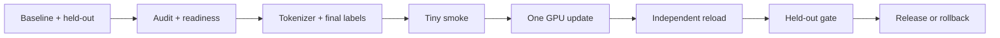

# Single-GPU Finetuning：在一张显卡上交付可复核的 Adapter

**项目导航**：[项目索引](../project-index.md) ·
[SFT 数据管线](../../training/sft-data-pipeline.md) ·
[PEFT/QLoRA](../../training/peft-qlora-engineering.md) ·
[持续学习](../../training/continual-learning.md) ·
[运行手册](https://github.com/NightLemon/about-llm/blob/main/projects/single-gpu-finetuning/README.md) ·
[项目证据](../../evidence/project-controls.md)
{ .doc-nav }

这个项目围绕一条售后对话任务，把 `数据 → labels → LoRA/QLoRA → Adapter → held-out gate` 串成可回滚交付。
第一次只走 SFT/LoRA 主线；DPO、Reward Model、PPO、DDP、AMP 和恢复控制都不是隐性前置。

最终结果不是“loss 降了”或一个 `adapter_model.safetensors`，而是一份能回答以下问题的发布包：

- 哪些 train-only 数据进入了训练；
- 哪些 token 进入监督目标；
- Adapter 绑定哪个 base、tokenizer 和 chat template；
- 新进程能否独立重载；
- 同一留出集上是否优于 base、Prompt 或 RAG 基线；
- 目标显卡的峰值、失败配置和回滚条件是什么。

## 一条主线与三个入口

| 入口 | 唯一职责 |
|---|---|
| 本页 | 决定先做什么、观察什么、何时停止或进入选修 |
| [项目 README](https://github.com/NightLemon/about-llm/blob/main/projects/single-gpu-finetuning/README.md) | 安装、完整 CLI、文件、参数、排错与测试 |
| [项目/Qwen/对齐证据](../../evidence/project-controls.md) | 固定输入、精确数值、录制结果和不可外推边界 |

## 第一次交付路线 {#run}

先运行不会下载公开模型的两个检查：

~~~powershell
python -m pip install -e ".[dev,torch,transformers,finetune]"
python -m about_llm.finetuning_cli audit --jsonl projects/single-gpu-finetuning/audit.example.jsonl --require-splits train,validation,test --output outputs/sft-split-audit.json
python projects/single-gpu-finetuning/smoke_trl_sft.py
~~~

然后沿八个检查点推进。完整多行命令只在
[项目 README](https://github.com/NightLemon/about-llm/blob/main/projects/single-gpu-finetuning/README.md)维护。

| 步骤 | 本步只回答什么 | 通过信号 |
|---|---|---|
| 0. 基线 | 参数更新是否真的比 Prompt/RAG 更合适 | 错误类型、主指标、关键切片与预算已写定 |
| 1. Readiness | Trainer 是否只能读取已批准 train subset | 数据身份、去重、治理与 split 绑定完成 |
| 2. Data preflight | 当前命令是否读取预期数据与父模型 | 非法 revision、split 或 readiness 会停止 |
| 3. Final labels | Assistant span 是否在最终 batch 中正确 | 非监督 token 为 `-100`，监督位置非空 |
| 4. Tiny smoke | TRL/PEFT 接线能否反向传播和保存 | 参数更新、base 冻结、Adapter 产物存在 |
| 5. One update | 目标 GPU 能否执行最小 update | 保存真实峰值、终态和失败配置 |
| 6. Reload | 工件能否脱离训练进程重新加载 | Base/Adapter/template 身份逐项匹配 |
| 7. Held-out gate | 更新是否值得发布 | 新任务收益、旧能力、安全、成本与失败分母齐全 |

目标 Qwen3-0.6B 路线先做 tokenizer/data preflight，再以 batch 1、长度 512、LoRA rank 8 尝试一个 update。
这些是起步配置，不是对所有 3070 Laptop 的容量保证。QLoRA 只压缩被冻结基础权重的一部分，实际峰值仍要把
Adapter、activation、gradient、optimizer、temporary buffer 与 allocator reserve 记入账本。

仓库保存的 Qwen2.5 报告用于离线核对 labels、LoRA 和 DPO 路径；它与本次 Qwen3 实验不是同一次运行，
不能把三份记录拼成一个端到端生产结论。

## 每一步应该观察什么

### 数据与 labels

训练进程只拿 train-only artifact 和 readiness，不读取验证/测试原文。打开最终 collator batch，逐位置确认
template token、用户 token 和 padding 不进入 assistant loss。机制解释见
[SFT 数据管线](../../training/sft-data-pipeline.md)。

### 训练与显存

Tiny smoke 只证明训练接线。目标 GPU 的一次 update 还要记录 model/revision、dtype、长度、micro-batch、
accumulation、rank、峰值 allocated/reserved、运行时间与终态。估算器只用于排除明显不可行配置。

### Adapter 与发布

保存后在新进程重载 base 和 Adapter，核对 target modules、tokenizer/template、generation config 和权重身份。
随后用同一 held-out 集比较 base、Prompt/RAG baseline 与候选 Adapter；训练 loss 不进入发布 gate。

## 从 SFT/LoRA 闭环进入可选后续路线 {#next-routes}

第 0–7 步已经构成完整交付。只有新基线失败确实需要偏好或在线反馈时，才进入下一条路线：

| 已有反馈 | 下一步 | 先读 | 仍须独立验收 |
|---|---|---|---|
| 固定可靠的 chosen/rejected 对 | DPO | [对齐进阶](../../training/alignment.md#dpo) | 偏好留出集、安全切片与 Adapter 重载 |
| 需要可复用评分器 | Reward Model | [强化学习](../../training/reinforcement-learning.md) | 长度/风格偏差、风险切片与校准 |
| 必须执行或验证后才能评分 | PPO/RLVR 机制实验 | [强化学习](../../training/reinforcement-learning.md) | Rollout 身份、reward、off-policy 漂移与成本 |

README 提供数据预检和 CPU/tiny 脚本。仓库没有目标 checkpoint 的 PPO 发布命令；这些控制不能证明
目标模型、CUDA、Reward Model 质量或生产稳定性。

## Task B 更新卡片 {#task-b-update}

已发布 Adapter 学习 Task B 时，把它当成新的发布候选：

1. 固定 Task A 留出集、安全/工具锚点和旧工件身份，且不把这些 anchor 放进 Task B 训练；
2. 为 Task B 重新发布 train-only readiness；
3. 固定父 base、tokenizer/template 与训练配置，小步训练；
4. 在新进程分别重载旧、新 Adapter；
5. 用同一 Task A 锚点和 Task B 留出集比较 base、旧 Adapter 与新 Adapter；
6. 报告新任务收益、逐项 retention、资源增量和 missing/timeout 分母；
7. 未过 gate 时回滚兼容的 Adapter、Prompt、索引和工具 schema。

`--resume-from-checkpoint` 只恢复同一次中断运行，不能代替新旧版本评测。Replay 的机制与证据边界见
[持续学习](../../training/continual-learning.md#single-gpu-task-b)。

## 遇到问题时再进入机制实验 {#controls}

| 症状 | 最小实验 | 权威解释 |
|---|---|---|
| Packed 文档互相泄漏 | `packing_loss_mask_toy.py` | [SFT 数据管线](../../training/sft-data-pipeline.md) |
| 变长 batch 梯度不对 | `gradient_accumulation_toy.py` | [分布式 global loss](../../systems/distributed-training.md#global-batch-loss-normalization) |
| DDP/`no_sync`/AMP 分叉 | `ddp_*_control.py`、`amp_grad_scaler_control.py` | [分布式正确性](../../systems/distributed-training-correctness.md) |
| Resume 漏样本或参数漂移 | 三个 `*_resume_control.py` | [分布式正确性](../../systems/distributed-training-correctness.md) |
| Adapter 可加载但回答退化 | 独立 reload + held-out gate | [PEFT/QLoRA](../../training/peft-qlora-engineering.md) |

脚本入口、参数与完整测试集合见 README；精确张量和历史结果见证据页。不要为完成首次单卡路线依次运行所有 controls。

## 交付物与证据边界

最终至少提交：

- Base、tokenizer、template、数据、代码与训练配置身份；
- Readiness、最终 labels 检查和一个失败样例；
- 目标 GPU 的峰值、运行终态与失败配置；
- 可独立重载的 Adapter bundle；
- Base/Prompt/RAG/Adapter 的同集评测与发布决定；
- 回滚包和未验证边界。

当前仓库能验证固定 CPU/tiny、录制 Qwen 和工件协议；目标 GPU 的 OOM 边界、真实训练质量、长期稳定性与
目标 serving runtime 兼容性仍需在对应环境实测。
