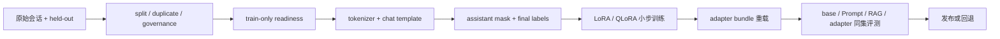

# Single-GPU Finetuning：在一张显卡上交付可复核的 Adapter

**项目导航**：[项目索引](../project-index.md) · [SFT 数据管线](../../training/sft-data-pipeline.md) ·
[PEFT/QLoRA](../../training/peft-qlora-engineering.md) · [实验 4A](../labs/lab-4a-sft-sample.md) ·
[Evaluation Gate](evaluation-gate.md)
{ .doc-nav }

假设你有一批售后对话，希望小模型更稳定地按团队格式回答。最终交付物不是“某次 loss 降了”，而是一个
能回答下面问题的发布包：

- 哪些数据真的进入了训练？
- 哪些 token 被当作监督目标？
- Adapter 绑定哪个 base model、tokenizer 和 chat template？
- 在没参与训练的 case 上，它比 Prompt 或 RAG baseline 好在哪里？
- 这张 GPU 上实际用了多少显存，失败配置是什么？

本项目把这些问题串成一条单卡路径。第一次学习按“端到端主线”运行；DDP、AMP 和精确恢复实验留到遇到
相应故障时再查。

!!! note "Qwen2.5 是固定实验对象，不是模型推荐"
    仓库保存了一组固定的 Qwen2.5-0.5B-Instruct 运行记录，用于离线复核模板、LoRA 和 DPO 路径。
    选择它是为了固定证据，不代表新项目必须使用 Qwen2.5。换成 Qwen3、Llama 或其他 checkpoint 时，
    需要重新确认 module names、chat template、special tokens、attention/runtime 支持和许可。

## 先看完整交付链



训练进程只拿 train 与 readiness，不读取 validation/test 原文。评测进程再用 held-out artifact 比较候选。
这不要求三台机器，但要求权限与数据流确实分开。

## 你的显卡能跑到哪一步

先不要从“某模型文件有几 GB”推断能否训练。单卡显存至少包含：

```text
量化或全精度 base weights
+ LoRA 参数、梯度和 optimizer state
+ activations
+ logits、temporary buffers 和 allocator reserve
```

Laptop GPU 还可能受到功耗、散热与共享显存影响。稳妥顺序是：

1. 零下载 data preflight；
2. CPU/tiny smoke，验证数据和 artifact plumbing；
3. 目标模型只做 tokenize/forward；
4. `micro_batch_size=1` 跑一个 optimizer update；
5. 再逐步提高 sequence length、rank 或有效 batch。

如果是 8 GiB 左右的消费级 GPU，优先从 0.5B–1B 级模型的 LoRA/QLoRA 学习协议。7B 的估算命令可用于
筛掉明显不可行配置，却不是显存承诺；是否 OOM 仍由 checkpoint、kernel、长度和 runtime 实测决定。

## 准备环境

基础 CPU 与 LoRA 路径：

```powershell
python -m pip install -e ".[dev,torch,transformers,finetune]"
python scripts/doctor.py
```

QLoRA 还需要 `.[qlora]`，并核对 PyTorch、CUDA、driver、bitsandbytes 与 GPU compute capability。
“包能 import”只完成了环境检查，不能替代一次真实 backward 与峰值显存记录。

## 端到端主线 { #run }

### 第 0 步：先写基线和接受标准

这次微调要修复什么错误？例如：

> 售后模型经常漏掉订单核验步骤；希望在固定 held-out 工单上提高流程完整率，同时不降低拒答与越权切片。

至少保存同一 base checkpoint 的 zero/few-shot、Prompt baseline；若错误来自易变知识，再加入 RAG baseline。
微调更适合学习稳定行为、格式和决策模式，不应被默认当作更新事实库的方法。

同时固定：

- split/group 单位；
- 主指标与不可退化 slice；
- 最小有意义差异；
- model/tokenizer/template revision；
- 最大训练时间、显存与失败预算。

### 第 1 步：发布 train-only readiness

仓库示例只有两条人工编写的 train records，用于检查数据协议，不能训练出有用模型：

```powershell
python -m about_llm.finetuning_cli prepare-training `
  --train-jsonl projects/single-gpu-finetuning/train.example.jsonl `
  --audit-jsonl projects/single-gpu-finetuning/audit.example.jsonl `
  --profile nfc_whitespace `
  --ngram-size 5 `
  --threshold 0.9 `
  --governance-policy projects/single-gpu-finetuning/governance-policy.example.json `
  --governance-evaluated-at 2026-08-06T12:00:00Z `
  --output-dir artifacts/sft-prepare
```

输出把 train 顺序、combined audit identity、split、近重复与 governance decision 绑定到 readiness。
Readiness 通过表示声明的机器门禁已执行；许可、consent、PII/secret 与语义污染仍要由相应审查负责。

### 第 2 步：让训练身份做零下载 preflight

先固定目标 checkpoint，但不下载 tokenizer 或权重：

```powershell
python projects/single-gpu-finetuning/train_trl_sft.py `
  --model-id Qwen/Qwen2.5-0.5B-Instruct `
  --revision 7ae557604adf67be50417f59c2c2f167def9a775 `
  --train-jsonl projects/single-gpu-finetuning/train.example.jsonl `
  --readiness-json artifacts/sft-prepare/sft-training-readiness.json `
  --output-dir artifacts/sft-preflight `
  --data-preflight-only
```

这一步会在导入训练依赖前检查顺序、内容、版本、字段、gate 和 fingerprint。失败时先解释数据为什么变了，
不要重新生成 hash 来掩盖漂移。

### 第 3 步：在 backward 前看清最终 labels

Chat template 会加入 system/tool 标记和 special tokens，原始字符串位置不能直接充当 assistant mask。
正确顺序是：

```text
structured conversation
→ 用目标 template 渲染
→ tokenize
→ 产生 assistant mask
→ collator 生成最终 labels
→ 人工抽查 token / mask / labels
```

Qwen2.5 原生 template 没有 TRL 所需的 `` span；在项目的 tool-aware 固定样例上会得到全零
assistant mask。审核模板保持序列化内容不变，只标出 assistant 区域。先检查 recorded report：

```powershell
python projects/single-gpu-finetuning/run_qwen_target_sft_label_control.py `
  --verify projects/single-gpu-finetuning/qwen2.5-0.5b-sft-label.recorded-report.json
```

然后在自己的样本上打印 `input_ids`、解码片段、assistant mask、final labels 与有效监督 token 数。System、user、
tool observation、padding 以及不希望学习的控制 token 应为 `-100`。最终要看 Trainer 收到的 batch，不能只看 Dataset 中间列。

### 第 4 步：先跑离线 tiny 模型

```powershell
python projects/single-gpu-finetuning/smoke_trl_sft.py
python projects/single-gpu-finetuning/smoke_peft.py `
  --steps 8 `
  --artifact-root artifacts/peft-export-control
```

第一条真实走过 `messages → assistant_masks → labels → optimizer step`；第二条检查冻结 base、adapter 保存/重载、
merge 与 manifest。Tiny loss 下降只说明小型控制路径能训练，不能替目标模型证明质量。

### 第 5 步：在目标 GPU 上只跑一个 update

先用估算器理解各项显存从哪里来：

```powershell
python projects/single-gpu-finetuning/train_qlora.py `
  --model-id illustrative/model `
  --revision immutable-commit-placeholder `
  --num-parameters 7000000000 `
  --num-layers 32 `
  --hidden-size 4096 `
  --max-length 1024 `
  --micro-batch-size 1 `
  --gradient-accumulation 16 `
  --rank 16 `
  --alpha 32 `
  --target-modules q_proj,k_proj,v_proj,o_proj `
  --target-linears-per-layer 4 `
  --estimate-only
```

这个结果是启发式容量分解，不包含目标 kernel、allocator 碎片与真实峰值。QLoRA 也不是“全训练 4-bit”：
Adapter、gradient、optimizer、activation 和部分算子仍使用更高精度。

确认模型的实际 module tree 后，再运行目标 SFT：

```powershell
python projects/single-gpu-finetuning/train_trl_sft.py `
  --model-id Qwen/Qwen2.5-0.5B-Instruct `
  --revision 7ae557604adf67be50417f59c2c2f167def9a775 `
  --train-jsonl projects/single-gpu-finetuning/train.example.jsonl `
  --readiness-json artifacts/sft-prepare/sft-training-readiness.json `
  --chat-template-path projects/single-gpu-finetuning/qwen2.5-generation-aware-sft.jinja `
  --output-dir artifacts/sft-run `
  --batch-size 1 `
  --gradient-accumulation 16 `
  --rank 16 `
  --alpha 32
```

示例数据只用于 smoke。换入真实 train-only 数据后，先限制为一个 update，确认：

- 有效监督 token 数不为 0；
- 只有目标 adapter 参数收到有限梯度；
- Base 参数保持冻结；
- Peak allocated/reserved memory 被记录；
- Checkpoint 能在新进程中加载；
- OOM 或 fallback 也作为实验结果保存。

一次 update 正常后，再逐步增加步数或长度。不要同时改 rank、batch、length 和 template，否则首个退化无法定位。

### 第 6 步：像用户一样重载 Adapter

发布目录至少包含：

| 文件或身份 | 为什么需要 |
|---|---|
| PEFT config 与 adapter weights | 定义可训练增量 |
| 不可变 base revision | 防止加载到另一个底座 |
| Tokenizer 与 chat template | 保持训练/推理序列化一致 |
| Generation config | 固定评测时解码协议 |
| Manifest、大小与 hash | 检查 bundle 完整性 |
| 数据与训练 run identity | 能追溯来源 |

用一个全新 base load 加载 adapter，而不是继续复用训练进程里的 model object。对固定输入比较保存前后 logits/输出，
同时验证 base identity 漂移会在加载前被拒绝。重载成功说明 artifact plumbing 正常，仍不代表任务质量提升。

仓库保存的 Qwen LoRA 运行可用于离线核对这条路径：

```powershell
python projects/single-gpu-finetuning/run_qwen_target_lora_control.py `
  --verify projects/single-gpu-finetuning/qwen2.5-0.5b-lora.recorded-report.json
```

它真实做过 CPU FP32 backward、一次 AdamW update、base freeze、PEFT export 与新 base 重载。这条人工编写样本的
loss 反而上升，所以正确结论是“训练与发布链路执行过”，而不是“LoRA 已改善模型”。

### 第 7 步：用 held-out gate 决定是否发布

不要用 train loss 选择上线版本。把 base、Prompt/RAG baseline 与 adapter 放到同一 case identity、template、
generation config 和 scorer 下比较。至少报告：

- 主任务指标与置信区间；
- 格式合法率和拒答/安全切片；
- 通用能力回归；
- 逐例改善与退化；
- Peak VRAM、训练时间和 adapter 大小；
- Missing、timeout 与人工排除怎样进入分母。

[Evaluation Gate](evaluation-gate.md)提供 paired comparison 与 release artifact。结论应写成：

> 在固定 held-out artifact 与预注册阈值上，adapter 相对 base 通过任务 gate，关键切片未越界；资源结果只适用于
> 记录的 GPU、runtime 与配置。

它比“模型学会了领域知识”“不会幻觉”更窄，却是证据真正支持的说法。

### 第 8 步：需要偏好训练时另开一条数据契约

DPO/RM 数据不是给 SFT JSONL 多加两个字段。Chosen/rejected 必须共享可比上下文，tie、invalid 和 annotator
disagreement 不能静默改成 winner，train 与 held-out 仍要分权。

```powershell
python -m about_llm.preference_cli prepare-training `
  --train-jsonl projects/single-gpu-finetuning/preference.train.example.jsonl `
  --audit-jsonl projects/single-gpu-finetuning/preference.example.jsonl `
  --profile nfc_whitespace `
  --ngram-size 5 `
  --threshold 0.9 `
  --governance-policy projects/single-gpu-finetuning/governance-policy.example.json `
  --governance-evaluated-at 2026-08-06T12:00:00Z `
  --output-dir artifacts/preference-prepare
python projects/single-gpu-finetuning/smoke_trl_dpo.py
```

固定 Qwen DPO 运行只用人工编写的 `good/bad` pair 检查 TRL/LoRA backward 与 artifact 路径；它没有人类偏好或
安全标签。正式训练前仍要做 `--data-preflight-only`、tokenizer 抽查、显存测量和 held-out preference 评测。

## 遇到故障时按哪条证据查

| 现象 | 先检查 | 下一项实验 |
|---|---|---|
| Assistant mask 全零 | Template 是否标 generation span | SFT label 检查 |
| 变长 batch 梯度不对 | Loss sum、有效 token denominator | `gradient_accumulation_toy.py` |
| 多卡梯度缩小 | DDP 是 sum 还是 mean | `ddp_token_mean_control.py` |
| `no_sync` 没减少通信 | Forward 是否也在 context 内 | `ddp_accumulation_no_sync_control.py` |
| AMP clip 结果太小 | 是否先 unscale 再 clip | `amp_grad_scaler_control.py` |
| 某 rank overflow 后分叉 | Skip 决策是否跨 rank 一致 | `ddp_amp_overflow_consensus_control.py` |
| Resume 漏样本 | Emitted、consumed、committed cursor | DataLoader/commit 实验 |
| Resume 参数仍漂移 | RNG、pending gradients、scheduler/scaler | Checkpoint 实验 |
| Adapter 能加载但回答退化 | Base/template/config 与 held-out slice | Reload + Evaluation Gate |

这些实验各自回答一个具体机制问题，不需要在第一次单卡实验前全部跑完。

## 深挖机制实验 { #controls }

当你开始研究分布式归一化、AMP 或 exact resume，再运行：

```powershell
python projects/single-gpu-finetuning/gradient_accumulation_toy.py
python projects/single-gpu-finetuning/ddp_token_mean_control.py
python projects/single-gpu-finetuning/ddp_accumulation_no_sync_control.py
python projects/single-gpu-finetuning/amp_grad_scaler_control.py
python projects/single-gpu-finetuning/ddp_amp_overflow_consensus_control.py
python projects/single-gpu-finetuning/checkpoint_resume_control.py
python projects/single-gpu-finetuning/dataloader_prefetch_resume_control.py
python projects/single-gpu-finetuning/optimizer_commit_resume_control.py
```

它们分别隔离 token-mean reduction、DDP mean、`no_sync`、GradScaler、跨 rank overflow、跨进程 checkpoint、
prefetch cursor 和 consumed—optimizer-committed 窗口。精确 tensor、cursor、RNG 与负例结果集中在
[项目控制台账](../../evidence/project-controls.md)，避免把八个实验误读成同一次完整训练。

## 最终交付物

| 交付物 | 最小内容 |
|---|---|
| 数据发布包 | Train-only JSONL、split/duplicate/governance、readiness identity |
| Token/label 审计 | Model/tokenizer/template、input IDs、assistant mask、final labels |
| 训练运行包 | Immutable revisions、依赖、seed、超参数、资源与 checkpoint 语义 |
| Adapter bundle | PEFT config/weights、base identity、template、manifest、fresh-load test |
| 比较评测包 | Base/Prompt/RAG/adapter 同 cases 的逐例结果与 gate |

发布或写入简历前做一次自查：

- [ ] Trainer 没有读取 held-out 原文。
- [ ] Final labels 已在真实 collator batch 上抽查。
- [ ] Target modules 来自当前 model tree。
- [ ] 至少记录一个成功配置与一个资源边界。
- [ ] Adapter 在新进程、新 base load 上重载过。
- [ ] Base 与 adapter 使用同一 held-out cases 和解码配置。
- [ ] 退化样本、安全 slice 与失败分母一同报告。
- [ ] CPU/tiny/recorded 证据没有被写成 CUDA 或生产质量结论。

仓库专项回归：

```powershell
python -m pytest `
  tests/test_finetuning_cli.py `
  tests/test_sft_readiness.py `
  tests/test_lora.py `
  tests/test_peft_export.py -q
python scripts/check_content_accuracy.py
```

面试时可以按“问题与 baseline → 数据 identity → mask → 小步训练 → fresh reload → held-out gate”讲解。
这条因果链比背 LoRA 公式更能说明你知道微调项目为什么可信。

完整代码位于 [projects/single-gpu-finetuning](https://github.com/NightLemon/about-llm/tree/main/projects/single-gpu-finetuning)。
