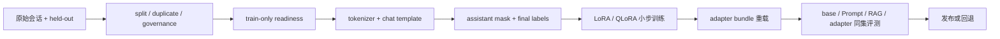

# Single-GPU Finetuning：在一张显卡上交付可复核的 Adapter

**项目导航**：[项目索引](../project-index.md) · [SFT 数据管线](../../training/sft-data-pipeline.md) ·
[PEFT/QLoRA](../../training/peft-qlora-engineering.md) · [实验 4A](../labs/lab-4a-sft-sample.md) ·
[Evaluation Gate](evaluation-gate.md)
{ .doc-nav }

假设你有一批售后对话，希望小模型更稳定地按团队格式回答。最终交付物不是“某次 loss 降了”，而是一个
能回答下面问题的发布包：

- 哪些数据真的进入了训练？
- 哪些 token 被当作监督目标？
- Adapter 绑定哪个 base model、tokenizer 和 chat template？
- 在没参与训练的 case 上，它比 Prompt 或 RAG baseline 好在哪里？
- 这张 GPU 上实际用了多少显存，失败配置是什么？

本项目把这些问题串成一条单卡路径。第一次学习按“端到端主线”运行；DDP、AMP 和精确恢复实验留到遇到
相应故障时再查。

!!! note "Qwen2.5 报告与本次 Qwen3 实验各自回答什么"
    仓库保存的 Qwen2.5-0.5B-Instruct 报告可以离线复核模板、LoRA 和 DPO 代码路径。本页为你的
    RTX 3070 Laptop 新增了 Qwen3-0.6B 起步命令。两者的模型结构和模板不能混用；Qwen3 实验需要重新
    生成自己的数据、标签、显存和评测证据。

## 先看完整交付链



训练进程只拿 train 与 readiness，不读取 validation/test 原文。评测进程再用 held-out artifact 比较候选。
这不要求三台机器，但要求权限与数据流确实分开。

## 你的 3070 学习进度对应哪条路线

你已经在用 Qwen3-0.6B 和 nano-vLLM 学推理。那条路线回答“请求怎样被调度、KV Cache 怎样变化”。

本项目接着回答训练问题：同一个模型怎样经过 TRL 和 PEFT，得到一个 LoRA Adapter。

两条路线共享 tokenizer、chat template 和模型结构，但运行时不同。nano-vLLM 是推理学习引擎，不是
TRL 的训练后端。

训练后的 Adapter 应先在新进程里由 Transformers 与 PEFT 重载。然后再确认目标推理引擎是否支持它。

## 你的显卡能跑到哪一步

先不要从“某模型文件有几 GB”推断能否训练。单卡显存至少包含：

```text
量化或全精度 base weights
+ LoRA 参数、梯度和 optimizer state
+ activations
+ logits、temporary buffers 和 allocator reserve
```

Laptop GPU 还可能受到功耗、散热与共享显存影响。稳妥顺序是：

1. 零下载 data preflight；
2. CPU/tiny smoke，验证数据和 artifact plumbing；
3. 用目标 tokenizer 生成并检查 assistant mask；
4. 以 batch 1、长度 512、LoRA rank 8 跑一个 optimizer update；
5. 再逐步提高 sequence length、rank 或有效 batch。

如果专用显存约为 8 GiB，可以先学习 0.5B–1B 级模型的 LoRA。QLoRA 是显存仍不足时的下一项实验。
估算器只能筛掉明显不可行的配置，最终是否 OOM 仍要在当前驱动、依赖和输入长度下实测。

## 准备环境

基础 CPU 与 LoRA 路径：

```powershell
python -m pip install -e ".[dev,torch,transformers,finetune]"
python scripts/doctor.py
```

QLoRA 还需要 `.[qlora]`。安装后应核对 PyTorch、CUDA、bitsandbytes 与显卡计算能力。

驱动正常、包能 import，只说明环境检查通过。你仍需真实执行 backward，并记录峰值显存。

## 端到端主线 { #run }

### 第 0 步：先写基线和接受标准

这次微调要修复什么错误？例如：

> 售后模型经常漏掉订单核验步骤；希望在固定 held-out 工单上提高流程完整率，同时不降低拒答与越权切片。

先保存同一 base checkpoint 的零样本或少样本结果，再保存 Prompt 基线。

如果错误来自易变知识，还应加入 RAG 基线。微调适合学习稳定行为、格式和决策模式，不宜用来更新事实库。

同时固定：

- split/group 单位；
- 主指标与不可退化 slice；
- 最小有意义差异；
- model/tokenizer/template revision；
- 最大训练时间、显存与失败预算。

### 第 1 步：发布 train-only readiness

仓库示例只有两条人工编写的 train records，用于检查数据协议，不能训练出有用模型：

```powershell
python -m about_llm.finetuning_cli prepare-training `
  --train-jsonl projects/single-gpu-finetuning/train.example.jsonl `
  --audit-jsonl projects/single-gpu-finetuning/audit.example.jsonl `
  --profile nfc_whitespace `
  --ngram-size 5 `
  --threshold 0.9 `
  --governance-policy projects/single-gpu-finetuning/governance-policy.example.json `
  --governance-evaluated-at 2026-08-06T12:00:00Z `
  --output-dir artifacts/sft-prepare
```

输出把训练顺序、综合审计、数据划分、近重复结果和治理决定绑定到 readiness。

Readiness 通过表示这些机器检查已经执行。许可、consent、PII/secret 与语义污染仍要由相应审查负责。

### 第 2 步：先检查数据，再接触模型文件

先固定目标 checkpoint，但不下载 tokenizer 或权重：

```powershell
python projects/single-gpu-finetuning/train_trl_sft.py `
  --model-id Qwen/Qwen3-0.6B `
  --revision c1899de289a04d12100db370d81485cdf75e47ca `
  --train-jsonl projects/single-gpu-finetuning/train.example.jsonl `
  --readiness-json artifacts/sft-prepare/sft-training-readiness.json `
  --output-dir artifacts/sft-preflight `
  --data-preflight-only
```

这一步不下载 tokenizer 或权重。它会核对训练记录的顺序、内容、字段和 readiness 指纹。失败时先找出
哪条数据发生了变化，再决定是否重新发布数据包。

### 第 3 步：在 backward 前看清最终 labels

对话模板会加入系统、工具和特殊 token 标记，原始字符串位置不能直接充当 assistant mask。
正确顺序是：

```text
structured conversation
→ 用目标 template 渲染
→ tokenize
→ 产生 assistant mask
→ collator 生成最终 labels
→ 人工抽查 token / mask / labels
```

固定 Qwen3 revision 的原生模板没有 `` 标记，因而无法直接返回 TRL 所需的 assistant mask。
仓库提供的 Qwen3 模板保留原有序列化逻辑，只在 assistant 输出周围增加监督区间。先在示例数据上运行：

```powershell
python projects/single-gpu-finetuning/train_trl_sft.py `
  --model-id Qwen/Qwen3-0.6B `
  --revision c1899de289a04d12100db370d81485cdf75e47ca `
  --train-jsonl projects/single-gpu-finetuning/train.example.jsonl `
  --readiness-json artifacts/sft-prepare/sft-training-readiness.json `
  --chat-template-path projects/single-gpu-finetuning/qwen3-0.6b-c1899de-generation-aware-sft.jinja `
  --output-dir artifacts/qwen3-sft-tokenization-preflight `
  --max-length 512 `
  --tokenization-preflight-only
```

打开 `sft-template-mask-audit.json`，逐条确认 `assistant_token_count` 大于零。这个报告能发现全零 mask、
长度超限和数据身份变化；它仍需要你抽查解码后的监督片段，确认模板作者标出的区域符合训练意图。

Qwen2.5 的已录制报告则用于复核更复杂的多轮与工具调用样例：

```powershell
python projects/single-gpu-finetuning/run_qwen_target_sft_label_control.py `
  --verify projects/single-gpu-finetuning/qwen2.5-0.5b-sft-label.recorded-report.json
```

在自己的样本上还要打印 token 和解码片段，并查看 assistant mask。

接着检查 final labels 和有效监督 token 数。系统、用户、工具返回与 padding 应映射为 `-100`。

最终结论来自 Trainer 收到的 batch，而不是 Dataset 的中间列。

### 第 4 步：先跑离线 tiny 模型

```powershell
python projects/single-gpu-finetuning/smoke_trl_sft.py
python projects/single-gpu-finetuning/smoke_peft.py `
  --steps 8 `
  --artifact-root artifacts/peft-export-control
```

第一条真实走过 `messages → assistant_masks → labels → optimizer step`；第二条检查冻结 base、adapter 保存/重载、
merge 与 manifest。Tiny loss 下降只说明小型控制路径能训练，不能替目标模型证明质量。

### 第 5 步：在目标 GPU 上只跑一个 update

先用估算器理解各项显存从哪里来：

```powershell
python projects/single-gpu-finetuning/train_qlora.py `
  --model-id illustrative/model `
  --revision immutable-commit-placeholder `
  --num-parameters 7000000000 `
  --num-layers 32 `
  --hidden-size 4096 `
  --max-length 1024 `
  --micro-batch-size 1 `
  --gradient-accumulation 16 `
  --rank 16 `
  --alpha 32 `
  --target-modules q_proj,k_proj,v_proj,o_proj `
  --target-linears-per-layer 4 `
  --estimate-only
```

这个结果是启发式容量分解。它没有计入目标 kernel、allocator 碎片与真实峰值。

QLoRA 也不是“全部训练都用 4-bit”。Adapter、梯度、优化器状态、激活值和部分算子仍使用更高精度。

Qwen3-0.6B 的注意力层使用 `q_proj`、`k_proj`、`v_proj` 和 `o_proj`。先只训练这些投影层的 LoRA，
不要一开始同时扩大序列长度、rank 和目标模块。运行一个 optimizer update：

```powershell
python projects/single-gpu-finetuning/train_trl_sft.py `
  --model-id Qwen/Qwen3-0.6B `
  --revision c1899de289a04d12100db370d81485cdf75e47ca `
  --train-jsonl projects/single-gpu-finetuning/train.example.jsonl `
  --readiness-json artifacts/sft-prepare/sft-training-readiness.json `
  --chat-template-path projects/single-gpu-finetuning/qwen3-0.6b-c1899de-generation-aware-sft.jinja `
  --output-dir artifacts/qwen3-sft-one-step `
  --max-length 512 `
  --batch-size 1 `
  --gradient-accumulation 1 `
  --rank 8 `
  --alpha 16 `
  --fp16 `
  --max-steps 1
```

这里的 FP16 是 Trainer 的混合精度模式，不表示所有参数都以 FP16 保存。示例数据只有两条，只适合检查
代码路径。命令结束后依次打开三个报告：

1. `sft-template-mask-audit.json`：每条记录都找到了 assistant token；
2. `sft-final-label-audit.json`：collator 只保留目标 token，其余 label 为 `-100`；
3. `sft-training-run.json`：状态为 `completed`，optimizer step 为 1，并记录可训练参数和显存。

显存数字来自当前进程的 PyTorch CUDA allocator。测量窗口从 `Trainer.train()` 前开始，因此包含当时已加载的
模型和训练阶段峰值，但不包含模型加载时的瞬时峰值，也不包含其他进程占用。若在 `trainer.train()` 内发生
CUDA OOM，脚本会先写失败报告；若权重加载时就 OOM，则还来不及生成该报告。

换入真实 train-only 数据后，继续确认：

- 有效监督 token 数不为 0；
- 只有目标 adapter 参数收到有限梯度；
- Base 参数保持冻结；
- 训练窗口内的 peak allocated/reserved memory 被记录；
- Checkpoint 能在新进程中加载；
- OOM 或 fallback 也作为实验结果保存。

一次 update 正常后，再逐步增加步数或长度。每次只改一个变量，才能解释首个退化来自哪里。

如果 LoRA 在长度 512、batch 1、rank 8 时仍然 OOM，先降低长度；仍不够时再尝试 QLoRA。

Qwen3-0.6B 配置有 28 层，hidden size 为 1024。做容量估算时，可把总参数量近似写成 6 亿。

QLoRA 会把 base 权重量化为 NF4，但 Adapter、梯度、optimizer state 和 activation 仍使用更高精度。

下面是同一模型的一步 QLoRA 对照：

```powershell
python projects/single-gpu-finetuning/train_qlora.py `
  --model-id Qwen/Qwen3-0.6B `
  --revision c1899de289a04d12100db370d81485cdf75e47ca `
  --train-jsonl projects/single-gpu-finetuning/train.example.jsonl `
  --readiness-json artifacts/sft-prepare/sft-training-readiness.json `
  --chat-template-path projects/single-gpu-finetuning/qwen3-0.6b-c1899de-generation-aware-sft.jinja `
  --output-dir artifacts/qwen3-qlora-one-step `
  --num-parameters 600000000 `
  --num-layers 28 `
  --hidden-size 1024 `
  --max-length 512 `
  --micro-batch-size 1 `
  --gradient-accumulation 1 `
  --rank 8 `
  --alpha 16 `
  --target-linears-per-layer 4 `
  --max-steps 1
```

脚本会根据 PyTorch 报告的显卡能力选择 BF16 或 FP16。实际选择会写入报告的 `bnb_compute_dtype`。

### 第 6 步：像用户一样重载 Adapter

发布目录至少包含：

| 文件或身份 | 为什么需要 |
|---|---|
| PEFT config 与 adapter weights | 定义可训练增量 |
| 不可变 base revision | 防止加载到另一个底座 |
| Tokenizer 与 chat template | 保持训练/推理序列化一致 |
| Generation config | 固定评测时解码协议 |
| Manifest、大小与 hash | 检查 bundle 完整性 |
| 数据与训练 run identity | 能追溯来源 |

在全新进程里加载 base 和 Adapter，不要复用训练进程里的 model object。

对固定输入比较保存前后的 logits 或输出，并确认 base revision 变化会被拒绝。

重载成功说明文件和加载路径正常。任务质量是否提升，还要由留出集评测回答。

仓库保存的 Qwen LoRA 运行可用于离线核对这条路径：

```powershell
python projects/single-gpu-finetuning/run_qwen_target_lora_control.py `
  --verify projects/single-gpu-finetuning/qwen2.5-0.5b-lora.recorded-report.json
```

它在 CPU 上用 FP32 做过反向传播、一次 AdamW 更新和底座冻结，也导出过 PEFT Adapter。

这条人工编写样本的 loss 反而上升。因此只能说训练与发布链路执行过，不能说 LoRA 已改善模型。

### 第 7 步：用 held-out gate 决定是否发布

不要用 train loss 选择上线版本。

把 base、Prompt/RAG 基线与 Adapter 放到同一批样例、同一对话模板、同一生成参数和同一评分器下比较。至少报告：

- 主任务指标与置信区间；
- 格式合法率和拒答/安全切片；
- 通用能力回归；
- 逐例改善与退化；
- Peak VRAM、训练时间和 adapter 大小；
- Missing、timeout 与人工排除怎样进入分母。

[Evaluation Gate](evaluation-gate.md)提供 paired comparison 与 release artifact。结论应写成：

> 在固定 held-out artifact 与预注册阈值上，adapter 相对 base 通过任务 gate，关键切片未越界；资源结果只适用于
> 记录的 GPU、runtime 与配置。

它比“模型学会了领域知识”“不会幻觉”更窄，却是证据真正支持的说法。

### 第 8 步：需要偏好训练时另开一条数据契约

DPO 和奖励模型数据，不是给 SFT JSONL 多加两个字段。

优选与拒选回答必须共享可比上下文。平局、无效标注和标注者分歧不能静默改成胜者。

训练集与 held-out 数据仍要分权。

```powershell
python -m about_llm.preference_cli prepare-training `
  --train-jsonl projects/single-gpu-finetuning/preference.train.example.jsonl `
  --audit-jsonl projects/single-gpu-finetuning/preference.example.jsonl `
  --profile nfc_whitespace `
  --ngram-size 5 `
  --threshold 0.9 `
  --governance-policy projects/single-gpu-finetuning/governance-policy.example.json `
  --governance-evaluated-at 2026-08-06T12:00:00Z `
  --output-dir artifacts/preference-prepare
python projects/single-gpu-finetuning/smoke_trl_dpo.py
```

固定 Qwen DPO 运行只用人工编写的 pair 检查 TRL、LoRA backward 与文件路径。它没有人类偏好或安全标签。

正式训练前仍要检查数据和 tokenizer，测量显存，并在 held-out preference 数据上评测。

## 遇到故障时按哪条证据查

| 现象 | 先检查 | 下一项实验 |
|---|---|---|
| Assistant mask 全零 | Template 是否标 generation span | SFT label 检查 |
| 变长 batch 梯度不对 | Loss sum、有效 token denominator | `gradient_accumulation_toy.py` |
| 多卡梯度缩小 | DDP 是 sum 还是 mean | `ddp_token_mean_control.py` |
| `no_sync` 没减少通信 | Forward 是否也在 context 内 | `ddp_accumulation_no_sync_control.py` |
| AMP clip 结果太小 | 是否先 unscale 再 clip | `amp_grad_scaler_control.py` |
| 某 rank overflow 后分叉 | Skip 决策是否跨 rank 一致 | `ddp_amp_overflow_consensus_control.py` |
| Resume 漏样本 | Emitted、consumed、committed cursor | DataLoader/commit 实验 |
| Resume 参数仍漂移 | RNG、pending gradients、scheduler/scaler | Checkpoint 实验 |
| Adapter 能加载但回答退化 | Base/template/config 与 held-out slice | Reload + Evaluation Gate |

这些实验各自回答一个具体机制问题，不需要在第一次单卡实验前全部跑完。

## 深挖机制实验 { #controls }

当你开始研究分布式归一化、AMP 或 exact resume，再运行：

```powershell
python projects/single-gpu-finetuning/gradient_accumulation_toy.py
python projects/single-gpu-finetuning/ddp_token_mean_control.py
python projects/single-gpu-finetuning/ddp_accumulation_no_sync_control.py
python projects/single-gpu-finetuning/amp_grad_scaler_control.py
python projects/single-gpu-finetuning/ddp_amp_overflow_consensus_control.py
python projects/single-gpu-finetuning/checkpoint_resume_control.py
python projects/single-gpu-finetuning/dataloader_prefetch_resume_control.py
python projects/single-gpu-finetuning/optimizer_commit_resume_control.py
```

这些脚本分三组回答机制问题。

- 第一组研究 token-mean、DDP 的平均规则和 `no_sync`。
- 第二组研究 GradScaler、跨 rank overflow 与 checkpoint。
- 第三组研究 prefetch cursor 和 optimizer-committed 窗口。

精确 tensor、cursor、RNG 与负例结果集中在[项目控制台账](../../evidence/project-controls.md)。
这些结果来自独立实验，不能拼成同一次完整训练。

## 最终交付物

| 交付物 | 最小内容 |
|---|---|
| 数据发布包 | Train-only JSONL、split/duplicate/governance、readiness identity |
| Token/label 审计 | Model/tokenizer/template、input IDs、assistant mask、final labels |
| 训练运行包 | Immutable revisions、依赖、seed、超参数、资源与 checkpoint 语义 |
| Adapter bundle | PEFT config/weights、base identity、template、manifest、fresh-load test |
| 比较评测包 | Base/Prompt/RAG/adapter 同 cases 的逐例结果与 gate |

发布或写入简历前做一次自查：

- [ ] Trainer 没有读取 held-out 原文。
- [ ] Final labels 已在真实 collator batch 上抽查。
- [ ] Target modules 来自当前 model tree。
- [ ] 至少记录一个成功配置与一个资源边界。
- [ ] Adapter 在新进程、新 base load 上重载过。
- [ ] Base 与 adapter 使用同一 held-out cases 和解码配置。
- [ ] 退化样本、安全 slice 与失败分母一同报告。
- [ ] CPU/tiny/recorded 证据没有被写成 CUDA 或生产质量结论。

仓库专项回归：

```powershell
python -m pytest `
  tests/test_finetuning_cli.py `
  tests/test_sft_readiness.py `
  tests/test_lora.py `
  tests/test_peft_export.py -q
python scripts/check_content_accuracy.py
```

面试时先讲“问题与基线 → 数据身份 → 监督 mask → 小步训练”。

接着讲“新进程重载 → held-out 发布门禁”。这条因果链比背 LoRA 公式更能说明微调项目为什么可信。

完整代码位于 [projects/single-gpu-finetuning](https://github.com/NightLemon/about-llm/tree/main/projects/single-gpu-finetuning)。
