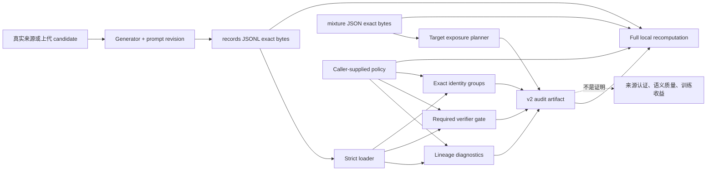

# Synthetic Data Audit

**项目导航**：[返回项目索引](../project-index.md) · [合成数据](../../training/synthetic-data.md) · [SFT 数据流水线](../../training/sft-data-pipeline.md) · [生产检查表](../production-checklist.md)
{ .doc-nav }

这个项目把 synthetic candidate 进入训练前的离线审计做成可执行 reference control。读者不仅要得到一份“通过/不通过”报告，还要能回答：报告针对哪一字节输入、用了什么 policy、能否从 caller-supplied 输入复算、哪些结论从未被执行证明。

当前固定交付是 `about-llm.synthetic-data-audit.v2`。它只运行 CPU/offline Python，不请求 teacher、student 或 LLM judge，也不启动训练。

## 1. 学习目标与证据层级

完成项目后，应能独立解释并实现以下边界：

1. **Parse evidence**：输入满足 strict JSON/JSONL contract；
2. **Lineage evidence**：parent 可解析，内部 parent round 单调，graph 是否有环；
3. **Gate evidence**：每个 required verifier 都存在且 `passed=true`；
4. **Identity evidence**：在声明的 fingerprint profile 下内容是否 exact duplicate；
5. **Planning evidence**：mixture 权重对应什么期望消费量与重复暴露；
6. **Artifact evidence**：报告绑定了哪些输入 bytes 与外部 policy；
7. **Outcome evidence**：训练后质量、安全和收益——本项目没有执行这一层。

因此，`eligible` 只属于第 3 层。它不是“事实正确”“高质量可用数据”或“可以直接发布”的同义词。

## 2. 供应链对象与信任边界

审计器信任 caller 指定的 records、mixture 与 policy head。无密钥 SHA-256 能发现 accidental drift，却不能证明谁发布了这些输入。若攻击者同时替换输入、policy 与报告，必须由签名、MAC、受控 registry 或可信发布渠道补上认证。

## 3. 交付物与最短运行 { #run }

核心文件：

- `records.example.jsonl`：4 条固定 synthetic candidates；
- `mixture.example.json`：real/synthetic target mixture；
- `audit.example.json`：可完整复算的 v2 recorded artifact；
- `src/about_llm/synthetic_data.py`：lineage、gate、identity、mixture reference core；
- `src/about_llm/synthetic_data_cli.py`：strict loader、artifact 与 CLI；
- 两个测试文件：正常路径和故意失败路径。

从仓库根目录运行：

~~~powershell
python -m about_llm.synthetic_data_cli `
  --records projects/synthetic-data-audit/records.example.jsonl `
  --required-verifier schema `
  --required-verifier grounding `
  --known-parent-id real-anchor-001 `
  --mixture projects/synthetic-data-audit/mixture.example.json `
  --output artifacts/synthetic-data/audit.json
~~~

`--output` 默认使用 **exclusive-create**。目标已存在时命令失败；只有明确接受替换旧证据时才传 `--overwrite`。这避免误覆盖，但不是版本化 artifact store。

安装项目后，也可运行 `about-llm-synthetic-audit --help`。

## 4. 固定 fixture：先手算再信程序

四条记录故意形成可辨认的反例：

| ID | Round | Parent | Required verifier | 预期 finding |
|---|---:|---|---|---|
| `syn-001` | 1 | `real-anchor-001` | schema pass；grounding pass | eligible；human reviewed |
| `syn-002` | 1 | `real-anchor-001` | schema pass；grounding pass | eligible；与 `syn-001` exact duplicate；revision overlap |
| `syn-003` | 1 | `real-anchor-001` | schema pass；grounding missing | missing；不 eligible |
| `syn-004` | 2 | `syn-001` | schema pass；grounding fail | failed；不 eligible |

固定审计账本是：

- `candidate_count=4`；
- `eligible_count=2`，所以 eligibility rate 为 0.5；
- `eligible_unique_content_count=1`；
- round 1：3 candidates / 2 eligible；
- round 2：1 candidate / 0 eligible；
- `self_verified_record_ids=["syn-002"]`；
- `missing_verifier_record_ids=["syn-003"]`；
- `failed_verifier_record_ids=["syn-004"]`；
- `unresolved_parent_pairs=[]`；
- `nonmonotonic_parent_pairs=[]`；
- `lineage_cycle_record_ids=[]`。

固定输入 identity：

| Artifact | Exact size | SHA-256 |
|---|---:|---|
| records JSONL | 1,457 bytes | `7b1fe32811b835aa20c579c0ed351311a617a0ec70cd582a5f5313b2b78d8530` |
| mixture JSON | 341 bytes | `4bef57e8ca23e35b8f3953bb442779f9d706ee2e9570ef5d4090a956c3669bc0` |
| v2 report fingerprint | canonical payload | `202d8db97b704c5542e8516c5bd0c945da1c1022100f6ecbfb828f2d2bb6f4cd` |

这里的 size 和 digest 是 contract。只改换行、缩进或对象 key 顺序，也会改变输入 bytes identity；审计逻辑结果可能相同，但旧 artifact 仍应验证失败。

## 5. Strict JSONL contract

一行 record 的最小结构是：

~~~json
{
  "record_id": "syn-001",
  "content": "候选文本",
  "parent_ids": ["real-anchor-001"],
  "generator_revision": "teacher@v1",
  "prompt_revision": "expand@v3",
  "generation_round": 1,
  "verifications": [
    {"verifier_id": "schema", "revision": "schema-rules@v2", "passed": true}
  ],
  "human_reviewed": false
}
~~~

除可缺省且默认为 false 的 `human_reviewed` 外，record 字段都必需。Loader fail closed：

- 拒绝 **duplicate JSON keys**，避免不同 parser 对同名 key 取首值或尾值；
- 拒绝 `NaN`、`Infinity` 与 `-Infinity`，因为它们不是标准 JSON number；
- 拒绝 invalid UTF-8 与 unpaired surrogate；
- 拒绝 record、verification、mixture/component 的 unknown 或 missing fields；
- `passed`、`human_reviewed` 必须是 JSON boolean，整数 `0/1` 不可冒充；
- `generation_round` 与 token budget 必须是真正 integer，boolean 不可冒充；
- ID、revision、content 必须非空；
- parent IDs、verifier IDs、record IDs 和 caller 的 known parent IDs 必须唯一；
- record 不得把自身列为 parent；
- records、mixture 与 report 都有 byte-size cap。

Strict parsing 只证明对象被无歧义地解释。它不证明 `generator_revision` 没伪造，也不认证 `human_reviewed=true` 背后真的有人审过。

## 6. Lineage graph：external、internal、round 与 cycle

Parent 分两类：

- **internal parent**：ID 出现在当前 records 中；
- **external parent**：ID 不在 records 中，但由 caller 用 `--known-parent-id` 明确声明。

其余 parent 会进入 `unresolved_parent_pairs`。unknown parent 不能静默解析成“外部真实数据”，否则一个拼写错误就可能伪造完整 lineage。

对于内部边 \(p\rightarrow c\)，实现要求：

\[
round(c)>round(p).
\]

若 child 与 parent 同 round，或 child round 更小，这一对进入 `nonmonotonic_parent_pairs`。DFS 还输出 `lineage_cycle_record_ids`；只标真正处于 cycle 的记录，不把“指向环但自身不在环内”的后代误报为 cycle member。

当前 policy 有意将 lineage finding 与 verifier eligibility 分账：unresolved、nonmonotonic 或 cycle 不会自动修改 `eligible_count`。这是为了保存诊断维度，不表示它们适合发布。生产 publication policy 通常应把严重 lineage failure 设为独立 deny 条件。

还应补的真实治理问题包括：external parent registry 如何认证、多 parent 的许可如何合并、parent 删除如何传播到派生 shard/checkpoint，以及 round 是按 record、dataset version 还是 model generation 定义。

## 7. Required verifier gate 与 revision overlap

设 required verifier 集合为 \(V\)，则当前 eligibility 定义为：

\[
eligible(x)=\bigwedge_{v\in V}
\left[present(v,x)\land passed(v,x)\right].
\]

Missing 与 present-but-failed 分别进入两个列表；额外 verifier 保留在 record 中，但不参与 caller 指定的 gate。Duplicate、lineage 与 revision overlap 也不从分母中偷偷删记录。

如果任一 verifier 的 exact `revision` 字符串等于 `generator_revision`，记录进入 `self_verified_record_ids`。准确解释是 **revision-string overlap**：

- overlap 不能证明生成和验证真的由同一进程或权重执行；
- 没有 overlap 也不能证明 judge 独立；
- 两个 revision 仍可能共享模型族、训练数据和系统性偏差；
- verifier pass 不证明 calibration、事实正确或无法 reward hack。

同理，`human_reviewed_count` 只是 authored boolean 的计数，不证明 reviewer 身份、rubric、盲评或 inter-rater agreement。

## 8. Exact identity 与双分母

默认 profile 是 `byte_exact`：

\[
id(x)=SHA256(UTF8(content_x)).
\]

任何空白或 Unicode 表示差异都会产生不同 digest。对明确允许文本归一化的 prose，可显式选择：

~~~powershell
python -m about_llm.synthetic_data_cli `
  --records projects/synthetic-data-audit/records.example.jsonl `
  --required-verifier schema `
  --required-verifier grounding `
  --known-parent-id real-anchor-001 `
  --fingerprint-profile nfc_whitespace
~~~

`nfc_whitespace` 先做 Unicode NFC，再用 Unicode whitespace split，最后以单个 ASCII space join。它不应静默用于 Python 缩进、代码格式、Markdown table、YAML 或格式遵循任务，因为 whitespace folding 可能改变语义。

报告保留三种分母：

- candidate count：多少条进入 audit；
- eligible count：多少条通过 required verifier gate；
- eligible unique content count：eligible 集合中有多少 exact identity。

所以 fixture 的两个 eligible 仍计入 `eligible_count=2`，但只贡献 `eligible_unique_content_count=1`。选择哪条作 canonical item 还依赖许可、parent、时间、review 与 split policy；本项目不擅自删除。

Exact identity 不是 semantic near-duplicate detector。它没有运行 embedding、MinHash 或 paraphrase detector，也没有证明 train/held-out 无语义泄漏。

## 9. Mixture expectation 与 observed exposure

设 component \(i\) 的正 relative weight 为 \(w_i\)，总 consumed-token budget 为 \(D\)，unique token 数为 \(n_i\)。先归一化：

\[
p_i=\frac{w_i}{\sum_j w_j}.
\]

再计算：

\[
E[C_i]=Dp_i,\qquad E[repeat_i]=\frac{Dp_i}{n_i}.
\]

固定 fixture 的 total budget 是 2,000,000 tokens：

| Component | Weight | Fraction | Expected consumed | Unique | Expected repetition |
|---|---:|---:|---:|---:|---:|
| real anchor | 3 | 0.75 | 1,500,000 | 800,000 | 1.875 |
| synthetic round 1 | 1 | 0.25 | 500,000 | 100,000 | 5.0 |

因此 25% synthetic target 对应 unique synthetic tokens **预期消费 5 倍**。Weight 3:1 是相对权重，不可把 `3*D` 和 `1*D` 当实际 token 数。

这仍是 sampler expectation。Packing、动态过滤、worker skew、读取失败、curriculum、replacement、checkpoint resume 与 early stop 都会改变实际 exposure。生产必须建立 **observed-token ledger**，按 component/round/source/split 记录 committed tokens，并与 target expectation 分账。

测试 `test_mixture_plan_uses_normalized_not_pre_normalized_weights` 专门防止把归一化前权重乘总预算。Target mixture expectation 不得写成实际 token exposure。

## 10. V2 artifact 具体绑定什么

`audit.example.json` 的顶层字段包括：

- `schema_version`：固定为 `about-llm.synthetic-data-audit.v2`；
- `inputs`：records/mixture 的 exact size 和 SHA-256；
- `policy`：排序后的 required verifiers、known parent IDs、fingerprint profile，以及 finding 是否影响 eligibility；
- `audit`：完整 lineage/gate/identity/round 结果；
- `mixture`：完整 target exposure 结果；
- `scope` 与 `evidence_boundary`：执行了什么、没有执行什么；
- `report_fingerprint`：移除该字段后 canonical payload 的 SHA-256。

换句话说，v2 把 **输入 bytes 与外部 policy** 一同绑定。只复制一串 report hash 而不保存可信输入和 policy，无法复核这份证据代表什么。

## 11. Audit → verify：完整本地复算

用仓库固定输入验证 recorded artifact：

~~~powershell
python -m about_llm.synthetic_data_cli `
  --records projects/synthetic-data-audit/records.example.jsonl `
  --required-verifier schema `
  --required-verifier grounding `
  --known-parent-id real-anchor-001 `
  --mixture projects/synthetic-data-audit/mixture.example.json `
  --verify-report projects/synthetic-data-audit/audit.example.json
~~~

成功结果包含：

~~~json
{
  "report_fingerprint": "sha256:202d8db97b704c5542e8516c5bd0c945da1c1022100f6ecbfb828f2d2bb6f4cd",
  "schema_version": "about-llm.synthetic-data-audit.v2",
  "verification_scope": "full_local_recomputation",
  "verified": true
}
~~~

Verifier 的动作是：strict-load 现有报告；重新读取 caller-supplied inputs；按 caller-supplied policy 重跑全部审计；重算 inputs、audit、mixture、scope 与 fingerprint；最后比较 canonical JSON。它不是“从报告中取 hash，再用同一份被篡改报告验证自己”。

## 12. 故意失败：artifact threat model

至少理解并演练以下失败路径：

1. **Input byte drift**：给 records 末尾加空白，旧 artifact 因 size/hash 不同而失败；
2. **Policy drift**：修改 required verifier、known parent 或 profile，重算结果不同；
3. **Cooperative rehash**：篡改 `eligible_count` 并重算无密钥 self-hash，仍不匹配可信输入的 full recomputation；
4. **Strict JSON failure**：duplicate key、non-finite number、unknown field 或无效 UTF-8 在审计前失败；
5. **Publication collision**：重复写同一 `--output`，exclusive-create 拒绝覆盖；
6. **Lineage failure**：unknown parent、cycle 或 round 非单调被独立报告。

写文件时实现会 flush 并执行 file `fsync`。这不保证 **directory entry durable**，也没有 atomic rename、crash injection 或断电一致性证明；更没有解决 verify 后到 consumer 使用前的 TOCTOU。对象存储还需 generation precondition、lease 或 immutable object key。

Unkeyed hash 也不提供 publisher identity、可信 timestamp 或 provenance authentication。若威胁模型包含恶意发布者，应使用签名/MAC、可信 key distribution 与 append-only transparency log，而不是继续堆 SHA-256 字段。

## 13. 测试与可复现实验

运行专项：

~~~powershell
python -m pytest `
  tests/test_synthetic_data.py `
  tests/test_synthetic_data_cli.py -q
~~~

当前 **40 个测试**覆盖 gate 分账、revision overlap、lineage graph、cycle/round、两种 identity profile、mixture 公式、strict JSON、input drift、cooperative rehash、exclusive-create 与 overwrite。

优先运行的反例：

~~~powershell
python -m pytest `
  tests/test_synthetic_data.py::test_audit_reports_cycles_and_nonmonotonic_parent_rounds `
  tests/test_synthetic_data_cli.py::test_report_verifier_rejects_cooperative_rehash `
  tests/test_synthetic_data_cli.py::test_report_verifier_binds_exact_input_bytes `
  tests/test_synthetic_data_cli.py::test_output_is_exclusive_create_unless_overwrite_is_explicit `
  -q
~~~

若修改 fixture，应先生成候选报告，再用 diff 审阅每个字段，最后更新 recorded artifact 和准确性 gate；不要只复制新的 fingerprint。

## 14. 故障定位顺序

出现验证失败时，按以下顺序缩小范围：

1. 比较 records/mixture 的 byte size 与 SHA-256；
2. 比较 required verifier 的集合、拼写与排序语义；
3. 比较 known external parents 与 fingerprint profile；
4. 单独运行 strict loader，定位 JSONL 行号或 schema 字段；
5. 比较 `audit` 的 missing/failed/lineage/duplicate 子结构；
6. 比较 mixture 的 normalized fraction、consumed 与 repetition；
7. 最后才比较 canonical `report_fingerprint`。

只看到 fingerprint mismatch 时不要猜“哈希算法坏了”。更常见原因是输入换行、policy drift、fixture 字段变化或使用了错误 mixture 文件。

## 15. 接入真实生产流水线

Reference control 之外至少还要补：

- raw teacher request/response、sampling、seed、时间、cost、provider/model revision；
- prompt/template/tool schema 的 immutable bytes；
- source license、consent、PII/secret 与 deletion policy；
- verifier input/output、infra failure、calibration slice 与人工 adjudication；
- semantic near-duplicate、cluster 和 group-aware split；
- real-only untouched holdout；
- target/observed sampler ledger 与 resume state；
- 每代 dataset/model/eval manifest、stop rule、rollback 与删除传播；
- artifact signing、publisher identity、atomic publication 与 verify-use binding。

Publication decision 应显式组合多个 gate，例如：`strict_parse AND lineage_policy AND verifier_policy AND contamination_policy AND legal_policy`。不要把这些维度压成无法追责的单一“quality score”。

## 16. 求职验收与面试追问

简历不能只写“搭建合成数据流水线”。至少应展示：

- 一个 exact artifact contract 和它绑定的 policy；
- candidate / eligible / eligible unique 三种分母；
- unresolved、cycle、nonmonotonic、missing、failed 的失败账本；
- target mixture 与 observed exposure 的分账设计；
- input drift、cooperative rehash、overwrite collision 三个反例；
- 明确写出当前只是 CPU/offline control。

常见追问：

1. 为什么 verifier pass 不是 ground truth？
2. 为什么 `self_verified_record_ids` 只能称 revision overlap？
3. 为什么 exact duplicate 与 semantic leakage 不等价？
4. 为何 hash 绑定 bytes 却不能认证来源？
5. file `fsync`、directory `fsync`、atomic rename 各解决什么？
6. 如何在 resume 后对账实际 synthetic token exposure？
7. 为什么 lineage finding 不应被一个 verifier eligibility boolean 吞掉？

## 17. 证据边界

当前项目只证明 strict parsing、lineage/verifier/identity/mixture 计算契约，以及 v2 artifact 能在可信 caller 输入和 policy 下做完整本地复算。

它没有调用 teacher/student 或 verifier model，没有运行训练与 observed ledger，没有执行 verifier calibration、语义质量/多样性评测、license/consent/PII/secret review、semantic near-duplicate 检测、无泄漏证明或多代 collapse 实验，也不证明 downstream training benefit。

因此，eligibility 不得写成“高质量可用数据”；exact unique 不得写成语义多样；revision 不重叠不得写成 judge 独立；Target mixture expectation 不得写成实际 token exposure；CPU/offline 结果不得外推到目标模型质量或生产系统可靠性。

完整实现见 [projects/synthetic-data-audit](https://github.com/NightLemon/about-llm/tree/main/projects/synthetic-data-audit)。
