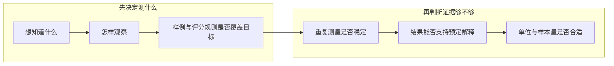

# 评测测量学：先证明“测得对”，再比较“谁更高”

<!-- learning-contract -->
<div class="learning-contract" markdown="1">

**学习导航**

- **适合读者**：设计人工标注、LLM-as-judge、业务评测集和模型发布实验的开发者与算法工程师。
- **先修**：[评测总览](evaluation.md)中的 case 与 metric，以及比例和二项分布的基本直觉。
- **首次阅读**：跟着退款助手依次回答“想知道什么、怎样观察、观察是否稳定、结论是否成立”。
- **完成信号**：能解释“标注者很一致”为何仍可能全部标错，并能为配对实验写清目标效果、抽样单位和功效。
- **卡住时**：先看[完全一致但全部错误](#reliability-not-validity)的四条手算反例，再运行页面末尾的小程序。

</div>

**学习入口**：[评测总览](evaluation.md) · [评测统计](../foundations/evaluation-statistics.md) · [方法与发布决策](evaluation-methodology.md) · [Evaluation Gate](../practice/projects/evaluation-gate.md)
{ .doc-nav }

团队升级了退款助手。两位标注者都觉得新回答更像“问题已经解决”，彼此也非常一致；事务日志却显示，
有些被判为成功的退款根本没有发生。此时继续计算 bootstrap 或 p-value，只会精确比较一套错误标签。

测量学关心的是统计之前的推理链：



这条链不能倒着走。增加样本量会让错误指标显得更稳定；标注一致率很高，也可能只是大家共同误解了任务。
本页继续使用同一个退款助手，把每个术语放回它要解决的具体问题。

## 第一步：把“效果更好”写成一个可回答的问题

“帮助用户正确解决问题”太宽，不能直接指导采样和打分。先写一条完整声明：

> 在本季度中文退款请求中，新旧系统使用相同知识库、工具权限和预算。我们用独立事务日志判断授权退款是否完成，
> 并估计新系统相对旧系统的逐请求完成率差。

这句话固定了六件事：

| 问题 | 退款助手中的答案 |
|---|---|
| 要支持什么决定？ | 是否让新系统进入下一阶段发布 |
| 想讨论什么能力？ | 在授权范围内正确完成退款任务 |
| 用什么观察它？ | 事务最终状态与权限审计记录 |
| 对哪些请求解释？ | 本季度中文退款请求，不含已由人工接管的会话 |
| 比较哪两个系统？ | 使用相同知识库、工具权限和预算的新旧版本 |
| 最终估计什么量？ | 新系统减旧系统的逐请求完成率差 |

如果实际只收集了“裁判模型更喜欢哪个回答”，结论就只能写成偏好差异，不能改写成退款完成率提高。

## 第二步：把构念变成可以观察的规则

**构念（construct）**是我们希望讨论、却不能靠读取一个字段直接得到的属性。退款助手的“任务成功”不仅包含
退款是否完成，还包含账户是否正确、操作是否获授权、金额是否正确，以及用户是否得到必要说明。

**操作化（operationalization）**把构念拆成可收集的观察：准备哪些 case、查看哪些状态、怎样标注、如何聚合，
以及什么情况必须判为失败。

同一个退款请求可以产生几种不同观察：

| 观察 | 它能回答什么 | 它遗漏了什么 |
|---|---|---|
| 事务最终状态 | 退款是否真的完成，金额是否正确 | 回复是否清楚、用户是否理解 |
| 权限审计记录 | 系统是否操作了正确账户并通过授权 | 最终资金状态是否成功落账 |
| 回答中的 claim 与证据 | 回复是否由当前证据支持 | 工具是否真正执行成功 |
| 盲评者按规则打分 | 文字是否正确、完整、易懂 | 隐藏业务状态和长期结果 |
| 用户追问或转人工 | 用户是否继续寻求帮助 | 原因可能是习惯、渠道或等待成本 |

这些观察可以组合，却不能互相冒充。事务状态适合判断“是否完成”，人工评分适合补充判断“是否解释清楚”。
权限错误属于强制失败，不能用流畅表达抵消。

一份可审查的操作化说明至少写清：包含和排除的情形、观察对象、标签空间、评分规则、失败怎样进入分母、
聚合方式、时间窗口和预定用途。只写一个 `quality_score`，读者无法知道分数代表什么。

### 测量尺度决定可以怎样计算

| 尺度 | 退款例子 | 可以安全解释的关系 |
|---|---|---|
| 名义（nominal） | `supported / contradicted / insufficient` | 类别相同或不同 |
| 顺序（ordinal） | 1 到 5 级解释质量 | 4 高于 3，但相邻等级未必等距 |
| 区间（interval） | 差值可解释、零点由约定选择的分数 | 加减后的间隔 |
| 比率（ratio） | 延迟、token 数和金额 | 有意义的零点与倍数 |

把 1 到 5 级直接求均值，隐含了相邻等级近似等距的假设。它并非一定错误，但这个假设来自分析模型，
不是因为数据恰好用数字保存。报告等级分布，往往比只给一个均值更容易看出变化。

## 第三步：检查结论是否测到了目标

Validity 通常译作**效度**。它问的是：当前观察是否足以支持这次预定解释和用途？
效度属于“分数在特定场景中的解释”，不是某个指标永久拥有的证书。

### 内容效度：评测集是否覆盖重要场景

如果评测集几乎都是普通全额退款，它就很难支持“退款助手整体安全可靠”的结论。团队可以先画一张内容蓝图：

| 构念组成 | 在产品中的地位 | 当前 case | 评分依据 | 已知缺口 |
|---|---|---:|---|---|
| 普通退款 | 主要流量 | 220 | 事务最终状态 | 无明显缺口 |
| 部分退款 | 常见金额风险 | 40 | 金额与最终状态 | 样本偏少 |
| 欺诈或越权请求 | 零容忍风险 | 30 | 必须拒绝并升级 | 尚未覆盖跨租户攻击 |

表中数字只是内容蓝图的示意，不是仓库记录的线上数据。挑战集可以故意多收集长尾风险，
但它的均值不能再被解释成线上发生率。领域专家评审、来源台账和缺口分析，比单纯增加题目数量更重要。

### 构念效度：指标应按预期响应变化

如果某个指标真的在测“授权退款成功”，可以在运行前写下几条预测：

- 事务成功后，任务完成标签应更可能通过；
- 只修改回答措辞、不改变事务状态时，完成标签不应改变；
- 把目标账户替换成其他用户时，权限标签必须失败；
- 内容相同但回答更长时，正确性裁判不应无条件提高分数。

第一条检查它是否收敛到接近目标的观察，第二条检查它能否排除无关表面变化，第三条使用已知错误组做对照。
一次相关性仍不够：共同数据来源、答案泄漏或混杂变量，都可能制造看似合理的关系。

最有价值的做法，是事先写出“如果指标真在测 X，干预 Y 后应该怎样变化”，再准备正反例验证。

### 准则效度：与独立外部依据比较

**准则（criterion）**是比当前测量更接近目标、而且通过独立过程获得的外部依据。例如：

- 用事务日志检查助手自报的 `completed`；
- 用盲审专家结论检查模型裁判的标签；
- 用后续一段时间的线上任务结果检查离线分数。

同一时点比较通常称为 concurrent validity；用当前分数预测未来结果称为 predictive validity。
名称不是重点，关键是写清外部依据来自哪里、何时产生、是否与被测结果共享信息。

混淆矩阵还要注明“行是外部准则，列是当前测量”，并展示每类分母和关键错误。外部准则本身也可能出错；
“与 gold 一致”只在 gold 的来源、独立性和适用范围内成立。

## 第四步：稳定的测量仍可能稳定地错

Reliability 通常译作**信度**或稳定性。它问：目标没有改变时，换标注者、换顺序或重复运行，结果是否足够稳定？
误差可能来自题目措辞、呈现顺序、裁判采样、时间漂移或输出解析程序。

经典直觉常写成：

\[
X=T+E,
\]

观察值 (X) 由目标相关部分 (T) 和测量误差 (E) 组成。这只是定位误差的简化模型；
它不保证现实中的误差彼此独立、均值为零，或存在唯一的“真分数”。系统性偏差可以非常稳定，
所以信度是支持效度的条件之一，却不能单独证明测量有效。

### 两位标注者的一致率与 Cohen's κ

两位标注者为 (n) 个名义类别样例给出 (a_i) 与 (b_i)。直接观察到的一致率为：

\[
p_o=\frac{1}{n}\sum_{i=1}^{n}\mathbf{1}[a_i=b_i].
\]

若两人使用类别 (k) 的边际比例分别是 (p_{Ak}) 和 (p_{Bk})，独立边际模型下的机会一致率为：

\[
p_e=\sum_k p_{Ak}p_{Bk}.
\]

Cohen's \(\kappa\) 用机会一致率校正观察一致率：

\[
\kappa=\frac{p_o-p_e}{1-p_e}.
\]

\(\kappa=1\) 表示相对这个机会模型完全一致，0 表示观察一致率等于机会一致率，负值表示低于它。
如果两人把所有样例都标成同一类别，则 (p_o=p_e=1)，分母为零，\(\kappa\) 没有定义；此时不能把它写成 1。

类别比例会影响 \(\kappa\)。因此，高观察一致率仍可能对应较低的 \(\kappa\)，不同评测集也不能脱离类别分布直接比较。
报告时应同时给出混淆情况、类别数量、观察一致率、机会一致率，以及按用户或文档聚类的不确定性。

<a id="reliability-not-validity"></a>
### 完全一致但全部错误

下面四条是本仓库为了手算而准备的极端反例：

| Case | 事务日志给出的外部准则 | 标注者 A | 标注者 B |
|---|---|---|---|
| 1 | correct | incorrect | incorrect |
| 2 | correct | incorrect | incorrect |
| 3 | incorrect | correct | correct |
| 4 | incorrect | correct | correct |

两位标注者每次都给出相同标签，所以观察一致率为 1。两类标签各占一半，机会一致率为 0.5，
Cohen's \(\kappa\) 因而为 1。然而，两人的标签与事务日志每次都相反，对外部准则的准确率都是 0。

这不是统计悖论。\(\kappa\) 回答“两人是否一致”，与外部准则的准确率回答“他们是否判断正确”。

```python
from about_llm.evaluation import cohen_kappa, criterion_validity

criterion = ["correct", "correct", "incorrect", "incorrect"]
rater_a = ["incorrect", "incorrect", "correct", "correct"]
rater_b = list(rater_a)

assert cohen_kappa(rater_a, rater_b).kappa == 1
assert criterion_validity(rater_a, criterion).accuracy == 0
```

### 标注结构变了，统计量也要变

| 数据结构 | 常见选择 | 先确认什么 |
|---|---|---|
| 两位标注者、名义类别 | Cohen's \(\kappa\) | 两人是否评了同一批样例 |
| 每条样例有固定数量的多位标注者 | Fleiss' \(\kappa\) | 每条样例的评分人数是否相同 |
| 有顺序的等级标签 | Weighted \(\kappa\) | 等级距离使用什么权重 |
| 连续或等级评分 | ICC | 评分者与对象采用哪种设计 |
| 评分人数不齐或存在复杂缺失 | Krippendorff's \(\alpha\) | 缺失机制与距离函数是否合适 |

Fleiss' \(\kappa\) 有自己的机会模型和数据结构，不是把 Cohen's \(\kappa\) 多算几遍。
任何一个一致性统计量都不能自动处理所有缺失、聚类或系统性偏差。

## 第五步：把评分规则变成可执行标注流程

“请两个人打分”还不是标注设计。退款助手可以按下面的顺序准备：

1. **确定判断对象**：标的是整段回答、单个 claim、一次工具调用，还是事务最终状态？
2. **写封闭的评分规则**：定义每个类别，并给出边界、正例、反例、“证据不足”和无法判断的处理。
3. **隐藏系统身份**：随机呈现 A/B 顺序，并保存每次分配。
4. **先做试标**：讨论分歧并修改规则；参与修改的样例不再充当独立的最终验证集。
5. **按风险分层双标**：不能只挑最容易达成一致的普通退款。
6. **保留原始标签**：复核会产生最终标签，但不能覆盖最初分歧。
7. **按切片诊断**：总体一致可能掩盖某种语言、风险或错误类型上的不稳定。
8. **监控漂移**：更换规则、裁判模型、标注团队或时间窗口后重新校准。

复核后的标签不是多数票的同义词。记录还应包含复核者、可见证据、规则版本和决定理由。
如果所有标注者都看到了同一份泄漏答案，增加人数只会让共同偏差显得更稳定。

## 第六步：分清标签、抽样和分析作用在哪个单位

一个用户可能发起 20 次会话，每次会话又包含 5 个待核对 claim。于是仓库里有 100 条标签，
但这些标签仍只来自一个用户，不能当作 100 个独立用户。

| 单位 | 它回答什么 | 退款例子 |
|---|---|---|
| Measurement unit | 一次标签落在哪个对象上？ | 单个 claim 或事务终态 |
| Sampling unit | 抽样过程近似独立抽到了什么？ | 用户、订单或文档 |
| Analysis unit | 每条统计贡献按什么聚合？ | 每次请求等权，或每位用户等权 |

用错误的独立单位计算区间和功效，会制造伪精度。Estimand 还应说明目标总体、系统版本、指标、聚合方式、
时间窗口和干预。只写“平均分差”，不足以区分随机请求与随机用户上的改善。

## 第七步：在运行前判断样本能否发现目标效果

先固定一个可重复的检验。零假设为真时，它错误拒绝零假设的概率上限记为 \(\alpha\)。
在某个具体备择情形下，它正确拒绝零假设的概率称为统计功效（power）：

\[
\operatorname{power}=P(\text{reject }H_0\mid H_1\text{ 中指定的效果}).
\]

第二类错误率是 \(\beta=1-\operatorname{power}\)。功效由目标效果、样本量、噪声与相关结构、检验方向和阈值共同决定。
它是运行前的设计性质，不能在实验结束后根据 p-value 反推出“这次实验成功的概率”。

这里还要分清：

- **最小有意义效果**来自业务：改善小于多少不值得发布？
- **最小可检测效果（MDE）**来自设计：在固定样本量、\(\alpha\)、目标功效和分析协议下，最小能分辨多大的效果？

先决定有业务意义的效果，再反推所需样本。如果预算无法达到，就应承认当前实验分辨力不足，
而不是把设计能力改写成业务价值。

### 用配对 sign test 看懂“有效样本”

新旧系统回答同一条 case。去掉两者平局后，剩下 (m) 个**有差异的配对**。在这些配对中，
令 (p>0.5) 表示新系统胜出的条件概率，则：

\[
X\sim\operatorname{Binomial}(m,p).
\]

单侧、固定样本量的检验选择最小整数 (c)，使得零假设 (p=0.5) 下

\[
P(X\ge c)\le\alpha.
\]

备择概率为 \(p\) 时，精确条件功效是：

\[
P_p(X\ge c)=\sum_{x=c}^{m}\binom{m}{x}p^x(1-p)^{m-x}.
\]

当 \(m=5\) 且 \(\alpha=0.05\) 时，只有 5 次全部胜出才会拒绝零假设。
实际零假设拒绝概率是 \(1/32=0.03125\)。即使真实条件胜率 \(p=0.8\)，功效也只有
\(0.8^5=0.32768\)。精确计算保证口径清楚，却不会让小样本自动变得充足。

仓库的小程序还复现了两个规划结果：

- 条件胜率设为 0.75、目标功效设为 0.8 时，至少需要 **23 个有差异的配对**；新系统至少赢 16 个时拒绝，功效约为 0.8037。
- 固定 25 个有差异的配对，在千分之一概率网格上达到 0.8 功效所需的最小 \(p\) 是 **0.770**。

第二个结果中的 0.270 是“发生差异时，新系统胜率相对 0.5 的条件差”，不是总体准确率提高 27 个百分点。

最容易误读的是样本量：23 指非平局配对数，不是总 case 数。如果试标估计只有 20% 的 case 会产生新旧差异，
获得 23 个有差异配对的粗略期望约为 (23/0.2=115) 个总 case。这个换算仍依赖试标得到的差异率；
真实差异率会变化，因此规划时要留出余量。

检验方向也要在看结果前指定。反复查看、用户内相关、多重指标或根据数据决定停止，都会改变错误率与功效；
本节的固定样本量精确计算不能直接处理这些情况。

## 第八步：在生成答案前填写 measurement plan { #measurement-plan }

下面不是结果报告，而是运行前的设计草案：

| 字段 | 退款助手示例 |
|---|---|
| Decision | 新系统是否进入下一阶段发布？ |
| Construct | 在授权范围内正确完成退款，并提供必要说明 |
| Operationalization | 事务状态、权限记录、回答 claim 和盲评标签怎样组合 |
| Content blueprint | 普通、部分、欺诈和跨租户请求怎样覆盖 |
| Criterion | 事务日志由哪个独立过程产生，可能有什么延迟或错误 |
| Reliability | 哪些风险切片双标，使用什么一致性统计量 |
| Estimand | 目标请求分布上，新系统减旧系统的逐请求完成率差 |
| Effect and design | 最小有意义效果、配对方式、抽样单位、\(\alpha\)、目标功效和最大样本量 |
| Missingness | 超时、无效输出、拒答和裁判失败怎样进入分母 |
| Evidence boundary | 本实验不能说明哪些用户、时间和风险 |

常见误判可以直接回到这张表定位：

| 看到的说法 | 真正缺少的东西 |
|---|---|
| “\(\kappa\) 很高，所以 gold 正确” | 独立外部准则、干预反例和专家审查 |
| “样本很多，所以指标可信” | 构念、内容覆盖与准则效度证据 |
| “p-value 小于 0.05，所以改善重要” | 事前定义的业务阈值和效果区间 |
| “有 1000 个 claim，所以样本量是 1000” | 用户或文档层面的独立抽样单位 |
| “目标功效是 80%，实验就有 80% 概率成功” | 功效所条件依赖的备择效果与噪声模型 |
| “MDE 是 2%，所以 1% 没价值” | 独立定义的最小业务价值 |

## 运行四条反例与功效计算

```powershell
python projects/evaluation-gate/measurement_toy.py
python -m pytest tests/test_evaluation_measurement.py -q
```

第一个命令会重新计算四条标签的一致率、机会一致率、Cohen's \(\kappa\) 和相对外部准则的混淆矩阵。
它还会计算配对 sign test 的拒绝阈值、条件功效、所需的有差异配对数，以及声明网格上的 MDE。

这些标签由本仓库为教学准备，没有执行真实标注者、模型、裁判服务或线上实验。

小程序可以检查公式、标签方向和边界处理；真实的内容覆盖、外部准则质量、抽样代表性与用户间独立性，
仍要由具体评测设计提供证据。

完成测量计划后，再进入[配对区间、多重比较和发布门禁](evaluation-methodology.md)。统计方法可以量化剩余不确定性，
却无法修复这一页发现的测量对象错误。

## 读完后，试着回答

1. 两位标注者的 \(\kappa=1\)，为什么仍不能说 gold 标签正确？
2. 事务日志、人工帮助性评分和用户是否追问，分别观察了“任务成功”的哪一部分？
3. 规划需要 23 个有差异配对时，为什么不能只收集 23 个总 case？
