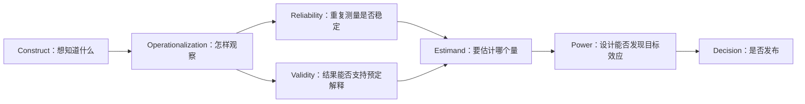

# 评测测量学：先证明“测得对”，再比较“谁更高”

<!-- learning-contract -->
<div class="learning-contract" markdown="1">

**学习导航**

- **适合读者**：设计人工标注、LLM-as-judge、业务评测集和模型发布实验的开发者与算法工程师。
- **先修**：[评测总览](evaluation.md)中的 case/metric，概率、比例和二项分布直觉。
- **首次阅读**：Construct → operationalization → reliability → validity → power。
- **完成信号**：能解释“标注者很一致”为何不等于“标签正确”，并为配对实验写出 effect、alpha、power 和 sampling unit。
- **卡住时**：先看[完全一致但全部错误](#reliability-not-validity)的四条反例，再运行页面末尾 toy。

</div>

**学习入口**：[评测总览](evaluation.md) · [评测统计](../foundations/evaluation-statistics.md) · [方法与发布决策](evaluation-methodology.md) · [Evaluation Gate](../practice/projects/evaluation-gate.md)
{ .doc-nav }

一个模型得 82 分，另一个得 80 分。Bootstrap、p-value 和发布门禁都可能算得完全正确，但还有一个更早的问题：这 2 分究竟代表什么？

测量学把评测拆成一条不能跳步的推理链：



任何后层都不能自动修复前层。增大样本量会让一个错误指标更精确；κ 很高会让一套共同误解更稳定；显著差异也可能只说明系统更擅长迎合 judge。

## 从一个具体问题开始

假设团队想比较两个客服 RAG 系统。原始目标是“帮助用户正确解决问题”。它至少可能被操作化为：

- 最终业务状态是否正确，例如退款是否真的完成；
- 回答中的 atomic claims 是否被授权证据支持；
- 人工标注者按 rubric 给出的 1–5 分；
- LLM judge 对 A/B 回答的偏好；
- 用户是否继续追问或转人工。

这些都不是“目标本身”。它们观察了目标的不同侧面，也带有不同误差。继续计算前先写一句完整声明：

> 对固定季度中文退款请求分布，在相同知识库、工具权限和预算下，用独立事务日志验证的任务完成率，估计 candidate 相对 baseline 的 case-level 平均差。

这句话同时固定了 construct 的一个可观察部分、criterion、目标分布、系统身份、采样单位和 estimand。若实际只测 judge 偏好，就不能把结论写成“退款完成率提高”。

## Construct 与 operationalization

**Construct（构念）**是不能被一次直接读取、但希望讨论的属性，例如 helpfulness、faithfulness、safety 或真实任务成功。**Operationalization（操作化）**是把它变成可收集观察的规则：case、rubric、label、metric、阈值和聚合。

同一个词在不同项目里可能是不同 construct：

| 名称 | 可复现定义 | 实际没有回答的问题 |
|---|---|---|
| Correctness | 最终数据库状态等于预注册 expected state | 表达是否自然、过程是否合规 |
| Faithfulness | 每个回答 claim 都被给定 evidence 支持 | Evidence 本身是否真实、完整、最新 |
| Helpfulness | 盲评者按固定 rubric 判断能否完成任务 | 用户是否真的完成、长期是否满意 |
| Safety | 预定义危险行为在测试集中是否出现 | 未覆盖威胁、真实发生率、攻击适应性 |

一个可审计操作化至少记录：construct 定义、包含和排除的情形、观察单位、标签空间、rubric、失败分母、聚合规则、时间窗口和预定用途。只写“quality score”无法判断测量对象。

### 测量尺度决定允许的计算

- **Nominal（名义）**：类别只有相同/不同，例如 `supported/contradicted/insufficient`；可算 confusion、agreement 和 κ。
- **Ordinal（顺序）**：等级有次序但相邻距离未必相等，例如 1–5 rubric；普通均值隐含等距假设，可优先报告各等级分布并按设计使用 weighted κ。
- **Interval（区间）**：差值可解释但零点任意。
- **Ratio（比率）**：有可解释零点，例如延迟和 token 数。

把 ordinal 1–5 当连续值并不是永远错误，但这是建模假设，不是数据格式自动授予的性质。

## Validity 是一组证据，不是一张永久证书

Validity 回答的是：**这些观测是否支持预定解释和用途？** 它属于“分数在特定场景中的解释”，不是某个 metric 永远具有的属性。一个适合短答案抽取的 exact match，不一定适合开放问答；一个适合日常客服的 judge，也不一定能识别医疗高风险错误。

### Content validity：内容是否覆盖目标领域

Content validity 检查 case 和 rubric 是否覆盖 construct 的重要组成，而不是被易收集样例支配。实际做法是先建 blueprint：

| 构念组成 | 目标流量/风险权重 | Case 数 | 评分规则 | 缺口 |
|---|---:|---:|---|---|
| 普通退款 | 55% | 220 | 最终状态 | 无 |
| 部分退款 | 25% | 40 | 金额与状态 | 样本不足 |
| 欺诈/越权 | 风险 guardrail | 30 | 必须拒绝并升级 | 未覆盖跨租户 |

挑战集可以故意过采样长尾，但不能再把它的均值称为线上发生率。内容覆盖通常需要领域专家评审、来源台账和缺口分析；“题很多”不等于覆盖好。

### Construct validity：行为是否符合构念理论

如果一个指标真在测目标 construct，它应呈现预先预测的关系。例如：

- 独立事务成功应与“任务完成”rubric 正相关；
- 只改变回答措辞、不改变事实时，事实正确性不应大幅变化；
- 注入一个关键错误时，correctness 应下降；
- 回答变长但内容不变时，judge 不应无条件偏好更长文本。

这些可分别提供 convergent、discriminant 或 known-groups 证据。一次相关性不是最终证明：共同数据来源、泄漏和混杂都能制造相关。最有价值的是预先写出“若指标真测到 X，干预 Y 后应该怎样变化”，再用正负对照检验。

### Criterion validity：与外部 criterion 是否一致

Criterion validity 将测量结果与一个更接近目标、且独立获得的外部 criterion 比较：

- Judge verdict 对照盲审专家裁决；
- Agent 自报 `completed` 对照数据库 effect；
- 离线通过率对照随后一段时间的线上 outcome。

同一时间获得常称 concurrent validity，预测未来 outcome 常称 predictive validity。报告 accuracy/confusion 时必须说明 criterion 行、预测列、类别分母和关键错误类型。Criterion 仍可能有误，也可能与被测结果共享泄漏；“与 gold 一致”只在 gold 的来源、独立性和适用范围内成立。

## Reliability 与 inter-rater agreement

Reliability 问的是：在 construct 没有改变时，重复测量能否得到足够稳定的结果。误差可能来自 annotator、题目措辞、顺序、judge sampling、时间漂移或 parser。

经典直觉常写成：

\[
X=T+E,
\]

观察值 \(X\) 由目标相关部分 \(T\) 和测量误差 \(E\) 组成。这只是帮助定位误差的模型，不保证现实误差独立、均值为零或存在唯一“真分数”。系统性偏差可以非常稳定，因此 reliability 是 validity 的必要但非充分条件。

### Observed agreement 与 Cohen's κ

两个标注者对 \(n\) 个 nominal items 的 observed agreement 是：

\[
p_o=\frac{\#\{i:a_i=b_i\}}{n}.
\]

若 A/B 使用类别 \(k\) 的边际比例分别为 \(p_{Ak},p_{Bk}\)，独立边际模型下的 chance agreement 为 \(p_e=\sum_k p_{Ak}p_{Bk}\)。Cohen's κ 为：

\[
\kappa=\frac{p_o-p_e}{1-p_e}.
\]

κ=1 表示相对该 chance model 的完全一致，0 表示 observed 与 chance expectation 相同，负值表示低于它。若两人把所有 item 都标成同一类别，则 \(p_o=p_e=1\)，分母为零，κ 未定义；不能偷偷写成 1。

κ 依赖类别 prevalence 和两位标注者的边际使用方式。高 observed agreement 可能得到较低 κ；不同数据集的 κ 也不能脱离类别分布直接排榜。报告 κ 时同时给 confusion、类别分布、observed/chance agreement 和 cluster-aware 不确定性。

Fleiss' κ 可处理每个 item 有固定数量、多于两位 nominal ratings 的设计，但 chance model 和数据结构与 Cohen's κ 不同。它不是“把 Cohen κ 多算几遍”，也不能处理所有缺失、ordinal distance 或连续分数。
Ordinal 常考虑 weighted κ；连续/等级评分常按设计选择 ICC；rater 数不齐或缺失复杂时可考虑 Krippendorff's α。选统计量要先看测量尺度和 assignment design。

<a id="reliability-not-validity"></a>
### 完全一致但全部错误

| Item | 外部 criterion | Rater A | Rater B |
|---|---|---|---|
| 1 | correct | incorrect | incorrect |
| 2 | correct | incorrect | incorrect |
| 3 | incorrect | correct | correct |
| 4 | incorrect | correct | correct |

两位标注者 observed agreement=1，边际 chance agreement=0.5，Cohen's κ=1；但两人对 criterion 的 accuracy 都是 0。这不是悖论：reliability 问“两人是否一致”，criterion validity 问“是否与外部标准一致”。

```python
from about_llm.evaluation import cohen_kappa, criterion_validity

criterion = ["correct", "correct", "incorrect", "incorrect"]
rater_a = ["incorrect", "incorrect", "correct", "correct"]
rater_b = list(rater_a)

assert cohen_kappa(rater_a, rater_b).kappa == 1
assert criterion_validity(rater_a, criterion).accuracy == 0
```

## 从 rubric 到可用标签

一个实用标注流程不是“请两个人打分”这么简单：

1. **定义 unit**：一次判断对应整段回答、atomic claim、tool action 还是最终 state。
2. **写 closed rubric**：给类别定义、边界、正例、反例、`insufficient` 和无法判断处理。
3. **盲化与随机化**：隐藏系统身份；A/B 顺序随机并保存 assignment。
4. **先做 calibration round**：讨论分歧并修改 rubric；参与修改的数据不能再当独立 final validation。
5. **抽样 double-label**：按风险和主要 slice 覆盖，不只挑最容易一致的样例。
6. **保留原始 labels**：Adjudication 产生最终标签，但不能覆盖原始分歧历史。
7. **按切片报告**：总体一致会掩盖某语言、类别或失败类型的不可靠。
8. **监控 drift**：换 rubric、judge、标注团队或时间窗口后重新校准。

Adjudicated label 不是多数票的同义词。它应记录 adjudicator、看到的证据、规则版本和决定理由。若所有人共同看到泄漏答案，增加标注者只会提高共同偏差的稳定性。

## Estimand、sampling unit 与 measurement unit

三个 unit 经常被混为一个：

- **Measurement unit**：一次标签落在哪个对象上，例如一个 claim。
- **Sampling unit**：抽样过程近似独立抽取什么，例如 user 或 document。
- **Analysis unit**：统计量把什么当一条贡献，例如 case mean 或 equal-user mean。

一个 user 有 20 个对话、每个对话有 5 个 claims，会产生 100 个 labels，却不等于 100 个独立用户。Power 和 interval 使用错误 unit，会产生伪精度。Estimand 必须说明目标总体、unit、系统、metric、聚合、时间和干预；“平均分差”还不完整。

## Statistical power、MDE 与样本量

设一个预先固定的检验在零假设为真时错误拒绝的概率上限为 \(\alpha\)，在某个具体 alternative 下正确拒绝的概率就是 **statistical power**：

\[
\text{power}=P(\text{reject }H_0\mid H_1\text{ 中指定的 effect}).
\]

Type II error 是 \(\beta=1-\text{power}\)。Power 不是实验完成后由 p-value 反推的“成功概率”；它依赖 effect、样本量、噪声/相关结构、检验方向和阈值。

**Minimum Detectable Effect（MDE）**是在固定样本量、alpha、目标 power 和分析协议下，设计能以目标 power 检出的最小 effect。它不是“最小业务价值”。建议先定 minimum meaningful effect，再问需要多少样本；若预算无法达到，就承认实验对该效应分辨力不足。

### 配对 sign test 的 exact power

对同一 case 比较 baseline/candidate，删除 tie 后剩 \(m\) 个 informative pairs。令 positive 表示 candidate 胜出，固定 alternative win probability \(p>0.5\)：

\[
X\sim\operatorname{Binomial}(m,p).
\]

单侧 fixed-horizon test 选择最小整数 \(c\)，使 \(P_{p=0.5}(X\ge c)\le\alpha\)。则 exact conditional power 是：

\[
P_p(X\ge c)=\sum_{x=c}^{m}\binom{m}{x}p^x(1-p)^{m-x}.
\]

当 \(m=5,\alpha=0.05\)，只有 5 次全胜才拒绝，实际 null rejection probability 是 \(1/32=0.03125\)。若 \(p=0.8\)，power 只有 \(0.8^5=0.32768\)。Exact 不等于“样本够了”；离散检验的实际 alpha 还可能明显低于名义 alpha。

仓库 exact control 给出两个可复算结果：

- 若 alternative positive probability=0.75、target power=0.8、alpha=0.05，最少需要 **23 个 informative pairs**；rejection threshold 是至少 16 个 positive，power 约 0.8037。
- 固定 25 个 informative pairs、target power=0.8，在千分之一概率网格上，最小 \(p\) 是 **0.770**，即相对 chance 的 conditional sign margin 是 0.270；这不是 accuracy 提升 27 个百分点。

最重要的限制是：\(m\) 是非 tie pair 数，不是总 case 数。若预期 discordance rate 为 \(q\)，总 paired cases 的粗略期望约为 \(m/q\)，但 \(q\) 本身有不确定性并可能随系统版本和 slice 改变。设计时用独立 pilot 估计并留余量；不能跑完后删除 ties，再把 23 说成预先规划的总样本量。

单侧方向必须在看结果前指定。重复 peeking、cluster dependence、多重指标或数据驱动停止都会改变 error/power；此处 fixed-horizon exact calculation 不能直接复用。

## 一份最小 measurement plan { #measurement-plan }

在生成输出前填写，而不是看到结果后补：

```text
Decision: 哪个发布决定依赖本评测？
Construct: 希望解释的属性是什么？明确排除什么？
Operationalization: case、rubric、labels、metric、threshold、aggregation
Content blueprint: 主要任务/风险/slice 怎样覆盖？
Criterion: 来自哪里？是否独立？误差和时间边界是什么？
Reliability: 哪些 items 双标？用什么 agreement statistic？
Estimand: population + unit + system bundle + metric + time window
Effect: minimum meaningful effect 与 planning alternative
Design: paired/independent，sampling/cluster unit，alpha，power，max N
Missingness: timeout、invalid、abstain、judge failure怎样进入分母？
Evidence boundary: 哪些结论明确不能由本实验推出？
```

| 失败 | 为什么不成立 | 修复方向 |
|---|---|---|
| κ 高，所以 gold 正确 | Reliability 不等于 validity | 加独立 criterion、干预反例与专家审计 |
| 样本很多，所以指标可信 | 大 N 只减少抽样误差 | 先验证 construct/content/criterion |
| p<0.05，所以改善重要 | 显著性不等于 effect value | 预设 meaningful threshold 并报告区间 |
| 1000 个 claims，所以 n=1000 | Claims 可能嵌套于少量用户/文档 | 固定 sampling/cluster unit |
| Judge 与人类相关 0.9 | Overall relation 可隐藏关键错误 | 报 confusion、风险 slice 与 disagreement |
| 目标 power=80%，实验就有 80% 概率成功 | Power 条件于指定 effect/model | 披露 alternative、噪声、tie/cluster 假设 |
| MDE=2%，所以 1% 没价值 | MDE 是设计分辨力，不是业务价值 | 先定义 minimum meaningful effect |

## 可运行控制

```powershell
python projects/evaluation-gate/measurement_toy.py
python -m pytest tests/test_evaluation_measurement.py -q
```

Toy 精确计算 observed/chance agreement、Cohen's κ、criterion confusion、单侧 sign-test rejection threshold、conditional power、minimum informative-pair count 和声明概率网格上的 MDE。
它使用四条 authored labels 和二项模型，没有执行真实标注者、模型、judge、provider 或线上实验。

因此它只证明公式、数据方向和边界处理：不建立 construct/content validity，不证明 criterion 正确或独立，不估计真实 discordance rate，不验证 sampling/cluster independence，也不证明任何模型改善。
真实项目还要把本页的 measurement plan 与[配对区间、多重比较和发布门禁](evaluation-methodology.md)连接起来。
