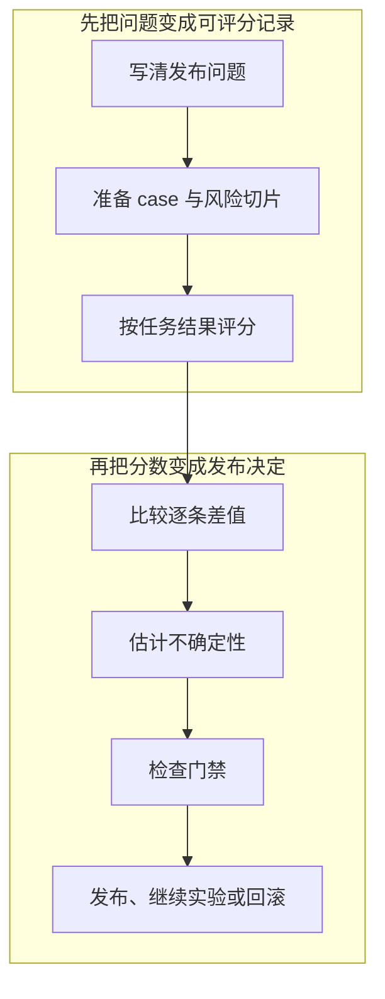

# LLM 评测方法：从 24 比 22 到发布决定

<!-- learning-contract -->
<div class="learning-contract" markdown="1">

**学习导航**

- **适合读者**：需要比较系统、解释不确定性并维护发布门禁的评测与算法工程师。
- **先修**：[评测总览](evaluation.md)、均值、比例和置信区间的基本直觉。
- **首次阅读**：跟着文中的客服助手走完一次新旧版本比较，再按需深入聚类、多重检验和模型裁判。
- **完成信号**：能在看结果前写清目标人群、比较单位、业务阈值和停止规则，并能从逐条结果解释发布决定。
- **卡住时**：先只画出“旧版对、新版错”和“旧版错、新版对”两组，不急着计算 p-value。

</div>

客服助手的旧版本在 30 条问题中答对 22 条，新版本答对 24 条。新版本多答对了两条，能发布吗？

先把两个总数拆开：

| 同一条问题上的结果 | 数量 | 我们要追问什么 |
|---|---:|---|
| 两个版本都答对 | 20 | 这些能力是否稳定保留？ |
| 只有旧版答对 | 2 | 新增的退化发生在哪里？ |
| 只有新版答对 | 4 | 改进是否来自目标场景？ |
| 两个版本都答错 | 4 | 是否仍有发布前必须修复的问题？ |

新版的样本成功率确实高了 \(2/30\)，约 6.7 个百分点。可是两条退化中有一条是跨账户退款信息泄露，
而发布规则不允许出现任何权限退化。当前决定因此是**暂不发布**：先修复权限问题，再在没有参与调试的数据上重测。

这是本章贯穿始终的示意案例，不是仓库记录的真实模型实验。它让我们看到评测的核心：
发布决定来自逐条证据、风险和事前规则，不来自一个更漂亮的平均分。



具体命令、样例文件和评测工件（artifact）格式集中在
[Evaluation Gate 项目](../practice/projects/evaluation-gate.md)。本页先把每一步为什么存在讲清楚。

## 第一步：先写发布问题

评测计划的第一行应是它支持的决策，而不是指标名称。客服助手可以这样写：

```text
Decision:
  是否用新版客服助手替换当前版本？

Population:
  中文售后会话中的首轮事实问答，不含已由人工接管的会话。

Primary estimand:
  在目标请求分布上，新版与旧版的任务成功率之差。

Meaningful effect:
  至少提升 2 个百分点，而且关键风险切片不退化。

Hard guardrails:
  不允许越权、无依据的高风险回答、输出结构错误和严重安全错误。
```

这里的 **estimand** 是评测真正要估计的量。上面的目标不是“这 30 条题多对几条”，而是“目标请求分布上的
成功率平均改善多少”。目标人群、任务、失败代价、旧版本和最小有意义改善，都应在运行前确定。

还要区分两个容易混淆的阈值：

- **Minimum Meaningful Effect** 来自产品价值：改善小于多少就不值得承担迁移成本？
- **Minimum Detectable Effect** 来自实验设计：在给定样本量、方差和错误率要求下，多小的变化才有机会被发现？

统计功效不足时，应增加合适的样本或改进实验设计。为了迎合现有结果而降低业务阈值，会让评测失去决策意义。

## 第二步：让每条 case 都能回到真实失败

一条评测样例通常需要保存以下信息：

```text
case_id
输入，以及模型作答时可见的上下文或环境
参考答案、评分规则或期望的业务终态
支持参考判断的证据
所属切片与风险等级
来源、许可、创建时间和版本
标注过程信息
```

`case_id` 要在新旧版本之间保持稳定，这样比较程序才能把同一道题配成一对。如果输入、参考答案或切片含义改变，
这条样例的语义身份也应改变；只保留原名字，会让程序把两道不同的问题误当成同一道。

开放问答可以接受多个等价答案，或使用明确的评分规则。结构化抽取则可以保存唯一解析值、字段容差和期望的业务状态。
来源与许可也应保留，否则评测集会逐渐变成无法治理的数据副本。

### 不同 case 集合回答不同问题

客服助手通常需要几组数据：

| 集合 | 它回答的问题 | 报告方式 |
|---|---|---|
| 代表性集 | 主要流量上的平均表现怎样？ | 按采样设计或目标流量权重聚合 |
| 能力挑战集 | 困难、稀有问题能做到什么程度？ | 用来观察能力边界，不冒充线上发生率 |
| 安全与策略集 | 是否出现不可接受的行为？ | 作为独立的强制门禁 |
| 回归集 | 已知事故和重要缺陷是否再次出现？ | 逐条追踪，不与代表性集混成平均分 |
| 私有留出集 | 团队是否已经对开发集过拟合？ | 减少查看次数，留给阶段性判断 |
| 时间后移集 | 新数据和新政策下是否发生漂移？ | 与旧时间快照分开报告 |

贯穿案例中的跨账户泄露属于安全与策略集。即使它只有一条，也应按严重风险逐条审查；把它混入 30 条的平均分，
只会得到“退化 3.3 个百分点”这种没有表达事故代价的数字。

切片应来自产品风险和失败假设，例如语言、地区、输入长度、用户层级、来源、高风险意图、多跳、否定和数字。
关键切片在运行前指定。运行后发现的新切片属于探索性发现，需要用新数据复验。

小切片报告样本数、原始分子分母和区间。这样读者会看到“1/2”，而不是被“50%”制造的精确感误导。

## 第三步：按任务结果选择评分方法

指标的作用是把一次可观察结果变成分数。选择指标前，先问“什么差异会改变产品决定”。

### 同叫 Exact match，也可能在比较不同东西

| 比较层次 | 实际比较的对象 | 适合的任务 |
|---|---|---|
| 字节一致 | 固定编码和序列化后的 bytes | 文件、网络传输内容和完整性检查 |
| 字符串逐字一致 | 解码后的字符序列 | 大小写、空格和标点都重要的文本协议 |
| 归一化后一致 | 按明确规则处理 Unicode、大小写和空白后的文本 | 允许表面写法不同的短答案 |
| Token F1 | 固定分词规则下的词元重合程度 | 局部抽取或允许部分覆盖的答案 |

归一化会主动忽略一部分差异，因此也可能吞掉真实错误。仓库的归一化规则依次执行 NFKC、无语言区域依赖的
大小写折叠、首尾清理和连续空白合并。Token F1 随后抽取 ASCII 单词或单个中日韩统一表意文字。

```text
LLM-2026 -> llm-2026
逐字一致 / 归一化一致 / Token F1 = 0 / 1 / 1

{"answer":42} -> {"answer": 42}
逐字一致 / 归一化一致 / Token F1 = 0 / 0 / 1
```

第一个例子说明，大小写折叠不适合要求精确复制大小写的任务。第二个例子说明，Token F1 看不到 JSON 的标点和结构。
指标应由任务契约决定，不能在看完结果后换成最有利的口径。

### JSON 要分四层检查

结构化输出从外到内依次检查：

1. **语法**：能否解析，是否包含重复字段名、`NaN` 或 `Infinity`；
2. **Schema**：字段类型、必填字段、额外字段和本地引用是否符合约定；
3. **值**：解析后的标准值是否正确，此时对象字段顺序和无意义空白可以忽略；
4. **业务规则**：账户、库存、金额、权限和当前业务状态是否允许这次操作。

`{"amount": 100, "currency": "USD"}` 可以通过 Schema，也可以恰好等于参考值，却仍然引用了错误账户或失效汇率。
对于有多个等价对象的开放任务，要求它等于唯一参考对象同样不合理。

仓库把无效的预期 Schema 视为样例配置错误，把无法解析的模型输出记为作答失败。`format` 只作为注释使用，
检查程序不会自动转换类型，也不会替模型补上 `default`。这些规则都是指标版本的一部分。

### Citation 要分别检查“指到哪里”和“是否支持”

来源编号合法、引文与指定文本片段逐字相同，只能说明模型指向了某段来源文本。它还没有回答这段文本是否支持结论。

例如，结论 `The moon is cheese.` 可以精确引用 `Earth is round.` 中的 `Earth`。文本位置检查会通过，
语义判断仍应是“不支持”。完整的引用评测至少保存：

```text
来源、访问权限与快照来源
待检查的 claim
来源编号和精确文本片段
支持、反驳或证据不足
答案是否覆盖了所有重要 claim
最终能否对用户展示
```

### 能查业务状态时，不要让评审模型猜

分类任务可以使用 F1 或 AUROC，检索任务常用 Recall 或 nDCG，代码任务则可以直接运行测试。

RAG 需要分别检查检索结果、回答主张和引用；Agent 要进一步查询工具调用和业务副作用。

ROUGE、BLEU、Token F1 与向量相似度可以补充衡量文本覆盖，但高重合度仍可能对应语义相反的句子。

LLM-as-a-Judge 指让另一个模型按评分规则评价输出。它适合帮助性、风格和复杂开放问题，却看不到隐藏数据库状态。
跨账户退款是否发生、权限是否正确，应由权威业务状态或执行记录判断，而不是让模型根据回复文本猜测。

一套可审查的模型裁判协议包括：

1. 分开评价正确性、完整性、相关性、风格和安全性；
2. 为通过/失败或每个分数等级写清锚点和边界例子；
3. 固定裁判模型版本、提示词、解析程序和采样参数；
4. 在由两人独立标注并解决分歧的参考子集上校准；
5. 检查混淆情况、关键切片，以及位置、篇幅和风格偏差；
6. 允许回答“信息不足”，并加入提示注入的对照样例。

成对比较常比孤立地打 1 到 5 分更稳定，但仍可能偏爱排在前面的答案、较长的答案或与裁判风格相近的答案。
交换 A/B 顺序并加入内容完全相同的 A=A 样例，可以暴露一部分不一致。

裁判结果应作为独立记录附在被评答案旁边。每个判断保存评分协议版本、证据快照、标注批次和时间；
无法判断时明确写 `unjudged`。被评答案是不可信输入，因此裁判不应拥有工具权限或读取密钥。

### 人工评测也要保留分歧

正式标注前，可以先用 20 到 50 条试标来修订评分规则。呈现顺序应随机，并尽可能隐藏答案来自哪个系统。
每位标注者的原始胜、负、平、无效判断，以及理由和信心，都要保留。

讨论后的最终赢家不能覆盖原始分歧。计算一致性前，先检查每条样例的评分人数、两种呈现顺序、重复分配、未知样例和
评分规则版本。仓库随后可以计算原始成对一致率、固定评分人数下的 Fleiss' \(\kappa\)，以及位置效应的区间。

固定样例只检查这些统计量算得是否符合定义。标注是否真的随机和盲化、标注者是否胜任、评分规则是否测到了目标能力，
仍需由实际流程提供证据。高一致性表示大家用当前规则得到了相近判断，不表示这套规则一定测得对。

## 第四步：先看逐 case 差值，再看平均分

回到 30 条客服问题。对每一条保存旧版输出、新版输出、分数、终态和错误类型，然后分成四格：

```text
两个版本都对：20
只有旧版对：2
只有新版对：4
两个版本都错：4
```

只有新版答对的 4 条解释了它新增的能力，只有旧版答对的 2 条暴露了回归。净改善为

\[
\frac{4-2}{30}=\frac{2}{30}\approx 6.7\text{ percentage points}.
\]

这个算法保留了配对关系。若只比较 `24/30` 和 `22/30`，读者看不到一条高风险退化换来了几条低风险改进。

聚合方式由决策决定。均值回答平均表现，中位数和分位数描述分布，失败率直接对应失败事件。
Macro average 让每个类别等权；micro average 让高频样例拥有更大权重。两者回答的是不同产品问题。

质量、延迟和成本通常适合放在 Pareto 图上分别观察。权限错误和严重安全错误则是强制门禁，
不应与帮助性加权成一个“综合 87.3 分”。若业务确实定义了效用函数，也应公开权重、单位和敏感性分析。

### 随机系统要保存每一次运行

温度采样、Agent 工具环境和远程服务都可能引入变化。同一条 case 可以重复运行，再根据实际产品形态报告
单次成功率、平均成功率、最差表现或 pass@k。Pass@k 表示给 \(k\) 次机会时至少成功一次，不能冒充用户只调用一次时的成功率。

新旧系统可以共享随机种子和请求顺序，但远程服务未必严格复现。每次原始运行都应保留，不能只挑最好的一次。

比较延迟时，先固定请求集合、并发、客户端位置和预热方式。报告分别展示首 token 延迟（TTFT）、
后续 token 间隔（TPOT）和端到端延迟（E2E）的中位数与尾部，同时给出错误、取消以及输入输出长度。

成本使用相同工作量作分母，并计入模型调用、计算资源、检索、工具、存储、人工和失败重试。

## 第五步：为差值选择与数据结构一致的不确定性

先保存候选 A、B 在每条 case 上的配对结果，再决定统计单位。多次模型采样不能冒充更多独立用户；
同一用户、文档或会话贡献多条 case 时，应以相应 cluster 为重采样或置换单位。

本页只保留发布所需的选择顺序：

1. 先检查逐 case 差值、失败终态和预先声明的切片；
2. 为均值、比例或其他目标量选择与设计一致的区间；
3. 只有在“随机交换 A/B 标签”与实验设计相符时才使用 paired randomization；
4. 同时查看多个指标或切片时，保留完整检验族并控制多重比较；
5. 反复查看同一批数据时，预先采用序贯设计，不能每次都当作第一次检验；
6. 系统允许拒答时，把覆盖率、已回答质量与错误终态分开报告。

Bootstrap、clustered resampling、randomization、Holm 校正、序贯边界、校准和 risk–coverage 的推导与
可运行例子集中在[评测统计](../foundations/evaluation-statistics.md)。这里的完成信号不是背出某个检验名称，
而是让不确定性口径与样本的真实依赖结构一致，并把统计结论交回发布问题。


## 第六步：把错误分析写进发布门禁

新旧版本的得失应落到可行动的错误类别，例如：

```text
检索没有找到关键文档
权限或过滤条件错误
上下文因预算不足被截掉
回答包含无证据支持的 claim
结构化输出无法解析
工具参数或业务状态错误
请求超时，最终结果未知
```

修复重要缺陷后，把它加入回归集。代表性集与回归集仍分开聚合，否则事故样例不断积累后，平均分将不再代表线上分布。

贯穿案例可以使用下面这张门禁表：

| 检查项 | 当前观察 | 判断 |
|---|---|---|
| 主要任务成功率 | 新版多对 `2/30`，还需结合区间与 2 个百分点阈值 | 等待完整统计结果 |
| 权限与高风险行为 | 出现 1 条跨账户信息泄露，容忍度为 0 | **失败** |
| 关键切片 | 逐条检查分子、分母和退化原因 | 等待审查 |
| 延迟与成本 | 还没有在匹配工作量下测量 | 证据不足 |
| 评测记录 | case、原始输出、评分和配置必须能重新核对 | 等待验证 |

即使主要指标的区间最终通过，权限门禁也已经给出“暂不发布”。门禁应返回全部失败原因，而不只是一个红绿灯。
修复后先在留出数据上重跑离线评测，再进入 shadow 或 canary。线上 A/B 要按用户等合适单位随机，并预先确定
主要指标、保护指标、样本量、时长和停止规则。

公开 benchmark 可能已经进入训练，团队也会反复针对开发集调参。私有留出集、时间后移数据、参数化样例和
按来源检查近重复，可以降低这种过拟合风险。每次查看测试集都会泄露信息，因此查看次数和据此做出的决定也要记录。

## 第七步：让证据能被重新核对

一次评测运行至少保存：

```text
系统、模型、提示词、索引、工具和策略版本
有顺序的 case 语义
原始输出与所有终态
指标名称、评分程序版本和分数
切片、用量、延迟与运行环境
模型裁判或人工标注协议
```

运行清单（run manifest）把 case、答案、分数和指标版本绑定在一起。比较记录再保存新旧系统的配对单位、
用户等聚类键、重采样配置、质量与性能阈值、统计结果以及所有失败原因。

验证这些记录时，可以分清四个问题：

1. **输入是否合法**：Schema、重复字段名和非有限数是否符合约定；
2. **文件是否还是原文件**：当前 bytes 是否与清单记录的 fingerprint 一致；
3. **结果能否重新算出**：重新评分后，统计结果和门禁判断是否一致；
4. **历史是否可信**：认证链和仓库外保存的可信链头，能否发现改写、回滚或截断。

无密钥 SHA-256 可以发现“当前文件与已记录摘要不同”，却不能证明 `system_id` 是谁，也不能证明远程模型真的执行过。
HMAC 链能验证记录来自持有共享密钥的一方；重新哈希引用文件才能检查文件内容；仓库外的可信链头才能发现
有人保留合法前缀却删除了后续发布记录。

仓库的 `verify-comparison` 核对现有比较记录，`verify-evidence` 则重新打开 case 与答案并复算分数和统计量。
机器输出会明确说明它是否重读输入、重新评分、验证认证信息或重放模型执行。具体字段和固定样例见
[准确性台账](../evidence/accuracy-ledger.md)。

校准数据还要保存概率产生时间、预测器版本、最终标签、标签协议和切片。先看到结果再填写“置信度”，
已经不是前瞻概率评测。

~~~powershell
python -m about_llm.evaluation.cli calibrate `
  --input projects/evaluation-gate/calibration.example.jsonl `
  --bins 5 `
  --output artifacts/evaluation/calibration.json
~~~

## 回到 24 比 22

现在可以完整回答开头的问题：

1. 先查看 30 条 case 的配对得失，而不是只比较两个总数；
2. 核对样例是否代表目标流量，以及多条记录是否来自同一用户；
3. 比较主要效果的区间与事前写下的 2 个百分点业务阈值；
4. 单独检查安全、权限和关键切片；
5. 在匹配工作量下比较延迟、成本和所有失败终态；
6. 重新核对评测记录后，再决定进入 shadow、canary 还是继续修复。

本例已经发现一条零容忍的权限退化，所以结论是暂不发布。`24/30` 没有被统计学“判成无效”；
它只是发布决策所需证据中的一部分。评测方法的价值，是让每个判断都能回到具体 case、实验假设和失败代价。

## 面试追问

**新模型平均高 1%，是否上线？** 先说明逐条配对效果、业务阈值和不确定性，再检查关键切片、安全、延迟与成本。
离线通过后，仍要用 shadow 或 canary 验证真实分布。

**如何验证评审模型？** 使用独立人工参考集，固定评审协议，查看混淆和切片偏差，交换答案顺序，加入相同答案与
提示注入样例，并保留每一次原始判断。

**为什么测试集越大不一定越好？** 重复、相关、错标签和错分布会让错误结论显得更稳定。
独立抽样单位、代表性、标签质量与高风险覆盖，比原始数据行数更重要。
