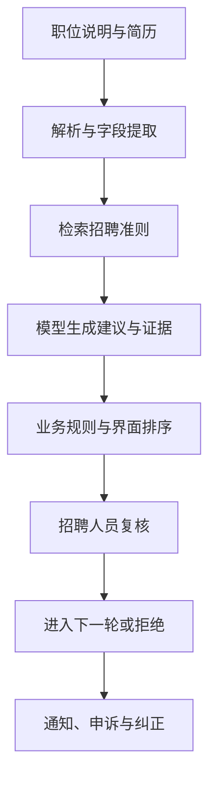
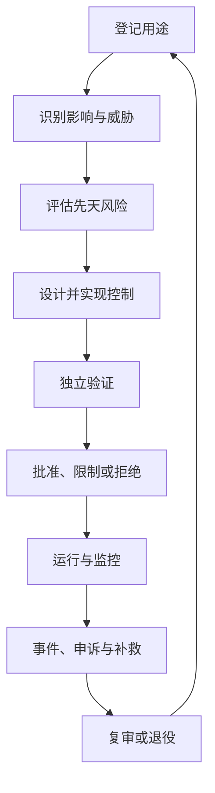

# 治理与社会影响：一次招聘筛选怎样变成可审计决定

<!-- learning-contract -->
<div class="learning-contract" markdown="1">

**学习导航**

- **适合读者**：需要把模型能力接入真实业务的产品、工程、法务、隐私、安全和治理负责人。
- **先修**：知道系统的用户、数据来源和输出去向；不要求法律背景。
- **首次阅读**：候选人经历 → 影响场景 → 控制措施 → 发布决定 → 申诉与退役。
- **完成信号**：能解释同一个模型为什么会因用途不同而承担不同风险，并为一项风险写出负责人、控制证据和停止条件。
- **卡住时**：先跟着本页的招聘案例走完一遍，再用[治理工件模板](governance-templates.md)填写自己的系统。

</div>

假设一家公司准备上线 `resume-screening-assistant-v1`。系统读取职位说明和简历，从公司招聘准则中检索相关条目，
然后给招聘人员一条“建议面试”或“建议不进入下一轮”的结论。

候选人甲符合岗位要求，但简历里有一段非典型职业经历。解析器漏掉了其中一项技能，模型又把职业空档看得过重，
界面最后把“建议不进入下一轮”显示成醒目的红色标签。招聘人员没有查看原始证据，直接接受了建议。

这不是简单的“模型答错一道题”。一次错误经过解析、模型、界面和人工流程，已经改变了一个人的就业机会。
治理要回答的正是：**谁允许这套系统参与什么决定，风险怎样被发现和降低，出了问题谁能暂停、纠正和补救。**

本章的招聘系统是教学用假想案例，不代表真实部署或真实组织的合规结论。本章提供工程治理方法，不构成法律意见；
具体义务仍须按上线时的地区、行业、数据和用途审查官方规则。

## 先看完整决定，而不只是模型调用

候选人甲经历的链路可以画成：



底层模型只是其中一个组件。解析器可能漏字段，检索可能取错版本，界面可能放大自动化偏见，招聘人员也可能没有足够
时间复核。只评测模型回答，无法证明整条决定链可靠。

同一个模型放在员工 FAQ 中，最坏结果可能只是一条错误链接。放在招聘、信贷或医疗流程中，错误却可能影响机会、
财务或人身安全。因此，治理要面对一个有明确用途、数据流、负责人和受影响者的完整系统。

## 第一步：把用途写成可以反驳的承诺

团队先不要登记“我们用了某个大模型”，而要写清楚系统被允许做什么。招聘案例的最小用途记录可以是：

| 问题 | 本例的回答 |
| --- | --- |
| 业务目的 | 帮招聘人员从简历中定位与既定岗位准则相关的证据 |
| 不使用 AI 的基线 | 招聘人员按同一份准则逐份阅读简历 |
| 直接用户 | 招聘人员和招聘经理 |
| 受影响者 | 求职候选人，包括不会直接操作系统的人 |
| 最大自动化程度 | 系统只能给建议；拒绝决定必须由具名人员复核 |
| 明确禁止 | 推断健康、家庭状况等无关敏感信息；把简历用于未批准的训练；把系统挪到未评审岗位 |
| 需要固定的组件 | 模型版本、解析器、Prompt、招聘准则、检索索引、业务规则和界面版本 |
| 责任人 | 业务负责人、工程负责人、招聘领域专家以及隐私、安全和法律审查人 |
| 退出路径 | 停用建议功能后，恢复到人工阅读流程 |

“帮助招聘”仍然太宽。系统是概括简历、排序候选人，还是自动拒绝？这三种用途产生的影响和所需证据完全不同。
用途记录应当让审查者能够指出越界行为，而不是写一句永远无法判错的愿景。

用途记录还要固定模型供应商及版本，以及输入数据、检索、记忆、工具和日志的范围。部署地区、目标语言、监控状态和
退役条件也属于这份记录。问题出现时，团队才能找到“哪一版系统对哪一批人做了什么”。

## 第二步：沿伤害发生的路径做影响评估

影响评估不要从风险名词开始，而要先写一条现实中的因果链：

> 非典型简历格式 → 解析器漏掉技能 → 模型给出负面建议 → 界面隐藏原始证据 → 招聘人员快速接受 →
> 合格候选人失去机会，而且不知道系统参与了决定。

同一条链要从不同角度拆开：

- **严重度**：候选人失去一次就业机会，而不是页面上出现一个无关紧要的错别字。
- **发生可能性**：取决于解析失败率、模型行为、界面和复核流程，不能由主观印象代替测量。
- **暴露规模**：每天处理多少候选人，错误是否会批量发生。
- **可检测性**：如果系统从不抽样复核被拒绝者，这类错误可能长期不可见。
- **可逆性**：生成建议后立即纠正较容易；岗位关闭后再申诉，损失通常更难恢复。
- **群体差异**：非标准职业路径、少数语言或无障碍需求是否承担了更多错误。

风险矩阵可以帮助排序，但 `likelihood × impact = 12` 不是客观概率。团队仍需记录评分依据、数据缺口和不确定性，
也不能用大量轻微问题的平均值掩盖少数严重伤害。

### 先天风险、控制措施与剩余风险

治理常把同一项风险分成三个状态：

- **先天风险（inherent risk）**：假设还没有保护措施时，系统会带来什么风险。
- **控制措施**：为预防、发现、响应或恢复风险而真正实施的机制。
- **剩余风险（residual risk）**：控制措施经过验证后，仍然存在的风险和未知项。

以“合格候选人被错误过滤”为例：

| 控制措施 | 它怎样改变风险 | 需要什么证据 | 仍然不能证明什么 |
| --- | --- | --- | --- |
| 每条建议引用简历原文和招聘准则 | 让招聘人员能够检查建议依据 | 引用定位测试、缺失引用时阻止提交的负例 | 引用内容一定完整、招聘准则本身没有偏见 |
| 禁止自动拒绝，并对部分负面建议做第二人复核 | 降低单次模型错误直接变成决定的概率 | 权限测试、复核日志和跳过复核的失败测试 | 人一定不会受界面暗示影响 |
| 按语言、简历格式和职业路径检查漏选率 | 发现总体平均数遮住的差异 | 固定数据版本、各切片样本数、误差区间和错误分析 | 没有覆盖到的群体也同样安全 |
| 告知候选人并提供人工申诉 | 给错误决定一条恢复路径 | 通知送达、申诉时限和纠正演练 | 已经错过的机会能够完全恢复 |

“以后会加分类器”或“Prompt 已提醒模型公平”都只是计划，不能降低剩余风险。只有已经落地、能被绕过测试挑战，
并且明确记录适用范围的控制措施，才有资格进入发布决定。

## 第三步：让治理贯穿系统的一生

治理不是上线前填一次表。招聘系统从构想到退役会经历：



每一步都应有负责人、输入证据和退出条件。这里的“独立验证”不是一句组织口号，而是让没有编写该控制的人，
用不同测试或人工样本检查它是否真的阻断了目标失败。模型、数据、界面、用户群体和供应商都会变化，所以上线只是
生命周期的中点。

### 谁能真正按下暂停键

招聘案例至少涉及以下责任：

| 角色 | 要做的决定 |
| --- | --- |
| 业务或用途负责人 | 系统创造的价值是否值得承担剩余风险 |
| 模型、数据与应用工程 | 实现、版本关系和技术证据是否可信 |
| 招聘领域专家 | 招聘准则、错误代价和人工复核是否符合真实流程 |
| 隐私、安全与法律审查人 | 数据、攻击面和适用义务是否允许发布；必要时阻止上线 |
| 独立验证或红队 | 控制能否被绕过，报告是否遗漏失败切片 |
| 运行与事件负责人 | 指标越线后怎样停机、调查和恢复 |
| 申诉与补救负责人 | 候选人如何获得解释、纠正和后续处理 |

一张 RACI 表不会自动产生治理能力。被指定为阻断者的人必须看得到原始证据、有时间复核，也确实拥有暂停流量的权限。

## 第四步：把“人在环中”变成可以观察的动作

候选人甲虽然经过了人工点击，仍然不代表系统拥有有效的人工监督。真正的复核至少要求招聘人员：

1. 能同时看到简历原文、招聘准则和模型引用的证据，而不只是红绿标签；
2. 能看见缺失字段、相互矛盾的信息和系统不确定性；
3. 有足够时间与专业能力重新判断；
4. 可以拒绝、修改或升级处理，而不会因界面默认值或绩效指标被迫接受；
5. 留下覆盖理由，供团队发现系统性错误；
6. 在系统停用后仍有可行的人工流程。

如果审核者每分钟必须处理数百项，只能点击“同意”，那么“人在环中”更像责任转移。验证人工监督时，应观察真实界面、
任务负荷和覆盖行为，而不只是确认数据库里存在 `reviewer_id`。

## 第五步：从候选人简历追到每一份衍生数据

先说明处理目的，再决定保存哪些字段。因为“以后可能有用”而永久记录完整简历、Prompt、工具结果和隐藏推理，
会扩大泄露、滥用和删除失败的风险。

招聘系统的数据图至少要回答：

- 简历从哪里进入，由谁依法或依合同处理；
- 原文、解析结果、向量、缓存和日志分别保存在哪里、多久、谁能访问；
- 云模型、解析服务和其他下游供应商是否保留数据或用于训练；
- 数据会经过哪些地区和子处理方；
- 候选人如何请求访问、更正、反对、导出或删除；
- 哪些用途明确被禁止，例如把招聘数据转作广告画像。

如果供应商返回不可读的 reasoning 或 signature block，也要把它当作单独的数据类别。团队需要知道谁能再次处理它、
它绑定哪个用户、会话和模型版本，是否允许重放，以及公开导出时怎样处理。只删除可见文本，不能证明原始轨迹已经脱敏。

### 删除不是删掉一行数据库记录

一次删除请求可能沿着下面的链传播：

```text
原始简历 → 解析副本 → embedding → 检索索引 → cache → 日志/回放 → 微调数据 → backup → 第三方副本
```

每个箭头都要有负责人、时限和完成证据。已经进入模型权重的数据影响，不能通过删除数据库行自动消除；团队应按照
[持续学习与机器遗忘](../training/continual-learning.md)说明能够撤销到什么程度。

模型还可能从措辞、位置或职业经历推断输入中没有明写的健康、家庭或其他敏感属性。既然招聘目的不需要这些推断，
系统就不应生成、记录或拿它们参与排序。

## 第六步：总体分数不能回答“谁在承担错误”

假设系统的总体准确率很好，候选人甲仍然可能属于被系统持续漏掉的小群体。公平性审查至少要问：

- “正确答案”来自独立岗位准则，还是直接复制了可能包含历史偏差的旧招聘决定；
- 对合格候选人而言，系统漏选率是否因语言、简历格式、职业路径或其他相关群体而明显不同；
- 各切片有多少样本，误差区间有多宽；“没有显著差异”是否只是数据太少；
- 多个属性交叉后是否出现单一维度平均值看不见的问题；
- token 成本、响应时间、界面和申诉渠道是否让某些人更难获得同等服务；
- 团队为了测量差异而收集敏感属性时，是否有明确目的、保护措施和合法依据。

公平不等于强迫所有群体拥有相同平均分。任务标签、错误代价、数据覆盖和救济能力都要一起看。高影响决定还需要可理解的
理由和人工复核；模型事后生成的一段“自我解释”不能当成真实决策因果。

可及性也属于系统正确性。候选人应能用键盘、屏幕阅读器、文本缩放和适当语言完成通知与申诉；停用自动化后，
也不能把原本可用的人类支持渠道一并取消。

## 第七步：从用途映射义务，而不是背法律清单

法律和监管要求会随时间、地区和具体角色变化。更可靠的起点是先定位系统：

```text
地区 × 招聘用途 × 组织角色 × 数据类型 × 候选人群体 × 自动化程度
```

然后逐项判断可能涉及的数据保护、消费者或劳动者保护、反歧视与机会、AI 专门规则、网络与产品安全、行业规则和
知识产权要求。每一项适用要求都记录：

1. 当时的官方来源和版本日期；
2. 为什么它适用于这套招聘系统；
3. 哪个角色负责解释和落实；
4. 对应的技术或流程控制；
5. 哪份证据支持控制已经生效。

二手文章可以帮助找到入口，但不能替代上线地区的正式审查。也不要维护一张与用途脱节的“全球 AI 法律大全”；
它很快会过期，而且无法告诉工程师当前发布究竟缺少什么。

## 第八步：让不同的人看见对自己有用的信息

透明不是把所有参数和日志公开。候选人、招聘人员和审计者需要的内容不同：

| 对象 | 本例中需要知道什么 |
| --- | --- |
| 候选人 | AI 是否参与筛选、数据用途、主要限制、怎样要求人工复核和申诉 |
| 招聘人员 | 建议依据、缺失信息、不确定性、适用岗位和禁止用途 |
| 部署与运行团队 | 完整版本、评测切片、性能边界、监控和回滚方法 |
| 审计与治理人员 | 数据来源、原始证据、控制测试、变更、例外和事件记录 |
| 安全团队 | 信任边界、攻击面、访问日志、敏感数据和响应权限 |

透明也有边界：不能因此泄露其他候选人的个人信息、密钥或可直接利用的漏洞。目标是让每个对象理解限制并行使权利，
而不是倾倒一份无法阅读的配置列表。

### 数据卡、模型卡和系统卡各回答什么

- **数据卡**说明数据从哪里来，涵盖哪些语言和群体，怎样处理、去重、授权、删除，以及已知缺口。
- **模型卡**说明模型版本、训练目标的已知边界、评测、适用和禁止场景、精度或量化设置以及维护状态。闭源未知项保持未知。
- **系统卡**说明招聘应用怎样组合 Prompt、检索、权限、模型、界面、人工复核、监控和事件响应。

模型卡描述模型组件，系统卡描述模型进入业务后的完整链路。底层模型保持不变时，解析器、招聘准则和界面仍然可能制造
新风险。卡片中的重要结论应链接数据与模型版本、测试产物、运行日期、负责人和适用范围。截图或精选演示只记录那次
示例运行，证据范围到此为止。

## 第九步：供应商承诺要落到实际配置和证据

招聘系统可能依赖模型 API、解析器、向量服务和托管平台。团队需要检查：

- 数据用途、保留、训练退出选项、处理地区和下游处理方；
- 加密、访问日志、租户隔离和删除流程；
- 模型或 API 版本、变更通知、弃用和回滚；
- 漏洞与事件响应时限；
- 可用性、配额、数据导出和退出方案；
- 许可、知识产权、责任和受限用途；
- 合同结束后怎样关闭访问并处理副本。

合同中的“数据留在指定地区”是一项等待验证的承诺。团队还要用配置、调用日志、测试或可信的独立报告确认实际路由。
模型能力可以外包，对候选人的责任仍由部署组织承担。

## 第十步：发布决定必须说明“为什么现在可以上线”

在招聘案例中，评审会不应该只给出一个 `approved=true`。一份可复核的决定至少包含：

1. 当前用途记录和影响评估；
2. 数据卡、模型卡、系统卡以及所有组件的不可变版本；
3. 隐私与数据流、威胁模型和适用义务分析；
4. 质量、安全、公平、可及性和效率证据；
5. 每项高风险控制的实现、独立验证和局限；
6. 由谁接受哪些剩余风险，哪些未知项仍然存在；
7. 上线范围、监控阈值、停止开关、申诉和回滚方案；
8. 供应商审查、开放例外及其到期时间。

决定可以是批准、限制条件下批准、拒绝，或者要求补充证据。

例如，团队可以先批准一个岗位的影子运行。此时系统只记录建议，不影响真实招聘决定。漏选切片、界面复核和申诉演练
通过后，团队再评估是否扩大范围。

流量路由、权限或功能开关要负责执行这些限制，会议纪要则负责记录决定。

可复制的用途记录、影响评估、控制证据、发布决定、例外、事件和退役字段见[治理工件模板](governance-templates.md)。
模板提供共同结构，真实负责人和当前证据仍需由项目填写。

### 哪些变化会让旧决定失效

下面任何一项变化，都可能改变候选人甲的经历：

- 模型供应商、版本别名、tokenizer 或量化方式；
- 简历解析器、Prompt、工具 Schema、招聘准则或检索索引；
- 评测数据、岗位、地区、语言、候选人群体或自动化程度；
- 界面的默认排序、颜色和人工复核流程；
- 安全分类器、阈值、保留期、下游处理方或网络路径。

变更记录应说明风险发生了什么变化、运行了哪些回归、谁重新批准以及怎样回滚。同名模型的静默升级同样属于变更，
可以用固定探针或离线回放发现行为漂移，但探针通过仍不能替代完整复审。

## 第十一步：监控必须能触发动作

招聘系统上线后，可以观察总体与关键切片的漏选率、引用缺失、解析失败、人工覆盖、申诉与纠正、权限事件、
敏感信息泄露、模型与流量漂移，以及延迟、成本和可用性。

不过，仪表盘本身不是控制。每个指标都要在发布时绑定：谁查看、什么情况触发调查、何时限制流量、谁能停机，
以及多快通知受影响者。阈值必须来自业务风险和基线证据，不能从别的系统复制一个看似专业的数字。

### 如果候选人甲提出申诉

事件调查应沿完整决定链重建事实：

1. 找到当时的简历、解析结果、招聘准则、模型和界面版本；
2. 确认系统给了什么建议，招聘人员看见了什么、做了什么；
3. 判断还有多少候选人可能受同一解析缺陷影响；
4. 先暂停或限制相关路径，再纠正决定并通知受影响者；
5. 解释为什么引用、人工复核、抽样和监控没有更早发现问题；
6. 修复解析器、界面或流程，用回归样本验证，并由独立人员决定是否恢复。

根因分析要越过“模型幻觉了”这层表象，继续解释模型建议怎样越过了验证和人工复核。修复方案则要说明怎样防止同类问题
再次发生。事件记录还应包含时间线、影响范围、控制失效、补救、负责人和复发监控。

候选人的申诉不是单纯的客服工单，而是发现系统性风险的信号。团队要能纠正个人记录，也要能把同类案件扩展到受影响群体。

## 第十二步：退役时关闭系统留下的所有路径

停止发送新请求只是退役的第一步。团队还要：

- 关闭流量、定时任务和外部凭据；
- 处理原始简历、解析结果、向量、缓存、日志、备份和供应商副本；
- 保留仍在申诉或依法需要保存的记录，并明确隔离范围与到期时间；
- 通知用户，提供数据导出或人工流程；
- 记录模型、适配器和评测工件的最终处置；
- 由未参与关闭操作的人检查是否还有残留端点和依赖。

如果换了新模型却继续使用旧索引和后台任务，旧系统实际上并没有退役。

## 把系统边界再向外推一层

候选人甲的单次决定解释了主要治理链，但完整影响还包括支撑系统的人和资源。

### 标注、审核与红队劳动

数据标注者、内容审核者和红队人员可能接触暴力、仇恨、性内容或敏感个人信息。团队应提前说明任务内容和暴露风险。

劳动保护还包括合理报酬、工作量与休息安排、心理支持、退出方式、隐私保护和申诉渠道。人工标签会受到标注协议、
领域能力和劳动条件影响，使用时也要记录这些来源。

### 能源、碳、水与硬件生命周期

设备能量可以粗略写成：

\[
E_{IT}=\int P_{IT}(t)\,dt.
\]

数据中心总能耗有时用场站的 PUE 估算：

\[
E_{facility}\approx \mathrm{PUE}\cdot E_{IT}.
\]

PUE 是场站级比率，适合描述数据中心边界；单次招聘请求和硬件制造需要另外建模。碳估算还依赖地点、时间、电力口径和
计算边界，水资源估算则可能同时包含现场冷却与电力供应链。报告应说明测量范围、因子来源和不确定性。训练 FLOPs 只描述
计算量，无法单独给出精确排放。

完整核算还要纳入实验失败、评测、长期服务、闲置容量、存储网络、制造和报废。量化或缓存会降低单次成本，也可能带来
更多调用，这就是反弹效应（rebound effect）。因此要同时报告每次请求和一段时间内的总量。

### 信息与市场影响

最后再问更长时间尺度的问题：自动化是否让招聘人员的专业判断退化，少数语言和非典型职业路径是否被主流数据挤压，
团队是否被单一供应商锁定，候选人能否选择人工流程。这些影响很难由一个 benchmark 概括，需要结合用户研究、申诉、
市场与劳动指标持续观察。

## 这个案例说明了什么，又没有说明什么

本页说明了怎样把一个抽象的“模型风险”拆成用途、受影响者、控制措施、证据、发布决定和恢复路径。它也说明，技术测试
只能支持自己实际覆盖的性质：例如跨租户负例通过，可以证明那批固定输入没有返回越权片段，却不能证明系统永远不会泄露。

当前仓库提供数据、模型和 API 准确性台账，也包含访问控制、审批、评测门禁和变更记录。这些材料可以成为治理证据的一部分。

真实组织还需要自己的系统记录、适用地区法律意见、责任签署、供应商合同审查、生产影响评估和环境实测。本仓库没有这些
外部材料，所以它的证明范围限于仓库内已经实现和核验的内容。

## 容易说出口、但证据不够的结论

- **“底层模型已经合规，所以招聘应用也合规。”** 应用增加了用途、数据、界面和人工决定，必须重新评估。
- **“总体准确率很高，所以候选人受到的风险很低。”** 平均数可能掩盖严重个案和群体差异。
- **“有人点了确认，所以已经实现人工监督。”** 还要检查证据、时间、权限、界面和覆盖行为。
- **“供应商合同写了，所以技术上一定如此。”** 配置、日志和独立证据可能给出不同答案。
- **“模型卡存在，所以每个人都得到了透明度。”** 候选人仍需要通知、理由、人工复核和申诉路径。
- **“测试全绿，所以系统符合法律要求。”** 测试只证明被实现、被选中并拥有可信判据的技术性质。
- **“单次请求更省电，所以总环境影响下降。”** 流量反弹和全生命周期可能抵消节省。

## 自测与实践

1. 把招聘案例改成员工 FAQ，逐项说明严重度、自动化和所需控制为什么变化。
2. 为“合格候选人被错误过滤”补一项预防、发现、响应和恢复措施，并分别写出验证证据。
3. 画出你自己的系统从原始输入到日志、向量、备份和第三方副本的删除路径。
4. 设计招聘人员界面的反例：即使数据库里有 `reviewer_id`，为什么人工监督仍可能无效？
5. 为一次模型别名升级写出重新评审范围、回归样本、停止条件和回滚对象。
6. 从仓库选择一个技术测试，准确说明它能支持哪条治理结论，以及不能支持哪些更广的结论。
