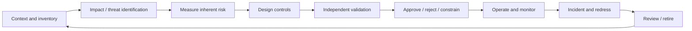

# 治理、法规与社会影响

治理把技术风险转成明确的责任、证据、发布决定和救济机制。它不是一张发布前表格，也不能用“模型卡存在”代替控制有效性。

本章提供工程治理框架，不构成法律意见。法律、监管解释和生效日期依地区、用途与时间变化；具体上线必须由当地法律、隐私、安全和行业专家基于当时官方文本审查。

## 1. 治理对象是系统与用途

同一底层模型用于写诗、客服建议、招聘筛选和医疗分诊，风险完全不同。资产登记至少包含：

- use case、用户和受影响者；
- 模型/provider/revision 与 fallback；
- 输入数据、RAG、memory、日志和跨境流向；
- tool、自动化程度和可产生的外部影响；
- 输出怎样进入决策；
- owner、approver、operator、security/privacy/legal contact；
- 适用地区、行业、用户年龄与合同；
- 评测、监控、incident 和 retirement 状态。

仅登记“使用 GPT/Qwen/Claude”不足以判断风险。

## 2. 风险治理生命周期



每一步都有输入、owner、证据和退出条件。上线不是生命周期终点；模型、数据、流量、法律和供应商都会变化。

## 3. 风险分级

考虑：

- 影响严重度：轻微不便、经济损失、权利/机会、人身安全；
- 发生可能性与攻击者能力；
- 暴露规模和频率；
- 可检测性与可逆性；
- 受影响群体脆弱性；
- 人是否能及时推翻决定；
- 错误是否会反馈到后续数据/决策。

风险矩阵用于排序，不是精确概率模型。把 `likelihood × impact = 12` 写成数字不会消除主观假设；记录 rationale、证据和 uncertainty。

### 3.1 Inherent 与 residual risk

- **Inherent risk**：不考虑控制时的风险；
- **Control**：预防、检测、响应或恢复措施；
- **Residual risk**：考虑经过验证的控制后剩余风险。

只有已经实现并有测试证据的控制才能降低 residual risk。计划中的 classifier、未来审计或文档声明不能算已生效控制。

## 4. 责任与独立性

最低角色：

- product/use-case owner：价值、边界与业务责任；
- model/data engineering：实现、lineage 与技术证据；
- security/privacy/legal：专业审查和阻断权；
- domain expert：定义临床、金融、招聘等真实伤害；
- independent validator/red team：不依赖开发者自评；
- operations/incident owner：监控、响应和恢复；
- appeal/redress owner：处理受影响者纠错。

RACI 表不能替代资源与权限。负责阻止发布的人必须能访问证据、有时间复核，并能在商业压力下真正暂停上线。

## 5. AI/Algorithmic Impact Assessment

影响评估至少回答：

1. 系统做什么、不做什么？
2. 谁使用，谁被决定或间接影响？
3. 不使用 AI 的基线是什么？
4. 输入来自哪里，哪些人没有代表？
5. 错误如何转化为现实伤害？
6. 自动化程度和 human override 是什么？
7. 哪些群体可能承担不成比例的错误？
8. 评测是否覆盖目标分布和最坏切片？
9. 用户怎样知情、纠正、退出和申诉？
10. 如何监控、停止、回滚和退役？

影响评估应在设计早期开始。系统已经部署后才补文档，往往无法改变数据和产品架构。

## 6. 法规映射方法

不要维护一张脱离 use case 的“全球 AI 法律清单”。使用矩阵：

```text
地区 × 用途 × 角色 × 数据类型 × 用户群体 × 自动化程度
```

常见义务类别可能包括：

- 数据保护：合法基础、目的限制、最小化、保留、主体权利、跨境；
- 消费者保护：不得欺骗、不公平或隐瞒重要限制；
- 反歧视与机会：招聘、信贷、教育、住房等差别影响；
- AI 专门规则：风险分类、透明、技术文档、日志、评测、事件报告；
- 行业规则：医疗、金融、通信、工作场所、儿童和关键基础设施；
- 网络安全与产品安全：供应链、漏洞、访问控制和事件；
- 知识产权：训练来源、输出复制、许可、归属和通知。

每条 requirement 记录官方来源、适用理由、版本/日期、owner、技术/流程控制和证据。二手博客可用于导航，不能作为最终法律依据。

## 7. 数据保护与隐私治理

### 7.1 Purpose 与 minimization

先写处理目的，再决定字段。因为“以后可能有用”而永久记录所有 prompt、tool output 和 chain-of-thought，会扩大泄露和权利风险。

数据清单包括：

- 数据主体与敏感类别；
- 收集来源和合法/合同基础；
- 处理目的与禁止的二次用途；
- controller/processor/subprocessor 角色；
- region、storage、encryption 和 access；
- retention/TTL、backup 与 deletion；
- 是否用于 provider/model training；
- export、correction、objection 和 appeal 流程。

### 7.2 删除与衍生物

删除请求要覆盖 raw data、parsed copy、embedding、cache、fine-tuning dataset、replay buffer、日志和 backup policy。已经训练进权重的影响不能通过删数据库行自动消除，应按[持续学习与机器遗忘](../training/continual-learning.md)声明处置和证据边界。

### 7.3 敏感推断

即使输入没有显式敏感属性，模型也可能从文本、位置、行为或 proxy 推断。限制不必要推断，并评估这种推断是否被决策、日志或个性化使用。

## 8. 公平、歧视与可及性

治理问题不是只让各群体平均分相同：

- 任务标签是否本身反映历史偏差；
- 错误代价对群体是否不同；
- 少数语言是否有更高 token 成本和更差服务；
- 无障碍用户能否理解、纠错和申诉；
- 自动化是否剥夺原有人类支持渠道；
- proxy feature 是否产生差别影响。

评测报告群体样本数、置信区间、intersectional slices 和数据缺口。小群体“没有显著差异”可能只是统计功效不足。

高影响决定应提供可理解理由、人工复核和救济；不要把不可验证的模型自我解释当作真实决策因果。

## 9. Human oversight

“人在环中”有效需要：

- 人能看到原始证据和模型不确定性；
- 有足够时间、专业能力和替代方案；
- 不因 KPI/界面默认而盲目接受；
- 有权限拒绝、修改或升级；
- override 被记录并用于发现系统性问题；
- 自动化停机后仍有业务连续性。

若人工每分钟审核数百项、只能点击“同意”，它更像责任转移而非控制。

## 10. 透明度分层

不同受众需要不同信息：

| 受众 | 需要知道 |
| --- | --- |
| 用户 | 正在与 AI 交互、主要限制、数据用途、纠错/退出 |
| 受影响者 | 决策作用、证据、人工复核与申诉 |
| 部署者 | 版本、适用场景、评测、SLO、配置和已知失败 |
| 审计者 | lineage、raw evidence、control tests、变更与 incident |
| 安全团队 | threat model、攻击面、日志和响应权限 |

透明不等于公开 secrets、个人数据或可直接利用的漏洞。应解释限制和权利，而不是倾倒无法理解的参数列表。

## 11. 数据卡、模型卡与系统卡

### 11.1 数据卡

来源、许可、时间、语言/群体、处理、去重、污染、PII、删除和限制。必须链接可验证 manifest，而不是只写“来自公开互联网”。

### 11.2 模型卡

模型 revision、训练目标、数据边界、评测、适用/禁用场景、硬件/精度、已知风险和维护状态。闭源未知项保持 unknown。

### 11.3 系统卡

完整 prompt/RAG/tool/ACL/monitoring 架构、威胁模型、红队、residual risk、human oversight 与 incident plan。模型卡不能替代系统卡，因为应用工具和数据流会创造新风险。

### 11.4 Evidence linkage

文档中的每个重要结论链接：测试 artifact、dataset/model revision、运行日期、owner 和适用范围。截图和精选 demo 不是充分证据。

## 12. 变更管理

需要重新评审的变化包括：

- 模型/provider/alias、tokenizer、quantization；
- system prompt、tool schema、RAG source/index；
- 训练/偏好/评测数据；
- 用户群体、地区、用途和自动化程度；
- safety classifier、threshold 与 policy；
- retention、subprocessor 与网络路径。

每次变更记录 risk delta、回归集、approval 和 rollback。供应商“同名模型”静默升级也属于变更；用固定 probe/replay 检测行为漂移。

## 13. 监控与事件治理

线上监控：

- 质量/事实/拒答与受保护切片；
- 跨租户、权限和工具副作用；
- PII/secret leakage；
- prompt injection/abuse indicators；
- 模型/数据/流量 drift；
- latency、cost、availability；
- appeal、complaint 和人工 override。

定义 threshold、owner、响应时限和 kill switch。仅收集 dashboard 而没有触发动作，不是有效监控。

Incident 记录时间线、影响用户、版本、控制为何失效、containment、notification、reconciliation 和复发预防。安全指标改善不应靠删除失败样本。

## 14. 第三方与采购

对模型 API、数据、embedding、插件和托管商审查：

- 数据用途、保留、训练 opt-out 和 subprocessors；
- region、跨境、encryption 与 access logging；
- model revision、变更通知和 rollback；
- 安全测试、漏洞响应与 incident SLA；
- license、indemnity 与输出条款；
- availability、rate limit、退出与数据可携带；
- 删除证明和合同终止处置；
- 能否提供审计证据而不只是营销承诺。

合同控制需要技术验证：若请求实际被 trace 到另一地区，合同中的 region 选项没有被正确实施。

## 15. 人类劳动

数据标注、内容审核和红队可能暴露于暴力、仇恨、性内容和心理压力。治理包括：

- 知情同意和任务预览；
- 公平报酬、合理配额和休息；
- 暴露限制、心理支持与退出；
- 隐私与身份保护；
- 申诉、错误纠正和不报复；
- 记录 annotator demographics/context，但避免不必要敏感收集；
- 不把高风险判断外包给没有领域支持的低成本劳动。

“人类标注”不是无偏 ground truth；协议和劳动条件会影响标签。

## 16. 环境与资源

### 16.1 能源边界

设备能量粗略为

\[
E_{IT}=\int P_{IT}(t)dt.
\]

数据中心总能耗可能用 PUE 估计：

\[
E_{facility}\approx PUE\cdot E_{IT}.
\]

PUE 是场站级比率，不应机械套到单请求；它也不包含所有硬件制造影响。

### 16.2 碳与水

Carbon estimate 依地点/时间电力因子、location-based 或 market-based 口径、可再生合同和边界。Water 可能包括现场冷却用水和电力供应链用水，数据可得性不同。报告范围、因子来源、时间和 uncertainty，不能用训练 FLOPs 直接声称精确排放。

### 16.3 全生命周期与 rebound

包括训练、实验失败、评测、长期 serving、idle capacity、存储网络、硬件制造和报废。量化/缓存降低单请求成本后，调用量可能上升（rebound/Jevons effect），所以同时报告每请求与总量。

## 17. 信息生态与市场影响

评估：

- 大规模低成本生成是否放大 spam、欺骗和个性化操纵；
- 来源归因和创作者补偿；
- 用户能否辨认自动化和控制个性化；
- 专业判断是否因 automation bias 退化；
- 语言/文化是否被主流数据挤压；
- 算力/数据集中与供应商锁定；
- 开放、互操作、退出和公共研究能力。

这些影响难以用一个 benchmark 表示，需要用户研究、申诉、市场指标和长期监控。

## 18. 发布审批包

最低内容：

1. use-case inventory 与 impact assessment；
2. data/model/system cards 和 immutable revisions；
3. threat model、privacy/data-flow 和 legal applicability matrix；
4. offline quality/safety/fairness/efficiency evidence；
5. control implementation 与独立验证；
6. residual risks、exceptions、owner 和 expiry；
7. rollout、monitoring、incident、redress 和 rollback；
8. third-party due diligence；
9. environmental measurement boundary；
10. approval/rejection record。

Exception 应有范围、补偿控制、owner 和到期复审，不能永久存在。

可直接复制的 use-case inventory、impact assessment、数据卡、模型卡、系统卡、control evidence、供应商尽调、发布决定、exception、incident 和 retirement 字段见[治理工件模板](governance-templates.md)。模板只提供一致结构；每个字段仍需真实 owner、当前 artifact 和独立证据。

## 19. 当前仓库证据边界

仓库已有数据/模型/API 准确性台账、项目成熟度、ACL/审批/评测门禁和 changelog，可作为治理证据的技术组成部分。但没有特定司法辖区的正式法律意见、真实组织责任签署、生产 impact assessment、供应商合同审计或环境实测。因此不能把本仓库通过自动化测试等同于法规合规或治理完成。

## 20. 常见错误结论

- **“底层模型合规，所以所有应用合规”**：用途、数据、工具和自动化程度决定系统义务。
- **“风险矩阵得分低，所以风险客观很低”**：分值依假设与证据，且可能漏掉高影响场景。
- **“有模型卡就实现透明”**：不同受众还需要通知、理由、申诉和可执行权利。
- **“Human review 等于 meaningful oversight”**：审核者必须有能力、时间和 override 权限。
- **“供应商合同承诺就是技术事实”**：需要配置、日志和测试验证。
- **“单请求能耗下降，所以总环境影响下降”**：流量反弹和全生命周期可能抵消。
- **“测试全绿就代表法律合规”**：自动化测试只覆盖明确实现的技术性质。

## 自测与实践

1. 为“写诗”和“筛选求职者”分别做用途、影响与 oversight 对比。
2. 把一个风险拆成 inherent risk、三个控制、控制证据和 residual risk。
3. 设计用户、审计者和安全团队三种不同透明度材料。
4. 为模型 API 供应商写包含 retention、subprocessor、revision 和退出的尽调表。
5. 计算一次训练的 IT energy，并列出为什么不能直接等同精确碳排。
6. 从仓库选择一个技术测试，说明它能支持哪个治理结论、不能支持哪些更广结论。
