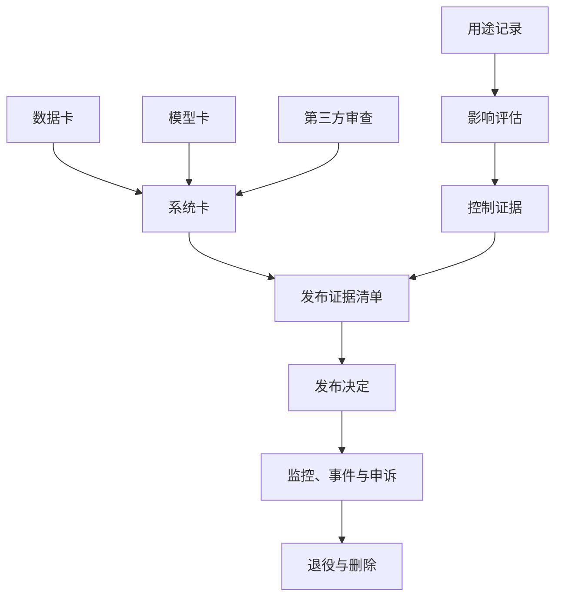

# 治理工件模板：从一个用途走到发布决定

<!-- learning-contract -->
<div class="learning-contract" markdown="1">

**学习导航**

- **适合读者**：需要把治理要求变成可填写、可审阅记录的产品、工程、法务、隐私、安全和治理团队。
- **先修**：先读[一次招聘筛选的治理闭环](governance-impact.md)，理解用途、风险和控制措施怎样关联。
- **首次阅读**：用途记录 → 影响评估 → 控制证据 → 发布决定。其余模板遇到对应问题时再查。
- **完成信号**：能用真实负责人、组件版本和证据填写四份核心记录，并说明还有哪些信息未知。
- **卡住时**：回到招聘案例，先选一项具体风险，不要同时填写整套模板。

</div>

上一页的招聘筛选助手不能靠一份“AI 已评审”表格完成治理。团队先要说明系统被允许做什么，再写出候选人可能怎样受伤，
接着证明保护措施确实生效，最后才有足够信息决定是否发布。

这四步分别留下四份记录：

| 顺序 | 记录 | 它回答的问题 | 交给下一步什么 |
| --- | --- | --- | --- |
| 1 | 用途记录 | 谁用什么系统，影响谁，最多能自动做到哪一步？ | 一个稳定的治理对象 |
| 2 | 影响评估 | 错误怎样变成现实伤害，现有保护还剩什么风险？ | 风险、控制和证据缺口 |
| 3 | 控制证据 | 某项保护措施究竟证明了什么，边界在哪里？ | 可复核的测试结果 |
| 4 | 发布决定 | 现有证据是否足够，上线范围和停止条件是什么？ | 批准、限制、拒绝或补证据 |

其余模板为这条主线补充数据、模型、系统、供应商、例外、事件和退役信息。第一次阅读不必从第一行填到最后一行；
先让四份核心记录围绕同一个用途互相引用，再按风险补充材料。

## 填写前先统一四种说法

模板中会反复出现下面四类信息：

- **负责人（owner）**：能作决定并承担后续动作的具体角色或具名人员，而不是“相关团队”。
- **不可变版本（revision）**：能重新找到同一份模型、数据、Prompt、索引、策略或代码的版本标识。
- **证据（evidence）**：原始测试产物、命令、样本、日期和审阅人，而不只是“已测试”。
- **组件版本关系图（artifact graph）**：说明哪些模型、数据、配置和代码共同组成这次发布。

填写状态也要分开：

| 状态 | 含义 | 正确动作 |
| --- | --- | --- |
| 未知（unknown） | 团队目前不知道答案 | 指定调查负责人和期限 |
| 不适用（not applicable） | 经过判断，该字段与当前用途无关 | 写明理由和审阅人 |
| 尚未实现（not yet implemented） | 这项措施当前不存在 | 不能把它计入风险降低 |
| 已实现但未验证 | 代码或流程已经存在，效果仍缺证据 | 完成独立测试后再进入发布判断 |

所有数字都应带上数据版本、运行日期和适用范围。例外要有到期时间；模板本身也要版本化，并与系统组件的变更记录一起保存。

## 核心记录一：用途记录

用途记录是后续治理材料共同引用的主键。它需要把“招聘助手”缩小成可以判断是否越界的承诺。

```markdown
# AI 用途记录（AI Use-Case Record）

- 记录 ID / 模板版本：
- 系统名称 / 主负责人 / 备份负责人：
- 业务目的 / 不使用 AI 时的基线流程：
- 直接用户 / 受影响者 / 需要特别保护的群体：
- 部署地区 / 语言 / 行业 / 年龄范围：
- 模型供应商 / 不可变版本 / 备用模型：
- Prompt / RAG / memory / 工具 / 策略版本：
- 输入与输出数据类别：
- 可能产生的外部动作 / 最大自动化程度：
- 人工复核 / 覆盖 / 申诉路径：
- 明确禁止的用途：
- 部署状态 / 流量范围 / 开始日期：
- 复审周期 / 下次复审 / 退役触发条件：
```

招聘案例不能只写“提高招聘效率”。更可审阅的目的应说明：系统只帮助招聘人员定位与既定岗位准则相关的简历证据；
拒绝决定由具名人员完成；系统不得推断与岗位无关的健康或家庭信息。

如果团队把它改成自动排序，或者换到另一个岗位，原用途记录已经发生变化。后续影响评估和批准范围也要一起复审。

## 核心记录二：影响评估

影响评估把抽象风险写成一条现实中的因果链。招聘案例可以从“解析器漏掉技能”一直追到“合格候选人失去机会”。

```markdown
# AI 影响评估（AI Impact Assessment）

## 背景
- 评估 ID / 版本 / 日期：
- 关联的用途记录 / 本次评估覆盖的组件版本关系图：
- 评估人 / 独立审阅人 / 决策人：
- 允许用途 / 禁止用途 / 不使用 AI 时的基线：
- 直接用户与受影响者：

## 数据与系统流
- 数据来源 / 处理依据 / 处理目的 / 涉及地区：
- RAG / memory / 日志 / 供应商 / 下游处理方：
- 工具 / 外部副作用 / 人工交接 / 删除传播：
- 数据流图 / 威胁模型 / 隐私审查链接：

## 影响场景
| 编号 | 受影响的人或群体 | 触发条件 | 现实伤害 | 严重度 | 发生依据 | 可发现性与可逆性 | 证据 |
| --- | --- | --- | --- | --- | --- | --- | --- |

## 控制措施
| 风险编号 | 控制措施 | 预防 / 发现 / 响应 / 恢复 | 是否实现 | 负责人 | 测试产物 | 最近结果 | 已知边界 |
| --- | --- | --- | --- | --- | --- | --- | --- |

## 剩余风险与决定建议
- 经过验证后仍存在的风险和未知项：
- 群体差异 / 数据缺口：
- 人工监督与申诉是否真正有效：
- 监控阈值 / 停止开关 / 事件负责人：
- 建议决定 / 限制 / 到期时间 / 签署人：
```

严重度和发生可能性可以用等级排序，但要保留评分依据。`4 × 3 = 12` 只是团队在一组假设下的排序结果，
不是客观概率。少数灾难性风险也应单独审查，不能被大量轻微样本平均掉。

控制措施表中的“是否实现”要诚实。计划中的公平分类器、未来的人工抽检或 Prompt 里的自我约束，都不能当作已经生效的保护。

## 核心记录三：控制证据

控制证据记录不重复整份影响评估。它只回答一件事：某项保护措施在什么条件下，通过什么方法，证明了哪条有限性质。

```markdown
# 控制证据记录（Control Evidence Record）

- 控制编号 / 关联风险编号 / 负责人：
- 本次要证明的性质：
- 实现版本 / 配置：
- 测试方法 / 正常样例 / 边界与失败样例：
- 环境 / 模型 / 数据 / 运行时间：
- 原始产物 / 复现命令 / 审阅人：
- 结果 / 样本量 / 不确定性：
- 已发现的失败：
- 本次证据没有覆盖的范围：
- 重新测试的触发条件 / 证据到期时间：
```

好的结论应当窄而可证。例如：

> 在固定的 200 个跨租户检索负例上，指定版本的检索层没有返回调用者无权访问的片段。

它没有证明所有输入、所有版本或整个 RAG 系统永远不会泄露。样本清单、权限策略版本和运行命令都应链接到记录里，
这样其他审阅者才能复现同一判断。

招聘案例中的“人工复核”也需要证据。权限测试只能证明系统要求存在 `reviewer_id`；真实界面观察和覆盖日志，
才能进一步说明招聘人员是否看到了原始证据、是否有时间和权限改变建议。

## 核心记录四：发布决定

发布决定汇总已有证据和缺口，并把批准范围变成系统能够执行的限制。

```markdown
# 发布决定（Release Decision）

- 决定 ID / 发布候选版本 / 会议日期：
- 决定：approve | approve-with-constraints | reject | request-evidence
- 决策人 / 独立审阅人 / 利益冲突：
- 已审阅的证据 / 仍然缺少的证据：
- 硬性门禁 / 关键群体切片 / 失败项：
- 由谁接受哪些剩余风险 / 接受理由：
- 上线限制 / 流量 / 用户 / 地区 / 到期时间：
- 监控阈值 / 负责人 / 响应时限：
- 回滚触发条件 / 已测试的回滚产物：
- 不同意见 / 开放例外 / 下次复审：
- 签署或组织认可的证明方式：
```

四种机器可读的决定值分别表示批准、限制条件下批准、拒绝和要求补充证据。限制条件下批准不能只写在会议纪要里；
路由、访问控制、功能开关或合同机制要真正限制岗位、地区、用户和流量。

以招聘案例为例，团队可以只批准影子运行：系统记录建议，但招聘人员看不到，也不会影响真实决定。等群体切片、界面复核和
申诉演练补齐后，再提交下一份发布决定。

## 按需模板一：数据卡

数据卡描述一份数据从哪里来、经过什么处理、覆盖谁以及怎样删除。它既适用于训练数据，也适用于评测集和 RAG 语料。

```markdown
# 数据卡（Data Card）

- 数据集 ID / 不可变快照 / 负责人：
- 使用目的 / 禁止的二次用途：
- 来源 / 收集日期 / 许可 / 同意情况：
- 语言 / 地区 / 人群 / 已知缺失：
- 样本单位 / Schema / 标签 / 标注协议：
- 原始量 / 规范化后数量 / 去重后数量 / 实际消费 token：
- 解析 / 过滤 / 精确与近似去重方法：
- 个人信息与敏感数据处理 / 访问权限：
- 训练、验证、测试拆分 / 实体与时间泄漏检查：
- Benchmark 污染检查 / 覆盖范围：
- 保留 / 更正 / 撤回 / 删除传播：
- 质量切片 / 不确定性 / 已知限制：
- 处理代码 / 报告产物：
```

“来自公开互联网”只描述了访问来源。许可、隐私、代表性和能否再发布仍需分别判断。闭源来源或未知许可应如实记录未知，
不能从“可以抓取”推出“可以训练”。

## 按需模板二：模型卡

模型卡描述模型组件本身。供应商没有披露的训练数据、参数量或内部架构保持未知。

```markdown
# 模型卡（Model Card）

- 模型 ID / 不可变版本 / tokenizer / chat template：
- 供应商 / 许可 / 维护状态：
- 架构与参数：已知 / 已披露 / 未知：
- 训练目标与数据边界：已知 / 未知：
- 精度 / 量化 / Runtime / 目标硬件：
- 适用用途 / 禁止用途：
- 评测数据 / Prompt / 日期 / 关键切片：
- 质量 / 安全 / 鲁棒性 / 效率结果：
- 统计不确定性 / 污染风险：
- 已知失败 / 不支持的语言或长度：
- 系统必须提供的控制与人工监督：
- 变更通知 / 回滚 / 生命周期终点：
```

产品表现只能说明那次输入输出行为。它不足以反推出供应商没有公开的训练数据或内部结构。

## 按需模板三：系统卡

系统卡把模型放回完整应用。招聘助手新增的解析器、检索、权限、界面和人工流程，都应在这里出现。

```markdown
# 系统卡（System Card）

- 系统 / 发布版本 / 负责人 / 日期：
- 完整组件版本关系图 / 兼容性清单：
- 用户旅程 / 不使用 AI 时的备用流程：
- 身份 / 租户 / 访问控制 / 网络信任边界：
- Prompt / 检索 / memory / 工具 / 执行器架构：
- 数据流 / 保留 / 供应商 / 下游处理方：
- 威胁模型 / 滥用场景：
- 离线质量 / 安全 / 公平 / 效率证据：
- Agent 外部副作用 / 对账证据：
- 人工监督 / 可及性 / 申诉与补救：
- 监控 / 漂移 / 事件 / 回滚：
- 剩余风险 / 限制 / 不支持的场景：
```

模型卡描述一个组件，系统卡描述用途和完整决定链。底层模型卡覆盖不到应用新增的 RAG 权限、memory、工具和界面风险。

## 按需模板四：第三方审查

对模型 API、数据、工具或托管服务的审查，要把合同承诺和技术证据分开记录。

```markdown
# 第三方 AI、数据或工具审查（Third-Party Review）

- 供应商 / 服务 / 内部负责人 / 合同版本：
- 服务角色 / 替代方案 / 退出计划：
- 数据类别 / 处理目的 / 是否退出供应商训练：
- 保留 / 删除 / 地区 / 下游处理方：
- 加密 / 访问日志 / 租户隔离：
- 模型或 API 版本 / 变更通知 / 弃用安排：
- 安全测试 / 漏洞与事件响应时限：
- 可用性 / 限流 / 配额 / 数据可携带性：
- 许可 / 知识产权 / 责任 / 受限用途：
- 已收到的证据 / 已独立验证的部分：
- 缺口 / 补偿措施 / 审批到期时间：
```

如果合同承诺请求留在指定地区，配置、调用日志、测试或可信独立报告还要确认真实路由。保留期、训练退出和删除也是同理。

## 按需模板五：发布证据清单

发布证据清单把一次发布实际使用的组件和评测产物绑定起来。它是发布决定的输入，不是批准本身。

```markdown
# 发布证据清单（Release Evidence Manifest）

- 清单 ID / 发布候选 / 基线版本 / 日期：
- 模型 / tokenizer / template 版本：
- Prompt / 数据 / 索引 / 检索器 / 工具 / 策略版本：
- Runtime / 镜像 / 硬件 / 生成配置：
- 评测样例与切片清单：
- 原始输出 / 指标 / 配对统计：
- 安全不变量 / 红队产物：
- 性能 workload / 延迟 / 容量 / 成本：
- 隐私 / 法律 / 可及性 / 领域审查：
- 开放例外 / 剩余风险：
- 上线计划 / 保护措施 / 停止开关 / 回滚包：
- 清单指纹 / 明确排除的外部状态：
```

指纹只能绑定清单中明确序列化的字节。它不会自动证明清单完整、语义等价、来源可信，也无法让远程模型输出必然重放。

## 生命周期模板一：例外记录

当团队暂时无法满足一项要求时，用例外记录说明范围、补偿措施和到期动作。

```markdown
# 例外记录（Exception Record）

- 例外 ID / 申请人 / 日期：
- 暂时放弃的要求或控制：
- 适用范围 / 业务理由：
- 受影响者 / 最坏伤害：
- 常规控制当前不可行的证据：
- 补偿措施 / 对应测试：
- 剩余风险负责人 / 批准人：
- 开始时间 / 到期时间 / 提前复审触发条件：
- 到期后自动执行的限制：
- 关闭例外所需证据：
```

例外没有到期时间，就会悄悄变成长期未治理风险。到期时应阻止继续发布或进入正式复审流程，而不是只发送一封无人处理的提醒。

## 生命周期模板二：事件记录

事件记录要重建完整因果链和控制失效。把根因写成“模型幻觉”会过早停止调查。

```markdown
# AI 事件记录（AI Incident Record）

- 事件 ID / 严重度 / 状态 / 负责人：
- 发现时间 / 可能发生区间 / 报告人：
- 受影响版本 / 租户 / 用户 / 地区 / 数据：
- 用户可见伤害 / 尚不确定的范围：
- 带原始证据链接的时间线：
- 遏制措施 / 已关闭功能 / 凭据处置：
- 外部副作用与对账：
- 用户、法律与合同通知决定：
- 根因 / 促成因素：
- 预防、发现、响应控制为什么失效：
- 修复动作 / 负责人 / 截止时间 / 验证测试：
- 用户补救 / 申诉 / 纠正：
- 恢复验证 / 复发监控：
- 独立复核人 / 关闭决定：
```

根因分析要继续追问：数据、接口、权限、界面、监控和组织流程为什么允许错误变成现实伤害。修复完成后，还要由独立审阅人
判断是否恢复流量。

## 生命周期模板三：退役与删除记录

退役要同时关闭流量、凭据、数据副本、后台任务和申诉路径。

```markdown
# 退役与删除记录（Retirement / Deletion Record）

- 系统 / 发布版本 / 负责人 / 生效日期：
- 退役原因 / 替代方案 / 用户通知：
- 流量关闭 / 凭据撤销：
- 原始数据 / 解析数据 / embedding / cache / memory：
- 微调数据 / 回放数据 / 日志 / backup：
- 供应商删除请求 / 完成证据：
- 依法保留 / 延迟删除的范围与到期时间：
- 模型权重 / adapter / 其他工件的处置：
- 数据导出 / 可携带性 / 未完成申诉：
- 残留端点 / 定时任务 / 依赖检查：
- 独立关闭验证：
```

删除数据库中的主记录只是起点。向量、缓存、备份、微调数据和第三方副本都有各自的传播路径与完成证据。

## 这些记录怎样连接起来



最小发布包的目标不是让所有字段都有文字，而是让每项适用风险都能找到负责人、已经实现的控制、有效证据、剩余风险决定
和可执行的监控与回滚。标记为不适用的字段，要附上理由和审阅人。

## 本页能够提供到哪里

这些模板提供统一字段和证据链接方式，可以帮助团队建立一致记录。它们仍需要真实组织补上系统数据、负责人签署、
适用地区法律审查、供应商合同、生产影响评估和事件材料。

本仓库没有这些外部材料，因此只能验证模板结构和仓库内示例。认证、审计与法规合规结论必须由对应组织基于当前事实作出。

## 自测与实践

1. 为多租户 RAG 写一条“越权片段进入生成上下文”的影响场景，再为检索层控制填写一份证据记录。
2. 把“Prompt 中要求模型不要泄露”作为控制措施，说明它缺少什么独立证据，为什么不足以降低剩余风险。
3. 为模型别名静默升级填写发布证据清单，列出需要重跑的评测和回滚触发条件。
4. 为“工具已经执行成功，但响应在返回途中丢失”填写事件时间线和外部副作用对账。
5. 为一次用户删除请求列出原文、向量、memory、日志、备份和供应商副本的负责人及完成证据。
