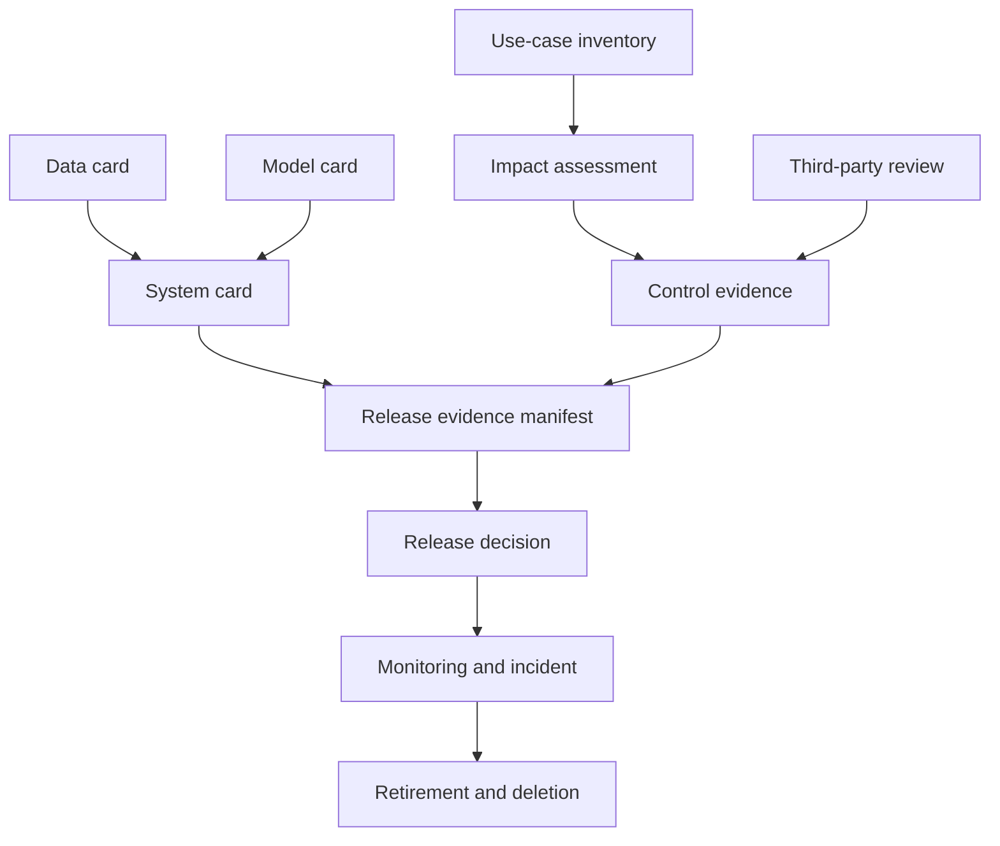

# 治理工件模板

这些模板把治理原则变成可审阅的记录。它们是工程起点，不构成法律意见，也不会因为“填完表格”自动产生合规性。具体字段、签署角色、保留期和监管报告必须由适用地区、行业和组织制度确定。

使用原则：

- unknown、not applicable 和 not yet implemented 分开；
- 每个控制链接实现与测试证据，计划中的控制不降低 residual risk；
- 每个数字记录版本、数据、日期、owner 和适用范围；
- exception 有范围、补偿控制、owner 和 expiry；
- 决策可以是 approve、approve with constraints、reject 或 request evidence；
- 模板本身版本化，修改历史与系统 artifact graph 一起保存。

## 1. AI use-case inventory

```markdown
# AI Use-Case Record

- Record ID / template version:
- System name / owner / backup owner:
- Business purpose and non-AI baseline:
- Users / affected persons / vulnerable groups:
- Regions / languages / industry / age groups:
- Model provider / immutable revision / fallback:
- Prompt / RAG / memory / tool / policy revisions:
- Input and output data classes:
- External actions and maximum automation:
- Human review / override / appeal path:
- Deployment state / traffic / start date:
- Review cadence / next review / retirement trigger:
```

Inventory 是后续评估的主键；只写“内部聊天机器人”不足以判断数据、用途和影响。

## 2. AI impact assessment

```markdown
# AI Impact Assessment

## Context
- Assessment ID / version / date:
- Use-case record / assessed artifact graph:
- Assessors / independent reviewers / approvers:
- Intended purpose / prohibited uses / non-AI baseline:
- Users and affected persons:

## Data and system flow
- Data sources, legal/contract basis, purpose and regions:
- RAG, memory, logs, providers and subprocessors:
- Tools, side effects, human handoff and deletion propagation:
- Diagram / threat model / privacy review links:

## Impact scenarios
| ID | Person/group | Trigger | Harm | Severity | Likelihood rationale | Detectability/reversibility | Evidence |
|---|---|---|---|---|---|---|---|

## Controls
| Risk ID | Control | Prevent/detect/respond/recover | Implemented? | Owner | Test artifact | Last result | Limit |
|---|---|---|---|---|---|---|---|

## Residual risk and decision
- Residual risks and uncertainty:
- Disproportionate group impacts / data gaps:
- Human oversight and redress effectiveness:
- Monitoring thresholds / kill switch / incident owner:
- Decision / constraints / expiry / signatures:
```

Likelihood 和 severity 可用分级，但必须保留 rationale。一个 `4 × 3 = 12` 的分数不是客观概率，也不能让单例灾难性风险被平均掉。

## 3. Data card

```markdown
# Data Card

- Dataset ID / immutable snapshot / owner:
- Purpose and prohibited secondary uses:
- Sources / collection dates / licenses / consent:
- Languages / regions / populations / known exclusions:
- Units, schema, labels and annotator protocol:
- Raw, normalized, deduplicated and consumed token counts:
- Parsing / filtering / exact and near dedup:
- PII/sensitive data handling and access:
- Train/dev/test split and entity/time leakage checks:
- Benchmark contamination checks and coverage:
- Retention / correction / withdrawal / deletion lineage:
- Quality slices / uncertainty / known limitations:
- Processing code and report artifacts:
```

“公开数据”不是许可、隐私或质量结论。抓取可访问也不自动意味着允许训练或再发布。

## 4. Model card

```markdown
# Model Card

- Model ID / immutable revision / tokenizer / template:
- Provider / license / maintenance state:
- Architecture and parameters: known / disclosed / unknown:
- Training objective and data boundary: known / unknown:
- Precision / quantization / runtime / target hardware:
- Intended and prohibited uses:
- Evaluation datasets / prompts / dates / slices:
- Quality, safety, robustness and efficiency results:
- Statistical uncertainty and contamination risks:
- Known failures / unsupported languages or lengths:
- Required system controls and human oversight:
- Change notification / rollback / end-of-life:
```

闭源模型未披露项保持 unknown。不要从产品表现反推训练数据、参数量或内部架构。

## 5. System card

```markdown
# System Card

- System / release / owner / date:
- Complete artifact graph and compatibility manifest:
- User journey and non-AI fallback:
- Identity / tenant / ACL / network trust boundaries:
- Prompt / retrieval / memory / tool / executor architecture:
- Data flow / retention / provider and subprocessor:
- Threat model and abuse cases:
- Offline quality / safety / fairness / efficiency evidence:
- Agent side-effect and reconciliation evidence:
- Human oversight / accessibility / redress:
- Monitoring / drift / incident / rollback:
- Residual risks / restrictions / unsupported cases:
```

模型卡描述组件，系统卡描述用途与完整链路。底层模型卡不能覆盖应用新增的 RAG 权限、memory、tool 或 UI 风险。

## 6. Control evidence record

```markdown
# Control Evidence Record

- Control ID / risk IDs / owner:
- Property claimed:
- Implementation revision / configuration:
- Test method / cases / negative cases:
- Environment / model / data / time:
- Raw artifact / command / reviewer:
- Result / sample size / uncertainty:
- Failure and scope not covered:
- Re-test trigger / expiry:
```

Property claim 要窄而可证。例如“在 200 个固定跨租户负例上，检索层未返回无权 chunk”比“系统不会泄露”可审计。测试绿色只支持它实际覆盖的性质。

## 7. Third-party due diligence

```markdown
# Third-Party AI/Data/Tool Review

- Vendor / service / owner / contract version:
- Service role and alternatives / exit plan:
- Data categories / purpose / training opt-out:
- Retention / deletion / regions / subprocessors:
- Encryption / access / tenant isolation / logs:
- Model or API versioning / change notice / deprecation:
- Security testing / vulnerability and incident SLA:
- Availability / rate limits / quotas / portability:
- Licenses / IP / indemnity / restricted uses:
- Evidence received and independently verified:
- Gaps / compensating controls / approval expiry:
```

合同承诺与技术事实分开记录。Region、retention 或 opt-out 需要配置、日志、测试或独立报告支持。

## 8. Release evidence manifest

```markdown
# Release Evidence Manifest

- Release ID / candidate / baseline / date:
- Model-tokenizer-template revisions:
- Prompt / data / index / retriever / tool / policy revisions:
- Runtime / image / hardware / generation config:
- Evaluation case and slice manifests:
- Raw outputs / metrics / paired statistics:
- Safety invariants and red-team artifacts:
- Performance workload / latency / capacity / cost:
- Privacy / legal / accessibility / domain reviews:
- Open exceptions and residual risks:
- Rollout / guardrails / kill switch / rollback bundle:
- Artifact fingerprint and explicitly omitted external state:
```

Fingerprint 只证明 manifest 中显式 canonical bytes 的身份，不证明清单完整、语义等价、来源可信或远程输出可重放。

## 9. Release decision record

```markdown
# Release Decision

- Decision ID / release / meeting date:
- Decision: approve | approve-with-constraints | reject | request-evidence
- Decision makers / independent reviewer / conflicts:
- Evidence reviewed and missing:
- Guardrail results / protected slices / hard failures:
- Residual risks accepted by whom and why:
- Constraints / traffic / users / regions / expiry:
- Monitoring thresholds / owner / response time:
- Rollback trigger and tested rollback artifact:
- Dissent / exception / next review:
- Signatures or organization-approved attestation:
```

“Approve with constraints”必须能由路由、ACL、feature flag 或合同机制执行，而不只是文档中的一句话。

## 10. Exception record

```markdown
# Exception

- Exception ID / requested by / date:
- Requirement or control waived:
- Scope and business rationale:
- Affected persons and worst-case harm:
- Evidence why normal control is infeasible:
- Compensating controls and tests:
- Residual risk owner / approver:
- Start / expiry / review trigger:
- Automatic enforcement at expiry:
- Closure evidence:
```

没有 expiry 的 exception 会变成永久性未治理风险。到期应自动阻止继续发布或触发正式复审，而不是只发无人处理的提醒。

## 11. Incident record

```markdown
# AI Incident Record

- Incident ID / severity / status / commander:
- Detection time / occurrence window / reporter:
- Affected releases, tenants, users, regions and data:
- User-visible harm and uncertain scope:
- Timeline with source-linked evidence:
- Containment / disabled features / credential actions:
- External side-effect reconciliation:
- Notification / legal / contractual decisions:
- Root and contributing causes:
- Why prevention/detection/response controls failed:
- Corrective actions / owners / due dates / tests:
- User remediation / appeal / redress:
- Recovery verification / recurrence monitoring:
- Post-incident reviewer / closure decision:
```

不要把模型“幻觉”当 root cause；继续追到数据、接口、验证、权限、UI、监控、组织和响应为什么允许伤害发生。

## 12. Retirement and deletion record

```markdown
# Retirement / Deletion Record

- System / release / owner / effective date:
- Reason and replacement / user communication:
- Traffic disabled and credentials revoked:
- Raw data / parsed data / embeddings / cache / memory:
- Fine-tuning data / replay / logs / backups:
- Provider deletion request and evidence:
- Legal hold / delayed deletion scope and expiry:
- Model weights / adapters / artifacts disposition:
- Export / portability / appeals preserved:
- Residual endpoints, scheduled jobs and dependencies checked:
- Independent closure verification:
```

删数据库一行不等于完成删除。每个衍生物、cache、backup 和第三方都有独立传播与证据边界。

## 13. 工件关系与最小发布包



最低发布包不是“所有表都非空”，而是每个适用风险有 owner、实现控制、有效证据、residual risk 决定和可执行的监控/回滚。Not applicable 必须给理由和 reviewer。

## 14. 当前仓库证据边界

本页提供可复制的字段与证据链接结构，能帮助项目建立一致记录。仓库没有任何真实组织签署、特定司法辖区法律审查、供应商合同、生产 impact assessment 或 incident。因此模板存在不等于治理完成，也不能作为认证、审计通过或法规合规证明。

## 自测与实践

1. 为多租户 RAG 填一条 impact scenario 和对应 control evidence。
2. 把“Prompt 中要求不要泄露”放入 control 表，解释为什么它不能单独降低 residual risk。
3. 为模型 alias 静默升级写 release manifest 和 rollback trigger。
4. 为工具执行成功但响应丢失写 incident timeline 与 reconciliation。
5. 为用户删除请求列出 raw、embedding、memory、日志、backup 和 provider 证据。
