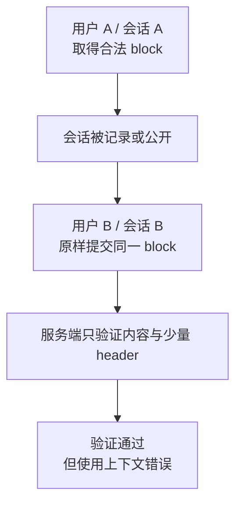

# 看不见的 Reasoning Block

<!-- learning-contract -->
<div class="learning-contract" markdown="1">

**学习导航**

- **适合读者**：使用云 API、开发 Agent runtime，或需要保存和公开会话记录的工程师。
- **先修**：[云 API 契约](../models/cloud-api-contracts.md)、[Agent runtime](../applications/agent-runtime.md)与基本认证加密概念。
- **首次阅读**：导出会话 → 识别 opaque block → 分析一次错误重放 → 绑定使用上下文 → 安全发布。
- **完成信号**：能解释为什么“密文验证成功”不等于“当前用户有权使用”，并通过[实验 0D](../practice/labs/lab-0d-reasoning-artifact-security.md)。
- **卡住时**：先只画四个对象：可见文字、看不见的 block、当前请求的可信身份、准备公开的会话副本。

</div>

**相关导航**：[安全总览](safety.md) · [治理](governance-impact.md) ·
[Cloud API 项目](../practice/projects/cloud-api-contracts.md) · [生产检查表](../practice/production-checklist.md)
{ .doc-nav }

## 从一次会话导出开始

一位工程师正在排查 Agent bug。他准备把会话记录贴到公开 issue，于是先替换了可见文字中的姓名和邮箱。
导出的响应大致还有两类内容：

```text
assistant response
├── text: "我会先检查订单状态……"
└── encrypted_reasoning: <客户端无法阅读的一段数据>
```

第二项就是本章关注的 **opaque reasoning block**：客户端能保存并在后续请求中原样带回，但通常无法解释其内部内容。
不同供应商的字段名和协议语义并不相同；上面的名字只用于说明对象边界。

工程师不能因为“自己看不见”就把它当成无害元数据。它可能包含用户内容、模型状态或中间推理，也可能影响后续生成和
工具选择。只要供应商仍会处理它，保存、转发和重放就都是有权限边界的操作。

Adapter 按 block 类型解析响应以后，这份会话有两种去向：

- **继续原会话**：只在供应商协议允许的用户、会话和模型中回传原 block。
- **准备公开副本**：新建一个只含允许字段的对象，移除 opaque 和未知 block，再扫描可见内容中的秘密与个人信息。

本章会跟着同一个 block 走完这两条路径：先看它为什么可能被拿到错误上下文重放，再看公开会话时为什么应该默认移除它。

## “安全”其实是四个不同问题

面对一段看不懂的数据，先不要笼统地问“它是否安全”。把问题拆开：

| 属性 | 通俗问题 | 在本例中仍可能出现的误判 |
|---|---|---|
| 保密性（confidentiality） | 没有解密能力的人能直接读到内容吗？ | base64、签名或乱码不等于加密 |
| 完整性（integrity） | 内容或已绑定的元数据被修改后能发现吗？ | 验证通过不代表使用位置正确 |
| 来源（provenance） | 谁在何时、通过哪个模型和 API 生成了它？ | 普通 hash 和客户端自报的 model id 不能认证来源 |
| 使用授权（authorization） | 当前用户、租户、会话和模型能使用它吗？ | 服务端能解密不代表当前请求有权重放 |

密码学只能保护协议实际绑定的内容。假如用户、会话和允许使用的模型没有被绑定，密文保持完整也无法替这些信息提供授权。

## 一个已经修复的历史案例

Panfilov 等人的[论文](https://arxiv.org/abs/2608.09867)于 2026 年 8 月 10 日提交。作者测试了 2026 年 7 月初
可访问的 Anthropic、OpenAI 和 Google 推理 API。

论文报告，某些客户端收到的 opaque block 可以跨会话、跨用户或跨兼容模型使用。研究中的一种方法把较强模型产生的
block 交给兼容模型，再诱导后者输出可能来自该 block 的内容。

论文讨论了两种风险：

1. 调用者拿自己获得的 block 做模型蒸馏，或尝试恢复最终回答没有显示的内容。
2. 第三方从公开的 Agent 会话中取得别人的 block，用它恢复隐私数据，或把隐藏指令带回后续工作流。

公开会话扫描给出了以下结果：

| 论文报告的数量 | 含义 |
|---|---|
| 6,708 条会话、315,320 个重建 block | 本次非穷尽扫描处理的数据规模 |
| 1,028 个 block（0.3%） | 经第二阶段分类后，至少含一个真实隐私条目的 block |
| 328 条会话（4.9%） | 至少含一个上述 block 的会话 |
| 704 个去重隐私条目 | 排除 benchmark 后得到的条目 |
| 其中 64 个只在 reasoning 中出现 | 解析后的可见会话里没有这些条目 |

这些数字经过两阶段 LLM 标注、去重和人工分类。它们描述的是一批公开数据，不能当成所有 Agent 日志的总体泄露率。

论文作者在发布前向相关供应商、Microsoft 和 Hugging Face 披露了问题。论文的可复现性声明写明：截至 2026 年
8 月，供应商采取缓解措施后，原攻击流程已经无法复现。

因此，本章只把它当作历史架构案例。这里不判断当前端点是否存在同类漏洞，也不会提供针对真实供应商的提取脚本。

论文用恢复 token 数、API 报告的 thinking token 数和定性样例判断恢复效果。由于缺少逐 token 的真实明文对照，
这些证据无法确认恢复内容与模型内部轨迹完全相同。

附录中的开放模型蒸馏迹象属于相关性观察，没有建立因果关系。

## 跟着同一个 block 看一次错误重放

先看一个简化的弱协议。它使用认证加密（AEAD），但只把供应商、格式和密钥编号放进认证上下文：

```text
AEAD(key, nonce, reasoning, AAD={provider, format, key_id})
```

攻击者保持密文不变，只把原 block 放进另一个请求。服务端仍然能验证密文以及 `provider`、`format` 和 `key_id`。
这些验证结果没有覆盖下面的问题：

- 当前登录用户是不是原用户？
- 是否仍在原租户、会话和分支中？
- 这个 block 前面是不是正确的上一条消息？
- 当前模型是否属于允许的模型集合？
- block 是否过期、被撤销或已经使用过？

验证成功只说明那几个已认证字段正确。它没有证明当前请求有权使用这段数据。合法 block 因而可能像 bearer token 一样，
谁拿到，谁就能把它提交给仍然接受它的端点。



这也是为什么只清理可见文字不够：脱敏程序既看不到 block 内部，也无法判断共享会话中是否藏着会影响后续行为的内容。

## 修复：把“谁在什么地方使用”也纳入协议

一种做法是把使用范围写进 AEAD 的 associated data（AAD，参与认证但不需要加密的数据）。另一种做法是让服务端保存
等价状态。无论选择哪一种，当前请求都必须与签发时的可信上下文匹配。

一个较完整的认证上下文可以包含：

```text
schema version + provider + key id + artifact id
authenticated subject + tenant
session + branch + predecessor digest
allowed model audience
issued at + expires at
```

这些值有两个来源，不能混在一起：

| 信息 | 应从哪里取得 |
|---|---|
| 当前用户和租户 | 已认证的 gateway / IAM 上下文 |
| 当前会话、分支和上一条消息 | 服务端会话状态 |
| 允许的模型、密钥状态 | provider 的控制面 |
| block 自己声明的签发范围 | 经过认证的 claims |

消费 block 时，服务端先验证密文和 claims 没有被改，再把 claims 与当前可信上下文逐项比较。不能让 Prompt、普通
request body 或共享会话自报“我就是原用户”。

### 认证上下文仍不能阻止同位置重复使用

假设同一个 block 在完全相同的用户、会话和模型中连续提交两次。两次的密码学验证都会成功。若协议要求一次性消费，
服务端还要记录 `(key_id, artifact_id)` 已经使用过，并在第二次提交时拒绝。

这张“已消费清单”需要明确保存范围和故障语义。单进程 `set`、有过期时间的 cache 和 Bloom filter 都可能在重启、
多副本或误判时产生不同结果，不能直接当成持久、多区域的重放保护。

### 加密 nonce 是另一回事

AES-GCM 等 AEAD 还要求同一密钥下的 nonce 不重复。生产系统通常用密码学安全随机数生成器（CSPRNG）产生 nonce，
并按实际规模设计唯一性控制。

不要把两本账混为一谈：nonce 账本防止签发时重复使用加密 nonce；消费账本防止同一业务 block 被再次使用。
二者都不能替代用户和会话授权。

### 会话分叉和历史压缩需要显式规则

把 block 绑定到完整会话最容易理解，但会阻止正常的历史压缩、分支和模型切换。真实协议需要明确回答：

- 新分支能否继承分叉点之前的 block？
- 压缩历史后，哪些 block 仍然有效？
- 切换模型时，是在原 `model audience` 内继续使用，还是重新签发？
- 协议保证完整连续的历史，还是只保证保留下来的片段顺序？
- 旧格式什么时候停止接受？

论文建议使用 session 与 predecessor chain，并讨论在压缩后保留 Merkle root。具体系统可以采用其他方案，但不能把
顺序和继承规则留给模型猜测。

## 公开会话时，不要修改原始响应再直接发布

Provider adapter 应先保留 block 的类型，不要一开始就把整个响应压成字符串。至少区分：

- 可见文字；
- 工具调用与结果；
- 引用和媒体；
- reasoning summary；
- opaque reasoning 或 signature block；
- 当前 adapter 不认识的供应商字段。

准备公开副本时，从空对象开始，只复制允许发布的字段。这比“先复制原始 JSON，再用正则擦掉已知敏感文字”更可靠：

1. 按发布 schema 新建会话对象，不直接复用供应商响应。
2. 默认不复制 reasoning、thinking、signature 和未知 block。
3. 分别扫描可见 Prompt、工具参数与结果、回答、引用和 metadata 中的 secret 与个人信息。
4. 审计报告只记录位置、类别和不可逆 fingerprint，不抄录命中的秘密。
5. 为公开副本记录用途、访问级别、用户同意、保留时间和删除负责人。
6. 只有字段检查、内容扫描和人工或策略审批都通过，才能发布。

仓库提供的 `trajectory-release-gate` 只负责第一道字段检查。它验证一份**已经重新构造好的发布对象**，不是原始供应商
响应的自动脱敏器。

~~~powershell
python -m about_llm.integrations.cloud_api_cli trajectory-release-gate `
  --input projects/cloud-api-contracts/trajectory-release.example.json `
  --output artifacts/cloud-api/trajectory-release-report.json
~~~

输入只能包含预定的会话、轮次和 block 字段。允许的 block 类型是 `text`、`tool_call`、`tool_result` 和 `citation`。
如果出现以下情况，命令会以退出码 1 停止发布：

- 出现 reasoning、thinking、signature 或 encrypted 类型；
- 工具参数中嵌套同类字段；
- 出现未知 block；
- 缺少必需字段、增加未知字段或 JSON 结构不符合约定。

报告只写数组位置和固定的拒绝类别，不回显文本、工具参数或未知字段名。安全样例应得到：

```text
passed: true
opaque_reasoning_block_count: 0
unknown_block_count: 0
secret_pii_scan_performed: false
```

最后一行非常重要：这个程序没有扫描允许字段中的 secret、个人信息、版权内容或用户同意状态。`passed: true` 只说明
发布对象符合这道字段门禁，不能单独批准公开。

## 运行仓库中的重放对照实验

第二个程序把“只认证内容”和“同时认证使用上下文”放在一起比较：

~~~powershell
python -m about_llm.integrations.cloud_api_cli reasoning-replay-matrix `
  --output artifacts/cloud-api/reasoning-replay-matrix.json
~~~

实验使用 `cryptography` 提供的 AES-256-GCM，以及仓库准备的虚构 key、nonce 和明文。它先生成一个只认证少量内容的
envelope，再把同一密文放到错误用户、租户、会话和模型下消费。这四种情况会被弱协议接受，所以
`unsafe_acceptance_count` 应为 4。

随后，程序使用绑定上下文的 envelope，检查以下情况：

| 请求变化 | 预期结果 |
|---|---|
| 用户、租户、会话、分支或模型变化 | 拒绝 |
| 上一条消息摘要不匹配 | 拒绝 |
| 尚未生效或已经过期 | 拒绝 |
| 密钥已经停用 | 拒绝 |
| claims 或密文被修改 | 认证失败 |
| 同一 block 第二次消费 | 重放被拒绝 |
| 所有上下文完全匹配，且首次消费 | 接受 |

完整的预测和修改练习见[实验 0D](../practice/labs/lab-0d-reasoning-artifact-security.md)。

### 这两个程序能说明什么

| 已经实际检查 | 仍然没有证明 |
|---|---|
| 本仓库设计的弱协议会接受四种错误上下文 | 任何当前供应商端点仍有论文中的漏洞 |
| 本仓库的强协议会比较用户、租户、会话、顺序、模型和时间 | 真实供应商使用相同字段或相同修复 |
| 单进程账本拒绝 nonce 重复和第二次消费 | KMS/HSM、持久化、多进程或多区域正确性 |
| 发布门禁拒绝已知敏感类型和未知字段 | 原始响应已被安全脱敏，或可见内容没有秘密 |

实验不解析或生成真实供应商 block，不访问网络，也不会输出虚构明文或密文。它验证的是本仓库教学协议的局部行为。

## 如果会话已经公开

发现公开轨迹中含有 opaque reasoning block 时，可以按以下顺序处理：

1. **先止血**：停止新的发布和自动重放，隔离原始会话及可控的下游副本。
2. **撤销可使用的能力**：轮换暴露的用户凭据；与 provider 协作撤销相关 artifact、session 或 key。
3. **确定范围**：按用户、租户、会话、artifact id、key id、模型和发布时间查找副本。
4. **传播删除**：覆盖日志、cache、备份策略、评测集、训练数据、replay buffer 和公开镜像。
5. **完成通知**：根据合同、法规和组织流程通知平台、provider、数据主体与负责人。
6. **恢复合法会话**：只为能够验证所有权的归档重新签发，并为迁移窗口设置结束日期。
7. **留下回归测试**：用不含真实秘密的固定样例复现这次失效边界。

删除本地文件不能收回别人已经克隆或镜像的内容。轮换密钥也不能抹去攻击者此前恢复出的明文；这两类残余风险要分别记录。

## Reasoning summary 也不是审计记录

论文展示过 summary 与恢复内容不一致的样例，例如 summary 写成顺序推导，而恢复内容表现为先得到答案、再尝试解释。
由于恢复内容没有完整明文真值，这不能证明某个 summary 一定不忠实，却足以提醒我们：

- summary 是模型生成的另一份文本，不是密码学收据；
- 表达流畅、步骤完整不等于忠实复述了实际计算；
- 最终答案正确也不能证明 summary 描述了真实路径；
- 审核关键动作应依赖可执行验证、主张与来源的映射以及外部状态。

评测 summary 时，分别记录答案正确性、summary 与答案是否一致、summary 是否得到证据支持、敏感内容泄露和外部验证结果，
不要把它们压成一个“解释质量”分数。

## 自测

1. 为什么 AES-GCM tag 验证成功后，仍可能发生跨用户重放？
2. 客户端在普通 JSON 里写入 `subject_id`，为什么不等于把身份放进 AAD？
3. 为什么用户、会话、模型、过期时间和上一条消息都匹配后，仍可能需要消费账本？
4. 为什么发布程序应该新建 allowlist 对象，而不是在原始 API 响应上删除几个已知字段？
5. 论文的哪些结果属于 2026 年 7 月的历史实验？截至 2026 年 8 月，哪些结论已经有时效变化？
