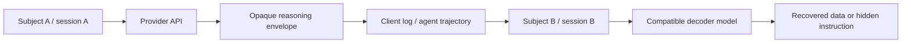

# Opaque Reasoning 工件与轨迹安全

<!-- learning-contract -->
<div class="learning-contract" markdown="1">

**学习导航**

- **适合读者**：云 API、Agent runtime、轨迹发布、隐私与安全工程师。
- **先修**：[云 API 契约](../models/cloud-api-contracts.md)、[Agent runtime](../applications/agent-runtime.md)与基本认证加密概念。
- **首次阅读**：对象边界 → 论文案例 → 四类属性 → 上下文绑定 → 发布门禁 → 事故响应。
- **完成信号**：能解释为什么“签名有效”不代表当前用户、会话和模型有权重放，并通过[实验 0D](../practice/labs/lab-0d-reasoning-artifact-security.md)。
- **卡住时**：先把一个多轮响应画成 visible text、opaque block、可信身份和后续请求四个对象。

</div>

**相关导航**：[安全总览](safety.md) · [治理](governance-impact.md) ·
[Cloud API 项目](../practice/projects/cloud-api-contracts.md) · [生产检查表](../practice/production-checklist.md)
{ .doc-nav }

## 从一份“已经脱敏”的轨迹说起

假设团队为了复现 Agent bug，把一段会话导出到公开 issue。Visible text 里的姓名和邮箱都替换掉了，
但序列化对象里还保留着一个客户端看不懂的 `encrypted_reasoning` block。维护者把它当成普通签名字段，
认为既然没人能直接阅读，就不算敏感数据。

这个判断漏掉了两个问题：Provider 可能在后续请求中再次处理这个 block；另一个兼容模型也可能接受它。
因此，“客户端看不懂”只描述可见性，不说明谁有权保存、转发或重放。

模型 API 中的 opaque reasoning block 可能同时是：

- 客户端保存、随后原样回传的模型状态；
- 含用户内容、系统信息或模型中间推理的数据工件；
- 能影响后续生成和工具选择的不可信输入；
- 带密码学完整性，但未必带当前调用上下文授权的 bearer-like artifact。

必须分开回答四个问题：

| 属性 | 回答的问题 | 常见误判 |
|---|---|---|
| Confidentiality | 未持有解密能力的人能否直接读内容？ | base64、签名字段或不可读文本就是安全加密 |
| Integrity | 内容或元数据被修改后能否检测？ | MAC/AEAD 有效就代表来源、用途都可信 |
| Provenance | 谁在何时、由哪个模型和 API 产生它？ | 无密钥 hash 或客户端记录的 model id 能认证来源 |
| Authorization | 当前主体、租户、会话、位置和模型能否使用它？ | 服务端能解密就应接受重放 |

最重要的不变量是：

> **密码学验证成功只回答协议实际绑定的字段。没有进入认证上下文的 identity、session、position 或 audience，不会因密文完整而自动获得保护。**

## 2026 年的历史失效案例

[Stealing Reasoning Traces from Proprietary LLM APIs](https://arxiv.org/abs/2608.09867) 于 2026-08-10 提交。
论文研究了 2026 年 7 月初可访问的 Anthropic、OpenAI 和 Google reasoning API。作者报告，客户端收到并回传的
opaque reasoning block 在部分供应商生态中可以跨会话、跨用户或跨模型使用。实验把较强模型产生的 block
交给兼容但防护较弱的模型，再诱导后者输出恢复内容。

论文区分两类攻击者：

1. **第一方攻击者**自己调用强模型取得 block，再用较弱 sibling model 尝试提取推理、绕过 anti-distillation 或获得最终回答没有显示的有害信息。
2. **第三方攻击者**从公开 Agent/session trajectory 取得他人的 block，尝试恢复隐私数据，或让受害者继续执行植入 opaque block 的共享轨迹。

作者收集了 6,708 条公开 trajectory，并处理 315,320 个重建 reasoning block。论文报告 1,028 个 block（0.3%）
和 328 条 trajectory（4.9%）至少包含一个经第二阶段分类为真实的隐私工件。排除 benchmark 后，作者得到
704 个去重工件，其中 64 个只存在于 reasoning block，没有出现在解析后的可见轨迹中。

这些数字来自两阶段 LLM labeling、去重和人工 taxonomy。它们描述一次非穷尽的公开数据扫描，不能解释为
所有 Agent 日志的总体泄露率。

!!! warning "时效与可复现性边界"
    论文作者在发布前向受影响供应商、Microsoft 和 Hugging Face 披露问题。Reproducibility statement 写明：
    截至 2026 年 8 月，供应商实施缓解后，文中原攻击方法已经不能复现。供应商内部密码学实现没有公开；
    本章只把论文当作特定历史版本的架构案例，不能据此声称当前端点仍然脆弱，也不提供真实供应商提取脚本。

论文用 extracted token count 与 API-reported thinking token count 的接近程度作为保真证据，并展示了定性样例。
由于研究者没有 ground-truth plaintext reasoning，这些证据不能证明每个恢复 token 都等于模型真实内部轨迹。
论文附录讨论的开放模型蒸馏迹象也没有建立因果关系。

## 根因：内容被认证，上下文没有被认证

论文把观察到的客户端 opaque payload 抽象成认证加密 envelope。简化后的失败设计是：

```text
AEAD(key, nonce, reasoning, AAD={provider, format, key_id})
```

它可以保证 ciphertext 或已绑定 header 被修改时验证失败，却没有回答：

```text
authenticated subject 是否相同？
tenant 是否相同？
session/branch 是否相同？
它是否紧跟正确的 predecessor？
当前 model 是否在允许 audience 中？
是否过期、被撤销或已经消费？
```

于是一个合法 block 可能像 bearer token 一样被拿到别处继续使用。攻击并不需要破解 AEAD；它利用的是服务端愿意在错误上下文中为攻击者处理合法 ciphertext。



只检查 visible text 的脱敏器看不到 opaque block 内部。更危险的是，共享 trajectory 的接收方也看不到其中是否携带了会影响后续行为的隐藏指令。

## Context-bound envelope

若继续使用客户端代管的无状态设计，envelope 至少要把可信控制面上下文放入 AEAD associated data，或绑定到等价的服务端认证状态：

```text
AAD = canonical(
  schema_version,
  provider,
  key_id,
  artifact_id,
  authenticated_subject,
  tenant,
  session,
  branch,
  predecessor_digest,
  model_audience,
  issued_at,
  expires_at
)
```

这些值不能来自 Prompt、request body 中模型可编辑的字段，也不能由共享 trajectory 自报。
`authenticated_subject`、tenant 和 policy context 应来自可信 gateway；允许模型集合、key status 和 replay state
应由 provider/control plane 决定。

### 为什么仍需要状态

AEAD context binding 能拒绝元数据篡改和错误上下文，但同一合法 envelope 在完全相同的上下文中仍可能被重复提交。
要实现 one-time consumption，服务端还需维护 consumed identity、sequence 或等价 replay ledger。
Bloom filter、TTL cache 和单进程 set 各自存在丢失、误判或多副本一致性问题；生产实现必须明确 durable scope。

Nonce 唯一性是另一项独立要求。AES-GCM 等 AEAD 在同一 key 下复用 nonce 会破坏安全保证；nonce 应由 CSPRNG
产生，并在供应商规模上控制唯一性。Artifact replay ledger 不能替代 nonce uniqueness，后者也不能替代
authorization。

### Fork、compaction 与模型切换

把 block 绑定到完整 transcript 最简单，却会破坏合法的历史压缩、会话 fork 和模型降级。论文建议使用 session + predecessor chain，并讨论在 compaction 后保留 Merkle root，使剩余 span 仍可验证。工程上需要先定义：

- fork 是否继承 fork point 之前的 chain state；
- compact 后允许哪些 block 继续使用；
- 模型切换是显式 audience，还是必须重新签发；
- 是否保证相对顺序、完整连续性，还是只保证 surviving span；
- 历史格式的兼容窗口何时结束。

任何取舍都要写成协议和负例，不能依赖“模型通常能理解正确顺序”。

## 纵深防御

| 层 | 最低控制 | 仍未解决的问题 |
|---|---|---|
| 架构 | 服务端保存 reasoning，客户端只持随机 state id | provider 存储、访问、删除和可用性成本 |
| 密码学 | subject/session/predecessor/audience context binding | 合法上下文中的模型转录行为 |
| Replay | consumed ledger、顺序、撤销和异常速率 | 多区域一致性和故障恢复 |
| Key 生命周期 | key id、轮换、retired key 拒绝、有限迁移窗口 | 旧会话失效与企业 archive 迁移 |
| 模型 | 后训练拒绝 reasoning transcription/jailbreak | 行为防御可被规避，不能替代协议控制 |
| 监控 | 同一 artifact 跨 context/model、解密错误和批量提交告警 | 监控本身可能接触敏感数据 |
| 数据发布 | 默认移除 reasoning/signature/未知 opaque block | 已公开副本和下游镜像 |

跨模型完全隔离是清晰的默认值；若业务确实需要降级或路由，应把允许的 model audience 明确写入认证上下文，而不是让共享 key 的所有模型隐式兼容。

## 发布轨迹前逐类处理 block

Provider adapter 不应把 response 粗暴压成一个字符串。至少区分：

- visible text；
- tool proposal/result；
- citation 或媒体；
- reasoning summary；
- opaque reasoning/signature block；
- unknown provider-specific block。

Text-only adapter 遇到其他 block 时应明确失败。若业务需要多种 block，就保留 typed metadata 与受控原始 bytes，
但不要把它们写入普通日志、异常、metrics label 或公开 fixture。未知 block 既不能被静默丢弃后假装响应完整，
也不能自动回传给另一个 endpoint、模型或主体。

公开 trajectory 前使用 allowlist projection，而不是“先保存所有字段，再用正则擦除可见文本”：

1. 从 provider 原始响应生成新的发布对象，不原样复制 raw JSON。
2. 默认禁止 `thinking`、`reasoning`、`signature`、`thinkingSignature` 和未知 opaque field。
3. 对 visible prompt、tool observation、response 和 metadata 分别执行 secret/PII 检查。
4. 报告 detector、span 和 fingerprint，不把命中明文复制进审计报告。
5. 绑定用途、访问级别、consent、TTL、删除和撤回 owner。
6. 发布门禁要求 `opaque_reasoning_block_count == 0`；例外必须由具体 artifact、用途和审批绑定。

有限 regex 或 LLM judge 没有命中，不证明轨迹不含秘密。数据最小化和字段 allowlist 比事后扫描更强。

本仓库提供一个 fail-closed 发布投影 gate：

~~~powershell
python -m about_llm.integrations.cloud_api_cli trajectory-release-gate `
  --input projects/cloud-api-contracts/trajectory-release.example.json `
  --output artifacts/cloud-api/trajectory-release-report.json
~~~

输入使用 strict JSON/JSONL。顶层固定为 `schema_version + trajectory_id + turns`，turn 只允许
`turn_id + role + blocks`，block 只允许 `text`、`tool_call`、`tool_result` 和 `citation`。

Reasoning/thinking/signature/encrypted 类型、同名嵌套工具参数、未知 block 和 Schema drift 都会使退出码为 1。
报告只输出数组位置、固定类别和规范化的已知禁用名，不回显 text、tool arguments、未知类型或任意字段名。

安全 fixture 应得到 `opaque_reasoning_block_count: 0`、`unknown_block_count: 0` 与 `passed: true`。
这仍不等于可以公开发布，因为报告同时给出 `secret_pii_scan_performed: false`。当前门禁不读取 opaque 内容，
也不检查 visible text、tool arguments/result 和 citation 中的 secret、PII、版权或 consent；这些需要独立检测器
和人工治理流程。

## 如果那份轨迹已经公开

发现 reasoning artifact 泄露时，至少分开处理：

1. **Containment**：停止发布和自动 replay，隔离 raw trajectory 与下游镜像。
2. **Revocation**：轮换暴露的用户凭据；由 provider 撤销 artifact/key/session，旧 key 进入 retired 状态。
3. **Scope**：按 subject、tenant、session、artifact id、key id、模型和发布时间定位影响范围。
4. **Deletion**：覆盖 raw/parsed logs、cache、backup policy、评测集、训练数据、replay buffer 和公开副本。
5. **Notification**：按合同、法规和组织流程通知 provider、平台、数据主体和责任人。
6. **Recovery**：只对验证所有权的 archive 做重新签发；迁移窗口有明确终止日期。
7. **Regression**：把实际失效上下文转成不含真实秘密的测试 fixture。

删除本地文件不能撤销已经克隆、镜像或进入训练衍生物的内容；key rotation 也不能收回攻击者已经恢复的 plaintext。

## Reasoning summary 不是审计证据

论文还展示 summary 与恢复轨迹不一致的样例，例如 summary 呈现为顺序推导，而恢复内容先写出答案再尝试推导。由于恢复内容本身没有完整 ground truth，这不能把某个 summary 判定成普遍不忠实，但足以说明：

- summary 是模型生成的另一个输出，不是密码学 receipt；
- 流畅、简洁和步骤完整不证明忠实；
- final answer 正确不证明 summary 描述了真实计算路径；
- 监督应优先使用可执行 verifier、claim-source mapping 和外部状态，而不是依赖隐藏或可见 CoT 自述。

评测 summary 时分开记录 final correctness、summary-answer consistency、summary-evidence entailment、敏感内容泄露和 verifier agreement。

## 本仓库的离线 control

运行：

~~~powershell
python -m about_llm.integrations.cloud_api_cli reasoning-replay-matrix `
  --output artifacts/cloud-api/reasoning-replay-matrix.json
~~~

Control 使用 `cryptography` 的 AES-256-GCM、固定虚构 key/nonce、虚构 plaintext 和内存 ledger。
它先构造 content-only envelope，展示错误 subject、tenant、session 和 model 上下文仍会被接受，
此时 `unsafe_acceptance_count` 应为 4。随后改用 context-bound envelope，分别验证 exact context、scope drift、
wrong predecessor、expiry、retired key、claims tamper 和第二次消费。

输出不含 plaintext reasoning 或 ciphertext，只给 case、预期/实际接受状态和稳定拒绝原因。完整步骤见[实验 0D](../practice/labs/lab-0d-reasoning-artifact-security.md)。

这个 control 只证明本仓库 authored 协议的局部不变量：

- 不解析或生成任何真实供应商 signature/thinking block；
- 不访问网络，不调用模型，不尝试绕过当前 provider 缓解；
- 内存 nonce/replay ledger 不 durable、不跨进程或区域；
- 固定 key 不是生产 key custody、KMS/HSM、轮换或来源认证证据；
- predecessor digest 不是完整 Merkle compaction/fork 协议；
- trajectory release gate 只接受本仓库严格投影，不是 raw provider response sanitizer，也没有执行 secret/PII 检测；
- 通过本地矩阵不证明真实 API 已实现同样绑定。

## 自测

1. 为什么 AEAD tag 有效仍可能发生跨用户重放？
2. `subject_id` 放进未认证 JSON header 与放进 AAD 有什么区别？
3. 为什么 model audience、expiry 和 predecessor 都通过，却仍要消费账本？
4. 为什么只清理 visible text 不能安全发布原始 API trajectory？
5. 论文哪些结论属于 2026 年 7 月实证，哪些截至 2026 年 8 月已经有时效变化？
