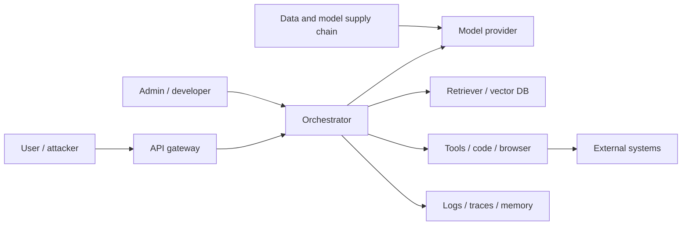
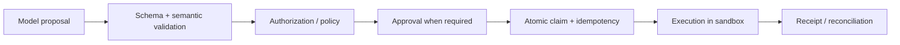

# LLM 系统安全、隐私与公平

<!-- learning-contract -->
<div class="learning-contract" markdown="1">

**学习导航**

- **适合读者**：LLM 安全、隐私、RAG/Agent 和平台工程师。
- **先修**：理解系统组件、身份、数据流和外部副作用。
- **首次阅读**：信任边界 → injection/jailbreak → RAG → Agent/tool → secrets → 响应。
- **完成信号**：能画数据流/信任边界，并为高风险路径设计 fail-closed 负例。
- **卡住时**：先从当前系统的一条请求链开始，不必一次覆盖所有威胁类别。

</div>

LLM 安全不是“让模型更听话”，而是让整个系统在恶意输入、错误模型输出、第三方内容、工具失败和内部误操作下，仍把损害限制在可接受范围。模型输出应被视为**不可信建议或数据**，不能直接成为权限凭证、SQL、shell、支付或删除授权。

## 1. 先画系统与信任边界

一个典型系统包含：



每条边都可能跨越身份、租户、网络、供应商或数据保留边界。先列出：

- **资产**：用户数据、系统提示、凭据、模型权重、索引、工具权限、业务状态、日志；
- **参与者**：用户、攻击者、内部人员、第三方内容作者、模型/插件/数据供应商；
- **入口**：prompt、上传文件、网页、邮件、RAG 文档、tool output、训练数据、依赖更新；
- **影响**：泄露、越权、错误决策、现实滥用、服务中断、财务/法律/人身伤害；
- **假设**：攻击者能否多轮交互、上传内容、控制网页、观察 token/延迟、拥有账户或内部权限。

没有攻击能力和影响范围的“高风险/低风险”只是标签。

## 2. Prompt injection、Jailbreak 与普通错误

- **Prompt injection**：不可信输入试图改变应用原本的指令或数据流，常以获取工具/数据为目标。
- **Indirect prompt injection**：攻击指令藏在网页、文档、邮件、图片 OCR 或工具结果中，由系统代用户读取。
- **Jailbreak**：诱导模型绕过内容/行为限制，常针对模型安全策略。
- **普通幻觉/误解**：没有攻击者也会发生，但可能产生同样严重的副作用。

这些类别可以重叠。防御不能只搜索“ignore previous instructions”等固定字符串。

### 2.1 为什么分隔符不是安全边界

XML tag、Markdown code block、system prompt 中的“以下只是数据”能帮助模型理解结构，但模型仍在同一个 token context 中处理它们。攻击者可以改写、翻译、编码或利用模型歧义。**Prompt hierarchy 是行为约束，不是强制访问控制。**

真正的安全边界应由模型之外的程序实施：身份、ACL、capability、schema、allowlist、sandbox、审批和 egress policy。

## 3. Indirect injection 攻击链

一个典型链条：

1. 攻击者把指令写入可被检索的文档或网页；
2. Agent 因用户任务读取该内容；
3. 模型把数据中的文本解释为新指令；
4. 模型调用邮件、文件、浏览器或网络工具；
5. 凭据/数据被外传，或执行了未授权副作用。

只在第 3 步做文本分类无法覆盖整条链。纵深防御：

- 检索和浏览内容标注 provenance/trust，不提升权限；
- 生成器只看到调用者有权访问的数据；
- secrets 不进入模型上下文；
- tool gateway 根据真实用户身份重新授权；
- 高风险参数经过 deterministic validation 和人类确认；
- egress allowlist、DNS/IP/redirect 检查和数据量限制；
- 读写工具分离，默认只读；
- 记录 action proposal、approval、execution 与 external receipt。

## 4. RAG 安全

### 4.1 ACL 必须在排名和生成之前

正确顺序：

\[
\text{authorized candidates}
\rightarrow
\text{score/rank}
\rightarrow
\text{context}
\rightarrow
\text{generation}.
\]

先对全局库召回，再让模型“忽略无权文档”仍可能通过 score、日志、cache 或 prompt 泄露。仓库 BM25/dense baseline 在评分前执行 tenant + principal ACL，并在构造 citation context 时再次检查。

### 4.2 Cache 与 trace 也要带安全上下文

Cache key 至少包含 tenant、principal/role set、query、corpus/index revision 和 policy version。只按 query 文本缓存，可能把高权限答案返回给低权限用户。Trace、评测集、embedding 导出和 reranker feature 也可能包含受限内容。

Prefix/KV cache 同样是授权边界。Identity 应由可信 gateway 构造，并绑定 tenant、完整 visibility/security equivalence class、authorization/policy revision、model/tokenizer/template/adapter、position config、KV dtype 与 exact token prefix。Unkeyed hash 只能定位候选：发生碰撞时仍须 full comparison，且 hash 不隐藏可枚举的低熵 prompt。跨域共享与 warm/cold latency 还可能形成访问模式侧信道；单元测试证明“没有错误复用”并不证明 timing-channel mitigation、加密、删除传播或生产 IAM 正确。

### 4.3 Retrieval poisoning

攻击者可通过 SEO、重复文档、metadata、隐藏文本或 embedding manipulation 提高恶意内容排名。防护：source allowlist、签名/version、写权限隔离、ingestion validation、重复/异常监控、可信来源优先和冲突检测。

引用存在只能证明输出包含一个 source ID；不能证明 source 可信、最新或语义支持 claim。

## 5. Agent 与工具安全

### 5.1 模型提出动作，系统决定能否执行

planner 的结构化 `tool/finish/escalate` 输出仍是不可信 proposal。schema-valid 不能授予身份、资源访问或完成状态：tool proposal 进入模型外 policy/approval/runtime，finish proposal 进入独立 verifier。模型自报 token、费用、证据或“已完成”只能作为待核 observation；可信 usage 来自 provider/control plane，可信 effect 来自业务状态或独立审计。

恢复 checkpoint 同样是不可信输入面。严格 JSON、schema 和 canonical hash 能拒绝损坏、未知字段与意外漂移，但无密钥 hash 不是认证；checkpoint 可能含工具结果和敏感参数，需要加密、ACL、签名/MAC、版本/回滚保护与 retention。恢复时重新解析可信主体和资源、重新授权，审批只绑定原 execution fingerprint；不能反序列化任意对象、恢复模型自报 capability，或因“之前已允许”跳过 cache/pending 的当前 policy。

安全执行链：



模型生成的 tool name/arguments 不是授权。工具层必须：

- allowlist tool 与参数；
- 使用调用者身份，不使用模型自报身份；
- 限制文件路径、域名、金额、对象和作用域；
- 对写操作做 approval 与 idempotency；
- 对 timeout 后“结果未知”做 reconciliation；
- 对返回内容继续按不可信数据处理。

本仓库 reference runtime 已实现同 tenant + exact capability policy、默认拒绝、indeterminate fail closed，并在 cache replay 前重新授权。resource owner/version 由 tool resolver 提供，不能采用模型自报 tenant；proposal fingerprint 与绑定 subject/resource/tool/policy revision 的 execution fingerprint 分离。它仍不是集中 IAM：没有 role inheritance、deny override、签名 policy bundle、分布式吊销传播或 resource lookup side-channel 证明。

### 5.2 TOCTOU

用户审批后到执行前，价格、收件人、文件内容或权限可能变化。审批 artifact 应绑定规范化参数、subject/task/call、tool/policy/resource version、预览和过期时间；执行前重新校验。仓库 typed grant 可拒绝这些漂移与过期，但不验签或证明 approver authority。不能让模型在批准后静默修改 arguments。

### 5.3 Retry 与副作用

网络 timeout 不代表外部操作失败。盲目重试发送、支付、删除可能重复执行。使用稳定 idempotency key、pending ledger、external receipt 查询和人工 reconciliation。仓库 Safe Agent 把 uncertain outcome 保留为 pending，而不是伪装成失败可安全重放。

## 6. Code execution、浏览器与网络

### 6.1 Sandbox 不是一个布尔值

需要限制：

- filesystem mount 和路径穿越；
- network egress、DNS rebinding、redirect 与 localhost/metadata service；
- CPU、内存、进程、文件数、磁盘和执行时间；
- system call、device、container socket 和 cloud credentials；
- package install、native extension 与 build script；
- 输出大小、压缩炸弹和 fork bomb。

容器若挂载宿主 socket、共享高权限 token 或允许任意出网，仍可能越界。

### 6.2 SSRF 与数据外传

URL allowlist 要在解析、DNS resolution 和每次 redirect 后检查。阻止显式 `localhost` 但允许解析到私网 IP 不够。外传还可通过 URL path、query、DNS、图片加载、错误消息或逐次小请求完成；需要 egress destination 与 data-flow 两层控制。

## 7. Secret 管理

系统提示不能安全保存秘密。任何放进模型 context 的 secret 都可能被输出、工具参数或日志泄露。

原则：

- 模型只获得短期、最小范围的 capability，最好由 tool gateway 代持；
- 不把长期 API key 放入 prompt、RAG 或 memory；
- logs/traces 默认脱敏，原始访问单独授权；
- credential rotation 与吊销可独立于模型部署；
- 输出/异常/repr 不包含 header、token 或 signed URL；
- 第三方 provider 的数据保留与训练选项按契约配置。

仓库 cloud API contract 的 fixture 只证明 request serialization 会 redaction，且明确 `network_performed: false`；它不证明真实供应商日志或网络路径安全。

## 8. 数据泄露面

泄露不只来自训练记忆：

- prompt/context 中的其他租户数据；
- RAG index、embedding 和 metadata；
- conversation memory 与摘要；
- traces、analytics、exception 和 support ticket；
- tool output、screenshots 和临时文件；
- response cache 与 CDN；
- training/evaluation artifacts；
- model/provider telemetry。

做 data-flow inventory，按字段标注目的、访问者、位置、TTL、加密和删除路径。数据最小化比“收集后再脱敏”更可靠。

### 8.1 Opaque reasoning 与共享轨迹

某些 API 把客户端不可读的 reasoning/thinking block 交给客户端保存，并在后续请求中回传。不可读不代表低敏感：它可能吸收 prompt、工具 observation、PII、secret 或隐藏 instruction，也可能影响后续生成和工具 proposal。签名或 AEAD tag 证明的范围取决于被认证字段；若 authenticated subject、tenant、session、predecessor 和 model audience 没有绑定，合法 ciphertext 仍可能在错误上下文中被重放。

公开 Agent trajectory 应从 typed allowlist 重新生成，默认删除 reasoning、signature 和未知 opaque block，并要求 `opaque_reasoning_block_count == 0`。从外部取得的 trajectory 是不可信序列化状态，不能直接继续调用模型或工具。详见 [Opaque Reasoning 工件与轨迹安全](reasoning-artifact-security.md)和[实验 0D](../practice/labs/lab-0d-reasoning-artifact-security.md)。

## 9. 模型隐私

### 9.1 Memorization 与 extraction

重复、罕见和可预测上下文可能增加 verbatim memorization。Canary exposure、membership inference 和 extraction attack 测量的是特定攻击能力，不是一个统一隐私分数。未成功提取不证明样本对参数没有影响。

### 9.2 Differential Privacy

DP-SGD 通常按样本/用户裁剪梯度并加噪，通过 privacy accountant 组合得到 \((\epsilon,\delta)\) 保证。必须定义 adjacency（差一个样本还是一个用户）、sampling scheme、clipping、noise multiplier、steps 和 \(\delta\)。

较小 \(\epsilon\) 通常代表更强的形式保证，但不同 adjacency、\(\delta\) 或 accountant 不能只比一个 epsilon。DP 保护其正式威胁模型中的训练贡献，不自动保护 prompt 日志、RAG、工具或输出中的主动泄密。

### 9.3 Federated learning

数据留在设备不代表更新无信息。Gradient/update 可能泄露；server、client poisoning、secure aggregation、DP 与设备身份仍需设计。Federated 是部署拓扑，不是隐私证明。

## 10. 数据与模型供应链

风险包括：

- poisoned/backdoored dataset；
- 恶意 model weights、pickle 或 remote code；
- dependency confusion、typosquatting、build script；
- compromised tokenizer/chat template；
- embedding/reranker/index 静默替换；
- provider model alias 无通知升级；
- 评测集或安全规则被内部人员篡改。

控制：artifact digest/signature、来源 allowlist、SBOM、依赖 pin、隔离加载、最小 CI 权限、双人审批、可复现构建、model/data lineage 和升级回归。`trust_remote_code` 属于代码执行决策，不是普通模型配置。

## 11. 模型滥用与内容安全

风险可能涉及诈骗、恶意软件、骚扰、自残、危险操作、隐私侵犯与大规模操纵。分类和缓解需要结合能力、意图、上下文、用户授权和现实可执行性；关键词黑名单会误伤安全研究、教育与求助。

### 11.1 分层控制

- account/age/region 与用途 policy；
- input/output classifier；
- 模型行为训练和安全 prompt；
- tool/capability 限制；
- rate limit、异常检测和 abuse monitoring；
- 高风险人工复核与申诉；
- 下游可执行验证。

Classifier 也会漂移、被规避并产生群体误差。所有拦截都要同时测 false negative 和 benign false positive。

### 11.2 拒答质量

拒答不应泄露隐藏政策或有害细节；对可安全帮助的请求提供降风险替代。测试：直接、多轮、角色扮演、翻译、编码、隐晦表达和 benign neighbor。全部拒绝可以得到很低 harmful-compliance，却不是可用系统。

## 12. 公平与群体伤害

区分：

- **representational harm**：刻板、贬损、抹除或不当关联；
- **allocative harm**：资源、机会、价格或服务质量差异；
- **quality-of-service harm**：某语言/口音/设备持续更差；
- **interaction harm**：冒犯、操纵或不尊重用户自主。

Accuracy parity、equal opportunity、predictive parity、calibration 等指标在不同 base rate 下可能互相冲突。选择指标必须基于决策与伤害模型，而不是寻找“唯一公平公式”。

敏感属性的收集本身有隐私和法律风险；群体分类也可能错误或文化不适配。与受影响者共同定义切片、阈值、人工复核和救济。

## 13. 可靠性也是安全问题

在医疗、金融、招聘、法律和关键基础设施中，非恶意幻觉也会造成伤害。控制包括：

- 限定适用/禁用场景；
- evidence/citation 与 deterministic verification；
- 不确定性和不可回答机制；
- 人类复核与双重控制；
- fail-closed/fail-safe 的明确选择；
- SLO、监控、rollback 和 business continuity。

“Human in the loop”只有在人有信息、时间、权限和能力推翻系统时才是有效控制。

## 14. 红队与安全评测

### 14.1 测试集合

- direct/indirect prompt injection；
- 跨租户、越权和 cache poisoning；
- tool argument manipulation、TOCTOU、重放与 timeout；
- SSRF、path traversal、secret exfiltration；
- 多轮、多语言、编码/混淆和长上下文；
- harmful request 与 benign neighbor；
- training/RAG poisoning 和 supply-chain rollback；
- privacy extraction 与 membership attack；
- 负载、资源耗尽与 oversized input。

### 14.2 指标

- attack success rate，附前提与攻击预算；
- harmful compliance 与 benign refusal；
- unauthorized tool execution 数；
- cross-tenant exposure：目标应为零，任何单例都是 incident；
- secret/PII leakage；
- detection precision/recall 与群体切片；
- time-to-detect、time-to-contain、recovery success。

只报告“拦截率 99%”会掩盖 1% 的高影响漏洞和 false positive。

### 14.3 回归与独立性

修复后的 exploit 进入永久回归集；同时保留未公开 holdout，避免只背固定 prompt。红队与开发团队应有适度独立性，严重问题有阻止发布的权限。

## 15. Incident response

发布前准备：

1. owner、on-call 和升级路径；
2. request/model/prompt/tool/index revision 可追溯；
3. kill switch、tool disable、credential revoke 和流量回退；
4. 证据保全与最小化访问；
5. 用户/监管/供应商通知决策流程；
6. 外部副作用 reconciliation；
7. postmortem 与控制有效性复测。

删除日志会妨碍调查，永久保存日志又增加隐私风险；应按目的、TTL 和 legal hold 设计分层保留。

## 16. 威胁模型模板

```yaml
system: customer-support-agent
assets:
  - tenant documents
  - scoped ticket-write capability
actors:
  - authenticated user
  - malicious document author
trust_boundaries:
  - user -> gateway
  - retrieved document -> model context
  - model proposal -> tool gateway
attacker_capabilities:
  - multi-turn prompts
  - upload HTML/PDF
  - observe responses
forbidden_outcomes:
  - cross-tenant disclosure
  - ticket write without bound approval
controls:
  - pre-ranking ACL
  - no secrets in context
  - parameter fingerprint approval
  - egress allowlist
evidence:
  - test IDs and artifact revisions
residual_risk_owner: security-lead
```

模板必须链接真实测试和 owner；只填写表格不代表控制有效。

## 17. 本仓库已有与缺失证据

已有 CPU/离线证据：

- BM25/dense 在评分前执行 tenant + principal ACL；
- citation context 再次拒绝跨租户/无 principal 结果；
- Agent 默认拒绝、同 tenant exact capability、cache 重新授权、typed approval binding、execution identity、幂等与 pending reconciliation；
- cloud request fixture 对 credential 做 redaction，且不执行网络；
- prefix-cache metadata oracle 用强制 fingerprint collision 验证 full identity/token comparison、跨租户拒绝、lease-pinned LRU 和原子容量失败；
- 评测门禁支持 protected slices。

这些测试不证明：集中生产 IAM、签名/一次性审批、resource resolver 无侧信道、真实网络 sandbox、安全浏览器、SSRF 防护、真实 provider 数据保留、模型越狱鲁棒性或法律合规。项目成熟度必须保持在其实际证据等级。

## 18. 常见错误结论

- **“System prompt 优先级高，所以注入不会成功”**：模型指令遵循不是强制安全边界。
- **“文档用 XML 包起来就是不可信数据隔离”**：分隔符帮助语义，不提供权限隔离。
- **“模型不看到 API key 就无法越权”**：高权限 tool gateway 仍可能被模型调用。
- **“容器里运行就安全”**：mount、network、socket、credential 和 kernel 决定真实边界。
- **“引用存在就说明答案安全可信”**：还需授权、来源可信度与 claim entailment。
- **“DP epsilon 越小一定可直接横比”**：adjacency、delta、accountant 和机制必须一致。
- **“Human in the loop 会阻止错误”**：人必须真正能理解、及时介入并推翻系统。

## 自测与实践

1. 为一个“读取邮件并创建工单”的 Agent 画资产与信任边界。
2. 设计 indirect injection → tool exfiltration 攻击链的每层控制和测试。
3. 为什么 query-only cache key 会造成跨权限泄露？
4. 给 URL fetch 工具列出 DNS、redirect、私网地址和数据外传检查。
5. 比较模型拒答、tool authorization 和 sandbox 分别保护什么。
6. 运行 Safe Agent/RAG ACL 测试后，列出它们仍无法证明的五个生产安全属性。
