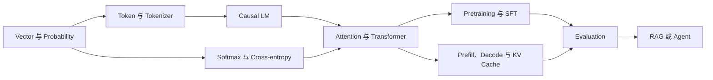
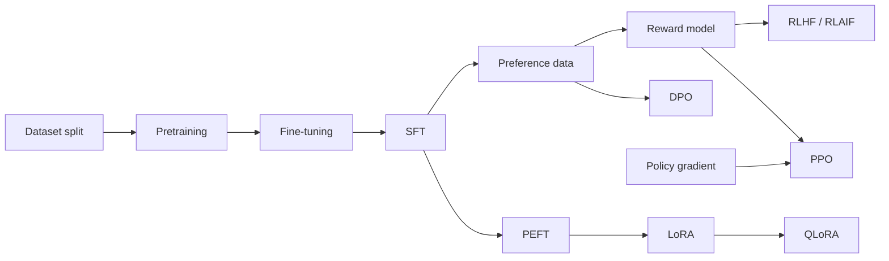
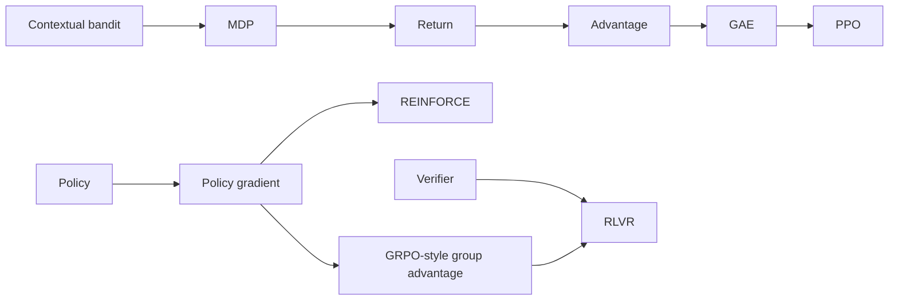
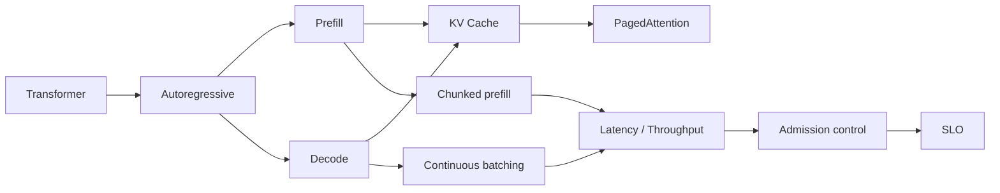
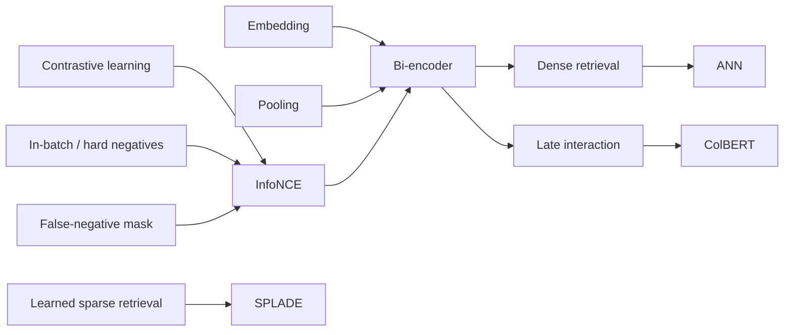
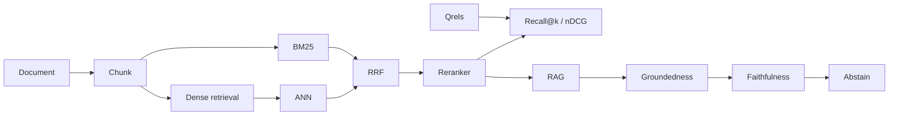
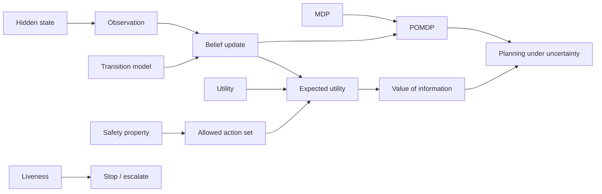
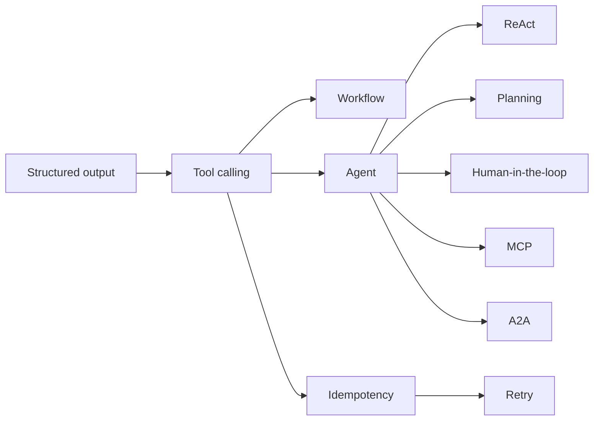
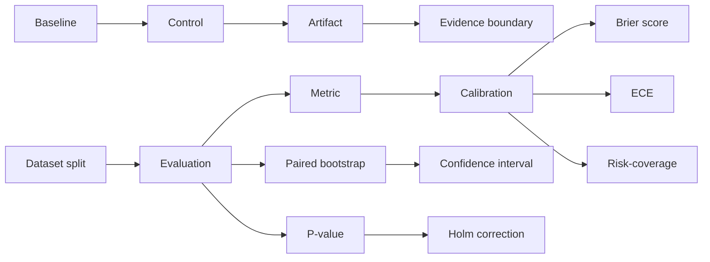

# 概念依赖与易混淆地图

这张地图把[术语知识图谱](glossary.md)从字母顺序还原成学习顺序。箭头表示“先理解左边，右边会更容易”，不是历史先后，也不表示左边足以推出右边。

每个术语都有正文与可运行验证入口。实验的作用是隔离机制和暴露边界，不是用一个 toy 证明生产质量。

## 一条最短主干

对应入口：

1. [Vector](glossary.md#term-vector)、[Probability](glossary.md#term-probability)；
2. [Token](glossary.md#term-token)、[Tokenizer](glossary.md#term-tokenizer)、[Causal LM](glossary.md#term-causal-lm)；
3. [Softmax](glossary.md#term-softmax)、[Cross-entropy](glossary.md#term-cross-entropy)、[Transformer](glossary.md#term-transformer)；
4. [Pretraining](glossary.md#term-pretraining)、[SFT](glossary.md#term-sft)、[Evaluation](glossary.md#term-evaluation)；
5. [RAG](glossary.md#term-rag)或 [Agent](glossary.md#term-agent)。

## 训练与对齐链

这条链最重要的分叉是：SFT 学条件分布中的理想回答；偏好优化使用比较或奖励信号；LoRA/QLoRA 描述参数更新方式，不描述训练目标。

强化学习分支从决策问题而不是算法缩写开始：

对应的公式、边界和 exact categorical control 见[LLM 强化学习](../training/reinforcement-learning.md)。

## 推理与服务链

先把 prefill 与 decode 当成两种负载，再讨论 batching、cache 和调度。只报告平均 tokens/s 无法回答首 token、尾延迟或过载时发生了什么。

## RAG 诊断链

检索表示不是黑盒 API；它有自己的训练依赖：

InfoNCE 的候选分母就是训练问题的一部分。Hard negative 提供更细判别信号，false negative 却会把真实相关文档推远；模型 exact ranking 与 ANN approximation 必须分开评测。完整推导与可运行反事实见[检索表示学习](../applications/retrieval-learning.md)。

检索问题必须沿链定位：语料是否存在、权限后是否可见、大候选是否召回、reranker 是否保留、上下文是否选入、生成是否使用。最终答案错误不能直接归因于 embedding。

## Agent 控制链

先把“不确定地选择下一步”还原为决策对象：

Observation 不是真实 state，context 也不是可审计 belief。Utility 只能在 policy/approval 已允许的 action set 内比较；terminal reachable 只表示可能结束，reachable cycle 仍会破坏 guaranteed termination。公式与有限图 exact control 见[Agent 决策理论](../applications/agent-decision-theory.md)。

工具调用只产生候选动作。身份、授权、幂等、副作用和完成判定属于 runtime，而不是语言模型概率自动提供的性质。

## 评测与证据链

统计量只有在系统身份、采样单位、分母和决策规则固定后才有意义。Artifact 保存观察；evidence boundary 约束能从观察推出什么。

## 最重要的易混淆概念

| 概念 A | 概念 B | 真正的区别 | 判断问题 |
|---|---|---|---|
| [Token](glossary.md#term-token) | [Word](glossary.md#term-word) | token 是 tokenizer 的离散 ID 单位，word 是语言或任务单位 | 换 tokenizer 后单位会不会变化？ |
| [Logit](glossary.md#term-logit) | [Probability](glossary.md#term-probability) | logit 未归一化，概率依赖完整候选集合和 softmax | 候选集合改变后数值是否仍可直接比较？ |
| [Causal mask](glossary.md#term-causal-mask) | [Loss mask](glossary.md#term-loss-mask) | 前者限制可读取位置，后者限制哪些位置贡献损失 | 这是信息泄漏问题还是监督分母问题？ |
| [Checkpoint](glossary.md#term-checkpoint) | [Activation checkpointing](glossary.md#term-activation-checkpointing) | 前者是持久化恢复状态，后者是训练显存重算技术 | 崩溃后能否从它恢复训练？ |
| [GQA](glossary.md#term-gqa) | [MLA](glossary.md#term-mla) | GQA 共享标准 K/V heads，MLA 使用 latent 压缩语义 | 标准 KV 元素公式仍然成立吗？ |
| [SFT](glossary.md#term-sft) | [DPO](glossary.md#term-dpo) | SFT 拟合理想回答，DPO 使用相对偏好与参考策略 | 数据是单个 target 还是同 prompt 的比较？ |
| [Mixed precision](glossary.md#term-mixed-precision) | [Quantization](glossary.md#term-quantization) | 前者组合浮点精度执行训练，后者将状态映射到低位宽 code | 是否需要 scale、zero point 或校准集？ |
| [Prefix cache](glossary.md#term-prefix-cache) | [Prompt cache](glossary.md#term-prompt-cache) | 前者是 runtime 的 token/KV identity，后者常是 provider 产品契约 | 谁定义命中、权限和计费？ |
| [Groundedness](glossary.md#term-groundedness) | [Faithfulness](glossary.md#term-faithfulness) | 前者问是否接入证据，后者问具体 claim 是否被证据支持 | 引用存在但论断不被支持时哪个失败？ |
| [MCP](glossary.md#term-mcp) | [A2A](glossary.md#term-a2a) | MCP 连接 host/client 与能力 server，A2A 连接独立 Agent 的任务生命周期 | 交换的是工具能力还是独立任务状态？ |
| [Reward](glossary.md#term-reward) | [Return](glossary.md#term-return) | reward 是单步或 outcome 信号，return 是从某时刻开始累计的随机量 | 当前公式使用即时反馈还是未来累计结果？ |
| [Old policy](glossary.md#term-ppo) | [Reference policy](glossary.md#term-rlhf-rlaif) | old policy 产生 rollout 并定义 ratio，reference policy 约束行为漂移 | 它会随每轮 rollout 刷新吗？ |
| [On-policy](glossary.md#term-on-policy) | [Off-policy](glossary.md#term-off-policy) | 前者主要从当前策略分布学习，后者复用其他 behavior policy 数据并需校正 | 是否保存了 behavior identity 和 log probability？ |
| [ORM](glossary.md#term-orm) | [PRM](glossary.md#term-prm) | ORM 只评价 outcome，PRM 给中间 step/state 信号 | 多条合法过程怎样标注？ |
| [Bi-encoder](glossary.md#term-bi-encoder) | [Cross-encoder](glossary.md#term-cross-encoder) | 前者可预计算 document vectors，后者要为每个 query-document pair 联合前向 | 这个 final score 能否离线绑定单个文档？ |
| [Hard negative](glossary.md#term-hard-negative) | [False negative](glossary.md#term-false-negative) | 前者按任务定义不相关但难区分，后者其实相关却漏标 | 梯度应该排斥它，还是标签缺失？ |
| [InfoNCE](glossary.md#term-infonce) | [Calibration](glossary.md#term-calibration) | InfoNCE 概率只在训练候选分母内归一化，不自动表示线上相关概率 | 换 batch/candidate pool 后数值含义是否保持？ |
| [Pooling](glossary.md#term-pooling) | Qrels pooling | 前者聚合 token representations，后者汇总多系统候选供人工标注 | 聚合的是隐藏向量还是待 judging 文档？ |
| [State](glossary.md#term-state) | [Observation](glossary.md#term-observation) | state 是环境实际状况，observation 是系统收到且可能带噪的信号 | Provider 写了 completed，还是外部 effect 已被独立证明？ |
| [Belief state](glossary.md#term-belief-state) | Model confidence | belief 绑定事件、先验和 observation model，模型自述数字不天然校准 | 能否重放 prior、likelihood 与 evidence？ |
| [Planning](glossary.md#term-planning) | [Policy](glossary.md#term-policy) | plan 常是候选动作序列，policy 规定不同 observation/state 下怎样选 action | 中间结果变化时是否定义了分支？ |
| [Reward](glossary.md#term-reward) | [Utility](glossary.md#term-utility) | reward 是训练/环境信号，utility 表示特定决策主体对结果的偏好尺度 | 这个数用于学习更新，还是用于业务选择？ |
| [Safety property](glossary.md#term-safety-property) | [Liveness](glossary.md#term-liveness) | 前者要求坏事不发生，后者要求好事最终发生 | 是发现 reachable forbidden，还是发现 cycle/dead end？ |
| [Constrained MDP](glossary.md#term-constrained-mdp) | Hard authorization | 前者常约束期望累计 cost，后者把动作直接移出可执行集合 | 少量违规能否被平均收益抵消？ |

## 掌握一个术语的最低证据

把“见过这个词”与“会使用这个概念”分开：

1. **定义**：不用同义词循环解释，能指出输入、输出或研究对象；
2. **关系**：能说出至少一个先修概念和一个易混淆概念；
3. **机制**：能画出数据流、状态流或写出关键公式；
4. **验证**：运行词条绑定的实验，先写预测，再解释观察；
5. **边界**：明确实验没有证明的外推结论。

达到前两项是识别，达到前三项是理解，五项全部完成才算能用于工程判断。
